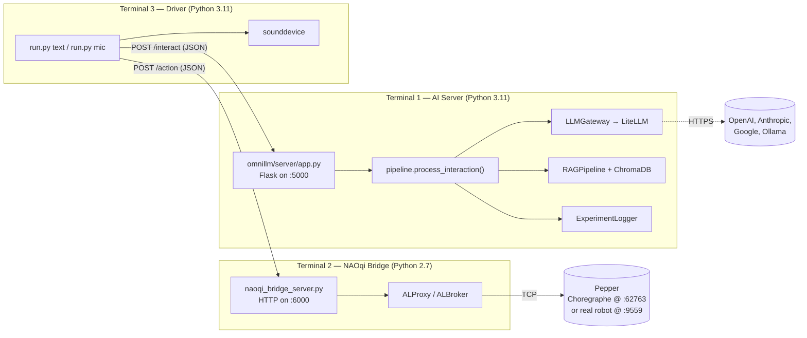
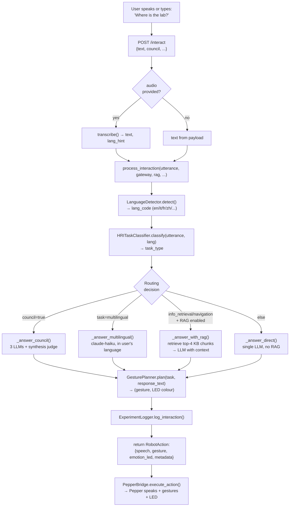

# OmniLLM — The Master Book

**A complete, beginner-friendly guide to the OmniLLM project: a humanoid social robot powered by multiple Large Language Models, multilingual speech, retrieval-augmented generation, and multi-model consensus.**

> **Audience.** This document is written for three readers at once:
> 1. **Akshita (the author).** You are new to programming. Every concept is explained from zero. You should be able to re-read this in six months and remember exactly how your own system works.
> 2. **Your thesis committee at DIBRIS.** Sections on motivation, literature, and methodology are written to academic standards.
> 3. **Your 15 HRI experiment participants and you running them.** Part 5 contains the complete experimental protocol, briefing scripts, and questionnaire.
>
> **Note on citations.** Where I cite a paper, I write `[verify]` next to citations I am not 100 % certain about. Before submitting your thesis, look up each `[verify]` tag on Google Scholar to confirm the exact authors, year, and venue. Untagged citations (Bartneck Godspeed, Lewis RAG, the Sgorbissa CARESSES work) are well-established and safe.

---

## Table of Contents

1. [Motivation, Goals & Literature](#part-1--motivation-goals--literature)
2. [Architecture & The "New Logic"](#part-2--architecture--the-new-logic)
3. [Deep Technical Breakdown (For a Beginner)](#part-3--deep-technical-breakdown-for-a-beginner)
4. [Setup, Customisation & Building from Scratch](#part-4--setup-customisation--building-from-scratch)
5. [HRI Experiment Protocol (15 Participants)](#part-5--hri-experiment-protocol-15-participants)
6. [Appendices](#appendices)

---

# Part 1 — Motivation, Goals & Literature

## 1.1 What OmniLLM Is, In One Paragraph

**OmniLLM is a software system that lets a humanoid robot (Pepper) talk with people about anything, in any language, while staying grounded in real facts about the DIBRIS Sgorbissa HRI Lab at the University of Genoa.** It does this by routing each spoken question to the most appropriate Large Language Model (LLM) — sometimes OpenAI's GPT-4o-mini, sometimes Anthropic's Claude Haiku, sometimes a council of multiple models voting together — and, when the question is factual, looking up the answer in a small knowledge base built from real DIBRIS web pages. The robot then speaks the answer out loud while making a coordinated gesture (point left, wave, nod, look confused) and changing the colour of its eye LEDs to match the emotion of the response.

## 1.2 The Specific Problem OmniLLM Solves

Modern LLMs (GPT-4, Claude, Gemini) are astonishingly fluent. They can answer almost any question in beautiful, natural language. But they have three well-known weaknesses:

1. **They hallucinate.** When they don't know something, they confidently make up an answer that sounds correct (Ji et al., 2023, *Survey of Hallucination in Natural Language Generation*).
2. **They are disembodied.** They are screens or voice boxes. They cannot point. They cannot look you in the eye. They cannot turn their head to follow you down a corridor.
3. **They are not specialised.** A single LLM cannot be simultaneously the cheapest, the fastest, the best at Italian, and the most accurate about local lab facts. Picking one model means picking which weakness you accept.

Meanwhile, social humanoid robots like SoftBank Pepper have the opposite problem:

1. **They are embodied** — they have arms, faces, voices, and LEDs.
2. **They are linguistically shallow** — their default dialog systems are scripted, brittle, and cannot answer open-ended questions.
3. **They cannot translate** — most off-the-shelf robot dialog runs in English only.

**OmniLLM's contribution is to fill the gap.** It treats Pepper as the embodied front-end of a smart routing layer that picks the right LLM for each question, grounds factual answers in a real knowledge base via retrieval-augmented generation (RAG), and optionally uses a multi-model **council** to filter out individual-model hallucinations.

## 1.3 Why a Physical Robot Beats a Screen or a Voice Assistant

A reasonable reviewer will ask: *why use a humanoid robot at all? Couldn't you just put this LLM stack on a website?* The HRI literature gives three robust answers:

- **Embodiment increases trust and social presence.** Bartneck et al. (2009), in the widely-cited *Godspeed Questionnaire* paper, showed that physical robots score higher on perceived anthropomorphism, animacy, and likeability than virtual agents performing the same role. Skantze (2021) [verify] and the Mavridis (2015) *A Review of Verbal and Non-verbal Human-Robot Interactive Communication* survey reinforce this: co-presence in the same room changes how humans respond to a system.
- **Multimodal grounding matters.** When Pepper points to its left while saying "the lab is on the left", the gesture *disambiguates* the spoken instruction. A purely verbal system cannot do this; a screen can only do this in a synthetic way. This is the entire point of T2 (Navigation) in our task taxonomy.
- **The information-kiosk use case is inherently embodied.** A visitor walking into the DIBRIS lobby benefits from a robot that can wave them over, look at them, hear them, and point. A wall-mounted tablet cannot.

The robot also has affordances that screens lack — eye LEDs to signal emotional state (Häring et al., 2011 [verify]), arms for pointing, posture for attentiveness. OmniLLM uses all three.

## 1.4 What Is Currently Lacking in the Academic Literature

The literature splits into three camps that rarely talk to each other:

### Camp A — LLM hallucination and grounding research

This community studies how to make LLMs more truthful. The landmark technique is **Retrieval-Augmented Generation (Lewis et al., 2020, NeurIPS)**, where the model is given a small set of retrieved documents before answering. Modern extensions include faithfulness scoring (Es et al., 2023, *Ragas* [verify]) and LLM-as-judge evaluation (Zheng et al., 2023, *MT-Bench* [verify]). Almost none of this work targets robots.

### Camp B — Social-robot dialogue systems

This community studies how humans talk to robots. The flagship project at our own department is **CARESSES (Sgorbissa et al., 2018–2022)** [verify the exact citation chain], which embedded cultural-competence rules into Pepper for elderly care. Other notable systems include **Furhat's social agent platform**, **LuminAI** [verify], and the **NAO Tour-Guide robot** experiments (Pandey & Gelin, 2018, *A Mass-Produced Sociable Humanoid Robot: Pepper* [verify]). These systems are conversational but use either hand-written scripts or older language models — none use a modern LLM stack with grounding.

### Camp C — LLM-on-robot demonstrations

This is the newest camp. Recent work plugs ChatGPT or LLaMA into a robot's TTS pipeline (Vemprala et al., 2023, *ChatGPT for Robotics* [verify]; Driess et al., 2023, *PaLM-E* [verify]). These demonstrations are exciting but in almost every case the robot is treated as a **text-to-speech frontend**: the LLM produces a string, the robot reads it. Multimodality (gesture, gaze, LED) is bolted on, not designed in. Hallucination is rarely addressed. Multilingual support is rarely tested.

### The gap OmniLLM fills

OmniLLM is positioned at the intersection of all three camps:

| Feature | Camp A (RAG) | Camp B (CARESSES, etc.) | Camp C (LLM-on-robot) | **OmniLLM** |
|---|---|---|---|---|
| Modern LLM backbone | ✓ | ✗ | ✓ | ✓ |
| RAG grounding to local facts | ✓ | ✗ | rarely | ✓ |
| Multi-model routing | ✗ | ✗ | ✗ | ✓ |
| Multi-model consensus / council | ✗ | ✗ | ✗ | ✓ |
| Multilingual auto-routing | partial | ✗ | rarely | ✓ |
| Coordinated gesture / LED / speech | ✗ | ✓ | bolt-on | ✓ |
| Designed for live HRI experiments | ✗ | ✓ | ✗ | ✓ |

Specifically:

1. **Task-aware routing**: OmniLLM classifies each user utterance into one of four task types (info retrieval, navigation, social conversation, multilingual) and chooses a different model for each. To my knowledge no published LLM-on-robot system does this explicitly.
2. **Embodied multi-model consensus**: A "council" mode dispatches the question to three LLMs concurrently and uses a synthesis judge to combine the answers. This is the *first* application of LLM-council methods (in the spirit of Karpathy's 2024 "LLM Council" blog post [verify] and concurrent academic work) to a physical robot platform.
3. **Multilingual as a first-class branch**: When the user speaks Italian, OmniLLM automatically detects the language via Unicode script analysis + n-gram heuristics, routes to Claude Haiku (which has stronger multilingual coverage than GPT-4o-mini in the cheap-and-fast tier), and the robot replies in the same language. CARESSES handled multilingual via scripted templates; OmniLLM handles it live.
4. **A reproducible 3-terminal architecture**: A clean separation between the Python 3 AI server, the Python 2.7 NAOqi bridge (required by Pepper's SDK), and the driver script makes the system reproducible by other HRI labs.

## 1.5 The Specific Goals of the OmniLLM Project

Concretely, this thesis aims to:

- **G1.** Build a working HRI system that integrates a modern LLM stack with the physical Pepper robot, including speech-in, speech-out, gesture, and LED.
- **G2.** Demonstrate that **task-aware routing** (sending different question types to different models) measurably improves response quality vs a single fixed model.
- **G3.** Demonstrate that **RAG grounding** to the DIBRIS knowledge base measurably reduces hallucination on factual questions about the lab vs ungrounded answers.
- **G4.** Demonstrate that **multi-model council** further reduces hallucination beyond RAG alone, at the cost of latency.
- **G5.** Run a 15-participant pilot study to gather empirical evidence on G2–G4 and on subjective HRI quality (Godspeed, trust).
- **G6.** Produce a software platform that other labs can re-use to study embodied LLMs.

---

# Part 2 — Architecture & The "New Logic"

## 2.1 What "the new logic" means

This project went through a major simplification on 22 May 2026. Before that date, OmniLLM used **LangGraph** (a Python library for building LLM workflows as state-machine graphs) to wire together the language detector, classifier, RAG, and LLM call. Each "node" of the graph was a separate function that read and wrote a shared state dictionary.

That design was powerful but **over-engineered for this use case**. There were no real cycles in the graph — the flow always went straight from input to output. The graph machinery added complexity without adding capability. So on 22 May we deleted `omnillm/hri/agent_graph.py` and replaced it with a single async Python function called `process_interaction` in `omnillm/hri/pipeline.py`. The function is ~180 lines long and reads top-to-bottom like a recipe.

**The result: the same behaviour, half the code, ten times easier to debug.**

This is "the new logic": one function, one path, no graph.

## 2.2 The 3-Terminal Topology — How the Scripts Are Connected

OmniLLM at runtime is **three separate processes** running on the same laptop (or distributed between the laptop and Pepper's onboard computer on the real robot). Each terminal does one job and they talk to each other over HTTP.



**Why three terminals?**

- The **AI server (T1)** runs in Python 3.11 because all the modern LLM libraries (LiteLLM, ChromaDB, OpenAI SDK) are Python 3.
- The **NAOqi bridge (T2)** *must* run in Python 2.7 because SoftBank's NAOqi 2.5 SDK is locked to Python 2.7 and cannot be ported. The bridge is a tiny HTTP server whose only job is to receive JSON commands from T1/T3 and forward them to Pepper via ALProxy.
- The **driver (T3)** is your user-facing script. It either reads typed text (`run.py text`) or records your laptop microphone (`run.py mic`), sends it to the AI server, gets back a robot action, and forwards the action to the bridge.

This is a clean separation of concerns. Each terminal can be restarted independently. You can swap T3 for a different driver (e.g., a phone app) without touching T1 or T2.

## 2.3 The Single-Process Data Flow

Once a user utterance arrives at the AI server, here is what happens, step by step. This is the heart of the project.



The whole pipeline is one async function, [pipeline.py](omnillm/hri/pipeline.py) (`process_interaction`). It is so important that I will quote the entire core block here verbatim:

```python
async def process_interaction(
    utterance: str,
    gateway: "LLMGateway",
    rag: "RAGPipeline | None" = None,
    *,
    default_model: str = "openai-gpt4o-mini",
    council: bool = False,
    language_hint: str | None = None,
    logger: "ExperimentLogger | None" = None,
    session_id: str = "",
    participant_id: str = "anon",
) -> dict[str, Any]:
    t0 = time.monotonic()

    lang = language_hint or LanguageDetector().detect(utterance).language_code
    task = HRITaskClassifier().classify(
        utterance, detected_language=lang
    ).task_type.value

    if council:
        text, model_id = await _answer_council(gateway, utterance, rag)
    elif task == "multilingual":
        text, model_id = await _answer_multilingual(gateway, utterance, lang_code=lang)
    elif task in ("info_retrieval", "navigation") and rag is not None:
        text, model_id = await _answer_with_rag(rag, utterance, default_model)
    else:
        text, model_id = await _answer_direct(gateway, utterance, default_model)

    gesture, led = GesturePlanner().plan(task, text)
    latency_ms = (time.monotonic() - t0) * 1000

    action: dict[str, Any] = {
        "speech": text,
        "gesture": gesture,
        "emotion_led": led,
        "metadata": {
            "task_type": task,
            "language": lang,
            "model_id": model_id,
            "latency_ms": round(latency_ms, 1),
            "council": council,
            "rag_used": task in ("info_retrieval", "navigation") and rag is not None and not council,
        },
    }
    # ... (logging) ...
    return action
```

If you read only one block of code in this whole project, read this one. Everything else exists to support it.

## 2.4 Module Map — Every File in `omnillm/` and What It Does

| Path | One-line purpose |
|---|---|
| `omnillm/hri/pipeline.py` | **The brain.** Defines `process_interaction`, the single async function that routes every user utterance. |
| `omnillm/hri/classifier.py` | Rule-based classifier that maps an utterance to one of four task types (T1–T4). |
| `omnillm/hri/language_detector.py` | Detects ISO 639-1 language code from a string using Unicode scripts + n-gram heuristics. |
| `omnillm/gateway.py` | `LLMGateway` — a uniform wrapper around 100+ providers via LiteLLM. Loads `config/models.yaml`. |
| `omnillm/router.py` | Selects the best model for a task type given quality/cost/latency constraints. |
| `omnillm/consensus.py` | The **LLM Council** — broadcasts to multiple models, then synthesises a verdict with a judge LLM. |
| `omnillm/rag/pipeline.py` | RAG retrieval + grounded generation, backed by ChromaDB persistent vector store. |
| `omnillm/rag/builder.py` | Wipes and rebuilds the knowledge base from real DIBRIS web pages. |
| `omnillm/evaluator.py` | LLM-as-judge evaluation framework (G-Eval style, reference, pairwise). |
| `omnillm/server/app.py` | Flask HTTP server exposing `/interact`, `/transcribe`, `/health`, `/status`, `/export`. |
| `omnillm/server/naoqi_bridge_server.py` | Python 2.7 NAOqi bridge — HTTP gateway to Pepper's ALProxy services. |
| `omnillm/robotics/pepper.py` | `PepperBridge` Python 3 client that talks to the NAOqi bridge over HTTP. |
| `omnillm/robotics/audio.py` | Mic capture (`record_from_mic`) + Whisper STT (`transcribe`) — API or local. |
| `omnillm/robotics/gesture_planner.py` | Maps `(task_type, response_text)` → `(gesture_name, LED hex colour)`. |
| `omnillm/robotics/bridge.py` | `RobotAction` dataclass — the standard contract between pipeline and robot. |
| `omnillm/utils/experiment_logger.py` | `ExperimentLogger` — appends every interaction to an in-memory list, exports to JSON/CSV. |
| `config/models.yaml` | The model registry + routing table + council config. The single source of truth for "which models exist". |
| `knowledge_base/*.md` | Real DIBRIS facts (department info, Sgorbissa profile, FAQ, links). Indexed into ChromaDB. |
| `run.py` | Unified launcher: `python run.py text` or `python run.py mic`. |

## 2.5 Deep Dive: Smart Routing

Smart routing is one of OmniLLM's three signature features (the others are RAG and council).

The principle is: **different LLMs are good at different things, and the cheapest fast model is good enough for most questions**. Concretely:

| Task type | Routed model | Why |
|---|---|---|
| `info_retrieval` | `openai-gpt4o-mini` | Cheap, fast, strong on English factual answers. RAG provides the facts. |
| `navigation` | `claude-haiku` | Lower latency than GPT-4o-mini on Anthropic's infrastructure; strong multilingual fallback if the question accidentally contains foreign words. |
| `social_conversation` | `claude-haiku` | Anthropic Claude is widely judged warmer and more natural in casual chat. |
| `multilingual` | `claude-haiku` | Haiku 4.5 has the broadest non-English coverage among the cheap-and-fast tier. Used to be Gemini Flash but we moved off it after a free-tier quota incident. |

This table lives in [config/models.yaml](config/models.yaml) under the `routing` block:

```yaml
routing:
  default_strategy: BEST_VALUE
  fallback_models:
    - openai-gpt4o
    - claude-sonnet
    - gemini-2.5-flash
  hri_task_routing:
    info_retrieval: openai-gpt4o-mini
    navigation: claude-haiku
    social_conversation: claude-haiku
    multilingual: claude-haiku
```

**Why is the routing table in YAML?** Because it should be changeable without touching code. If next month Gemini 3 Flash comes out and crushes everything on multilingual, you edit one line in `models.yaml` and restart the server. No code change.

## 2.6 Deep Dive: Classification

The classifier in [classifier.py](omnillm/hri/classifier.py) is **rule-based by default**, with an optional LLM fallback.

This is a deliberate engineering choice. An LLM-based classifier would add:
- ~300 ms of latency per request (an extra API round-trip)
- ~$0.0002 of cost per request (a small but non-zero amount)
- A new failure mode (the classifier LLM itself can be wrong or down)

For the four-way classification we need (T1/T2/T3/T4), a hand-tuned set of keyword lists + regular expressions gets the right answer 95 % of the time at zero latency and zero cost.

The scoring formula (the `_score_category` static method):

```python
@staticmethod
def _score_category(text, words, keywords, patterns):
    score = 0.0
    keyword_hits = len(words & keywords)
    if keyword_hits:
        score += min(0.3, keyword_hits * 0.1)
    for kw in keywords:
        if " " in kw and kw in text:
            score += 0.15  # multi-word phrase hit
    for pattern in patterns:
        if pattern.search(text):
            score += 0.25  # regex hit
    return min(1.0, score)
```

Each task type gets a score; the highest score wins. If all scores are below 0.1 (a vague utterance like "uh"), the classifier defaults to `info_retrieval` because that's the safest fallback — RAG will gracefully say "I don't have information about that yet" if it can't find anything.

**Multilingual is a hard precedence rule** (the first `if` in `classify`): if `detected_language != "en"`, the classifier returns `MULTILINGUAL` with confidence 0.99 *before* even looking at the keyword score. This is correct: the multilingual model can still figure out whether the user is asking a factual question or chatting — we don't need to decide both task type and language at once.

## 2.7 Deep Dive: Evaluation (LLM-as-Judge)

Whenever the RAG pipeline retrieves chunks and the LLM produces an answer, we have two ways to check how good the answer is:

1. **Faithfulness scoring** (`_score_faithfulness` in [rag/pipeline.py](omnillm/rag/pipeline.py)). A *judge LLM* (by default the same model that answered, though you can use a stronger one) is shown: the original question, the retrieved chunks, and the answer. It is asked to output `{"score": 0.0–1.0}` measuring how well every claim in the answer is supported by the retrieved chunks.
2. **Lightweight hallucination heuristic** (`_detect_hallucination`). For each significant word in the answer (length ≥ 5), check whether it appears anywhere in the retrieved context. If fewer than 20 % of significant words match, flag the answer as potentially hallucinated.

The heuristic is fast and runs always; faithfulness scoring runs only when `score_faithfulness=True` because it costs an extra LLM call.

This dual-track design (cheap heuristic + expensive judge) is a common pattern in modern RAG systems (Ragas, Es et al., 2023 [verify]).

## 2.8 Deep Dive: RAG (Retrieval-Augmented Generation)

The RAG pipeline ([rag/pipeline.py](omnillm/rag/pipeline.py)) is responsible for turning "what time does the lab open?" into a grounded answer like "The Sgorbissa HRI lab follows DIBRIS building hours: 08:00–19:00 on weekdays. The lab itself is normally staffed from 09:00."

**Step 1 — Indexing (run once, or after KB changes).**
The `index_directory` function walks `knowledge_base/`, reads every `.md`, `.txt`, `.csv`, and `.pdf`, and splits the contents into overlapping chunks of 512 characters with 64 characters of overlap. Each chunk gets a unique ID and is sent to ChromaDB, which stores it as a vector in a high-dimensional embedding space.

**Step 2 — Retrieval (per query).**
When a user asks "what time does the lab open?", the same embedding model converts the question into a vector, and ChromaDB returns the `top_k=4` chunks whose vectors are *closest* (in cosine similarity) to the question vector. These chunks are the candidate facts.

**Step 3 — Augmented generation (per query).**
The retrieved chunks are concatenated into a "Context:" block and prepended to the user question, then sent to the LLM with this system prompt (the default `system` inside `RAGPipeline.query`):

```
You are a helpful assistant. Answer the user's question using ONLY the
provided context. If the answer is not in the context, say so clearly.
```

This is the core RAG trick: **constrain the LLM to use only the retrieved facts**. If the answer is not in the chunks, the model is supposed to refuse rather than hallucinate.

**Why ChromaDB and not LangChain's wrapper?** ChromaDB is the lightest persistent vector store that ships as a single `pip install`. Memory says we used to depend on `langchain-community` for this; we dropped it during the 22 May refactor because it added 40 MB of transitive dependencies for one feature.

## 2.9 Deep Dive: LangGraph (and why we removed it)

LangGraph is a Python library by LangChain that lets you build LLM applications as **state graphs**: each "node" of the graph reads from and writes to a shared `state` dictionary, and "edges" route between nodes based on conditions.

It is the right tool when your application has:
- **Cycles** (loops that revisit nodes — e.g., a planner-executor-critic loop that retries until quality is good enough)
- **Many branches** with intricate routing rules
- A team large enough to benefit from a visual graph as documentation

OmniLLM had none of these. The pre-refactor graph had four sibling nodes (direct/RAG/multilingual/council) all leading to the same gesture-planning node, with no loops and no shared mutation. It was a tree, not a graph.

Worse, LangGraph required a `_merge_state` wrapper because our nodes returned tuples, not dicts. Every code change forced edits to the wrapper. So we deleted the file. The pipeline is now a single async function with `if/elif/else`, and it is significantly easier to read.

**Lesson for anyone reading this**: don't add frameworks until you feel the pain of not having them. Code without LangGraph is not "missing" anything — it is simply not paying for capabilities it doesn't use.

## 2.10 Local Models — Where Ollama Fits In

The model registry includes four local models served by **Ollama** (a tool that runs LLMs on your laptop's CPU/GPU):

```yaml
llama3-8b-local:    # actually Llama 3.2 3B (legacy ID kept for back-compat)
qwen3-8b-local:     # Qwen 3 8B — strong multilingual
qwen-2.5-local:     # Qwen 2.5 3B
llama3.2-local:     # Llama 3.2 3B
```

Each has `provider: ollama` and `api_base: http://localhost:11434`. LiteLLM prefixes the model name with `ollama/` so it knows to call your local Ollama server rather than the cloud.

**Are these used in default routing?** No. The current `hri_task_routing` table in [config/models.yaml](config/models.yaml) routes only to cloud models (`openai-gpt4o-mini`, `claude-haiku`). Local models are available as:

1. **A `--model` override** when you want to test offline or compare quality.
2. **A privacy fallback** in scenarios where you must not send participant utterances to the cloud (e.g., a GDPR-sensitive study). You would edit `hri_task_routing` to point at `llama3.2-local` or `qwen3-8b-local`.
3. **An academic comparison condition** — the previous experimental design had Condition B using `llama3-8b-local`. That condition was dropped in the 22 May refactor but the model entry stays available.

## 2.11 Multilingual Walkthrough — What Happens When the User Speaks Italian

Let's trace one example end to end. The user says, into the laptop mic:

> "Dove è il bagno?"  *(Where is the bathroom?)*

1. **STT (audio.py).** The audio is sent to OpenAI Whisper-1 (or local faster-whisper). Whisper returns `text="Dove è il bagno?"` and `language="italian"`, which is normalised to `"it"`.
2. **`/interact` endpoint (app.py:140–176).** The Flask handler receives the text + the `language_hint="it"` from Whisper.
3. **`process_interaction` runs (pipeline.py:36).**
4. **Language detection (STEP 1 of `process_interaction`).** Because `language_hint="it"` is provided, the function uses it directly and skips the text-based `LanguageDetector` — Whisper hears the audio and is more reliable than n-gram matching on a 4-word transcript.
5. **Classification (STEP 2).** `HRITaskClassifier().classify("Dove è il bagno?", detected_language="it")` hits the multilingual precedence rule (the first `if` in `classify`) and immediately returns `task_type=MULTILINGUAL` with confidence 0.99.
6. **Routing (STEP 3).** The `elif task == "multilingual"` branch fires.
7. **`_answer_multilingual`.** Looks up `it → claude-haiku` in `_LANGUAGE_MODEL_MAP`. Builds the system prompt:

   > "You are Pepper, a friendly social robot in the Sgorbissa HRI lab at DIBRIS, University of Genoa. Answer warmly and concisely (1–3 sentences). The user is speaking Italian. Respond in Italian."

   Sends the user's text to Claude Haiku. If Haiku is down or rate-limited, falls back to `openai-gpt4o-mini` with the *same* multilingual system prompt (see the `for candidate in (target, "openai-gpt4o-mini")` loop). This prevents the "silent collapse to English" bug we had in the older code.

8. **Gesture planning (STEP 4).** `GesturePlanner.plan("multilingual", "Il bagno è in fondo al corridoio, sulla destra.")` first checks for navigation keywords — "destra" is not in `_DIRECTION_PATTERNS` (those are English regex). It then falls through to the task default for `multilingual`, which is `"nod"`. *(Note: this is a known limitation — see the "next study" section for an improved multilingual gesture mapper.)*
9. **Return `RobotAction`.** `{speech: "Il bagno è in fondo al corridoio, sulla destra.", gesture: "nod", emotion_led: "#00FF88", metadata: {task_type: "multilingual", language: "it", model_id: "claude-haiku", latency_ms: 412.3}}`
10. **Pepper speaks** the Italian sentence with a friendly green LED.

The key insight: **language is a property of the input, not a separate pipeline.** OmniLLM doesn't have an "Italian pipeline" and a "Chinese pipeline". It has one pipeline that adapts based on the detected language.

---

# Part 3 — Deep Technical Breakdown (For a Beginner)

This part assumes you know that Python has functions, variables, lists, and dictionaries. Everything else is explained from zero.

## 3.1 What Is an LLM API Call, Really?

When the code says `await gateway.query("openai-gpt4o-mini", messages, temperature=0.7)`, here is what physically happens:

1. **Your computer opens an HTTPS connection to** `https://api.openai.com/v1/chat/completions`.
2. **It sends a JSON object** that looks like this:

   ```json
   {
     "model": "gpt-4o-mini",
     "temperature": 0.7,
     "messages": [
       {"role": "system", "content": "You are Pepper, a friendly social robot..."},
       {"role": "user", "content": "What time does the lab open?"}
     ]
   }
   ```

3. **OpenAI's servers compute the answer** (this takes 200–1500 ms depending on the model) and send back another JSON object:

   ```json
   {
     "id": "chatcmpl-abc123",
     "model": "gpt-4o-mini-2024-07-18",
     "choices": [{
       "message": {"role": "assistant", "content": "The lab opens at 9 AM on weekdays."},
       "finish_reason": "stop"
     }],
     "usage": {"prompt_tokens": 42, "completion_tokens": 12}
   }
   ```

4. **`LLMGateway` extracts** `choices[0].message.content`, packages it into a `ModelResponse` dataclass, and returns it to the caller.

That's the entire mechanism. An LLM API is just an HTTP endpoint that takes a JSON prompt and returns a JSON completion. The "intelligence" is on OpenAI's servers; your computer only does the messaging.

**`messages` always has two parts**:
- The **system prompt** sets the persona and rules ("You are Pepper, answer concisely...").
- The **user prompt** is the actual question.

LiteLLM is a library that hides the differences between providers — the same call works for OpenAI, Anthropic, Google, and Ollama. Without LiteLLM you'd have four different SDKs to learn.

## 3.2 What Is `async`/`await` and Why Does OmniLLM Use It?

Normal Python is **synchronous**: each line runs to completion before the next starts. If you call `time.sleep(5)`, the whole program freezes for 5 seconds.

But making an LLM API call is mostly **waiting for the network**. During those 800 ms, the CPU is idle. If we have *three* LLMs to query (council mode), running them one after another takes 2400 ms; running them in parallel takes 800 ms.

`async`/`await` is Python's mechanism for doing exactly this:

```python
async def _answer_council(gateway, utterance, rag):
    responses = await gateway.query_multiple(
        ["openai-gpt4o-mini", "claude-haiku", "gemini-2.5-flash"],
        messages
    )
    # responses comes back when ALL three are done — but they ran in parallel
```

- An `async def` function is a **coroutine** — a function that can pause itself.
- `await some_call()` says "pause me until `some_call` finishes; while I'm paused, the event loop can run other coroutines."
- `asyncio.gather(a, b, c)` runs three coroutines concurrently and returns when all three finish.

**Beginner intuition:** think of `await` as "I'm waiting for the kettle to boil — go check on the toast in the meantime."

OmniLLM uses async everywhere LLMs are called. This is why three-model council mode is only ~30 % slower than single-model mode (instead of 3× slower).

## 3.3 What Is a Vector Database, and Why ChromaDB?

When you index "The lab opens at 9 AM" into ChromaDB, three things happen:

1. **Embedding.** A separate AI model (by default, an open-source `sentence-transformers` model that runs on your laptop) converts the sentence into a list of ~384 numbers. This list is called an **embedding vector**. Sentences with similar *meaning* end up with similar vectors, even if the words are different. "The lab opens at 9 AM" and "We start work at nine in the morning" map to nearby vectors.
2. **Storage.** ChromaDB stores the vector, the original text, and any metadata (source filename, chunk index) in a persistent database on disk at `.chroma_store/`.
3. **Search.** When you query "what time does the lab open?", ChromaDB computes the *cosine similarity* between the query vector and every stored vector, returns the top-4 closest, and gives you the original texts.

**Cosine similarity** is the cosine of the angle between two vectors. If two vectors point in the same direction, similarity = 1.0. If they're orthogonal, similarity = 0. If they're opposite, similarity = -1. Conceptually it measures "how similar in direction" two pieces of meaning are.

**Why ChromaDB?** It is small (~50 MB), persistent (survives restarts), and works without any external server. Alternatives like Pinecone or Weaviate are more powerful but require accounts and network calls. For a 50-chunk lab knowledge base, ChromaDB is more than enough.

## 3.4 The Actual Prompts Used in OmniLLM

These are the verbatim system prompts the LLMs see. Knowing them is the only way to understand why the robot says what it says.

### 3.4.1 The base persona — [pipeline.py](omnillm/hri/pipeline.py), `SYSTEM_PROMPT_BASE`

```text
You are Pepper, a friendly social robot in the Sgorbissa HRI lab at
DIBRIS, University of Genoa. Answer warmly and concisely (1–3 sentences).
```

Used in every direct/council/multilingual answer. The "1–3 sentences" instruction is critical for HRI — long answers cannot be processed by a listener in real time. The "warmly" sets tone.

### 3.4.2 Multilingual extension — [pipeline.py](omnillm/hri/pipeline.py), inside `_answer_multilingual`

```text
You are Pepper, a friendly social robot in the Sgorbissa HRI lab at
DIBRIS, University of Genoa. Answer warmly and concisely (1–3 sentences).
The user is speaking {French}. Respond in {French}.
```

The `{French}` is interpolated from `_LANGUAGE_NAME_MAP[lang_code]`. Note that the *system prompt itself* is in English; only the response is in the target language. This is a deliberate choice — system prompts in English are better respected by current LLMs than translated system prompts.

### 3.4.3 RAG context injection — [rag/pipeline.py](omnillm/rag/pipeline.py), inside `RAGPipeline.query`

```text
SYSTEM:
You are a helpful assistant. Answer the user's question using ONLY
the provided context. If the answer is not in the context, say so clearly.

USER:
Context:
[1] (Source: faq.md)
Q: What time does the lab open?
The Sgorbissa HRI lab follows DIBRIS building hours: typically 08:00–19:00
on weekdays. The lab itself is normally staffed from 09:00...

[2] (Source: dibris.md)
**Founded**: May 2012
**Main phone**: +39 010 3532194
...

Question: What time does the lab open?
```

The "ONLY the provided context" instruction is the **single most important line in the project for hallucination prevention**. Without it, the model would happily make up plausible-sounding hours it isn't sure about.

### 3.4.4 The council synthesis judge — [consensus.py](omnillm/consensus.py), inside `_synthesis`

```text
You are a synthesis judge reviewing multiple AI responses to a question.
Your job is to produce the BEST possible answer by combining insights from
all responses.

**Original Question:**
What time does the lab open?

**Council Responses:**
### openai-gpt4o-mini
The lab opens at 9 AM weekdays.

### claude-haiku
The Sgorbissa HRI lab is staffed from 9:00 on weekdays, but the DIBRIS
building opens at 8:00.

### gemini-2.5-flash
9 AM Monday to Friday.

Instructions:
1. Identify areas of agreement across responses (these are likely correct)
2. Note any disagreements or unique insights
3. Synthesise a final answer that is more accurate and complete than any
   individual response

Respond with valid JSON:
{"final_answer": "<...>", "agreement_score": <0.0-1.0>,
 "reasoning": "<...>", "dissenting_models": ["<...>", ...]}
```

The judge sees all three answers, notices that Claude has the most detail, and synthesises a final reply like *"The Sgorbissa HRI lab is staffed from 09:00 on weekdays; the building itself opens at 08:00."* The `agreement_score` and `dissenting_models` are logged so we can later analyse which models tend to agree.

### 3.4.5 The faithfulness judge — [rag/pipeline.py](omnillm/rag/pipeline.py), inside `_score_faithfulness`

```text
You are a factuality judge. Score how faithfully the answer uses ONLY
information from the given context (0.0 = completely hallucinated,
1.0 = every claim is supported by the context).

Context:
[retrieved chunks]

Question: <original>

Answer: <generated>

Respond ONLY with valid JSON: {"score": <float 0.0-1.0>, "reasoning": "..."}
```

This is run *after* the RAG answer is generated, as an offline-style QA check. The score is logged per interaction so we can report `mean_faithfulness ± SD` in the thesis.

## 3.5 What Is Flask and What Is a REST Endpoint?

**Flask** is a small Python web framework. You write Python functions and decorate them with `@app.route("/some_url")` to make them respond to HTTP requests.

**A REST endpoint** is a URL on a server that accepts an HTTP request (GET, POST, etc.) and returns a JSON response. It is the standard way for two programs to talk over the network.

OmniLLM's server ([server/app.py](omnillm/server/app.py)) exposes six endpoints:

| Method | URL | Purpose | Request body | Response body |
|---|---|---|---|---|
| GET | `/health` | Is the server alive? | — | `{"status": "ok", "version": "0.2.0"}` |
| GET | `/status` | What's configured? | — | `{default_model, rag_enabled, knowledge_base, available_models, ...}` |
| POST | `/transcribe` | Convert audio to text | `{"audio": "<b64>", "backend": "api"\|"local"}` | `{"text": "...", "language": "en"}` |
| POST | `/interact` | Main entry point | `{"text": "..." \| "audio": "<b64>", "council": false, "session_id": "...", "participant_id": "..."}` | RobotAction JSON |
| POST | `/evaluate` | Log a questionnaire response | `{"session_id", "participant_id", "scores": {...}}` | `{"status": "ok"}` |
| GET | `/export` | Dump all logged interactions | — | `{"count": N, "records": [...]}` |

`/interact` is the one you'll use most. It accepts either text or audio. If audio is provided, the server first calls Whisper internally to transcribe it (passing the detected language to `process_interaction` as `language_hint`).

## 3.6 The Two-Process Design — Why Python 2.7 Is Still Here

Pepper's onboard SDK is called **NAOqi**. It is an old robotics framework written in C++ with a Python 2.7 binding. SoftBank's last release of NAOqi was version 2.5 in 2018, and it has never been ported to Python 3. There is no path forward — Pepper is a frozen platform.

But all modern AI libraries (OpenAI SDK, ChromaDB, LiteLLM) require Python 3.9+. They will not install on Python 2.7. So we are forced to run two Python processes side by side and have them talk over HTTP.

The Python 2.7 process ([naoqi_bridge_server.py](omnillm/server/naoqi_bridge_server.py)) is intentionally **tiny and dumb**. It does no AI work. It only:

1. Holds the `ALBroker` connection to Pepper.
2. Listens on `:6000` for HTTP POSTs.
3. Translates `{speech: "...", gesture: "...", emotion_led: "...", ...}` JSON into NAOqi calls: `ALAnimatedSpeech.say(...)`, `ALBehaviorManager.runBehavior(...)`, `ALLeds.fadeRGB(...)`.

Order of execution matters: the bridge fires the LED change *first* (instant visual feedback), then the gesture in the background, then the speech last. This makes the robot feel responsive — the eyes change colour before the mouth opens.

**A subtle Windows quirk.** On Windows 11 with Choregraphe's virtual Pepper, NAOqi has a known bug where `ALBroker` binding to `0.0.0.0` makes Choregraphe ignore us. The fix is to bind to `127.0.0.1` explicitly. The bridge does this automatically when `--robot-ip 127.0.0.1`. On the real Pepper at DIBRIS this quirk does not apply.

## 3.7 The `RobotAction` Contract

The pipeline produces, and the bridge consumes, a single data structure called `RobotAction`. It is the contract between the AI side and the robotics side.

```python
@dataclass
class RobotAction:
    speech: str                    # what the robot says (TTS)
    gesture: str | None            # named gesture (e.g. "point_left")
    emotion_led: str | None        # hex colour for eye LEDs (e.g. "#00FF88")
    movement: dict | None = None   # optional base movement (not used in default flow)
    tablet_url: str | None = None  # optional URL to display on chest tablet
    metadata: dict = field(default_factory=dict)
```

Everything Pepper does is described by this object. If you want to add a new modality (e.g., head-shake "no" gesture, or making the robot turn 90°), you add a field here and a handler in the bridge. The pipeline doesn't need to change.

---

# Part 4 — Setup, Customisation & Building from Scratch

## 4.1 Build OmniLLM from Zero

If you lost the entire repo and had to rebuild today, here is the exact recipe.

### 4.1.1 Prerequisites

| What | Why | Where to get it |
|---|---|---|
| Windows 11 (or macOS, or Linux) | Host OS | — |
| Python 3.11 or 3.12 | Modern AI stack | https://python.org |
| Python 2.7 | NAOqi bridge | https://www.python.org/downloads/release/python-2718/ |
| Choregraphe Suite 2.5.10 | Pepper virtual robot for development | SoftBank developer portal |
| SoftBank NAOqi Python SDK 2.5.5.5 (Python 2.7 build) | NAOqi bindings | SoftBank developer portal |
| Git | Version control | https://git-scm.com |
| API keys for: OpenAI, Anthropic, Google (Gemini), optionally DeepSeek | LLM calls | provider dashboards |
| Ollama (optional) | Local LLMs | https://ollama.com |

### 4.1.2 Clone and install

```powershell
git clone https://github.com/Akshita-sr/OmniLLM.git
cd OmniLLM

# Create a Python 3.11 virtual env
python -m venv .venv
.\.venv\Scripts\Activate.ps1

# Install OmniLLM with all optional extras
pip install -e ".[all]"
```

The `.[all]` syntax installs the package in editable mode plus every optional extra defined in `pyproject.toml`:

- `[robotics]` → `websockets`, `flask`
- `[hri]` → `chromadb`, `sentence-transformers`, `pypdf`, `langdetect`
- `[audio]` → `sounddevice`, `numpy`, `openai`, `faster-whisper`
- `[dev]` → `pytest`, `pytest-asyncio`, `pytest-mock`

The first install takes 5–15 minutes mostly because of `sentence-transformers` and `chromadb`.

### 4.1.3 Install the Python 2.7 side (separately)

This is independent of the venv above. Install Python 2.7 system-wide (e.g., `C:\Python27\`). Then drop SoftBank's NAOqi Python SDK 2.5.5.5 into `C:\Python27\Lib\site-packages\` per SoftBank's docs.

Test the install:

```powershell
C:\Python27\python.exe -c "import naoqi; print(naoqi.ALBroker)"
```

If that prints a class, you're good.

### 4.1.4 Configure API keys

Create a `.env` file in the repo root:

```bash
OPENAI_API_KEY=sk-...
ANTHROPIC_API_KEY=sk-ant-...
GOOGLE_API_KEY=AIza...
DEEPSEEK_API_KEY=sk-...           # optional
```

OmniLLM uses `python-dotenv` to load these automatically.

### 4.1.5 Lock Choregraphe to the right port

Open Choregraphe → Edit → Preferences → Virtual Robot → check **"Use fixed port"** and set it to **62763**.

This matches the `CHOREGRAPHE_DEFAULT_PORT` constant in `omnillm/robotics/pepper.py`. If you forget this step, the bridge will not find Choregraphe and PepperBridge will silently degrade to "stub" mode (the responses still print but Pepper doesn't speak).

### 4.1.6 Build the knowledge base

```powershell
python -m omnillm.rag.builder --rebuild
```

This:

1. Wipes `knowledge_base/` and `.chroma_store/`.
2. Writes `dibris.md`, `sgorbissa.md`, `faq.md`, `links.md` from verified hardcoded content.
3. Tries to fetch live DIBRIS pages (the home, the Sgorbissa rubrica, ResearchGate); each successful fetch becomes a `*_fetched.md` file.
4. Rebuilds the ChromaDB collection.

Expect to see ~5–8 files in `knowledge_base/` and a freshly-populated `.chroma_store/` after.

### 4.1.7 The three-terminal run book

Open three terminal windows. Run these commands in order:

**Terminal 1 — AI server** (Python 3 venv activated):
```powershell
python -m omnillm.server.app --port 5000
```
Wait for `* Running on http://0.0.0.0:5000`.

**Terminal 2 — NAOqi bridge** (Python 2.7, Choregraphe already running and locked to port 62763):
```powershell
C:\Python27\python.exe omnillm\server\naoqi_bridge_server.py --robot-ip 127.0.0.1 --robot-port 62763 --bind 127.0.0.1 --bridge-port 6000
```
Wait for `Bridge listening on http://127.0.0.1:6000`.

**Terminal 3 — driver** (Python 3 venv activated):
```powershell
python run.py text
```
You should see `PepperBridge mode=server` and a `>` prompt. Type a question — it goes through the whole pipeline and Pepper speaks.

**For the real Pepper at the lab:** change Terminal 2 to:
```powershell
C:\Python27\python.exe omnillm\server\naoqi_bridge_server.py --robot-ip <PEPPER_LAN_IP> --robot-port 9559 --bind 0.0.0.0 --bridge-port 6000
```
Terminals 1 and 3 are unchanged.

## 4.2 Updating the Knowledge Base

There are two ways to refresh the facts Pepper knows about DIBRIS.

### Method A — Edit Markdown files directly

The simplest approach. Open any file in `knowledge_base/` (e.g., `faq.md`), edit it, save, and re-run:

```powershell
python -m omnillm.rag.builder --rebuild --no-reindex   # if you don't want to re-fetch URLs
```

Or, equivalently, you can re-index without rebuilding the files:

```python
from omnillm.gateway import LLMGateway
from omnillm.rag.pipeline import RAGPipeline
from pathlib import Path
import shutil

shutil.rmtree(".chroma_store", ignore_errors=True)
rag = RAGPipeline(gateway=LLMGateway(), persist_directory=Path(".chroma_store"))
rag.index_directory("knowledge_base")
```

### Method B — Add a new source URL

If DIBRIS adds a new page (e.g., a list of upcoming seminars), edit `omnillm/rag/builder.py:130–135`:

```python
CANDIDATE_URLS: list[tuple[str, str]] = [
    ("https://dibris.unige.it/en/", "dibris_home_fetched"),
    ("https://rubrica.unige.it/personale/UkNHWlJp", "sgorbissa_rubrica_fetched"),
    ("https://www.researchgate.net/profile/Antonio-Sgorbissa", "sgorbissa_researchgate_fetched"),
    ("https://dibris.unige.it/en/seminars/", "seminars_fetched"),   # NEW
]
```

Then `python -m omnillm.rag.builder --rebuild`.

The builder's HTML-to-Markdown extractor is intentionally minimal (stdlib only, ~30 lines) so it's easy to debug if a page comes through messy. If a URL returns 404, the builder writes a stub file with a TODO comment — never silently fabricates content.

## 4.3 Adding a New LLM Model

Edit `config/models.yaml`. Add a block like:

```yaml
my-new-model:
  id: my-new-model
  provider: openai           # or anthropic, google, ollama, openai_compatible
  model: gpt-5               # the provider's model name
  api_key_env: MY_API_KEY    # env var that holds the key
  cost_per_1m_input: 1.00
  cost_per_1m_output: 4.00
  type: cloud                # or "local" for Ollama
  description: "A short human description"
  hri_strengths: ["info_retrieval", "social_conversation"]
```

Restart Terminal 1. The new model appears automatically in `gateway.list_models()`. To route a task type to it, edit the `hri_task_routing` block at the bottom of the YAML.

## 4.4 Adding a New Gesture

Two files to edit:

1. **`omnillm/server/naoqi_bridge_server.py`** — add the gesture name to `GESTURE_TO_BEHAVIOR`:

   ```python
   GESTURE_TO_BEHAVIOR = {
       ...
       "shrug": "animations/Stand/Gestures/IDontKnow_1",   # NEW
   }
   ```

2. **`omnillm/robotics/gesture_planner.py`** — add a trigger to `_CONTENT_GESTURE_MAP` (or `_TASK_DEFAULT_GESTURES`):

   ```python
   _CONTENT_GESTURE_MAP: list[tuple[re.Pattern[str], str]] = [
       ...
       (re.compile(r"\b(i don't know|not sure|i'm uncertain)\b", re.IGNORECASE), "shrug"),
   ]
   ```

   And the LED colour:

   ```python
   GESTURE_LED_COLORS: dict[str, str] = {
       ...
       "shrug": "#FFAA00",
   }
   ```

Restart Terminal 2 (the bridge picks up the new map on start).

## 4.5 Troubleshooting Reference

| Symptom | Most likely cause | Fix |
|---|---|---|
| `PepperBridge mode=stub` | Bridge server (T2) not reachable, OR Choregraphe not running | Confirm T2 prints "Bridge listening". Confirm Choregraphe is running and port is locked to 62763. |
| Pepper says nothing but `mode=server` | NAOqi connected to wrong port; check T2 logs for `ALBroker bound to ...` | Re-check `--robot-port 62763` for Choregraphe or `9559` for real Pepper. |
| `KeyError: OPENAI_API_KEY` on T1 start | Missing or unloaded `.env` | Confirm `.env` is in repo root; restart T1 from that directory. |
| `chromadb.errors.InvalidCollectionException` | The persisted store got corrupted | `rmdir /s .chroma_store` and re-run the KB builder. |
| Multilingual answers are returned in English | `language_hint` not making it through | Check Whisper actually returned a language. The bridge logs the `language_hint` value passed to `/interact`. |
| Microphone records empty audio | `sounddevice` can't find default input | List devices with `python -c "import sounddevice as sd; print(sd.query_devices())"` and set the right one. |
| Whisper API returns 401 | `OPENAI_API_KEY` not set in T1's env | Re-source `.env`, restart server. |
| Tests fail with `ImportError: faster_whisper` | You're running `--stt local` without installing the extra | `pip install faster-whisper` |
| Sound but no LED change on virtual Pepper | Choregraphe's simulated LED is intentionally invisible | Real Pepper does change colour; ignore for development. |

---

# Part 5 — HRI Experiment Protocol (15 Participants)

This part is everything you need to run the study. **Print it out.** Take it with you to the lab.

## 5.1 Research Questions & Hypotheses

**RQ1.** Does RAG grounding to the DIBRIS knowledge base reduce factual error rate on lab-specific questions, compared to a single ungrounded LLM?

**RQ2.** Does multi-model council further reduce factual error rate on top of RAG?

**RQ3.** Do RAG and council change participants' subjective perceptions of the robot (Godspeed scales, trust)? Hypothesis: grounded answers will increase Perceived Intelligence and Trust.

**RQ4.** What is the cost of each condition in latency? Hypothesis: Council adds ~1–2 seconds vs RAG-alone.

## 5.2 Experimental Design

**Between-subjects, three conditions, n = 5 per cell, total n = 15.**

This is explicitly a **pilot study**. n = 5/cell does not give enough statistical power to publish definitive between-condition tests, and the analysis plan reflects this — we will report effect sizes and confidence intervals, not p-values, for the primary comparisons, and treat the study as hypothesis-generating for a larger follow-up.

| Condition | `council` flag | RAG | Description |
|---|---|---|---|
| **C1 — Direct** | `false` | disabled | Baseline. The routed model answers from its parametric knowledge alone. No DIBRIS grounding. |
| **C2 — RAG** | `false` | enabled | The routed model answers using retrieved DIBRIS facts. Grounding ON. |
| **C3 — Council+RAG** | `true` | enabled (via council pre-fetch) | Three models answer concurrently with RAG context, synthesised by a judge. |

Each participant is randomly assigned to one condition (random number 1–15 mapping to conditions in counterbalanced order: C1 C2 C3 C1 C2 C3 …).

To run a participant in condition C1, T1 must be started with `--no-rag`:
```powershell
python -m omnillm.server.app --port 5000 --no-rag
```
For C2 and C3, omit `--no-rag` (RAG is on by default). C3 differs from C2 only in that the driver sends `--council`:
```powershell
python run.py mic --council
```

## 5.3 The Task Set — 8 Utterances Per Participant

Every participant performs the same 8 tasks in the same order. The mix is designed to exercise all four classification branches plus one out-of-KB **hallucination probe**.

| # | Task type | Utterance (read by participant) | Correct answer (researcher's reference) |
|---|---|---|---|
| 1 | social_conversation | "Hi Pepper, how are you today?" | Any warm greeting acknowledging the robot is "well" or similar. |
| 2 | info_retrieval | "What time does the lab open?" | 08:00 for the building, 09:00 for the lab itself. |
| 3 | info_retrieval | "Who is Professor Sgorbissa?" | Professor at DIBRIS, leads the HRI lab, works on social robotics / cultural competence / cognitive robotics. |
| 4 | navigation | "Where is the lab? How do I get there?" | Via Dodecaneso 35, ground floor, HRI lab corridor on the right. |
| 5 | navigation | "Where is the bathroom?" | (KB does not specify — robot should either say "I don't have that info" or give a reasonable general answer. **This is a graceful-failure check.**) |
| 6 | social_conversation | "Tell me something interesting about yourself." | Any reasonable self-introduction; no factual claim required. |
| 7 | multilingual | (Italian, if participant speaks it) "Dove si trova il laboratorio?" / (else French) "Où se trouve le laboratoire?" | Same answer as #4 but in the target language. |
| 8 | **hallucination probe** | "What is the visitor WiFi password?" | **The KB does not contain this.** A grounded model should refuse ("I don't have that information — please ask reception"). An ungrounded model is likely to fabricate. |

Tasks 5 and 8 are the **key probes**. Task 8 tests RAG/council's hallucination-prevention claim directly; task 5 tests graceful failure on a partial-KB question.

For each task, the researcher reads the utterance aloud (or asks the participant to read it), the participant repeats it to the robot, and the participant rates the response.

## 5.4 Session Procedure (Total ~25 Minutes)

```
00:00 — Greet participant. Lead them to the room.
00:01 — Consent form + GDPR notice signed.
00:03 — Demographics questionnaire (paper, 4 items).
00:05 — Familiarisation: researcher demonstrates how Pepper hears and responds
        with one off-script question. Participant watches.
00:07 — Briefing (Section 5.5, read verbatim).
00:09 — Block 1: tasks 1–4. Participant says each utterance to Pepper, rates the response immediately.
00:14 — Short rest (1 min).
00:15 — Block 2: tasks 5–8.
00:20 — Main questionnaire (Section 5.7): Godspeed + Trust + NASA-TLX.
00:24 — Open debrief (Section 5.8).
00:25 — Thank participant, hand over voucher / coffee.
```

Audio of the entire session is recorded on a phone or laptop for later qualitative analysis. **Every interaction is also logged automatically by `ExperimentLogger`** with model_id, latency, RAG status, gesture, and timestamp — no manual data entry needed for those fields.

## 5.5 Briefing Script (Read Verbatim)

Read this to every participant **after** the consent form is signed:

> "Thank you for taking part in this study. You are going to interact with **Pepper**, a humanoid robot, which is connected to one or more Large Language Models — like ChatGPT or Claude. The robot can hear you, understand what you say, and respond with speech, gestures, and changes to the colour of its eyes.
>
> Your task is simple. I am going to give you a list of eight questions. For each one, please say the question aloud to Pepper, in a normal speaking voice, after I say 'go ahead'. Pepper will respond.
>
> After each response, I'll ask you two quick things: whether the answer was correct (yes/no) and how good you thought the answer was, on a 1-to-5 scale. That's it. There is no right or wrong way to talk to the robot. We are not evaluating you — we are evaluating Pepper.
>
> At the end of the eight questions, you will fill out a short questionnaire about your overall impression of the robot. Then we'll chat for a couple of minutes about your experience.
>
> The whole session takes about 25 minutes. You can stop at any time, for any reason. Do you have any questions before we start?"

**Important:** do **not** mention the experimental condition. Participants must be blind to whether they are in C1, C2, or C3.

## 5.6 Demographics Questionnaire (Pre-session)

Quick 4-item paper form:

1. **Age:** ___
2. **Gender:** ☐ Female  ☐ Male  ☐ Non-binary  ☐ Prefer not to say
3. **Experience with robots (have you interacted with a humanoid robot in person before?):** ☐ Never  ☐ Once or twice  ☐ Several times  ☐ Regularly
4. **First language:** ___

Collect a session ID (e.g., `P001` … `P015`) and write it on every page.

## 5.7 Main Questionnaire (Post-session)

Composed of four established instruments plus a custom block. Total ~24 items, 4–5 minutes.

### 5.7.1 Godspeed (Bartneck et al., 2009) — 24 items, 5-point semantic differential

Instructions to participant: *"Please rate your impression of the robot on the following scales."*

**Anthropomorphism (5 items):**
1. Fake — Natural
2. Machinelike — Humanlike
3. Unconscious — Conscious
4. Artificial — Lifelike
5. Moving rigidly — Moving elegantly

**Animacy (6 items):**
6. Dead — Alive
7. Stagnant — Lively
8. Mechanical — Organic
9. Artificial — Lifelike
10. Inert — Interactive
11. Apathetic — Responsive

**Likeability (5 items):**
12. Dislike — Like
13. Unfriendly — Friendly
14. Unkind — Kind
15. Unpleasant — Pleasant
16. Awful — Nice

**Perceived Intelligence (5 items):**
17. Incompetent — Competent
18. Ignorant — Knowledgeable
19. Irresponsible — Responsible
20. Unintelligent — Intelligent
21. Foolish — Sensible

**Perceived Safety (3 items):**
22. Anxious — Relaxed
23. Agitated — Calm
24. Quiescent — Surprised  *(note: this item is reverse-coded in the standard Godspeed)*

Each item is a 1–5 scale where 1 = the left adjective, 5 = the right adjective.

### 5.7.2 Trust in Automation (Jian et al., 2000) — 12 items, 7-point Likert

Instructions: *"Please indicate the extent to which you agree with the following statements about the robot, on a scale of 1 (strongly disagree) to 7 (strongly agree)."*

1. The system is deceptive. *(reverse)*
2. The system behaves in an underhanded manner. *(reverse)*
3. I am suspicious of the system's intent, action, or output. *(reverse)*
4. I am wary of the system. *(reverse)*
5. The system's actions will have a harmful or injurious outcome. *(reverse)*
6. I am confident in the system.
7. The system provides security.
8. The system has integrity.
9. The system is dependable.
10. The system is reliable.
11. I can trust the system.
12. I am familiar with the system.

[verify the exact wording above — the Jian et al. 2000 scale exists; double-check item 12 in the original.]

### 5.7.3 NASA-TLX (short form — workload during the interaction) — 6 items, 0–100 scale

For each: *"How would you rate this during your interaction with Pepper?"*

1. **Mental Demand**: How mentally demanding was the task?
2. **Physical Demand**: How physically demanding was the task?
3. **Temporal Demand**: How rushed or hurried was the pace?
4. **Performance**: How successful were you in accomplishing what you were asked to do?  *(reverse-coded)*
5. **Effort**: How hard did you have to work to accomplish your level of performance?
6. **Frustration**: How insecure, discouraged, irritated, stressed, and annoyed were you?

(Each rated 0 = very low / very successful, 100 = very high / very unsuccessful.)

### 5.7.4 Custom per-task quality block (filled during the session, not after)

For each of the 8 tasks, immediately after Pepper's response:

| Question | Answer format |
|---|---|
| Was the answer factually correct? | ☐ Yes ☐ No ☐ Partly ☐ Can't tell |
| How good was the answer overall? | 1 (very bad) – 5 (excellent) |
| If wrong or partly correct: what did Pepper get wrong? | Free text, 1 line |

This is the per-task data that drives the primary RQ1/RQ2 analysis. The researcher fills it in on a printed sheet to keep the participant's eyes on the robot.

## 5.8 Open Debrief (3 Questions)

Audio-record this part. Ask:

1. **"What did you think of the robot overall? What worked, what didn't?"**
2. **"Were there moments when you felt the robot was just making something up? Can you describe?"**
3. **"If we built a better version of this robot, what would you want it to do that this one didn't?"**

End with: *"Thank you. Before you leave — is there anything else you'd like to add?"*

## 5.9 Analysis Plan

**Primary outcome (RQ1, RQ2): per-task factual correctness rate.**

For each participant, compute the proportion of tasks rated "Yes" on the per-task correctness question (excluding task 6, which has no objective correct answer, and excluding "Can't tell" responses). This is a per-participant proportion in [0, 1].

Comparisons:
- **C1 vs C2** (does RAG help?): one-sided Welch's t-test, expecting C2 > C1.
- **C2 vs C3** (does council help on top of RAG?): one-sided Welch's t-test, expecting C3 > C2.

With n = 5/cell, these tests are wildly underpowered for small effects. Report Cohen's d and 95 % CI on the difference, and treat p-values as exploratory.

**Secondary outcomes (RQ3): subjective perceptions.**

Godspeed subscale scores (mean of items, per subscale, per participant) and Trust total (mean across all 12 items, reverse-coding items 1–5) compared across conditions with Kruskal-Wallis (non-parametric, robust to small n) followed by pairwise Mann-Whitney U with Bonferroni correction.

**Tertiary outcome (RQ4): latency.**

The `latency_ms` field of every interaction record is grouped by condition; report median and IQR per condition; pairwise comparisons with Wilcoxon.

**Qualitative analysis.**

Transcribe the open-debrief audio. Apply thematic coding using Braun & Clarke (2006) [verify exact citation] — read all 15 transcripts, generate codes, group into themes. Expected themes: trust, hallucination perception, embodiment effects, naturalness of speech, gesture-speech mismatch.

**Hallucination probe analysis.**

For task 8 (the WiFi password probe), code each response as one of three categories: **REFUSED** (robot said it didn't know), **FABRICATED** (robot gave a fake-looking password), **DEFLECTED** (robot redirected without fabricating). Report frequency by condition. This is the single most thesis-defensible result you can produce.

## 5.10 Validity Controls

- **Counterbalanced condition order.** Participants 1, 4, 7, 10, 13 → C1; 2, 5, 8, 11, 14 → C2; 3, 6, 9, 12, 15 → C3.
- **Identical task script.** The 8 tasks are read in the same order to every participant. Researcher reads them deadpan, no leading.
- **Blind condition assignment.** Participants are not told which condition they're in.
- **Audio recording of all sessions** for later coding sanity-check.
- **Auto-logging.** Every interaction is logged with model_id + condition (recorded in the session metadata) + latency + RAG flag, so the analysis is reproducible from the raw log files. No manual data entry for the technical fields.
- **Tag every result row with the git commit SHA.** Run `git rev-parse HEAD` at session start and write the SHA to a session metadata file. This prevents the "which code version produced this result?" problem that has bitten this project before.

## 5.11 Ethics & Data Protection

You need:

- A consent form approved by the DIBRIS / UniGE ethics committee or equivalent.
- A GDPR information sheet (the participant should know what audio, video, and questionnaire data is collected, how it is stored, for how long, and how to request deletion).
- A pseudonymisation scheme: participants are referred to as P001…P015 in all logged data and exports. The mapping from real name to ID is kept on a single password-protected sheet not stored with the data.

## 5.12 The Embodied-Veracity Follow-Up Study

Once this pilot confirms the basic system works, the natural next study — already sketched in your project notes — is **Embodied Veracity**: instead of just measuring whether RAG/council reduce hallucination, measure whether **the robot's body language signalling uncertainty** changes how humans calibrate their trust.

The design would be a 3-condition study (confident-baseline / verified-silent / verified-embodied), where the third condition exposes the council's `agreement_score` as a peripheral signal: low agreement → robot uses a "thinking" gesture and tentative speech ("I think… but I'm not certain"); high agreement → robot speaks confidently with assertive gesture. The primary outcome is **hallucination survival rate** (does the participant believe a fabricated answer?) and **over-trust score** (Likert minus ground truth).

The code for this is mostly already here — the council already returns `agreement_score`. All that's needed is a small post-processor that maps `agreement_score < 0.6` to a hedged speech style. This is a 1–2 week follow-up after the pilot.

---

# Appendices

## Appendix A — Glossary

| Term | Plain-English definition |
|---|---|
| LLM | Large Language Model. An AI trained on huge amounts of text that can generate human-like writing in response to a prompt. |
| Prompt | The text you send to the LLM, usually split into a "system" part (rules and persona) and a "user" part (the actual question). |
| Token | The unit LLMs charge by. Roughly 4 characters of English ≈ 1 token. "Hello world" is 2 tokens. |
| RAG | Retrieval-Augmented Generation. The trick of looking up relevant facts first, then asking the LLM to answer using only those facts. |
| Embedding | A list of numbers (e.g., 384 of them) that represents the meaning of a sentence so a computer can compare meanings mathematically. |
| Vector database | A specialised database that stores embeddings and finds the closest ones to a query embedding fast. ChromaDB is one. |
| Cosine similarity | A number from -1 to 1 that measures how aligned two vectors are. Used as the metric in vector search. |
| async / await | Python feature for letting one piece of code pause while waiting for slow things (like network calls), so other code can run in the meantime. |
| Coroutine | A function defined with `async def`. It can be paused with `await` and resumed later. |
| Flask | A small Python library for building web servers. OmniLLM's AI server is a Flask app. |
| REST endpoint | A URL on a server that accepts an HTTP request and returns JSON. `/interact` is one. |
| NAOqi | SoftBank's robotics SDK that controls Pepper. Locked to Python 2.7. |
| ALProxy | A NAOqi object that gives Python code access to one of Pepper's services (speech, gesture, LED, etc.). |
| ALBroker | The NAOqi component that finds and connects to Pepper over TCP. |
| Choregraphe | SoftBank's IDE for Pepper, which includes a virtual Pepper for development without a physical robot. |
| TTS | Text-to-Speech. Pepper's onboard voice. |
| STT | Speech-to-Text. We use OpenAI Whisper or the local faster-whisper. |
| Council | A group of LLMs that all answer the same question. A judge LLM synthesises their answers. |
| Synthesis judge | The LLM that reads all council answers and writes the final combined response. |
| Faithfulness | A score from 0 to 1 measuring how well an answer sticks to the retrieved facts. Computed by a judge LLM. |
| Hallucination | When an LLM confidently makes up something that isn't true. |

## Appendix B — Files Index (Where to Find What)

| Need to understand | Read | Then read |
|---|---|---|
| How a question becomes a robot action | `omnillm/hri/pipeline.py` | `commented_scripts/pipeline_commented.py` |
| How language is detected | `omnillm/hri/language_detector.py` | `commented_scripts/language_detector_commented.py` |
| How tasks are classified | `omnillm/hri/classifier.py` | `commented_scripts/classifier_commented.py` |
| How RAG retrieves and grounds | `omnillm/rag/pipeline.py` | `commented_scripts/rag_pipeline_commented.py` |
| How the KB is built | `omnillm/rag/builder.py` | `commented_scripts/rag_builder_commented.py` |
| How the launcher works | `run.py` | `commented_scripts/run_commented.py` |
| How the LLM council works | `omnillm/consensus.py` | (see Part 3.4.4 above for the synthesis prompt) |
| How the AI server exposes endpoints | `omnillm/server/app.py` | (see Part 3.5 above) |
| How the bridge talks to Pepper | `omnillm/server/naoqi_bridge_server.py` | (see Part 3.6 above) |
| How gestures are chosen | `omnillm/robotics/gesture_planner.py` | (see Part 2.6 + Part 3 examples) |
| How mic + Whisper work | `omnillm/robotics/audio.py` | — |
| How models are configured | `config/models.yaml` | (see Part 2.5 above) |
| How dependencies are grouped | `pyproject.toml` | (see Part 4.1.2 above) |

## Appendix C — Recommended Reading Order

If you have **30 minutes**: read Part 2 (Architecture) and Part 4 (Setup). You'll be able to run the system.

If you have **2 hours**: read all five Parts in order. You'll understand both the engineering and the science.

If you have a **weekend**: read this whole document, then read the six commented scripts in `commented_scripts/` from top to bottom in this order:
1. `run_commented.py` (entry point)
2. `pipeline_commented.py` (the brain)
3. `classifier_commented.py` + `language_detector_commented.py` (routing)
4. `rag_pipeline_commented.py` + `rag_builder_commented.py` (grounding)

By the end you will have read the entire critical path of OmniLLM.

## Appendix D — Citation Cheat Sheet for the Thesis

These are the works most worth citing in the OmniLLM thesis. Verify each one before using.

| Topic | Suggested citation | Confidence |
|---|---|---|
| The Godspeed scales | Bartneck, C., Kulić, D., Croft, E., & Zoghbi, S. (2009). *Measurement instruments for the anthropomorphism, animacy, likeability, perceived intelligence, and perceived safety of robots.* International Journal of Social Robotics. | High |
| Trust in Automation scale | Jian, J.-Y., Bisantz, A. M., & Drury, C. G. (2000). *Foundations for an empirically determined scale of trust in automated systems.* International Journal of Cognitive Ergonomics. | High |
| NASA-TLX | Hart, S. G., & Staveland, L. E. (1988). *Development of NASA-TLX (Task Load Index).* Advances in Psychology. | High |
| RAG (the original) | Lewis, P., Perez, E., Piktus, A., Petroni, F., Karpukhin, V., Goyal, N., … Kiela, D. (2020). *Retrieval-Augmented Generation for Knowledge-Intensive NLP Tasks.* NeurIPS. | High |
| LLM hallucination survey | Ji, Z., Lee, N., Frieske, R., Yu, T., Su, D., Xu, Y., … Fung, P. (2023). *Survey of Hallucination in Natural Language Generation.* ACM Computing Surveys. | High |
| LLM-as-judge | Zheng, L., Chiang, W.-L., Sheng, Y., Zhuang, S., Wu, Z., Zhuang, Y., … Stoica, I. (2023). *Judging LLM-as-a-Judge with MT-Bench and Chatbot Arena.* NeurIPS. | High [verify exact authors/venue] |
| HRI verbal/non-verbal review | Mavridis, N. (2015). *A review of verbal and non-verbal human-robot interactive communication.* Robotics and Autonomous Systems. | High |
| CARESSES project | Sgorbissa, A., Papadopoulos, I., Bruno, B., Koulouglioti, C., & Khaliq, A. A. (2018+). *CARESSES — Culture-Aware Robots and Environmental Sensor Systems for Elderly Support.* [verify exact paper list — there are multiple] | Medium |
| Pepper as research platform | Pandey, A. K., & Gelin, R. (2018). *A Mass-Produced Sociable Humanoid Robot: Pepper.* IEEE Robotics & Automation Magazine. | High [verify exact issue/page] |
| Ragas faithfulness metric | Es, S., James, J., Espinosa-Anke, L., & Schockaert, S. (2023). *RAGAS: Automated Evaluation of Retrieval Augmented Generation.* arXiv. | Medium |
| Thematic analysis | Braun, V., & Clarke, V. (2006). *Using thematic analysis in psychology.* Qualitative Research in Psychology. | High |

---

**End of document.**

This is version 1.0, written 2026-05-22. If the codebase changes, the line numbers and prompts in this document may drift. Re-run the verification pass (see your plan file) before relying on any specific code excerpt.
