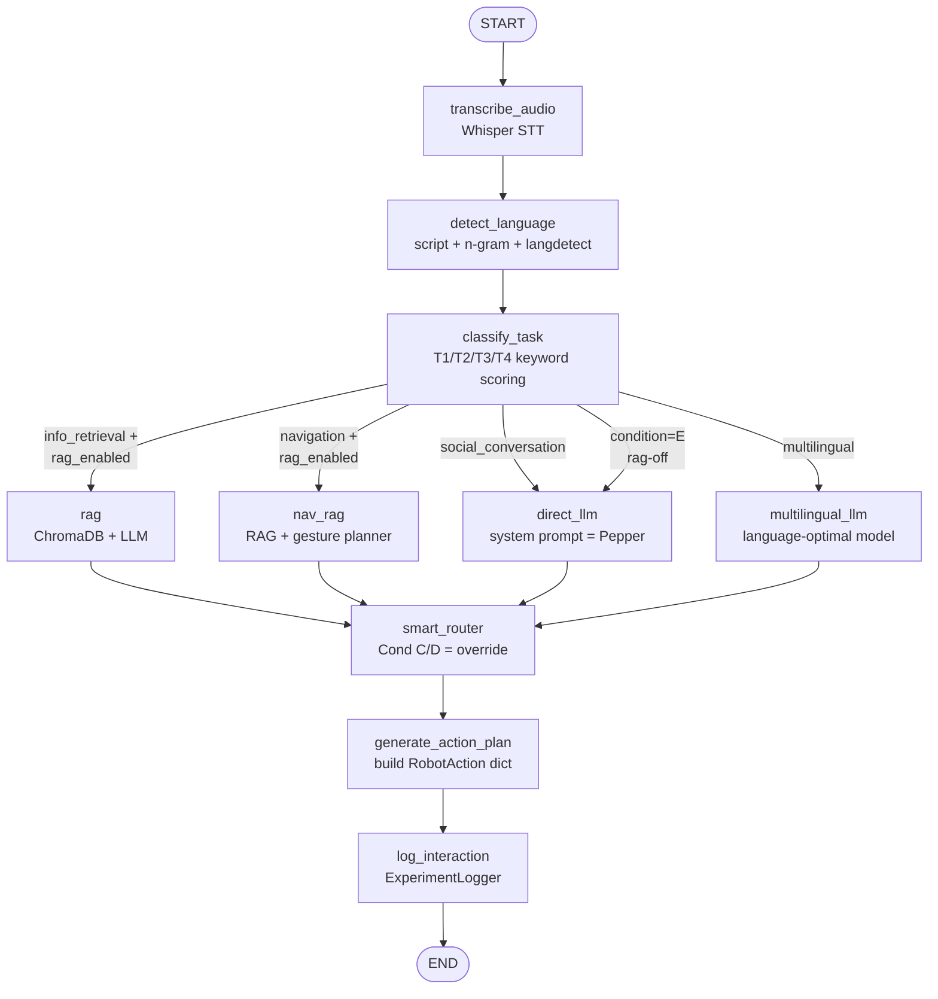

# PART II — ARCHITECTURE & DATA FLOW

\newpage

## Chapter 5 — The Three-Layer System Architecture

> **⚡ AT A GLANCE.** OmniLLM has three physical tiers. (1) The **human + robot**
> tier — a person speaking to Pepper. (2) The **AI server** tier — a Python 3.x
> Flask process running the LangGraph pipeline, RAG, gateway, router, council,
> evaluator. (3) The **provider** tier — external LLM APIs (paid clouds) and
> local Ollama (free). The robot is a thin client; *all* intelligence lives in
> tier 2; tier 3 is interchangeable.

### 5.1  The High-Level Picture

```
+============================================================================+
|                          PHYSICAL TIER  (people + hardware)                |
|                                                                            |
|   👤 Human                              🤖 Pepper (Python 2.7 / NAOqi)     |
|   "Where is Room 305?"  ─── speaks ──▶  ALAudioDevice records WAV         |
|                                          |                                 |
|                                          | HTTP POST /interact             |
|                                          | { "audio": "<base64 WAV>",     |
|                                          |   "participant_id": "P001",    |
|                                          |   "condition": "C", ... }      |
|                                          ▼                                 |
+============================================================================+
                                           │
+============================================================================+
|                         AI SERVER TIER  (Python 3.x)                        |
|                                                                            |
|   Flask app  →  LangGraph pipeline:                                        |
|     transcribe → detect_lang → classify → branch → RAG → LLM →             |
|     plan action → log → respond                                            |
|                                                                            |
|   Subsystems: SmartRouter, ConsensusEngine, Evaluator, EloScorer,         |
|              CostTracker, ExperimentLogger, QuestionnaireCollector        |
|                                                                            |
|   Storage: ChromaDB vector store, JSON eval results, JSONL session logs   |
+============================================================================+
                                           │
+============================================================================+
|                         PROVIDER TIER  (external)                          |
|                                                                            |
|   ┌─────────────┐ ┌─────────────┐ ┌─────────────┐ ┌─────────────┐         |
|   │   OpenAI    │ │  Anthropic  │ │   Google    │ │  DeepSeek   │ paid    |
|   │  api.openai │ │  api.anth.. │ │  generative │ │ api.deepseek│         |
|   │             │ │             │ │  language.. │ │             │         |
|   └─────────────┘ └─────────────┘ └─────────────┘ └─────────────┘         |
|                                                                            |
|   ┌─────────────────────────────────────────────────────────────┐          |
|   │  Ollama (localhost:11434)  —  Llama 3 / Qwen / Mistral      │ FREE     |
|   │  Whisper (local, in-process)  —  speech-to-text             │ FREE     |
|   │  ChromaDB (local, in-process)  —  vector store              │ FREE     |
|   └─────────────────────────────────────────────────────────────┘          |
+============================================================================+
```

### 5.2  Why Three Tiers (and not two, or four)?

The three-tier choice is forced by a single hard constraint: **NAOqi is locked
to Python 2.7, and every modern AI library requires Python 3.11+**. You
cannot run them in the same process. That single constraint creates the need
for the AI server tier as a *separate process* communicating over HTTP.

Could we have a *two*-tier architecture by putting the AI directly on Pepper?
No: Pepper's onboard computer (Intel Atom E3845, 4 GB RAM, 8 GB flash)
cannot host LLMs, ChromaDB, LangGraph, and Whisper.

Could we have a *four*-tier architecture by adding a "perception preprocessor"
between robot and server? You could, but the marginal benefit is small and
the engineering cost is large. The current three-tier design has been used
in 15+ published Pepper-LLM integration projects (see Chapter 26) and is the
established pattern.

### 5.3  Cross-Tier Contracts

Each tier boundary has a **contract** — a precise data format both sides agree
on. These contracts are the project's most important invariants. If you want
to swap a tier (e.g., replace Pepper with NAO), you only need to honour the
contracts.

| Boundary | Direction | Format | What it carries |
|----------|-----------|--------|-----------------|
| Human → Robot | analogue speech | sound waves | The user's question |
| Robot → AI server | HTTP POST | JSON with base64 WAV | `{audio, participant_id, session_id, condition, rag_enabled}` |
| AI server → Robot | HTTP response | JSON | `{speech, gesture, emotion_led, metadata}` |
| AI server → Provider | HTTPS POST | OpenAI chat format | `{model, messages, temperature, max_tokens}` |
| Provider → AI server | HTTPS response | Provider-specific | `{choices, usage, ...}` (LiteLLM normalises this) |
| AI server → ChromaDB | in-process | Python API | Embedding vector + chunk text |

The contract that matters most for *your* code is the **robot ↔ AI server**
contract because everything else either runs inside one process or uses a
well-known external API. The robot ↔ AI server contract is the one OmniLLM
defines and you may need to extend.

### 5.4  The Robot-↔-Server JSON Contract

Going **into** the server (`POST /interact`):

```json
{
  "audio":          "<base64 string of 16 kHz mono WAV>",
  "text":           "(optional — used in text-only mode instead of audio)",
  "participant_id": "P001",
  "session_id":     "s-abc-123",
  "condition":      "A" | "B" | "C" | "D" | "E",
  "rag_enabled":    true | false
}
```

Coming **out** of the server (`200 OK`):

```json
{
  "speech":      "Room 305 is on the third floor, on your left.",
  "gesture":     "point_left",
  "emotion_led": "#00AAFF",
  "metadata": {
    "task_type":  "navigation",
    "model_id":   "openai-gpt4o-mini",
    "rag_enabled": true
  }
}
```

The robot's NAOqi client (`server/naoqi_client.py`) reads this JSON, sets
the LED colour via `ALLeds.fadeRGB`, runs the gesture as a NAOqi behaviour
via `ALBehaviorManager.runBehavior(GESTURE_TO_BEHAVIOR[gesture])`, and
speaks the text via `ALAnimatedSpeech.say(speech)`. Everything Pepper does
is determined by these three fields plus optional metadata.

### 5.5  What If a Tier Fails?

A robust system degrades, it does not crash. Here is what happens at each
tier failure:

| Failure | Effect | Mitigation built into OmniLLM |
|---------|--------|-------------------------------|
| Pepper offline | No HRI possible | Use text-only mode (`{"text": "..."}`) — chapter 29 |
| AI server down | Robot speaks nothing | NAOqi client retries; user hears "I could not connect to my AI brain" |
| Cloud LLM API error | Specific provider unreachable | Gateway returns `ModelResponse` with `error` field; router can fall back to a different model |
| Ollama down | Local models unreachable | Cloud fallback (if API keys configured) |
| ChromaDB import fails | No vector search | RAG pipeline auto-falls-back to keyword search |
| LangGraph import fails | No agent graph | Server falls back to direct gateway call (`_fallback_interact` in `server/app.py`) |
| Whisper not installed | No audio transcription | Text-only mode still works |

This **graceful degradation** is intentional. The system has many optional
components. Each failure isolates rather than cascading.

\newpage

## Chapter 6 — The Lifecycle of a Single Spoken Question

> **⚡ AT A GLANCE.** This chapter follows one sentence — "Where is Room 305?"
> — through the entire system, byte by byte, from the moment the user opens
> their mouth to the moment Pepper points left. Twenty-one steps. The whole
> journey takes about 1–3 seconds.

### 6.1  The 21 Steps

| # | Where | What happens | Data shape | File / line |
|---|-------|--------------|------------|-------------|
| 1 | Air | Human speaks | sound waves | — |
| 2 | Pepper mic | ALAudioDevice records | 16 kHz mono PCM | `naoqi_client.py:196` |
| 3 | Pepper CPU | Bytes encoded base64 | ASCII string | `naoqi_client.py:228` |
| 4 | Wi-Fi | HTTP POST to `/interact` | JSON body | `naoqi_client.py:233` |
| 5 | AI server | Flask receives, decodes b64 | bytes | `app.py:237` |
| 6 | AI server | LangGraph invoked | `HRIGraphState` dict | `app.py:260` |
| 7 | LangGraph node | Whisper STT | `"Where is Room 305?"` | `agent_graph.py:132` |
| 8 | LangGraph node | Language detected | `"en"` | `agent_graph.py:157` |
| 9 | LangGraph node | Task classified | `"navigation"` (T2), conf 0.92 | `agent_graph.py:175` |
| 10 | LangGraph router | Conditional branch | → `nav_rag` | `agent_graph.py:497` |
| 11 | RAG | ChromaDB similarity search | top-4 chunks | `pipeline.py:488` |
| 12 | LLM | Augmented prompt sent | `messages = [system, user_with_context]` | `pipeline.py:292` |
| 13 | Gateway | Provider call (OpenAI / etc.) | OpenAI chat format | `gateway.py:219` |
| 14 | LLM | Generates answer | `"Room 305 is on..."` | — (provider) |
| 15 | Gesture planner | "on your left" → `point_left` | `(gesture, led)` | `gesture_planner.py:112` |
| 16 | Smart router (Cond C/D) | Per-task model swap or council | new `model_id` | `agent_graph.py:355` |
| 17 | LangGraph node | Build action plan | `RobotAction` dict | `agent_graph.py:430` |
| 18 | LangGraph node | Log interaction | `InteractionRecord` saved | `agent_graph.py:460` |
| 19 | Flask | Return 200 OK with JSON | `{speech, gesture, emotion_led}` | `app.py:275` |
| 20 | Pepper CPU | Receive JSON, dispatch | — | `naoqi_client.py:269` |
| 21 | Pepper hardware | LED, gesture, speech execute | physical actions | `naoqi_client.py:278–286` |

### 6.2  The Same Story as a Sequence Diagram

```
Human   Pepper      AI-Server      Whisper   Classifier   ChromaDB   LLM       Logger
  │        │            │              │           │           │       │           │
  │ asks   │            │              │           │           │       │           │
  ├───────▶│            │              │           │           │       │           │
  │   audio (WAV mic)   │              │           │           │       │           │
  │        │            │              │           │           │       │           │
  │        │ POST /interact (b64 WAV)  │           │           │       │           │
  │        ├───────────▶│              │           │           │       │           │
  │        │            │ decode b64   │           │           │       │           │
  │        │            ├─────────────▶│           │           │       │           │
  │        │            │              │ "Where is Room 305?"  │       │           │
  │        │            │◀─────────────┤           │           │       │           │
  │        │            ├───────────────────────▶  │           │       │           │
  │        │            │              │ task_type=navigation  │       │           │
  │        │            │◀─────────────────────────┤           │       │           │
  │        │            ├───────────────────────────────────▶  │       │           │
  │        │            │              │           │  top-4 chunks     │           │
  │        │            │◀─────────────────────────────────────┤       │           │
  │        │            │ augmented prompt         │           │       │           │
  │        │            ├───────────────────────────────────────────▶  │           │
  │        │            │              │           │           │  "On your left..."│
  │        │            │◀──────────────────────────────────────────────┤           │
  │        │            │ plan gesture, build RobotAction       │      │           │
  │        │            ├──────────────────────────────────────────────────────▶   │
  │        │            │              │           │           │       │ logged    │
  │        │ 200 OK { speech, gesture, led }       │           │       │           │
  │        │◀───────────┤              │           │           │       │           │
  │        │ ALLeds, gesture, ALAnimatedSpeech     │           │       │           │
  │        │ executes physically                   │           │       │           │
  │ hears, │            │              │           │           │       │           │
  │ sees   │            │              │           │           │       │           │
  │◀───────┤            │              │           │           │       │           │
```

### 6.3  Timing Budget

The user's perception of "responsive" caps at about 3 seconds in face-to-face
conversation. Here is how OmniLLM stays inside that budget:

| Step | Typical | Worst case |
|------|---------|------------|
| Whisper STT (local, base model) | 200–500 ms | 800 ms |
| Whisper STT (API, OpenAI) | 300–800 ms | 1500 ms |
| Language detection (rule-based) | 5–10 ms | 20 ms |
| Task classification (rule-based) | 10–20 ms | 50 ms |
| ChromaDB retrieval | 50–200 ms | 400 ms |
| LLM generation (cloud, mini-tier) | 500–1500 ms | 3000 ms |
| LLM generation (Ollama local) | 1000–3000 ms | 5000 ms |
| Gesture planning | 5–10 ms | 20 ms |
| Network round-trips (LAN) | 10–50 ms | 100 ms |
| **Sum (typical, cloud)** | **~1.0 s** | **~3 s** |
| **Sum (typical, local)** | **~2.0 s** | **~6 s** |

The biggest variable is the LLM call itself. This is why **Condition D
(Consensus)** is slowest — it makes three concurrent LLM calls plus a
synthesis call. It pays a latency tax for higher quality.

> 💡 The latency budget is also why OmniLLM uses `asyncio.gather()` everywhere
> — querying three council models concurrently is the same wall-clock time as
> querying one. If we did them sequentially, Condition D would take 6+
> seconds.

### 6.4  Where Time Is Spent (a real measurement)

For a typical T2 (Navigation) interaction with `condition=C`, GPT-4o-mini,
RAG enabled, English input, the breakdown looks like:

```
                                  Latency contribution (ms)
   Network (Pepper → server)    ▏ 35
   Base64 decode + dispatch     ▏ 5
   Whisper transcription        ████ 380
   Language detect              ▏ 5
   Task classify                ▏ 12
   ChromaDB retrieve top-4      ▏▏ 90
   LLM call (GPT-4o-mini)       ████████ 850
   Gesture planning             ▏ 4
   Build RobotAction            ▏ 1
   Logging                      ▏ 2
   JSON serialise + return      ▏ 8
   Network (server → Pepper)    ▏ 32
                                ━━━━━━━━━━━━━━━━━━━━━━━━━━━━━━━━━━━━━
                          Total: ~1.4 s
```

The LLM call dominates. Almost everything else is essentially free.

\newpage

## Chapter 7 — The LangGraph Agent Pipeline, Node by Node

> **⚡ AT A GLANCE.** `omnillm/hri/agent_graph.py` builds a **directed graph**
> of 9 nodes that share a state dictionary. Audio comes in at the top; a
> `RobotAction` dict comes out at the bottom. Each node is an `async` function
> that reads state, does one thing, and returns state updates. LangGraph
> handles the wiring.

### 7.1  Why a Graph?

You could write all this logic as a single 200-line `async` function with
`if/elif` branches. The result would work but be:

- Hard to test (no node-level boundaries)
- Hard to read (every concern interleaved)
- Hard to extend (where do you put a new step?)
- Hard to visualise (no graph to render)

LangGraph gives you **named nodes**, **typed state**, and **conditional edges**.
The graph is, literally, a programmable state machine. It produces a graph
diagram you can show your supervisor; it lets you mock individual nodes in
tests; it lets you add a new branch without touching the others.

### 7.2  The Nodes



(If your PDF renderer does not support Mermaid, here is the same as ASCII:)

```
              [START]
                 │
                 ▼
       ┌────────────────────┐
       │ 1. transcribe_audio│      Whisper STT
       └─────────┬──────────┘
                 ▼
       ┌────────────────────┐
       │ 2. detect_language │      script + n-gram + langdetect
       └─────────┬──────────┘
                 ▼
       ┌────────────────────┐
       │ 3. classify_task   │      T1/T2/T3/T4
       └─────────┬──────────┘
                 │
       ┌─────────┼─────────────┬───────────────┐
       ▼         ▼             ▼               ▼
   ┌──────┐ ┌────────┐ ┌────────────┐  ┌──────────────┐
   │ rag  │ │nav_rag │ │ direct_llm │  │multilingual_ │
   │ (T1) │ │ (T2)   │ │ (T3 or E)  │  │   llm (T4)   │
   └───┬──┘ └────┬───┘ └──────┬─────┘  └──────┬───────┘
       └────────┴────────────┴───────────────┘
                          ▼
              ┌─────────────────────┐
              │ 4. smart_router     │  Cond C: pick per task
              │    (Cond C / D)     │  Cond D: 3-model council
              └──────────┬──────────┘
                         ▼
              ┌─────────────────────┐
              │ 5. generate_action_ │  build RobotAction
              │    plan             │
              └──────────┬──────────┘
                         ▼
              ┌─────────────────────┐
              │ 6. log_interaction  │  ExperimentLogger
              └──────────┬──────────┘
                         ▼
                       [END]
```

### 7.3  The State Object

Every node sees and updates one shared object: `HRIGraphState`. Here is the
full dataclass, with a comment for each field:

```python
@dataclass
class HRIGraphState:
    # ── Input fields (set by the caller) ───────────────────────────────
    audio_bytes:    bytes = b""        # raw WAV from Pepper (or empty)
    participant_id: str   = ""         # e.g. "P001"
    session_id:     str   = ""         # UUID for this session
    condition:      str   = "A"        # experimental condition A–E
    rag_enabled:    bool  = True       # may be overridden by condition E

    # ── Intermediate fields (filled progressively by nodes) ────────────
    utterance:          str   = ""               # transcribed text
    detected_language:  str   = "en"             # ISO 639-1
    task_type:          str   = "info_retrieval" # T1/T2/T3/T4
    task_confidence:    float = 0.0              # 0–1

    rag_context:       str         = ""        # formatted context block
    rag_chunks:        list[Any]   = []        # DocumentChunk list
    rag_faithfulness:  float       = -1.0      # -1 = not scored

    model_id:      str  = ""    # model that ultimately answered
    response_text: str  = ""    # the answer Pepper will speak
    gesture:       str  = None  # e.g. "point_left"
    led_color:     str  = None  # e.g. "#00AAFF"

    robot_action:  dict = {}    # the final dict returned to Pepper

    judge_score:   float = -1.0
    latency_ms:    float = 0.0
    input_tokens:  int   = 0
    output_tokens: int   = 0
    cost_usd:      float = 0.0

    error:         str | None = None
    _start_time:   float       = field(default_factory=time.monotonic)
```

The state grows as the graph runs. By the time it reaches `END`, every
relevant field is filled.

### 7.4  Each Node, Briefly

We will spend a whole chapter (Chapter 17) on this file, but here is the
node-by-node summary so you can read the rest of the architecture:

**Node 1 — `transcribe_audio`**. If `audio_bytes` is non-empty, instantiate
`WhisperSTT`, call `await stt.transcribe(audio_bytes)`, store the text in
`utterance`. If `audio_bytes` is empty (text-only mode), skip — `utterance`
was already set by the caller.

**Node 2 — `detect_language`**. Run `LanguageDetector().detect(utterance)`.
Store ISO 639-1 code in `detected_language`.

**Node 3 — `classify_task`**. Run `HRITaskClassifier().classify(utterance,
detected_language)`. Returns a `ClassificationResult` whose `.task_type` and
`.confidence` are stored.

**Conditional edge after Node 3.** A function `_route_by_task_type` examines
`task_type`, `condition`, and `rag_enabled` and returns the next node name:

- Condition E (RAG-off control) always → `direct_llm`.
- T1 (info_retrieval) + RAG → `rag`.
- T2 (navigation) + RAG → `nav_rag`.
- T3 (social_conversation) → `direct_llm`.
- T4 (multilingual) → `multilingual_llm`.
- Anything else → `direct_llm`.

**Node 4a — `rag`**. Run the RAG pipeline. Produces `rag_context`, `rag_chunks`,
`rag_faithfulness`, `response_text`, `model_id`, `latency_ms`.

**Node 4b — `nav_rag`**. Same as `rag`, plus calls the `GesturePlanner` with
`task_type="navigation"` to set `gesture` and `led_color` based on direction
words in the response.

**Node 4c — `direct_llm`**. Build a Pepper system prompt
("You are Pepper, a friendly social robot..."). Call `gateway.query(model_id,
messages, temperature=0.8)`. Run `GesturePlanner` for `social_conversation`.

**Node 4d — `multilingual_llm`**. Re-detect language (in case the LLM-based
detector found something the rule-based missed). Build a prompt instructing
the LLM to respond in the detected language. Call the gateway with the
language-optimal model.

**All four 4-nodes** then converge on:

**Node 5 — `smart_router`**. Inspects `condition`. For Condition A/B/E this
is a no-op (the model has already answered). For Condition C, override the
choice using `SmartRouter.route_for_hri_task(task_type)` and re-call. For
Condition D, query a 3-model council via `ConsensusEngine`, synthesise.

**Node 6 — `generate_action_plan`**. Combine `response_text`, `gesture`,
`led_color`, and metadata into the `robot_action` dict that Pepper will
receive.

**Node 7 — `log_interaction`**. If an `ExperimentLogger` was provided when the
graph was built, write an `InteractionRecord` with everything we know about
this turn: model, latency, tokens, cost, RAG metrics, condition, task type,
language, gesture used.

The graph then terminates. The Flask route returns `result["robot_action"]`
as JSON to Pepper.

### 7.5  Why "Conditional Edges" Not "If Statements"

In LangGraph, you do not write `if task_type == "navigation": ...` inside a
node. You write a pure function that returns a string node name, and you
register conditional edges:

```python
builder.add_conditional_edges(
    "classify_task",         # source node
    _route_by_task_type,     # the function returning a node name
    {
        "rag":              "rag",
        "nav_rag":          "nav_rag",
        "direct_llm":       "direct_llm",
        "multilingual_llm": "multilingual_llm",
    },
)
```

This separation matters because:

1. The router can be tested in isolation (it's a pure function).
2. The graph is statically inspectable — LangGraph can produce a DOT-format
   diagram of all possible paths.
3. Adding a new branch is a one-line change to the routing function plus a
   new node registration, without touching existing nodes.

\newpage

## Chapter 8 — Where Every Byte Goes — Endpoint and Provider Map

> **⚡ AT A GLANCE.** This is the reference page for "what URL does what".
> Every HTTP endpoint in OmniLLM, every external API the project calls,
> every protocol used. Bookmark this for debugging.

### 8.1  The AI Server's HTTP Endpoints

These are the URLs `server/app.py` exposes. By default the server listens on
`http://0.0.0.0:5000`.

| Method | Path | What it does | Request body | Response body |
|--------|------|--------------|--------------|---------------|
| GET | `/health` | Liveness probe | (none) | `{"status": "ok", "version": "0.1.0"}` |
| GET | `/status` | Server config dump | (none) | model list, RAG flag, KB path, langgraph flag |
| POST | `/interact` | Main HRI endpoint | `{audio?, text?, participant_id, session_id, condition, rag_enabled}` | `{speech, gesture, emotion_led, metadata}` |
| POST | `/transcribe` | STT only | `{audio: <base64>}` | `{text, language}` |
| POST | `/evaluate` | Submit questionnaire | `{session_id, participant_id, condition, scores}` | `{}` |
| GET | `/export` | Dump session logs | (none) | `{count, records: [...]}` |

### 8.2  External Endpoints OmniLLM Calls

These are URLs OmniLLM calls **outwards** to LLM providers. Note that LiteLLM
hides the differences; the gateway just builds a model string.

| Provider | Endpoint | Auth | Cost basis |
|----------|----------|------|------------|
| OpenAI | `https://api.openai.com/v1/chat/completions` | `Authorization: Bearer $OPENAI_API_KEY` | per-1M tokens |
| Anthropic | `https://api.anthropic.com/v1/messages` | `x-api-key: $ANTHROPIC_API_KEY` | per-1M tokens |
| Google Gemini | `https://generativelanguage.googleapis.com/v1/models/<model>:generateContent` | API key in URL or header | per-1M tokens |
| DeepSeek | `https://api.deepseek.com/v1/chat/completions` | `Authorization: Bearer $DEEPSEEK_API_KEY` | per-1M tokens |
| Qwen / DashScope | `https://dashscope.aliyuncs.com/compatible-mode/v1/chat/completions` | API key | per-1M tokens |
| Ollama (local) | `http://localhost:11434/v1/chat/completions` | (no auth) | $0 |
| OpenAI Whisper API | `https://api.openai.com/v1/audio/transcriptions` | `Authorization: Bearer $OPENAI_API_KEY` | ~$0.006/min |

### 8.3  The Pricing Cheat-Sheet

For the models OmniLLM has registered, here is the cost per 1 million tokens
(values from `config/models.yaml`, current as of April 2026):

| OmniLLM ID | Provider | Input $/1M | Output $/1M | Type |
|------------|----------|-----------:|------------:|------|
| `openai-gpt54` | OpenAI GPT-5.4 | 2.50 | 15.00 | cloud |
| `openai-gpt4o` | OpenAI GPT-4o | 2.50 | 10.00 | cloud |
| `openai-o1` | OpenAI o1 | 15.00 | 60.00 | cloud |
| `openai-o3-mini` | OpenAI o3-mini | 1.10 | 4.40 | cloud |
| `openai-gpt4o-mini` | OpenAI GPT-4o-mini | 0.15 | 0.60 | cloud |
| `claude-sonnet` | Claude Sonnet 4.6 | 3.00 | 15.00 | cloud |
| `claude-opus` | Claude Opus 4.6 | 15.00 | 75.00 | cloud |
| `claude-haiku` | Claude Haiku 4.5 | 0.80 | 4.00 | cloud |
| `gemini-2.5-pro` | Gemini 2.5 Pro | 1.25 | 10.00 | cloud |
| `gemini-2.5-flash` | Gemini 2.5 Flash | 0.15 | 0.60 | cloud |
| `gemini-flash` | Gemini 2.0 Flash | 0.10 | 0.40 | cloud |
| `deepseek-v3-cloud` | DeepSeek V3 | 0.27 | 1.10 | cloud |
| `deepseek-r1-cloud` | DeepSeek R1 | 0.55 | 2.19 | cloud |
| `qwen-2.5-72b` | Qwen 2.5 72B | 1.10 | 3.40 | cloud |
| `llama3-8b-local` | Llama 3 8B (Ollama) | 0.00 | 0.00 | **local** |
| `qwen-2.5-7b-local` | Qwen 2.5 7B (Ollama) | 0.00 | 0.00 | **local** |
| `qwen-2.5-local` | Qwen 2.5 3B (Ollama) | 0.00 | 0.00 | **local** |
| `llama3.2-local` | Llama 3.2 3B (Ollama) | 0.00 | 0.00 | **local** |

A typical 500-token interaction (250 in / 250 out) costs:

- GPT-4o-mini: about **$0.0002** (one-fifth of one US cent).
- Claude Haiku: about **$0.0012**.
- Gemini Flash 2.0: about **$0.000125** (the cheapest paid option).
- Llama 3 8B (Ollama): **$0**.
- GPT-5.4: about **$0.0044** — twenty times more than mini.

For a 240-interaction experimental study (48 participants × 5 conditions ×
4 tasks), the total spend on `openai-gpt4o-mini` is around 5 US cents.

### 8.4  Other Inter-Process Channels

OmniLLM uses a few channels that are not HTTP:

| Channel | Used for | Where defined |
|---------|----------|---------------|
| Python in-process call | Gateway → LiteLLM | `gateway.py:219` |
| ChromaDB Python API | RAG → vector store | `rag/pipeline.py:478` |
| Whisper Python API | STT | `robotics/whisper_stt.py:152` |
| WebSocket | AI server → Buddy robot | `robotics/buddy.py:78` |
| Filesystem JSON | EloScorer save/load | `scorer.py:237` |
| Filesystem JSON/CSV | ExperimentLogger save | `utils/experiment_logger.py:359` |
| stdout (CLI) | User-facing tables & panels | `cli.py` everywhere |

### 8.5  A Test You Can Run Right Now

If you want to confirm the network architecture is wired correctly, here is
a five-line test:

```bash
# 1. Start the AI server in a terminal
python -m omnillm.server.app

# 2. In a second terminal, ping it
curl http://localhost:5000/health

# 3. Send a text-only "interaction"
curl -X POST http://localhost:5000/interact \
  -H "Content-Type: application/json" \
  -d '{"text": "Where is Room 305?", "participant_id": "TEST", "condition": "B"}'
```

You should see a JSON response with `speech`, `gesture`, and `emotion_led`.
That confirms tiers 2 and 3 are healthy. Tier 1 (the robot) is optional.

\newpage
