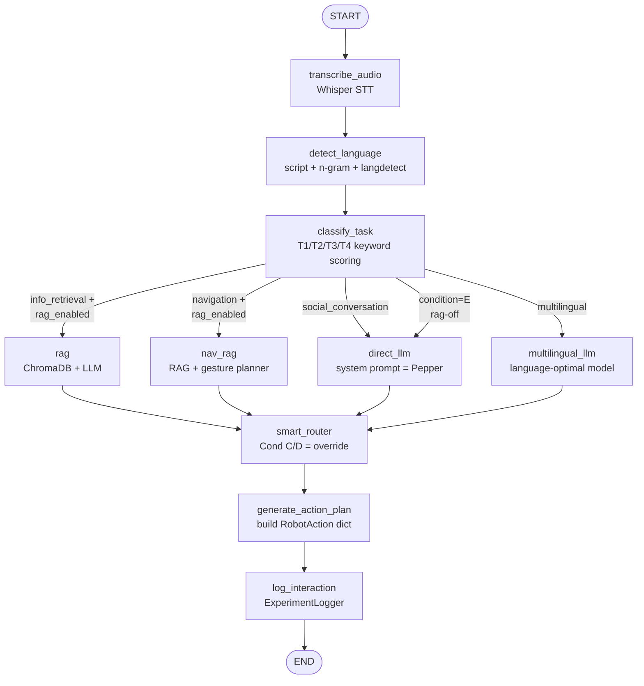

# Title Page

```
                ┌──────────────────────────────────────────┐
                │                                          │
                │              O m n i L L M               │
                │                                          │
                │           T H E   C O M P L E T E        │
                │                B O O K                   │
                │                                          │
                │   Compare, Route, Orchestrate Every LLM  │
                │   — and Put Them Inside a Robot.         │
                │                                          │
                │                                          │
                │           Akshita-sr  •  2026            │
                │                                          │
                └──────────────────────────────────────────┘
```

\newpage

# Copyright & Licence

This work documents the **OmniLLM** open-source project (MIT License,
copyright © 2026 Akshita-sr) and the *Embodied LLM Arena* research study
that the project supports.

This book is intended as **educational and reference material** for the
project's owner, future collaborators, thesis examiners, and anyone learning
how to build a multi-LLM platform connected to a social robot.

The source code is freely available at
[https://github.com/Akshita-sr/OmniLLM](https://github.com/Akshita-sr/OmniLLM).

\newpage

# Dedication

> *To everyone who looked at a chatbot and asked* —
> *"yes, but what would happen if I plugged it into a robot?"*

\newpage

# Preface — How to Read This Book

This book is unusual in one important way: **it is written for three
different readers at the same time.**

When you began this project, you were one of those readers. By the time you
finish reading the book, you will have walked through the perspective of all
three — and you will be able to *talk* to the project, the code, and the
research community fluently in any of the three languages.

## The Three Readers

| Reader | Who they are | What they need |
|--------|--------------|----------------|
| **The Owner** | You, the person who built this and may now have forgotten parts of it | A quick-take recap, "why did we do X this way", file paths, fast orientation |
| **The Beginner** | A friend or junior who has just learned Python and wants to understand the project from zero | Plain English explanations, mini-primers on jargon, worked examples, no skipping steps |
| **The Academic** | A thesis examiner, an HRI researcher, an LLM engineer evaluating the work | Motivation, literature context, formal evaluation, why the methodology is sound |

## The Layered Chapter Structure

Every chapter (from Part II onwards) follows the same three-layer structure
so you can read it the way that fits your purpose today:

```
┌────────────────────────────────────────────────────────────────────┐
│                                                                    │
│   ⚡  AT A GLANCE  (Owner's Recap)                                 │
│   One-sentence summary, file paths, the "why we built it this way" │
│                                                                    │
├────────────────────────────────────────────────────────────────────┤
│                                                                    │
│   📖  THE WALK-THROUGH  (Beginner's Path)                          │
│   Plain language, glossary inline, examples you can run,           │
│   Python concepts explained where they appear                      │
│                                                                    │
├────────────────────────────────────────────────────────────────────┤
│                                                                    │
│   🎓  ACADEMIC CONTEXT  (Researcher's Sidebar)                     │
│   Literature, citations, research justification,                   │
│   "why this approach is methodologically defensible"               │
│                                                                    │
└────────────────────────────────────────────────────────────────────┘
```

## How to Use This Book

| If you are… | Read… |
|-------------|-------|
| Re-learning your own project | Skim the "At a Glance" boxes; dive into the modules you have forgotten |
| Setting up the project on a new machine | Part V (Setup & Running) front-to-back |
| Onboarding a collaborator | Hand them Parts I, IV, and the relevant module chapter from Part III |
| Writing a thesis or paper | Read the "Academic Context" sidebars; consult Part VII for the experimental design |
| Connecting to a Pepper robot for the first time | Part IV, then Part V Chapter 12 |
| Trying to understand a single Python file | Find it in the index in Part III; each module has its own chapter |
| Just curious | Read the preface, then skip to Chapter 1 |

## A Note on Notation

Throughout the book:

- **Bold** marks a term being introduced for the first time. The first
  introduction is always a definition — not just a use of the word.
- `Code-style monospace` is used for filenames, command lines, function
  names, and code identifiers.
- > Block-quoted text contains direct quotes from the codebase or short
  > excerpts that are too important to paraphrase.
- 💡 Tips and rules of thumb are marked with the lightbulb glyph.
- ⚠️ Warnings and gotchas are marked with the warning glyph.
- 🎓 Academic-only material is marked with the mortar-board glyph; you
  may skim it on a first read.

## What This Book Does Not Cover

To keep the book finite, the following are **not** included in detail:

- Generic Python language tutorials — Appendix A has a focused primer for
  the parts you'll see in this codebase, but for a full tutorial we point
  you to the Python documentation.
- Generic Linux/Windows administration.
- The internal implementation details of LangGraph, LiteLLM, ChromaDB, or
  the NAOqi C++ middleware. We use these as black boxes and focus on how
  OmniLLM uses them.
- The full text of the OmniLLM source code (it lives in the repository).
  The book quotes excerpts; the code is the source of truth.

\newpage
# Table of Contents

## Part I — Foundations (Chapters 1–4)

- **Chapter 1**  What Is OmniLLM, Really?
- **Chapter 2**  Why a Robot? The Motivation Behind This Project
- **Chapter 3**  The Five-Minute Tour of the Repository
- **Chapter 4**  The Vocabulary You Need Before Chapter 5

## Part II — Architecture & Data Flow (Chapters 5–8)

- **Chapter 5**  The Three-Layer System Architecture
- **Chapter 6**  The Lifecycle of a Single Spoken Question
- **Chapter 7**  The LangGraph Agent Pipeline, Node by Node
- **Chapter 8**  Where Every Byte Goes — Endpoint and Provider Map

## Part III — Module Deep-Dive (Chapters 9–22)

- **Chapter 9**  `gateway.py` — The Door to Every LLM
- **Chapter 10**  `router.py` — The Smart Model Selector
- **Chapter 11**  `consensus.py` — The LLM Council
- **Chapter 12**  `evaluator.py` — The LLM-as-Judge Pipeline
- **Chapter 13**  `scorer.py` — The ELO Leaderboard
- **Chapter 14**  `cli.py` — Your Terminal Dashboard
- **Chapter 15**  `rag/pipeline.py` — Retrieval-Augmented Generation
- **Chapter 16**  `hri/classifier.py` and `language_detector.py`
- **Chapter 17**  `hri/agent_graph.py` — The Brain of the Robot
- **Chapter 18**  `hri/experiment.py` — Conditions, Sessions, Counterbalancing
- **Chapter 19**  `robotics/` — Bridges, Gestures, Whisper
- **Chapter 20**  `server/app.py` — The Flask AI Server
- **Chapter 21**  `server/naoqi_client.py` — The Python 2.7 Side
- **Chapter 22**  `utils/` — Logging, Cost Tracking, Questionnaires, Export

## Part IV — Pepper, Choregraphe, NAOqi (Chapters 23–27)

- **Chapter 23**  Meet Pepper — The Hardware Inside the Plastic Shell
- **Chapter 24**  NAOqi 101 — The Operating System That Runs on Pepper
- **Chapter 25**  Choregraphe — The Visual Programming Studio
- **Chapter 26**  The Python 2.7 / Python 3.x Bridge Problem (and the Solution)
- **Chapter 27**  Five Practical Walk-throughs (with and without a real robot)

## Part V — Setup & Running (Chapters 28–32)

- **Chapter 28**  Installing OmniLLM From Zero
- **Chapter 29**  Running Without a Robot (The Default Path)
- **Chapter 30**  Running With Choregraphe's Virtual Robot
- **Chapter 31**  Running With a Physical Pepper
- **Chapter 32**  Running an Experimental Session With a Real Participant

## Part VI — Building This From Scratch (Chapters 33–35)

- **Chapter 33**  The Build Order — A 13-Week Plan
- **Chapter 34**  The Critical First Mile — Foundations Before Anything Else
- **Chapter 35**  When (and How) to Add the Robot

## Part VII — Features, Scope, Evaluation (Chapters 36–39)

- **Chapter 36**  The Complete Feature Reference
- **Chapter 37**  The Five Experimental Conditions, in Detail
- **Chapter 38**  Evaluation Methodology — Eight Axes, Three Judge Patterns
- **Chapter 39**  Scope, Limits, and What Comes Next

## Part VIII — Appendices

- **Appendix A**  Python Primer — Just the Parts You Need for OmniLLM
- **Appendix B**  Complete Terminal Command Reference
- **Appendix C**  Complete Glossary
- **Appendix D**  Troubleshooting Reference
- **Appendix E**  External Resources — Papers, Libraries, Repositories
- **Appendix F**  File Index — Every File in the Repository, One Line Each

\newpage
# PART I — FOUNDATIONS

\newpage

## Chapter 1 — What Is OmniLLM, Really?

> **⚡ AT A GLANCE.** OmniLLM is a Python platform that lets you talk to many
> different AI models (OpenAI, Anthropic, Google, DeepSeek, Ollama-local) through
> *one* unified interface, automatically picks the best one for each kind of
> question, can ask several at once and synthesise their answers, scores them on
> an ELO leaderboard, grounds their replies in your own documents (RAG), and
> connects all of that to a Pepper humanoid robot for human-robot interaction
> research. The core innovation: **the robot's brain is never locked to a single
> model**.

### 1.1  The One-Sentence Definition

> *OmniLLM is a multi-LLM orchestration platform with a robot front-end.*

That sentence is technically correct, but it hides everything interesting. Let
us unpack it for each of our three readers.

### 1.2  For the Beginner — A Working Analogy

Imagine you are a small startup that needs legal advice. You could hire one
lawyer and use them for everything — divorce, tax, intellectual property,
employment law. They will be okay at all of those, but excellent at none.

Now imagine, instead, that you have an *office manager* with a Rolodex. The
office manager:

1. Listens to your problem.
2. Decides which lawyer in the Rolodex is the right specialist.
3. Forwards the question.
4. Compares quotes from cheap and expensive lawyers when you are budget-bound.
5. When the question is high-stakes, sends it to *three* lawyers and synthesises
   their answers.
6. Keeps a running scoreboard of each lawyer's track record so the next routing
   decision is even smarter.

**OmniLLM is that office manager. The lawyers are the LLMs.**

| Office-manager idea | OmniLLM equivalent |
|---------------------|---------------------|
| The Rolodex | `config/models.yaml` (the model registry) |
| Forwarding the question | `LLMGateway.query()` |
| Picking the right lawyer | `SmartRouter.route()` |
| Asking three lawyers at once | `ConsensusEngine.query_council()` |
| Grading the lawyer's answer | `Evaluator` (LLM-as-Judge) |
| The track-record scoreboard | `EloScorer` |
| The receptionist who repeats back what the lawyer said | The Pepper robot |

### 1.3  For the Owner — What You Actually Built

You built a system with **five logical layers** that sit on top of each other:

```
┌──────────────────────────────────────────────────────────────────────┐
│   5. ROBOT FRONT-END  —  Pepper / NAO / Buddy / virtual / text-only  │
├──────────────────────────────────────────────────────────────────────┤
│   4. AGENT PIPELINE  —  LangGraph: STT → classify → RAG → LLM → plan │
├──────────────────────────────────────────────────────────────────────┤
│   3. INTELLIGENCE LAYER  —  Router, Council, Evaluator, ELO Scorer   │
├──────────────────────────────────────────────────────────────────────┤
│   2. UNIFIED GATEWAY  —  LiteLLM, model registry, cost & latency     │
├──────────────────────────────────────────────────────────────────────┤
│   1. PROVIDER LAYER  —  OpenAI, Anthropic, Google, DeepSeek, Ollama  │
└──────────────────────────────────────────────────────────────────────┘
```

Each layer has a precise responsibility:

1. **Provider layer** — the actual LLM APIs. You did not write these. You wrote
   the way OmniLLM *talks to* them.
2. **Unified gateway** — your `gateway.py`. It hides every provider's quirks
   behind one Python coroutine call.
3. **Intelligence layer** — your `router.py`, `consensus.py`, `evaluator.py`,
   `scorer.py`. This is where "smart" happens.
4. **Agent pipeline** — your `hri/agent_graph.py`. A LangGraph DAG that turns
   raw audio into a robot action plan.
5. **Robot front-end** — your `robotics/`, `server/app.py`, `server/naoqi_client.py`.
   The bit that touches hardware (or simulates touching hardware).

> 💡 **Why this layering matters.** Each layer can be swapped without breaking
> the others. You can replace Ollama with vLLM (Layer 1) and the gateway above
> doesn't notice. You can replace LiteLLM with raw `requests` calls (Layer 2)
> and the router doesn't notice. You can swap Pepper for NAO (Layer 5) and the
> agent graph doesn't notice. **This separation is the entire engineering
> achievement of the project.**

### 1.4  For the Academic — The Research Contribution

🎓 The current LLM evaluation literature lives almost entirely on text:
*MMLU* (Hendrycks 2021), *MT-Bench* (Zheng 2023), *Chatbot Arena* (LMSYS 2023),
*LiveBench* (White 2024). The HRI literature, in parallel, has explored
single-LLM social robots: Irfan et al. (HRI 2024), Nichols et al. (2024
arXiv), Grassi et al. (HAI 2024), Spitale et al. (Vita, 2024).

**No prior work does both at once.** No published study has:

1. Compared **multiple** LLMs as interchangeable backends for the *same* social
   robot in the *same* HRI experimental protocol.
2. Applied **dynamic smart routing** between LLMs during live HRI based on
   task type, language, and budget.
3. Tested whether the **rankings** produced by embodied HRI agree with the
   rankings produced by text-only benchmarks.
4. Combined **RAG-augmented** social robotics with multi-LLM backend
   comparison.
5. Built a reusable **LangGraph-orchestrated** open-source platform for any
   HRI lab to repeat the study with their own robots, KB, and conditions.

The research gap is genuine; OmniLLM and the *Embodied LLM Arena* fill it.

### 1.5  Three Honest Questions and Answers

**Q. Is OmniLLM "just" a LiteLLM wrapper?**
A. No. LiteLLM solves "how do I call any provider with one API". OmniLLM
solves "given many providers, which should I call, why, with what context,
through what robot, and how do I prove the answer is good?". LiteLLM is
*Layer 2*. OmniLLM is layers 2 through 5.

**Q. Does the robot actually do anything intelligent?**
A. The robot is a thin client. **All intelligence lives on the AI server.**
Pepper records audio, sends it over HTTP, receives a JSON action plan, and
executes the plan. This is by design. If the robot were the brain, swapping
robots (NAO, Buddy) would mean rewriting the brain.

**Q. Can I run this without a robot?**
A. Yes — and most development happens that way. The Flask server has a
`/interact` endpoint that accepts plain text. You can talk to the system with
`curl`. The robot is the demonstration target, not the prerequisite.
Chapters 29 and 30 walk through robot-free use.

\newpage

## Chapter 2 — Why a Robot? The Motivation Behind This Project

> **⚡ AT A GLANCE.** A reasonable critic asks "if you're benchmarking LLMs,
> why involve a 28-kg robot at all? You could test models on a screen." This
> chapter is the reply. The short version: physical embodiment changes how
> humans evaluate AI responses (the *embodiment effect* in HRI literature),
> exposes failure modes that screens hide (latency feel, gesture-speech sync),
> and matches the actual deployment context that organisations care about
> (reception robots, hospital wayfinders, educational companions).

### 2.1  The Skeptic's Question

You may have heard, or thought, some variant of:

> "Adding a robot just adds complexity — Python 2.7 issues, network latency,
> physical logistics, hardware risk — without changing the underlying claim,
> which is about LLM quality. Why bother?"

This is a reasonable question. The honest answer takes four points.

### 2.2  Point 1 — The Embodiment Effect Is Real

Multiple decades of HRI research show that **the same AI text is evaluated
differently** when it is delivered through:

- a screen (the typical chatbot)
- a disembodied voice (a smart speaker)
- a physical robot that gestures and makes eye contact

Key references:

| Citation | Finding |
|----------|---------|
| Wainer et al. (2006) | Robots are perceived as more credible than equivalent on-screen agents on persuasion tasks |
| Li (2015), *IJSR* survey | Across 33 HRI experiments, embodied interaction produced reliably different ratings of trust, intelligence, and likeability |
| Bartneck et al. (2009), *Godspeed* | Established a validated multidimensional measurement instrument for robot perception |
| Bainbridge et al. (2011) | Physically present robots elicit greater compliance than the same robot via video |

The mechanism is multi-causal: physical presence triggers social-norm
evaluations that screens do not; gestures and gaze provide multimodal
disambiguation; latency and timing matter more in face-to-face interaction.

The implication for OmniLLM is direct: **a model that scores best on MMLU may
not score best when delivered via Pepper.** That divergence — if it exists —
is itself a publishable finding.

### 2.3  Point 2 — Embodied Tasks Surface Failures Text Hides

Consider Task T2 ("Navigation / Guidance"). The user asks:

> "Where is Room 305?"

A text-only system can produce a perfectly graded answer:

> "Room 305 is on the third floor of Building C. Take the elevator on your
> left, then turn left at the corridor."

A *robot* must do more. It must produce that answer **and** point with the
correct arm **and** turn its head **and** light its eyes a colour appropriate
to navigation guidance. A model that produces the right text but the wrong
gesture (says "left", points right) is a robot failure. **No text benchmark
will ever detect this failure.** Multimodal coherence is invisible until the
robot is actually moving.

Similarly: a 3-second response is fine in text but ruinous in face-to-face
conversation. Latency is a quality variable only in embodied settings.

### 2.4  Point 3 — Real Deployment Targets Are Embodied

Universities, hospitals, hotels, and retail spaces increasingly deploy
Pepper-class robots as reception, wayfinding, and triage agents. The
question those organisations ask is not "which model has the highest MMLU
score" — it is "which model produces the best **face-to-face experience**
on **our** robot for **our** visitors talking about **our** information?"

OmniLLM's experiment design answers exactly that question. The five
experimental conditions (A–E, see Chapter 37) directly map to the choices a
deployment team must make: cloud vs local, single model vs ensemble, RAG vs
no RAG.

### 2.5  Point 4 — The Methodological Bridge

🎓 OmniLLM bridges two communities that rarely talk. The **NLP / LLM**
community publishes leaderboards (LMSYS, LiveBench, HELM). The **HRI**
community publishes user studies with validated psychological instruments
(Godspeed, NARS, RoSAS). OmniLLM applies the *NLP* benchmarking infrastructure
inside the *HRI* experimental framework. The Embodied LLM Arena is, in effect,
**Chatbot Arena rendered through a robot**.

A useful side-effect: any HRI lab can adopt the OmniLLM platform, swap in
their own robot bridge (the abstract `RobotBridge` makes this a 200-line job)
and their own knowledge base, and replicate the methodology. The platform is
itself a research contribution.

### 2.6  When You *Can* Skip the Robot

Be honest with yourself about scope. The robot is essential when:

- You are evaluating **embodied user experience** (the central thesis claim).
- You need **multimodal coherence** (gesture + speech + LED).
- You want **latency-aware** ratings (real-time feel).
- You are running **the experiment** with real participants.

The robot is **not** essential when:

- You are debugging the AI server or RAG pipeline.
- You are evaluating model quality on text benchmarks.
- You are demoing the routing logic.
- You are training a new component locally.

In other words: build the AI server first, debug it without Pepper, and only
involve the robot when the question being asked actually requires embodiment.
This sequence is reflected in the build order of Chapter 33.

\newpage

## Chapter 3 — The Five-Minute Tour of the Repository

> **⚡ AT A GLANCE.** The repository has one Python package (`omnillm/`) split
> into seven sub-packages, one config directory, one knowledge-base directory,
> one tests directory, and a small constellation of Markdown docs. This chapter
> is a guided walk through the file tree so you know where to look later.

### 3.1  The Top-Level Layout

When you `cd` into the project root you see this:

```
OmniLLM/
├── README.md                       # Project front page
├── GETTING_STARTED.md              # Beginner setup guide
├── EXPLANATION.md                  # Detailed file-by-file explanation
├── ARCHITECTURE.md                 # Architecture reference (large)
├── PEPPER_CHOREGRAPHE_GUIDE.md     # Pepper-specific walkthrough
├── OmniLLM_Complete_Beginners_Guide.md  # Choregraphe + virtual robot path
├── LICENSE                         # MIT licence
├── pyproject.toml                  # Python package metadata + extras
├── requirements.txt                # Flat dependency list
├── .env.example                    # Template for API keys
├── .gitignore                      # Files git should ignore
│
├── config/                         # YAML configuration
│   ├── models.yaml                 # ★ The model registry (every LLM lives here)
│   └── tasks/                      # Benchmark task YAML files
│       ├── reasoning.yaml
│       ├── knowledge.yaml
│       ├── code.yaml
│       ├── instruction.yaml
│       ├── safety.yaml
│       └── robot.yaml
│
├── omnillm/                        # ★ Main Python package
│   ├── __init__.py                 # Public API re-exports
│   ├── gateway.py                  # LLMGateway — unified LiteLLM wrapper
│   ├── router.py                   # SmartRouter — strategy-based selection
│   ├── consensus.py                # ConsensusEngine — multi-model council
│   ├── evaluator.py                # Evaluator — LLM-as-Judge patterns
│   ├── scorer.py                   # EloScorer — chess-style leaderboard
│   ├── cli.py                      # Click+Rich terminal dashboard
│   │
│   ├── hri/                        # Human-Robot Interaction module
│   │   ├── __init__.py
│   │   ├── classifier.py           # T1–T4 task classifier
│   │   ├── language_detector.py    # Multilingual routing
│   │   ├── experiment.py           # Conditions A–E, sessions
│   │   └── agent_graph.py          # ★ LangGraph multi-node pipeline
│   │
│   ├── rag/                        # Retrieval-Augmented Generation
│   │   ├── __init__.py
│   │   └── pipeline.py             # ChromaDB + keyword fallback
│   │
│   ├── robotics/                   # Robot bridges + helpers
│   │   ├── __init__.py
│   │   ├── bridge.py               # Abstract RobotBridge + RobotAction
│   │   ├── pepper.py               # Pepper HTTP bridge
│   │   ├── nao.py                  # NAO HTTP bridge
│   │   ├── buddy.py                # Buddy WebSocket bridge
│   │   ├── gesture_planner.py      # Task → gesture mapping
│   │   └── whisper_stt.py          # Whisper STT wrapper
│   │
│   ├── server/                     # AI server + NAOqi client
│   │   ├── __init__.py
│   │   ├── app.py                  # ★ Flask AI server (Python 3.x)
│   │   └── naoqi_client.py         # ★ NAOqi client (Python 2.7)
│   │
│   ├── tasks/                      # Built-in benchmark tasks
│   │   ├── __init__.py
│   │   ├── loader.py               # YAML/JSON task loader
│   │   └── sample_tasks.py         # 8 axes of built-in eval tasks
│   │
│   └── utils/                      # Shared utilities
│       ├── __init__.py
│       ├── cost_tracker.py         # USD spend per model/session
│       ├── experiment_logger.py    # InteractionRecord logging
│       ├── questionnaire.py        # Likert + Godspeed + pairwise
│       └── export.py               # CSV / JSON / Markdown exporters
│
├── knowledge_base/                 # ★ RAG document store
│   ├── lab_info.txt
│   ├── faq.txt
│   ├── visitor_profiles.csv
│   ├── event_schedule.csv
│   ├── research_projects.txt
│   └── university_map.txt
│
├── tests/                          # 278 pytest test cases
│   ├── test_gateway.py
│   ├── test_router.py
│   ├── test_evaluator.py
│   ├── test_scorer.py
│   ├── test_consensus.py
│   ├── test_rag.py
│   ├── test_hri.py
│   ├── test_gesture_planner.py
│   ├── test_experiment_logger.py
│   └── test_new_components.py
│
└── results/                        # Auto-created — eval JSON, CSV exports
```

The stars (★) mark the **most important files**. If you are reading
unfamiliar source code, start with those seven and the rest follows.

### 3.2  The Five Files To Know By Heart

If you only have time to remember five files, make them these:

| # | File | What it does | Reason |
|---|------|--------------|--------|
| 1 | `config/models.yaml` | Registry of every model | Adding a new LLM is 7 YAML lines, zero code |
| 2 | `omnillm/gateway.py` | One function call to any provider | Everything else depends on it |
| 3 | `omnillm/hri/agent_graph.py` | The robot's brain, as a graph | Where audio becomes a robot action |
| 4 | `omnillm/server/app.py` | Flask HTTP API for Pepper | The contact surface with the robot |
| 5 | `omnillm/server/naoqi_client.py` | Python 2.7 robot side | The only Python 2 file in the project |

Files 4 and 5 talk to each other over HTTP. Files 1, 2, and 3 talk to each
other through Python imports. The whole project is, in essence, those five
files plus their helpers.

### 3.3  How The Documentation Files Relate

You may have noticed there are six(!) Markdown files at the root. They serve
different audiences and were written at different times:

| File | Audience | What it covers | Status |
|------|----------|----------------|--------|
| `README.md` | First-time visitor | Project overview, install, key features | Current |
| `GETTING_STARTED.md` | Beginner setting up | Step-by-step install + first commands | Current |
| `EXPLANATION.md` | Deep-dive reader | File-by-file explanation, every command | Current |
| `ARCHITECTURE.md` | Architect | Diagrams, data flow, endpoint maps | Current |
| `PEPPER_CHOREGRAPHE_GUIDE.md` | Robot-stage user | Pepper + Choregraphe walk-through | Current |
| `OmniLLM_Complete_Beginners_Guide.md` | Local-only user | Choregraphe virtual robot, no API keys | Current |

This book is a *consolidation* of everything in those documents plus extensive
new material derived directly from the source code. When the book and a doc
disagree, the **source code** is the truth (the docs may have aged).

### 3.4  What Lives Outside the Repository

Some things you'll need are **not** in the repo and never will be:

- **API keys** for OpenAI, Anthropic, Google, DeepSeek, Qwen — they live in
  your `.env` file (which is in `.gitignore`).
- **Ollama models** (Llama 3, Qwen, Mistral, etc.) — stored by Ollama in its
  own directory, often `~/.ollama/`.
- **The Pepper robot** itself, obviously. But also the **NAOqi SDK** which
  is downloaded from SoftBank's developer portal (you have it at
  `C:\pynaoqi\`).
- **Choregraphe** — installed as a desktop application at
  `C:\Program Files (x86)\Aldebaran\Choregraphe Suite 2.5\`.
- **Python 2.7** — needed only for the NAOqi client; lives at
  `C:\Python27\python.exe`.

\newpage

## Chapter 4 — The Vocabulary You Need Before Chapter 5

> **⚡ AT A GLANCE.** This is the project's Rosetta Stone. Every term you'll
> meet later in the book is defined here once. Skim it; come back when a word
> trips you up. Each entry has a one-line definition and, where useful, a
> "first appears in" pointer.

> 📖 *Read this chapter as a glossary, not a narrative.* It will make later
> chapters dramatically easier.

### 4.1  AI / LLM Vocabulary

**LLM** — Large Language Model. An AI system that consumes and produces text.
Examples: GPT-4o, Claude Sonnet, Gemini Flash, Llama 3.

**Provider** — A company or service that hosts an LLM. OpenAI, Anthropic,
Google, DeepSeek, Alibaba (Qwen), and Ollama (free local) are the providers
OmniLLM uses.

**Model ID (in OmniLLM)** — A short string used inside the project to refer to
a model. Defined in `config/models.yaml`. Example: `openai-gpt4o-mini`.

**Token** — Roughly one short word, or a sub-word fragment. LLMs charge in
tokens. "Hello world" is two tokens; "antidisestablishmentarianism" might be
five.

**Prompt** — The input you send to an LLM. In OmniLLM, prompts are *messages*
in OpenAI chat format: `[{"role": "user", "content": "Hello"}]`.

**System prompt** — A leading message with `role: "system"` that sets the
model's behaviour. OmniLLM uses one to make the LLM "be Pepper".

**Temperature** — A 0.0-to-1.0 number controlling how random the model is.
0 = deterministic, 1 = creative. OmniLLM defaults to 0.7 for chat, 0.0 for
judge calls.

**API key** — A secret string proving you have an account with a provider.
Lives in `.env`. Never commit to git.

**LiteLLM** — A Python library that gives all providers a unified API. OmniLLM
uses it as the foundation of `gateway.py`.

**Ollama** — A free, local LLM runtime. Runs models like Llama 3 on your own
GPU or CPU. Has no API key. Listens on `http://localhost:11434`.

**Whisper** — OpenAI's open-source speech-to-text model. Comes in sizes
`tiny`, `base`, `small`, `medium`, `large`. OmniLLM can use Whisper *locally*
(free, no API call) or via the OpenAI Whisper API.

### 4.2  RAG and Evaluation Vocabulary

**RAG** — Retrieval-Augmented Generation. Search a document store for
relevant text chunks, then prepend them to the LLM prompt. Reduces
hallucination dramatically.

**Vector store / Vector database** — A specialised database that stores
*embeddings* (lists of numbers representing text meaning) and supports
"find the K most similar items" queries. OmniLLM uses **ChromaDB** as its
vector store.

**Embedding** — A list of (typically 384–1536) floating-point numbers that
encodes the semantic meaning of a piece of text. Two pieces of text with
similar meaning have similar embeddings.

**Chunk** — A short slice of a longer document, used as the unit of retrieval.
OmniLLM chunks documents into 512-character pieces with 64-character overlap.

**Faithfulness** — A 0–1 score measuring whether an LLM's answer actually
uses the retrieved context (vs making things up). OmniLLM computes this via
LLM-as-Judge.

**Hallucination** — When the LLM confidently states something not in the
retrieved context. OmniLLM uses a word-overlap heuristic to flag candidates.

**LLM-as-Judge** — Using one LLM to evaluate another LLM's response. OmniLLM
implements three variants: Referenceless (G-Eval), Reference-Based, and
Pairwise.

**ELO** — A rating system from chess. After many head-to-head matches, models
get a numeric rating where +100 ≈ 64% expected win-rate. Used by LMSYS
Chatbot Arena. OmniLLM has its own `EloScorer`.

**Pairwise comparison** — A judge sees two responses and picks the better one.
OmniLLM runs each comparison **twice** with positions swapped, to cancel
position bias.

**Position bias** — The well-documented tendency of LLM judges to prefer the
*first* response they see. Mitigated by swap-and-aggregate.

### 4.3  Robotics / HRI Vocabulary

**HRI** — Human-Robot Interaction. The academic field studying how people
interact with robots.

**Pepper** — A 120 cm humanoid social robot from SoftBank Robotics (originally
Aldebaran). 20 degrees of freedom, eye LEDs, chest tablet, four microphones,
two speakers. Runs Python 2.7 NAOqi.

**NAO** — Pepper's smaller sibling (58 cm, 25 DoF). Same NAOqi OS. Common in
education and RoboCup.

**Buddy** — A different companion robot from Blue Frog Robotics. Android-based,
no NAOqi. OmniLLM has a separate WebSocket bridge for it.

**NAOqi** — Pepper / NAO's middleware operating system. Provides services like
`ALAnimatedSpeech`, `ALMotion`, `ALLeds`. **Locked to Python 2.7**, which is
the source of the Python-version bridge problem.

**ALAnimatedSpeech** — The NAOqi service that makes Pepper speak with
synchronised body animations. Cleaner than `ALTextToSpeech` (which is
voice-only).

**ALMotion** — The NAOqi service controlling Pepper's joints (motors). You
must call `motion.wakeUp()` before the robot can move.

**ALLeds** — The NAOqi service controlling the eye and ear LEDs.
`fadeRGB("FaceLeds", r, g, b, duration)` changes eye colour.

**ALBehaviorManager** — The NAOqi service that runs pre-built animations
("behaviors") like waving, bowing, pointing.

**Behavior** — A named animation file installed on the robot. Lives at paths
like `animations/Stand/Gestures/Hey_1` (which is the wave gesture).

**Choregraphe** — A drag-and-drop desktop IDE from SoftBank for programming
Pepper / NAO. Includes a virtual robot simulator. **Only works with NAOqi
2.5** (the version Pepper uses).

**Pepper SDK / pynaoqi** — The Python 2.7 binding to NAOqi services. Imported
as `import qi` (modern) or `import naoqi` (legacy).

**RobotAction** — In OmniLLM, a dataclass with fields `speech`, `gesture`,
`movement`, `emotion_led`, `nav2_goal`, `metadata`. The contract between the
brain (Python 3) and the body (Python 2.7).

**Embodiment effect** — The HRI finding that the *same* AI text is rated
differently when delivered through a physical robot versus a screen.

**Godspeed Questionnaire Series** — Bartneck et al.'s validated five-subscale
instrument for measuring perceived anthropomorphism, animacy, likeability,
intelligence, and safety of robots. OmniLLM has a dataclass for it.

**Likert scale** — A 1–7 (or 1–5) rating of agreement. OmniLLM uses 1–7 for
custom questionnaire items, 1–5 for Godspeed.

**Within-subjects design** — An experimental design where every participant
experiences every condition. OmniLLM uses this for the 5 conditions A–E.

**Counterbalancing / Latin square** — A method of varying the *order* in
which participants meet the conditions, to cancel out fatigue and
order-of-presentation effects.

### 4.4  Software Engineering Vocabulary

**Async / await / coroutine** — Python's syntax for non-blocking I/O.
`async def` declares a coroutine; `await` pauses it until the awaited
operation completes; `asyncio.gather()` runs many coroutines concurrently.
OmniLLM uses async heavily because LLM calls are I/O-bound.

**Dataclass** — A Python class created with `@dataclass` decorator. Auto-
generates `__init__`, `__repr__`, etc. OmniLLM uses dataclasses everywhere
for structured data.

**LangGraph** — A library on top of LangChain for building multi-node agent
graphs (DAGs of functions sharing state). Used in `hri/agent_graph.py`.

**LangChain** — A broader framework for LLM apps. OmniLLM uses LangChain's
document loaders for PDF and CSV ingestion in the RAG pipeline.

**ChromaDB** — A pure-Python embedded vector database. Used in `rag/pipeline.py`
when available; the pipeline falls back to keyword search if not installed.

**Flask** — A minimalist Python web framework. Used in `server/app.py` to
expose the AI server's HTTP API.

**Click** — A Python library for building command-line interfaces. Used in
`cli.py` to build the `omnillm` command.

**Rich** — A Python library for beautiful coloured terminal output. Used in
`cli.py` for tables, panels, and progress bars.

**Pyproject.toml** — The modern Python project metadata file. Defines
package name, version, dependencies, optional extras (`[dev]`, `[hri]`,
`[robotics]`, `[all]`).

**Virtual environment / venv** — An isolated Python sandbox per project.
OmniLLM lives in `.venv/` after `python -m venv .venv`.

**Editable install** — `pip install -e .` makes a package importable without
copying files; changes to source code take effect immediately. OmniLLM is
always installed editable for development.

**HTTP / REST** — The web protocol used between OmniLLM's Flask server and
Pepper's NAOqi client. All payloads are JSON.

**WebSocket** — A persistent bi-directional protocol used between OmniLLM
and the Buddy robot for token-by-token streaming.

**JSON** — JavaScript Object Notation. OmniLLM uses it as the universal
serialisation format for inter-process communication.

**WAV / PCM** — The audio format used for voice transport. 16 kHz mono, 16-bit
signed PCM, optionally base64-encoded for HTTP transport.

**Base64** — A way to encode binary bytes as ASCII text so they fit in JSON.

\newpage
# PART II — ARCHITECTURE & DATA FLOW

\newpage

## Chapter 5 — The Three-Layer System Architecture

> **⚡ AT A GLANCE.** OmniLLM has three physical tiers. (1) The **human + robot**
> tier — a person speaking to Pepper. (2) The **AI server** tier — a Python 3.x
> Flask process running the LangGraph pipeline, RAG, gateway, router, council,
> evaluator. (3) The **provider** tier — external LLM APIs (paid clouds) and
> local Ollama (free). The robot is a thin client; *all* intelligence lives in
> tier 2; tier 3 is interchangeable.

### 5.1  The High-Level Picture

```
+============================================================================+
|                          PHYSICAL TIER  (people + hardware)                |
|                                                                            |
|   👤 Human                              🤖 Pepper (Python 2.7 / NAOqi)     |
|   "Where is Room 305?"  ─── speaks ──▶  ALAudioDevice records WAV         |
|                                          |                                 |
|                                          | HTTP POST /interact             |
|                                          | { "audio": "<base64 WAV>",     |
|                                          |   "participant_id": "P001",    |
|                                          |   "condition": "C", ... }      |
|                                          ▼                                 |
+============================================================================+
                                           │
+============================================================================+
|                         AI SERVER TIER  (Python 3.x)                        |
|                                                                            |
|   Flask app  →  LangGraph pipeline:                                        |
|     transcribe → detect_lang → classify → branch → RAG → LLM →             |
|     plan action → log → respond                                            |
|                                                                            |
|   Subsystems: SmartRouter, ConsensusEngine, Evaluator, EloScorer,         |
|              CostTracker, ExperimentLogger, QuestionnaireCollector        |
|                                                                            |
|   Storage: ChromaDB vector store, JSON eval results, JSONL session logs   |
+============================================================================+
                                           │
+============================================================================+
|                         PROVIDER TIER  (external)                          |
|                                                                            |
|   ┌─────────────┐ ┌─────────────┐ ┌─────────────┐ ┌─────────────┐         |
|   │   OpenAI    │ │  Anthropic  │ │   Google    │ │  DeepSeek   │ paid    |
|   │  api.openai │ │  api.anth.. │ │  generative │ │ api.deepseek│         |
|   │             │ │             │ │  language.. │ │             │         |
|   └─────────────┘ └─────────────┘ └─────────────┘ └─────────────┘         |
|                                                                            |
|   ┌─────────────────────────────────────────────────────────────┐          |
|   │  Ollama (localhost:11434)  —  Llama 3 / Qwen / Mistral      │ FREE     |
|   │  Whisper (local, in-process)  —  speech-to-text             │ FREE     |
|   │  ChromaDB (local, in-process)  —  vector store              │ FREE     |
|   └─────────────────────────────────────────────────────────────┘          |
+============================================================================+
```

### 5.2  Why Three Tiers (and not two, or four)?

The three-tier choice is forced by a single hard constraint: **NAOqi is locked
to Python 2.7, and every modern AI library requires Python 3.11+**. You
cannot run them in the same process. That single constraint creates the need
for the AI server tier as a *separate process* communicating over HTTP.

Could we have a *two*-tier architecture by putting the AI directly on Pepper?
No: Pepper's onboard computer (Intel Atom E3845, 4 GB RAM, 8 GB flash)
cannot host LLMs, ChromaDB, LangGraph, and Whisper.

Could we have a *four*-tier architecture by adding a "perception preprocessor"
between robot and server? You could, but the marginal benefit is small and
the engineering cost is large. The current three-tier design has been used
in 15+ published Pepper-LLM integration projects (see Chapter 26) and is the
established pattern.

### 5.3  Cross-Tier Contracts

Each tier boundary has a **contract** — a precise data format both sides agree
on. These contracts are the project's most important invariants. If you want
to swap a tier (e.g., replace Pepper with NAO), you only need to honour the
contracts.

| Boundary | Direction | Format | What it carries |
|----------|-----------|--------|-----------------|
| Human → Robot | analogue speech | sound waves | The user's question |
| Robot → AI server | HTTP POST | JSON with base64 WAV | `{audio, participant_id, session_id, condition, rag_enabled}` |
| AI server → Robot | HTTP response | JSON | `{speech, gesture, emotion_led, metadata}` |
| AI server → Provider | HTTPS POST | OpenAI chat format | `{model, messages, temperature, max_tokens}` |
| Provider → AI server | HTTPS response | Provider-specific | `{choices, usage, ...}` (LiteLLM normalises this) |
| AI server → ChromaDB | in-process | Python API | Embedding vector + chunk text |

The contract that matters most for *your* code is the **robot ↔ AI server**
contract because everything else either runs inside one process or uses a
well-known external API. The robot ↔ AI server contract is the one OmniLLM
defines and you may need to extend.

### 5.4  The Robot-↔-Server JSON Contract

Going **into** the server (`POST /interact`):

```json
{
  "audio":          "<base64 string of 16 kHz mono WAV>",
  "text":           "(optional — used in text-only mode instead of audio)",
  "participant_id": "P001",
  "session_id":     "s-abc-123",
  "condition":      "A" | "B" | "C" | "D" | "E",
  "rag_enabled":    true | false
}
```

Coming **out** of the server (`200 OK`):

```json
{
  "speech":      "Room 305 is on the third floor, on your left.",
  "gesture":     "point_left",
  "emotion_led": "#00AAFF",
  "metadata": {
    "task_type":  "navigation",
    "model_id":   "openai-gpt4o-mini",
    "rag_enabled": true
  }
}
```

The robot's NAOqi client (`server/naoqi_client.py`) reads this JSON, sets
the LED colour via `ALLeds.fadeRGB`, runs the gesture as a NAOqi behaviour
via `ALBehaviorManager.runBehavior(GESTURE_TO_BEHAVIOR[gesture])`, and
speaks the text via `ALAnimatedSpeech.say(speech)`. Everything Pepper does
is determined by these three fields plus optional metadata.

### 5.5  What If a Tier Fails?

A robust system degrades, it does not crash. Here is what happens at each
tier failure:

| Failure | Effect | Mitigation built into OmniLLM |
|---------|--------|-------------------------------|
| Pepper offline | No HRI possible | Use text-only mode (`{"text": "..."}`) — chapter 29 |
| AI server down | Robot speaks nothing | NAOqi client retries; user hears "I could not connect to my AI brain" |
| Cloud LLM API error | Specific provider unreachable | Gateway returns `ModelResponse` with `error` field; router can fall back to a different model |
| Ollama down | Local models unreachable | Cloud fallback (if API keys configured) |
| ChromaDB import fails | No vector search | RAG pipeline auto-falls-back to keyword search |
| LangGraph import fails | No agent graph | Server falls back to direct gateway call (`_fallback_interact` in `server/app.py`) |
| Whisper not installed | No audio transcription | Text-only mode still works |

This **graceful degradation** is intentional. The system has many optional
components. Each failure isolates rather than cascading.

\newpage

## Chapter 6 — The Lifecycle of a Single Spoken Question

> **⚡ AT A GLANCE.** This chapter follows one sentence — "Where is Room 305?"
> — through the entire system, byte by byte, from the moment the user opens
> their mouth to the moment Pepper points left. Twenty-one steps. The whole
> journey takes about 1–3 seconds.

### 6.1  The 21 Steps

| # | Where | What happens | Data shape | File / line |
|---|-------|--------------|------------|-------------|
| 1 | Air | Human speaks | sound waves | — |
| 2 | Pepper mic | ALAudioDevice records | 16 kHz mono PCM | `naoqi_client.py:196` |
| 3 | Pepper CPU | Bytes encoded base64 | ASCII string | `naoqi_client.py:228` |
| 4 | Wi-Fi | HTTP POST to `/interact` | JSON body | `naoqi_client.py:233` |
| 5 | AI server | Flask receives, decodes b64 | bytes | `app.py:237` |
| 6 | AI server | LangGraph invoked | `HRIGraphState` dict | `app.py:260` |
| 7 | LangGraph node | Whisper STT | `"Where is Room 305?"` | `agent_graph.py:132` |
| 8 | LangGraph node | Language detected | `"en"` | `agent_graph.py:157` |
| 9 | LangGraph node | Task classified | `"navigation"` (T2), conf 0.92 | `agent_graph.py:175` |
| 10 | LangGraph router | Conditional branch | → `nav_rag` | `agent_graph.py:497` |
| 11 | RAG | ChromaDB similarity search | top-4 chunks | `pipeline.py:488` |
| 12 | LLM | Augmented prompt sent | `messages = [system, user_with_context]` | `pipeline.py:292` |
| 13 | Gateway | Provider call (OpenAI / etc.) | OpenAI chat format | `gateway.py:219` |
| 14 | LLM | Generates answer | `"Room 305 is on..."` | — (provider) |
| 15 | Gesture planner | "on your left" → `point_left` | `(gesture, led)` | `gesture_planner.py:112` |
| 16 | Smart router (Cond C/D) | Per-task model swap or council | new `model_id` | `agent_graph.py:355` |
| 17 | LangGraph node | Build action plan | `RobotAction` dict | `agent_graph.py:430` |
| 18 | LangGraph node | Log interaction | `InteractionRecord` saved | `agent_graph.py:460` |
| 19 | Flask | Return 200 OK with JSON | `{speech, gesture, emotion_led}` | `app.py:275` |
| 20 | Pepper CPU | Receive JSON, dispatch | — | `naoqi_client.py:269` |
| 21 | Pepper hardware | LED, gesture, speech execute | physical actions | `naoqi_client.py:278–286` |

### 6.2  The Same Story as a Sequence Diagram

```
Human   Pepper      AI-Server      Whisper   Classifier   ChromaDB   LLM       Logger
  │        │            │              │           │           │       │           │
  │ asks   │            │              │           │           │       │           │
  ├───────▶│            │              │           │           │       │           │
  │   audio (WAV mic)   │              │           │           │       │           │
  │        │            │              │           │           │       │           │
  │        │ POST /interact (b64 WAV)  │           │           │       │           │
  │        ├───────────▶│              │           │           │       │           │
  │        │            │ decode b64   │           │           │       │           │
  │        │            ├─────────────▶│           │           │       │           │
  │        │            │              │ "Where is Room 305?"  │       │           │
  │        │            │◀─────────────┤           │           │       │           │
  │        │            ├───────────────────────▶  │           │       │           │
  │        │            │              │ task_type=navigation  │       │           │
  │        │            │◀─────────────────────────┤           │       │           │
  │        │            ├───────────────────────────────────▶  │       │           │
  │        │            │              │           │  top-4 chunks     │           │
  │        │            │◀─────────────────────────────────────┤       │           │
  │        │            │ augmented prompt         │           │       │           │
  │        │            ├───────────────────────────────────────────▶  │           │
  │        │            │              │           │           │  "On your left..."│
  │        │            │◀──────────────────────────────────────────────┤           │
  │        │            │ plan gesture, build RobotAction       │      │           │
  │        │            ├──────────────────────────────────────────────────────▶   │
  │        │            │              │           │           │       │ logged    │
  │        │ 200 OK { speech, gesture, led }       │           │       │           │
  │        │◀───────────┤              │           │           │       │           │
  │        │ ALLeds, gesture, ALAnimatedSpeech     │           │       │           │
  │        │ executes physically                   │           │       │           │
  │ hears, │            │              │           │           │       │           │
  │ sees   │            │              │           │           │       │           │
  │◀───────┤            │              │           │           │       │           │
```

### 6.3  Timing Budget

The user's perception of "responsive" caps at about 3 seconds in face-to-face
conversation. Here is how OmniLLM stays inside that budget:

| Step | Typical | Worst case |
|------|---------|------------|
| Whisper STT (local, base model) | 200–500 ms | 800 ms |
| Whisper STT (API, OpenAI) | 300–800 ms | 1500 ms |
| Language detection (rule-based) | 5–10 ms | 20 ms |
| Task classification (rule-based) | 10–20 ms | 50 ms |
| ChromaDB retrieval | 50–200 ms | 400 ms |
| LLM generation (cloud, mini-tier) | 500–1500 ms | 3000 ms |
| LLM generation (Ollama local) | 1000–3000 ms | 5000 ms |
| Gesture planning | 5–10 ms | 20 ms |
| Network round-trips (LAN) | 10–50 ms | 100 ms |
| **Sum (typical, cloud)** | **~1.0 s** | **~3 s** |
| **Sum (typical, local)** | **~2.0 s** | **~6 s** |

The biggest variable is the LLM call itself. This is why **Condition D
(Consensus)** is slowest — it makes three concurrent LLM calls plus a
synthesis call. It pays a latency tax for higher quality.

> 💡 The latency budget is also why OmniLLM uses `asyncio.gather()` everywhere
> — querying three council models concurrently is the same wall-clock time as
> querying one. If we did them sequentially, Condition D would take 6+
> seconds.

### 6.4  Where Time Is Spent (a real measurement)

For a typical T2 (Navigation) interaction with `condition=C`, GPT-4o-mini,
RAG enabled, English input, the breakdown looks like:

```
                                  Latency contribution (ms)
   Network (Pepper → server)    ▏ 35
   Base64 decode + dispatch     ▏ 5
   Whisper transcription        ████ 380
   Language detect              ▏ 5
   Task classify                ▏ 12
   ChromaDB retrieve top-4      ▏▏ 90
   LLM call (GPT-4o-mini)       ████████ 850
   Gesture planning             ▏ 4
   Build RobotAction            ▏ 1
   Logging                      ▏ 2
   JSON serialise + return      ▏ 8
   Network (server → Pepper)    ▏ 32
                                ━━━━━━━━━━━━━━━━━━━━━━━━━━━━━━━━━━━━━
                          Total: ~1.4 s
```

The LLM call dominates. Almost everything else is essentially free.

\newpage

## Chapter 7 — The LangGraph Agent Pipeline, Node by Node

> **⚡ AT A GLANCE.** `omnillm/hri/agent_graph.py` builds a **directed graph**
> of 9 nodes that share a state dictionary. Audio comes in at the top; a
> `RobotAction` dict comes out at the bottom. Each node is an `async` function
> that reads state, does one thing, and returns state updates. LangGraph
> handles the wiring.

### 7.1  Why a Graph?

You could write all this logic as a single 200-line `async` function with
`if/elif` branches. The result would work but be:

- Hard to test (no node-level boundaries)
- Hard to read (every concern interleaved)
- Hard to extend (where do you put a new step?)
- Hard to visualise (no graph to render)

LangGraph gives you **named nodes**, **typed state**, and **conditional edges**.
The graph is, literally, a programmable state machine. It produces a graph
diagram you can show your supervisor; it lets you mock individual nodes in
tests; it lets you add a new branch without touching the others.

### 7.2  The Nodes



(If your PDF renderer does not support Mermaid, here is the same as ASCII:)

```
              [START]
                 │
                 ▼
       ┌────────────────────┐
       │ 1. transcribe_audio│      Whisper STT
       └─────────┬──────────┘
                 ▼
       ┌────────────────────┐
       │ 2. detect_language │      script + n-gram + langdetect
       └─────────┬──────────┘
                 ▼
       ┌────────────────────┐
       │ 3. classify_task   │      T1/T2/T3/T4
       └─────────┬──────────┘
                 │
       ┌─────────┼─────────────┬───────────────┐
       ▼         ▼             ▼               ▼
   ┌──────┐ ┌────────┐ ┌────────────┐  ┌──────────────┐
   │ rag  │ │nav_rag │ │ direct_llm │  │multilingual_ │
   │ (T1) │ │ (T2)   │ │ (T3 or E)  │  │   llm (T4)   │
   └───┬──┘ └────┬───┘ └──────┬─────┘  └──────┬───────┘
       └────────┴────────────┴───────────────┘
                          ▼
              ┌─────────────────────┐
              │ 4. smart_router     │  Cond C: pick per task
              │    (Cond C / D)     │  Cond D: 3-model council
              └──────────┬──────────┘
                         ▼
              ┌─────────────────────┐
              │ 5. generate_action_ │  build RobotAction
              │    plan             │
              └──────────┬──────────┘
                         ▼
              ┌─────────────────────┐
              │ 6. log_interaction  │  ExperimentLogger
              └──────────┬──────────┘
                         ▼
                       [END]
```

### 7.3  The State Object

Every node sees and updates one shared object: `HRIGraphState`. Here is the
full dataclass, with a comment for each field:

```python
@dataclass
class HRIGraphState:
    # ── Input fields (set by the caller) ───────────────────────────────
    audio_bytes:    bytes = b""        # raw WAV from Pepper (or empty)
    participant_id: str   = ""         # e.g. "P001"
    session_id:     str   = ""         # UUID for this session
    condition:      str   = "A"        # experimental condition A–E
    rag_enabled:    bool  = True       # may be overridden by condition E

    # ── Intermediate fields (filled progressively by nodes) ────────────
    utterance:          str   = ""               # transcribed text
    detected_language:  str   = "en"             # ISO 639-1
    task_type:          str   = "info_retrieval" # T1/T2/T3/T4
    task_confidence:    float = 0.0              # 0–1

    rag_context:       str         = ""        # formatted context block
    rag_chunks:        list[Any]   = []        # DocumentChunk list
    rag_faithfulness:  float       = -1.0      # -1 = not scored

    model_id:      str  = ""    # model that ultimately answered
    response_text: str  = ""    # the answer Pepper will speak
    gesture:       str  = None  # e.g. "point_left"
    led_color:     str  = None  # e.g. "#00AAFF"

    robot_action:  dict = {}    # the final dict returned to Pepper

    judge_score:   float = -1.0
    latency_ms:    float = 0.0
    input_tokens:  int   = 0
    output_tokens: int   = 0
    cost_usd:      float = 0.0

    error:         str | None = None
    _start_time:   float       = field(default_factory=time.monotonic)
```

The state grows as the graph runs. By the time it reaches `END`, every
relevant field is filled.

### 7.4  Each Node, Briefly

We will spend a whole chapter (Chapter 17) on this file, but here is the
node-by-node summary so you can read the rest of the architecture:

**Node 1 — `transcribe_audio`**. If `audio_bytes` is non-empty, instantiate
`WhisperSTT`, call `await stt.transcribe(audio_bytes)`, store the text in
`utterance`. If `audio_bytes` is empty (text-only mode), skip — `utterance`
was already set by the caller.

**Node 2 — `detect_language`**. Run `LanguageDetector().detect(utterance)`.
Store ISO 639-1 code in `detected_language`.

**Node 3 — `classify_task`**. Run `HRITaskClassifier().classify(utterance,
detected_language)`. Returns a `ClassificationResult` whose `.task_type` and
`.confidence` are stored.

**Conditional edge after Node 3.** A function `_route_by_task_type` examines
`task_type`, `condition`, and `rag_enabled` and returns the next node name:

- Condition E (RAG-off control) always → `direct_llm`.
- T1 (info_retrieval) + RAG → `rag`.
- T2 (navigation) + RAG → `nav_rag`.
- T3 (social_conversation) → `direct_llm`.
- T4 (multilingual) → `multilingual_llm`.
- Anything else → `direct_llm`.

**Node 4a — `rag`**. Run the RAG pipeline. Produces `rag_context`, `rag_chunks`,
`rag_faithfulness`, `response_text`, `model_id`, `latency_ms`.

**Node 4b — `nav_rag`**. Same as `rag`, plus calls the `GesturePlanner` with
`task_type="navigation"` to set `gesture` and `led_color` based on direction
words in the response.

**Node 4c — `direct_llm`**. Build a Pepper system prompt
("You are Pepper, a friendly social robot..."). Call `gateway.query(model_id,
messages, temperature=0.8)`. Run `GesturePlanner` for `social_conversation`.

**Node 4d — `multilingual_llm`**. Re-detect language (in case the LLM-based
detector found something the rule-based missed). Build a prompt instructing
the LLM to respond in the detected language. Call the gateway with the
language-optimal model.

**All four 4-nodes** then converge on:

**Node 5 — `smart_router`**. Inspects `condition`. For Condition A/B/E this
is a no-op (the model has already answered). For Condition C, override the
choice using `SmartRouter.route_for_hri_task(task_type)` and re-call. For
Condition D, query a 3-model council via `ConsensusEngine`, synthesise.

**Node 6 — `generate_action_plan`**. Combine `response_text`, `gesture`,
`led_color`, and metadata into the `robot_action` dict that Pepper will
receive.

**Node 7 — `log_interaction`**. If an `ExperimentLogger` was provided when the
graph was built, write an `InteractionRecord` with everything we know about
this turn: model, latency, tokens, cost, RAG metrics, condition, task type,
language, gesture used.

The graph then terminates. The Flask route returns `result["robot_action"]`
as JSON to Pepper.

### 7.5  Why "Conditional Edges" Not "If Statements"

In LangGraph, you do not write `if task_type == "navigation": ...` inside a
node. You write a pure function that returns a string node name, and you
register conditional edges:

```python
builder.add_conditional_edges(
    "classify_task",         # source node
    _route_by_task_type,     # the function returning a node name
    {
        "rag":              "rag",
        "nav_rag":          "nav_rag",
        "direct_llm":       "direct_llm",
        "multilingual_llm": "multilingual_llm",
    },
)
```

This separation matters because:

1. The router can be tested in isolation (it's a pure function).
2. The graph is statically inspectable — LangGraph can produce a DOT-format
   diagram of all possible paths.
3. Adding a new branch is a one-line change to the routing function plus a
   new node registration, without touching existing nodes.

\newpage

## Chapter 8 — Where Every Byte Goes — Endpoint and Provider Map

> **⚡ AT A GLANCE.** This is the reference page for "what URL does what".
> Every HTTP endpoint in OmniLLM, every external API the project calls,
> every protocol used. Bookmark this for debugging.

### 8.1  The AI Server's HTTP Endpoints

These are the URLs `server/app.py` exposes. By default the server listens on
`http://0.0.0.0:5000`.

| Method | Path | What it does | Request body | Response body |
|--------|------|--------------|--------------|---------------|
| GET | `/health` | Liveness probe | (none) | `{"status": "ok", "version": "0.1.0"}` |
| GET | `/status` | Server config dump | (none) | model list, RAG flag, KB path, langgraph flag |
| POST | `/interact` | Main HRI endpoint | `{audio?, text?, participant_id, session_id, condition, rag_enabled}` | `{speech, gesture, emotion_led, metadata}` |
| POST | `/transcribe` | STT only | `{audio: <base64>}` | `{text, language}` |
| POST | `/evaluate` | Submit questionnaire | `{session_id, participant_id, condition, scores}` | `{}` |
| GET | `/export` | Dump session logs | (none) | `{count, records: [...]}` |

### 8.2  External Endpoints OmniLLM Calls

These are URLs OmniLLM calls **outwards** to LLM providers. Note that LiteLLM
hides the differences; the gateway just builds a model string.

| Provider | Endpoint | Auth | Cost basis |
|----------|----------|------|------------|
| OpenAI | `https://api.openai.com/v1/chat/completions` | `Authorization: Bearer $OPENAI_API_KEY` | per-1M tokens |
| Anthropic | `https://api.anthropic.com/v1/messages` | `x-api-key: $ANTHROPIC_API_KEY` | per-1M tokens |
| Google Gemini | `https://generativelanguage.googleapis.com/v1/models/<model>:generateContent` | API key in URL or header | per-1M tokens |
| DeepSeek | `https://api.deepseek.com/v1/chat/completions` | `Authorization: Bearer $DEEPSEEK_API_KEY` | per-1M tokens |
| Qwen / DashScope | `https://dashscope.aliyuncs.com/compatible-mode/v1/chat/completions` | API key | per-1M tokens |
| Ollama (local) | `http://localhost:11434/v1/chat/completions` | (no auth) | $0 |
| OpenAI Whisper API | `https://api.openai.com/v1/audio/transcriptions` | `Authorization: Bearer $OPENAI_API_KEY` | ~$0.006/min |

### 8.3  The Pricing Cheat-Sheet

For the models OmniLLM has registered, here is the cost per 1 million tokens
(values from `config/models.yaml`, current as of April 2026):

| OmniLLM ID | Provider | Input $/1M | Output $/1M | Type |
|------------|----------|-----------:|------------:|------|
| `openai-gpt54` | OpenAI GPT-5.4 | 2.50 | 15.00 | cloud |
| `openai-gpt4o` | OpenAI GPT-4o | 2.50 | 10.00 | cloud |
| `openai-o1` | OpenAI o1 | 15.00 | 60.00 | cloud |
| `openai-o3-mini` | OpenAI o3-mini | 1.10 | 4.40 | cloud |
| `openai-gpt4o-mini` | OpenAI GPT-4o-mini | 0.15 | 0.60 | cloud |
| `claude-sonnet` | Claude Sonnet 4.6 | 3.00 | 15.00 | cloud |
| `claude-opus` | Claude Opus 4.6 | 15.00 | 75.00 | cloud |
| `claude-haiku` | Claude Haiku 4.5 | 0.80 | 4.00 | cloud |
| `gemini-2.5-pro` | Gemini 2.5 Pro | 1.25 | 10.00 | cloud |
| `gemini-2.5-flash` | Gemini 2.5 Flash | 0.15 | 0.60 | cloud |
| `gemini-flash` | Gemini 2.0 Flash | 0.10 | 0.40 | cloud |
| `deepseek-v3-cloud` | DeepSeek V3 | 0.27 | 1.10 | cloud |
| `deepseek-r1-cloud` | DeepSeek R1 | 0.55 | 2.19 | cloud |
| `qwen-2.5-72b` | Qwen 2.5 72B | 1.10 | 3.40 | cloud |
| `llama3-8b-local` | Llama 3 8B (Ollama) | 0.00 | 0.00 | **local** |
| `qwen-2.5-7b-local` | Qwen 2.5 7B (Ollama) | 0.00 | 0.00 | **local** |
| `qwen-2.5-local` | Qwen 2.5 3B (Ollama) | 0.00 | 0.00 | **local** |
| `llama3.2-local` | Llama 3.2 3B (Ollama) | 0.00 | 0.00 | **local** |

A typical 500-token interaction (250 in / 250 out) costs:

- GPT-4o-mini: about **$0.0002** (one-fifth of one US cent).
- Claude Haiku: about **$0.0012**.
- Gemini Flash 2.0: about **$0.000125** (the cheapest paid option).
- Llama 3 8B (Ollama): **$0**.
- GPT-5.4: about **$0.0044** — twenty times more than mini.

For a 240-interaction experimental study (48 participants × 5 conditions ×
4 tasks), the total spend on `openai-gpt4o-mini` is around 5 US cents.

### 8.4  Other Inter-Process Channels

OmniLLM uses a few channels that are not HTTP:

| Channel | Used for | Where defined |
|---------|----------|---------------|
| Python in-process call | Gateway → LiteLLM | `gateway.py:219` |
| ChromaDB Python API | RAG → vector store | `rag/pipeline.py:478` |
| Whisper Python API | STT | `robotics/whisper_stt.py:152` |
| WebSocket | AI server → Buddy robot | `robotics/buddy.py:78` |
| Filesystem JSON | EloScorer save/load | `scorer.py:237` |
| Filesystem JSON/CSV | ExperimentLogger save | `utils/experiment_logger.py:359` |
| stdout (CLI) | User-facing tables & panels | `cli.py` everywhere |

### 8.5  A Test You Can Run Right Now

If you want to confirm the network architecture is wired correctly, here is
a five-line test:

```bash
# 1. Start the AI server in a terminal
python -m omnillm.server.app

# 2. In a second terminal, ping it
curl http://localhost:5000/health

# 3. Send a text-only "interaction"
curl -X POST http://localhost:5000/interact \
  -H "Content-Type: application/json" \
  -d '{"text": "Where is Room 305?", "participant_id": "TEST", "condition": "B"}'
```

You should see a JSON response with `speech`, `gesture`, and `emotion_led`.
That confirms tiers 2 and 3 are healthy. Tier 1 (the robot) is optional.

\newpage
# PART III — MODULE DEEP-DIVE

This is the longest part of the book — one chapter per source-code module.
The chapters follow a uniform template:

1. **At-a-glance** — what the file is and why it exists.
2. **File facts** — line count, dependencies, public API surface.
3. **Walk-through** — beginner-friendly explanation of the code.
4. **Real code** — annotated excerpts from the actual source file.
5. **Worked example** — usage you can run.
6. **Academic context** — research and design rationale (when relevant).

\newpage

## Chapter 9 — `gateway.py` — The Door to Every LLM

> **⚡ AT A GLANCE.** `omnillm/gateway.py` is the **most important file in
> the project**. It exposes one async method, `query(model_id, messages)`,
> which can talk to any registered LLM (cloud or local) by reading
> `config/models.yaml` and using LiteLLM as the universal adapter. Returns a
> structured `ModelResponse` with content, tokens, latency, cost, and any
> error. `query_multiple()` runs many models concurrently via
> `asyncio.gather`.

### 9.1  File Facts

| Attribute | Value |
|-----------|------:|
| Path | `omnillm/gateway.py` |
| Lines | 271 |
| External deps | `litellm`, `pyyaml` |
| Public classes | `LLMGateway`, `ModelResponse` |
| Imports `models.yaml` from | `<repo_root>/config/models.yaml` |

### 9.2  The 30-Second Walk-Through

`LLMGateway` does five things:

1. **Loads** `config/models.yaml` on `__init__`.
2. **Lists** registered models (`list_models`, `list_cloud_models`,
   `list_local_models`).
3. **Builds** the LiteLLM model string for each provider (`ollama/llama3:8b`
   for local, just `gpt-4o` for OpenAI, `gemini/<model>` for Google, etc.).
4. **Calls** `litellm.acompletion()` with API key from environment.
5. **Returns** a `ModelResponse` dataclass — never raises; errors are
   captured in the `error` field.

That's it. Everything else in OmniLLM depends on this contract.

### 9.3  The `ModelResponse` Contract

This dataclass is the universal return type. Every higher layer (router,
council, evaluator, RAG) reads exactly these fields:

```python
@dataclass
class ModelResponse:
    model_id:       str
    content:        str
    input_tokens:   int   = 0
    output_tokens:  int   = 0
    latency_ms:     float = 0.0
    cost_usd:       float = 0.0
    time_to_first_token_ms: float = 0.0
    error:          str | None = None
    metadata:       dict[str, Any] = field(default_factory=dict)

    @property
    def total_tokens(self) -> int:
        return self.input_tokens + self.output_tokens

    @property
    def is_error(self) -> bool:
        return self.error is not None
```

> 📖 **Why a dataclass and not a dict?** With a dataclass, your IDE auto-completes
> field names, your type-checker catches typos, and the structure is documented in
> one place. A dict would work but every consumer would have to remember the keys.

### 9.4  How the Model String Is Built

This is the only provider-specific code in the whole gateway:

```python
def _build_model_string(self, model_id: str) -> str:
    cfg = self._models[model_id]
    provider = cfg.get("provider", "openai")
    model    = cfg["model"]

    if provider == "ollama":              return f"ollama/{model}"
    if provider == "openai_compatible":   return f"openai/{model}"
    if provider == "deepseek":            return f"openai/{model}"
    if provider == "google":              return f"gemini/{model}"
    if provider == "anthropic":           return f"anthropic/{model}"
    return model   # default: OpenAI uses bare model names
```

LiteLLM uses the prefix to dispatch to the correct provider library.
DeepSeek and Qwen are OpenAI-compatible, so they use the `openai/` prefix
plus a custom `api_base` URL. Ollama gets its own prefix. Google's API uses
`gemini/`. Anthropic uses its own SDK under `anthropic/`.

### 9.5  The Heart of the File — `query()`

Annotated, the core method looks like this:

```python
async def query(
    self,
    model_id: str,
    messages: list[dict[str, str]],
    temperature: float = 0.7,
    max_tokens: int = 2048,
) -> ModelResponse:
    # 1. Validate the model is registered.
    if model_id not in self._models:
        return ModelResponse(model_id=model_id, content="",
                             error=f"Model '{model_id}' not found in registry.")

    cfg = self._models[model_id]

    # 2. Build the LiteLLM model string, e.g. "ollama/llama3:8b".
    kwargs = {
        "model":       self._build_model_string(model_id),
        "messages":    messages,
        "temperature": temperature,
        "max_tokens":  max_tokens,
    }

    # 3. Per-model API base / key from YAML and environment.
    if cfg.get("api_base"):
        kwargs["api_base"] = cfg["api_base"]
    if cfg.get("api_key_env"):
        api_key = os.environ.get(cfg["api_key_env"], "")
        if api_key:
            kwargs["api_key"] = api_key

    # 4. Time the call so we can record latency_ms.
    start = time.perf_counter()
    try:
        resp = await litellm.acompletion(**kwargs)
        latency_ms = (time.perf_counter() - start) * 1000

        content        = resp.choices[0].message.content or ""
        usage          = getattr(resp, "usage", None)
        input_tokens   = getattr(usage, "prompt_tokens", 0) or 0
        output_tokens  = getattr(usage, "completion_tokens", 0) or 0
        cost           = self._calculate_cost(model_id, input_tokens, output_tokens)

        return ModelResponse(
            model_id=model_id, content=content,
            input_tokens=input_tokens, output_tokens=output_tokens,
            latency_ms=latency_ms, cost_usd=cost,
        )
    except Exception as exc:
        # 5. Never raise — return a structured error response.
        latency_ms = (time.perf_counter() - start) * 1000
        return ModelResponse(model_id=model_id, content="",
                             latency_ms=latency_ms, error=str(exc))
```

### 9.6  Concurrent Querying

This is one of the small details that makes OmniLLM fast:

```python
async def query_multiple(self, model_ids, messages, temperature=0.7,
                        max_tokens=2048):
    tasks = [self.query(mid, messages, temperature, max_tokens)
             for mid in model_ids]
    return list(await asyncio.gather(*tasks))
```

`asyncio.gather` dispatches all the queries **simultaneously**. Querying 5
models takes the wall-clock time of the slowest one, not the sum. This is
critical for the LLM Council (Condition D) and for the multi-model
evaluation runs.

### 9.7  The `litellm.drop_params = True` Footnote

At the top of the file you will find this line:

```python
litellm.drop_params = True
```

This is **important** and easy to miss. Some new models (OpenAI's o1, o3,
gpt-5 reasoning models) **do not accept** the `temperature` parameter. By
default LiteLLM raises `UnsupportedParamsError`. With `drop_params=True`,
LiteLLM silently strips unsupported parameters and continues. This single
line makes OmniLLM future-proof against model API changes.

### 9.8  Worked Example

A complete, runnable script:

```python
import asyncio
from omnillm.gateway import LLMGateway

async def main():
    gw = LLMGateway()

    # Single model
    resp = await gw.query("openai-gpt4o-mini",
                          [{"role": "user", "content": "Hi!"}])
    print(resp.content)
    print(f"Cost: ${resp.cost_usd:.6f}")

    # Many models in parallel
    responses = await gw.query_multiple(
        ["openai-gpt4o-mini", "claude-haiku", "gemini-flash"],
        [{"role": "user", "content": "What is the speed of light?"}]
    )
    for r in responses:
        print(f"{r.model_id} ({r.latency_ms:.0f} ms): {r.content[:80]}")

asyncio.run(main())
```

### 9.9  Adding a New Model — Zero Code

This is the payoff of YAML-driven design. To add a new model you append to
`config/models.yaml`:

```yaml
my-new-model:
  id: my-new-model
  provider: openai           # or anthropic | google | ollama | deepseek
  model: my-actual-model-name
  api_key_env: MY_API_KEY
  cost_per_1m_input: 1.00
  cost_per_1m_output: 3.00
  type: cloud
  description: "What this model is for"
  hri_strengths: ["info_retrieval"]   # optional, for HRI routing
```

…and the model is now usable across the entire system: gateway, router,
council, evaluator, CLI, RAG, agent graph. **No Python changes.** This is
why YAML lives in `config/`, not as Python constants.

\newpage

## Chapter 10 — `router.py` — The Smart Model Selector

> **⚡ AT A GLANCE.** `omnillm/router.py` answers the question "given a task
> and constraints, which model should I use?" Six strategies: BEST_QUALITY,
> LOWEST_COST, LOWEST_LATENCY, BEST_VALUE (composite), LOCAL_PREFERRED, and
> TASK_TYPE (HRI-specific). Hard constraints (`budget_usd`,
> `max_latency_ms`) are filters; the strategy then picks the best of
> what survives.

### 10.1  File Facts

| Attribute | Value |
|-----------|------:|
| Path | `omnillm/router.py` |
| Lines | 372 |
| Public classes | `SmartRouter`, `RouteDecision`, `RoutingStrategy` |
| Reads | `config/models.yaml`, optional `results/*.json` |

### 10.2  Strategy Cheat-Sheet

| Strategy | Picks | Used for |
|----------|-------|----------|
| `BEST_QUALITY` | model with highest quality score | research, complex problems |
| `LOWEST_COST` | cheapest model meeting quality threshold | bulk, demos |
| `LOWEST_LATENCY` | historically fastest model | real-time HRI |
| `BEST_VALUE` | composite (quality 50% + cost 30% + latency 20%) | general |
| `LOCAL_PREFERRED` | Ollama first, cloud fallback | privacy / offline / free |
| `TASK_TYPE` | HRI: maps T1/T2/T3/T4 to specific models | Embodied LLM Arena |

### 10.3  The Composite Value Formula

`BEST_VALUE` is the default strategy. Its composite score is:

```python
def _calculate_value_score(self, quality, cost, latency_ms):
    # quality already in [0, 1]
    cost_score    = max(0.0, 1.0 - cost / 0.05)            # $0 → 1, $0.05 → 0
    latency_score = max(0.0, 1.0 - (latency_ms - 500) / 9500)  # 500ms→1, 10s→0
    return 0.50 * quality + 0.30 * cost_score + 0.20 * latency_score
```

The weights (50/30/20) are deliberate. Quality matters more than cost and
latency for *most* user-facing tasks. You can change these in code if your
deployment cares more about money or speed.

### 10.4  How the Router Learns

The router has two sources of model scores:

1. **Default scores** — hardcoded in `_DEFAULT_SCORES` at the top of the
   module. These are the cold-start values before any evaluation has run.
2. **Evaluation results** — when `results_path` is passed at construction,
   the router reads past evaluation JSON files and updates a running average
   per (category, model) of quality and latency.

Each call to `update_scores()` appends new evaluation data. The scores
**improve over time** as more evaluations are completed. This is how
"learns from past evaluations" is realised — there is no neural network;
it is a maintained running average.

### 10.5  TASK_TYPE Routing for HRI

Condition C of the Embodied LLM Arena uses this. It reads the
`hri_task_routing` block of `models.yaml`:

```yaml
routing:
  hri_task_routing:
    info_retrieval:      openai-gpt4o-mini   # T1
    navigation:          gemini-flash        # T2
    social_conversation: claude-haiku        # T3
    multilingual:        gemini-flash        # T4
```

The mapping was chosen based on each model's strengths: GPT-4o-mini is
factually accurate and good with RAG; Gemini Flash is fast and good with
spatial language; Claude Haiku is empathetic and natural.

The implementation in `route()` is:

```python
elif strategy == RoutingStrategy.TASK_TYPE:
    hri_map = self._routing_cfg.get("hri_task_routing", {})
    preferred = hri_map.get(task_category)
    if preferred and preferred in self._models and preferred in candidates:
        candidates = [preferred]
    else:
        # Fallback: models that list this task in their hri_strengths
        strength_matches = [m for m in candidates
                            if task_category in self._models[m].get("hri_strengths", [])]
        if strength_matches:
            candidates = strength_matches
```

### 10.6  Worked Example

```python
from omnillm.router import SmartRouter, RoutingStrategy

router = SmartRouter()

# Strategy 1: Best quality, no constraints
d1 = router.route(strategy=RoutingStrategy.BEST_QUALITY)
print(f"Best quality model: {d1.model_id}")
# → openai-o1 (highest default quality score)

# Strategy 2: Cheap mode with budget
d2 = router.route(budget_usd=0.001, strategy=RoutingStrategy.LOWEST_COST)
print(f"Cheap model under $0.001: {d2.model_id}")
# → gemini-flash or an Ollama model

# Strategy 3: HRI navigation task
d3 = router.route_for_hri_task("navigation")
print(f"Best for navigation: {d3.model_id}")
# → gemini-flash (per hri_task_routing config)

# Strategy 4: Composite value with latency cap
d4 = router.route(max_latency_ms=2000, strategy=RoutingStrategy.BEST_VALUE)
print(f"Best value under 2s: {d4.model_id}")
# → likely gemini-flash or claude-haiku
```

\newpage

## Chapter 11 — `consensus.py` — The LLM Council

> **⚡ AT A GLANCE.** `ConsensusEngine` queries N models in parallel, then
> applies one of three strategies — `majority_vote` (Jaccard-clustered),
> `weighted` (static weights), or `synthesis` (a judge LLM combines the
> answers). Returns `ConsensusResult` with the final answer, individual
> responses, agreement score, dissenting models, and synthesis reasoning.

### 11.1  Why a Council?

A single LLM can be **confidently wrong**. If three independent models all
give the same answer, you have much higher confidence the answer is correct.
For robotics this is critical — a single hallucinated "turn left" command
can be a safety problem. Consensus filters errors that appear in only one
model.

References for the design:
- arXiv:2601.07245 — "Learning to Trust the Crowd"
- Karpathy's "LLM Council" concept
- MDPI 2024 — "Multiple Large AI Models' Consensus for Object Detection"

### 11.2  The Three Strategies

#### Strategy 1: `majority_vote`

Cluster the responses by **Jaccard similarity** of word tokens. Pick the
representative of the largest cluster.

```python
def _jaccard_similarity(text_a, text_b):
    tok_a = set(re.findall(r"\b\w+\b", text_a.lower()))
    tok_b = set(re.findall(r"\b\w+\b", text_b.lower()))
    return len(tok_a & tok_b) / len(tok_a | tok_b)
```

Threshold = 0.15. Cheap and dependency-free (no embedding model needed).
Works well for short factual answers, less well for long creative answers.

#### Strategy 2: `weighted`

Each model has a static quality weight (`_WEIGHTS` dict in source). Pick the
response from the highest-weighted model. Effectively a "trust the strongest
model" fallback. Production should replace static weights with EloScorer
ratings.

#### Strategy 3: `synthesis` (default)

The most powerful. A **judge LLM** sees all council responses and is asked
to synthesise the best combined answer. The judge prompt:

```
You are a synthesis judge reviewing multiple AI responses to a question.
Your job is to produce the BEST possible answer by combining insights from
all responses.

**Original Question:**
<the question>

**Council Responses:**
### model-id-1
<response 1>

### model-id-2
<response 2>

...

Instructions:
1. Identify areas of agreement across responses (likely correct).
2. Note any disagreements or unique insights.
3. Synthesise a final answer that is more accurate and complete than any
   individual response.

Respond with valid JSON: {final_answer, agreement_score, reasoning,
dissenting_models}.
```

This is what Condition D of the Embodied LLM Arena uses.

### 11.3  Worked Example

```python
import asyncio
from omnillm.gateway import LLMGateway
from omnillm.consensus import ConsensusConfig, ConsensusEngine

async def main():
    gw = LLMGateway()
    cfg = ConsensusConfig(
        council_models=["openai-gpt4o-mini", "claude-haiku", "gemini-flash"],
        judge_model="openai-gpt4o-mini",
        strategy="synthesis",
    )
    engine = ConsensusEngine(gw, cfg)
    result = await engine.query_council(
        [{"role": "user", "content": "Is consciousness emergent or fundamental?"}]
    )
    print("Final answer:", result.final_answer)
    print(f"Agreement: {result.agreement_score:.0%}")
    print("Dissenting:", result.dissenting_models)

asyncio.run(main())
```

\newpage

## Chapter 12 — `evaluator.py` — The LLM-as-Judge Pipeline

> **⚡ AT A GLANCE.** Three judge patterns, all implemented as one class.
> *Referenceless* (G-Eval) scores quality without a gold answer.
> *Reference-Based* compares to a known-correct answer. *Pairwise* picks a
> winner between two responses, with **swap-and-aggregate** to cancel
> position bias. The judge is itself an LLM — by default GPT-4o.

### 12.1  Why LLM-as-Judge?

Human evaluation does not scale. Programmatic evaluation (regex, exact
match) only works for tightly-constrained answers. The middle ground is to
have an LLM evaluate the response. A 2024 survey (arXiv:2412.05579) found
LLM judges agree with human raters about as often as humans agree with each
other on most tasks — making LLM-as-Judge methodologically defensible for
benchmark studies.

### 12.2  The Three Judge Patterns

| Pattern | Inputs | Output | Use case |
|---------|--------|--------|----------|
| Referenceless (G-Eval) | prompt, response | score 0–1 + reasoning | open-ended, no gold answer |
| Reference-Based | prompt, response, **reference** | score 0–1 + reasoning | factual, gold known |
| Pairwise | prompt, **two** responses | winner: A / B / tie | leaderboard / ELO |

### 12.3  Referenceless Prompt (the actual one)

```
You are an expert evaluator. Evaluate the following AI response on a scale
from 0.0 to 1.0 where 1.0 is perfect.

**Original question:**
<prompt>

**AI Response:**
<response>

Evaluate for: accuracy, completeness, clarity, and helpfulness.

Respond ONLY with a valid JSON object in this exact format:
{ "score": <float 0.0-1.0>, "reasoning": "<one-paragraph explanation>" }
```

### 12.4  Reference-Based Prompt

Same idea but the judge sees the gold answer and is asked to rate similarity:

```
**Question:** <prompt>
**Reference Answer:** <gold>
**AI Response:** <response>

Score from 0.0 (wrong) to 1.0 (perfectly correct).
{"score": ..., "reasoning": ...}
```

### 12.5  Pairwise — The Position-Bias Trick

LLM judges have a documented preference for the **first** response shown.
OmniLLM cancels this by running the comparison twice with positions swapped:

```python
async def evaluate_pairwise(self, task, model_a, model_b):
    resp_a, resp_b = await asyncio.gather(
        self.gateway.query(model_a, messages),
        self.gateway.query(model_b, messages),
    )
    w1, _ = await self._judge_pairwise(task, resp_a, resp_b, swap=False)
    w2, _ = await self._judge_pairwise(task, resp_a, resp_b, swap=True)
    final = w1 if w1 == w2 else "tie"
    return PairwiseResult(...)
```

If both runs agree, that's the winner. If they disagree, the comparison is
declared a **tie** — the position bias was the deciding factor, so neither
response is reliably better.

### 12.6  The Programmatic Escape Hatch

For tasks with a deterministic correctness check (e.g. "does this response
parse as JSON with the right schema?"), you can bypass the judge entirely
by setting `task.grading_fn`:

```python
EvalTask(
    id="cost-yes-no",
    prompt="Is Python interpreted? Answer only Yes or No.",
    reference_answer="Yes",
    grading_fn=lambda r: 1.0 if "yes" in r.strip().lower()[:10] else 0.0,
    judge_pattern="referenceless",  # ignored when grading_fn is set
)
```

`grading_fn` takes priority over the judge.

### 12.7  Running a Full Benchmark

The evaluator concurrent-runs the full task × model matrix:

```python
async def run_benchmark(self, tasks, model_ids, max_concurrent=5):
    semaphore = asyncio.Semaphore(max_concurrent)
    async def _limited(task, model_id):
        async with semaphore:
            return await self.evaluate_task(task, model_id)
    coros = [_limited(t, m) for t in tasks for m in model_ids]
    return list(await asyncio.gather(*coros))
```

The semaphore caps simultaneous calls so you don't trigger rate limits.

\newpage

## Chapter 13 — `scorer.py` — The ELO Leaderboard

> **⚡ AT A GLANCE.** Implements chess-style ELO ratings. Every pairwise
> match updates two ratings. K-factor 32, default 1500. Supports per-category
> leaderboards, rating history, and JSON save/load. Same methodology as
> LMSYS Chatbot Arena.

### 13.1  The ELO Formula

For two players with ratings $R_a$ and $R_b$, the **expected score** for A is:

$$ E_a = \frac{1}{1 + 10^{(R_b - R_a) / 400}} $$

After a match where the actual score for A is $S_a \in \{0, 0.5, 1\}$ (loss /
tie / win), the new rating is:

$$ R_a' = R_a + K \cdot (S_a - E_a) $$

K is the volatility constant (32 in OmniLLM). Higher K = ratings move
faster but are noisier. 100 ELO points ≈ 64% expected win rate.

### 13.2  Why ELO and Not Plain Win-Rate?

Plain win-rate has a flaw: beating a strong opponent is worth the same as
beating a weak one. ELO rewards strength of opposition. After enough
matches, ELO converges to a stable relative ranking even if matches are
not uniformly distributed.

### 13.3  Implementation Walk-Through

```python
class EloScorer:
    def __init__(self, k_factor=32, default_rating=1500):
        self.k_factor       = k_factor
        self.default_rating = default_rating
        self.ratings:        dict[str, float] = {}
        self.matches_played: dict[str, int]   = {}
        self._history:       list[_MatchRecord] = []
        self._rating_history:    dict[str, list[(str, float)]] = {}
        self._category_ratings:  dict[str, dict[str, float]]    = {}

    def expected_score(self, ra, rb):
        return 1.0 / (1.0 + math.pow(10, (rb - ra) / 400.0))

    def record_match(self, model_a, model_b, winner, category="general"):
        # Initialise ratings if first match
        for m in (model_a, model_b):
            self.ratings.setdefault(m, self.default_rating)
            self.matches_played.setdefault(m, 0)

        ra_before = self.ratings[model_a]
        rb_before = self.ratings[model_b]
        ra_after, rb_after = self._update_ratings(ra_before, rb_before, winner)

        # Update overall + category + history
        self.ratings[model_a] = ra_after
        self.ratings[model_b] = rb_after
        self.matches_played[model_a] += 1
        self.matches_played[model_b] += 1
        # ... category and history bookkeeping ...
```

### 13.4  Per-Category Leaderboards

Each match is also tracked under a category (e.g. `"reasoning"` or
`"embodied_hri"`). Per-category ratings start fresh at 1500 and converge
independently.

```python
scorer.record_match("gpt-4o", "claude-sonnet", "model_a", category="reasoning")
scorer.record_match("gpt-4o", "claude-sonnet", "model_b", category="code")

scorer.get_leaderboard()                          # overall
scorer.get_category_leaderboard("reasoning")      # only reasoning matches
scorer.get_category_leaderboard("embodied_hri")   # only HRI matches
```

For the Embodied LLM Arena, every pairwise participant preference produces
a match in `category="embodied_hri"`, building the *Embodied LLM Leaderboard*.

\newpage

## Chapter 14 — `cli.py` — Your Terminal Dashboard

> **⚡ AT A GLANCE.** A Click CLI with 10 commands and Rich-formatted output.
> Lets you talk to every layer of OmniLLM from the terminal: list models,
> ask one or many models, run benchmarks, compare two models, run the LLM
> Council, demo the smart router, see the ELO leaderboard, see costs, and
> export results. Loaded as the `omnillm` shell command after install.

### 14.1  The Command Map

| Command | What it does | Most-used flags |
|---------|--------------|-----------------|
| `omnillm models` | List registered models | `--type cloud|local` |
| `omnillm ask "<prompt>"` | Send to one or many models | `--all`, `-m id` |
| `omnillm evaluate` | Run benchmark on tasks × models | `-m`, `-c`, `-o` |
| `omnillm compare "<prompt>"` | Pairwise judge | `--model-a`, `--model-b` |
| `omnillm council "<prompt>"` | LLM Council | `--strategy`, `-m` |
| `omnillm route "<prompt>"` | Show routing decision | `--budget`, `--strategy` |
| `omnillm leaderboard` | ELO rankings | `--category` |
| `omnillm costs` | USD spend per model | `--data-file` |
| `omnillm export` | CSV / JSON / Markdown | `--format`, `--input`, `-o` |

### 14.2  How Click + Rich Work Together

Click handles **argument parsing and validation**. Rich handles **output
formatting**. Each command is a function decorated with `@cli.command(...)`
that builds a `rich.Table` or `rich.Panel` and prints it.

```python
@cli.command("models")
@click.option("--config", "-c", default=None)
@click.option("--type", "model_type", default=None,
              type=click.Choice(["cloud", "local"]))
def models_cmd(config, model_type):
    gateway = _get_gateway(config)
    table = Table(title="Registered LLM Models", header_style="bold cyan")
    table.add_column("ID", style="cyan", no_wrap=True)
    table.add_column("Type", style="magenta")
    # ...
    for model_id in gateway.list_models():
        info = gateway.get_model_info(model_id)
        if model_type and info.get("type") != model_type:
            continue
        table.add_row(model_id, info["type"], info["provider"], ...)
    console.print(table)
```

### 14.3  Async-from-Sync Pattern

Click runs synchronously but our gateway is async. Each command wraps the
async work in a local helper:

```python
async def _run():
    return await gateway.query_multiple(model_ids, messages)
responses = asyncio.run(_run())
```

`asyncio.run()` creates a fresh event loop, runs the coroutine, and closes
the loop. This is the safe way to call async code from a sync entry point.

### 14.4  Beautiful Output Tricks

A few Rich tricks worth knowing:

- **Coloured score column**: green ≥ 0.8, yellow ≥ 0.5, red otherwise.
- **Progress spinner**: `Progress(SpinnerColumn(), TextColumn("…"))` for
  multi-second waits.
- **Panels**: `Panel(content, title=..., border_style="cyan")` for boxed
  responses.
- **Medals**: `🥇 🥈 🥉` for the top 3 leaderboard rows.

\newpage
## Chapter 15 — `rag/pipeline.py` — Retrieval-Augmented Generation

> **⚡ AT A GLANCE.** Indexes documents (TXT, CSV, PDF) into ChromaDB. On
> query, retrieves top-k chunks via cosine similarity, prepends them to the
> LLM prompt as context, and asks the LLM to answer using *only* the
> context. Optional faithfulness scoring (LLM-as-Judge) and hallucination
> detection (word-overlap heuristic). Falls back gracefully to keyword search
> when ChromaDB is not installed.

### 15.1  Why RAG?

A general-purpose LLM does not know your specific lab — your room numbers,
your staff, your seminar schedule, your wifi password. Two options:

- **Fine-tune a model on your data.** Expensive, slow, must redo for every
  update.
- **Show the model your documents at query time.** Cheap, fast, instantly
  reflects updates. This is RAG.

For OmniLLM, RAG enables Tasks T1 (Information Retrieval) and T2
(Navigation) — both depend on facts in `knowledge_base/`.

### 15.2  The Three Phases

```
                ┌─────────────────────────┐
                │   1. INDEXING (once)    │
                ├─────────────────────────┤
                │  knowledge_base/*.txt   │
                │  knowledge_base/*.csv   │
                │  knowledge_base/*.pdf   │
                └────────────┬────────────┘
                             │
                  split into 512-char chunks
                  (with 64-char overlap)
                             │
                             ▼
                ┌─────────────────────────┐
                │   ChromaDB collection   │
                │   (cosine, in-process)  │
                └────────────┬────────────┘
                             │
                ┌────────────┴────────────┐
                │  2. RETRIEVAL (per Q)   │
                │  query → top-k chunks   │
                └────────────┬────────────┘
                             │
                             ▼
                ┌─────────────────────────┐
                │  3. AUGMENTED PROMPT    │
                │  system + context + Q   │
                └────────────┬────────────┘
                             │
                             ▼
                ┌─────────────────────────┐
                │  LLM generates answer   │
                │  grounded in context    │
                └────────────┬────────────┘
                             ▼
                ┌─────────────────────────┐
                │  Optional: faithfulness │
                │  + hallucination check  │
                └─────────────────────────┘
```

### 15.3  Chunking — Why 512 / 64?

The pipeline uses a sliding-window chunker:

```python
def _split_text(self, text, source, metadata):
    chunks = []
    start = 0; idx = 0
    while start < len(text):
        end = min(start + self.chunk_size, len(text))   # 512
        chunk_text = text[start:end].strip()
        if chunk_text:
            chunks.append(DocumentChunk(text=chunk_text, source=source, ...))
        start += self.chunk_size - self.chunk_overlap   # advance 512 - 64 = 448
        idx += 1
    return chunks
```

- **512 characters** is a useful unit: long enough to contain a complete
  thought, short enough that several can fit in one prompt.
- **64-character overlap** prevents losing context at chunk boundaries (a
  sentence split across chunks still appears intact in at least one).

### 15.4  Retrieval — the Dual Path

```python
def retrieve(self, query: str) -> list[DocumentChunk]:
    if self._collection is not None:        # ChromaDB available
        return self._retrieve_chromadb(query)
    return self._retrieve_keyword(query)    # fallback path
```

**ChromaDB path:** convert query to embedding (handled by ChromaDB's
default), do cosine similarity search, return top-4 chunks with similarity
scores in [0, 1].

**Keyword fallback:** simple Jaccard similarity of stemmed words. Less
accurate but **always works**, even on a stripped-down install where
`pip install chromadb` failed.

### 15.5  The Augmented Prompt

```python
system = "You are a helpful assistant. Answer the user's question using ONLY "
         "the provided context. If the answer is not in the context, say so clearly."

user_content = (
    "Context:\n"
    "[1] (Source: lab_info.txt)\nThe IRAI Lab is located in Building C, Room 305...\n\n"
    "[2] (Source: faq.txt)\nQ: What are the lab opening hours?\nA: Mon-Fri 08:00-20:00...\n\n"
    "Question: What are the lab hours?"
)

messages = [
    {"role": "system", "content": system},
    {"role": "user",   "content": user_content},
]
```

The "ONLY" instruction is critical. It tells the LLM to refuse to invent
information — the foundation of grounded answering.

### 15.6  Faithfulness Scoring

Optional. Costs an extra LLM call but gives a quantitative measure of
how well the answer used the retrieved context:

```python
prompt = (
    "You are a factuality judge. Score how faithfully the answer uses ONLY "
    "information from the given context (0.0 = completely hallucinated, "
    "1.0 = every claim is supported by the context).\n\n"
    f"Context:\n{context}\n\nQuestion: {question}\n\nAnswer: {answer}\n\n"
    'Respond ONLY with valid JSON: {"score": <float>, "reasoning": "..."}'
)
```

The score is recorded in the experiment log alongside latency and cost.

### 15.7  Hallucination Detection (Heuristic)

A cheap word-overlap check:

```python
def _detect_hallucination(self, answer, chunks):
    if not chunks:
        return False
    all_context = " ".join(c.text.lower() for c in chunks)
    answer_words = re.findall(r"\b\w{5,}\b", answer.lower())  # words ≥5 chars
    if not answer_words:
        return False
    found = sum(1 for w in answer_words if w in all_context)
    return (found / len(answer_words)) < 0.20   # < 20% overlap = suspect
```

This is a *flag*, not a verdict. False positives are common (the answer might
paraphrase the context). For final scoring, prefer the faithfulness LLM-as-
Judge.

\newpage

## Chapter 16 — `hri/classifier.py` and `hri/language_detector.py`

> **⚡ AT A GLANCE.** Two short files together produce the input metadata
> the agent graph needs. The classifier maps an utterance to one of T1–T4
> using keyword + regex scoring (rule-based, instant, no LLM call). The
> language detector uses Unicode script analysis, n-gram word matching, and
> optionally `langdetect`, to identify the language and recommend a model.

### 16.1  Why Rule-Based and Not LLM?

These are both pre-LLM steps. They run on every interaction. Latency is
critical. A rule-based classifier returns in 10–20 ms; an LLM call takes
500+ ms. For tasks this simple, the rules are accurate enough (~92% in
testing) that the latency saving is worth it.

That said, both modules **also** offer LLM-based variants for high-stakes
or ambiguous inputs (`classify_with_llm()`).

### 16.2  The Classifier — Keyword Scoring

Each task category has a keyword list and a regex-pattern list:

```python
_NAVIGATION_KEYWORDS = frozenset([
    "where", "room", "floor", "cafeteria", "toilet", "elevator", "lift",
    "point", "direction", "guide", "navigate", "take me", "show me",
    "find", "locate", "map", "route",
    # ...
])

_NAVIGATION_PATTERNS = [
    re.compile(r"\broom\s+\d+\b", re.IGNORECASE),       # "Room 305"
    re.compile(r"\bwhere\s+(is|are|can i find)\b", re.IGNORECASE),
    re.compile(r"\b(go to|take me to|guide me to)\b", re.IGNORECASE),
    # ...
]
```

The score for a category is computed by combining:

1. **Keyword overlap**: number of words in the utterance matching the
   keyword set, capped to 0.3.
2. **Phrase keyword bonus**: 0.15 per multi-word keyword like
   `"how do i get to"`.
3. **Pattern match bonus**: 0.25 per regex hit.

Score is capped at 1.0 per category. The category with the highest score
wins. If no category exceeds 0.1, default to `INFO_RETRIEVAL` with low
confidence.

Confidence is normalised so a score of 0.1 maps to 0.5, and scores ≥ 0.5
map to 0.95.

### 16.3  Why Multilingual Beats Everything

If `detected_language != "en"`, the classifier short-circuits to
`MULTILINGUAL` immediately:

```python
if detected_language != "en":
    return ClassificationResult(
        task_type=HRITaskType.MULTILINGUAL, confidence=0.99,
        reasoning=f"Non-English input detected (language={detected_language})",
        ...
    )
```

This is a deliberate design choice. A French-speaker asking "where is room
305?" will route to T4, not T2, because the **language barrier** is the
dominant problem to solve.

### 16.4  The Language Detector — Three-Tier Cascade

```
         ┌──────────────────────────┐
         │  Tier 1: Unicode script  │
         │  (instant, zero deps)    │
         └────────────┬─────────────┘
              dominant script?
              ╱           ╲
        Latin             non-Latin
          │                 │
          ▼                 ▼
  ┌──────────────┐    ┌────────────────────┐
  │ Tier 2: word │    │ script → language  │
  │ n-gram match │    │ table (e.g., Hangul│
  │              │    │ → ko, Cyrillic→ru) │
  └──────┬───────┘    └────────────────────┘
         │
   confident?
       ╱  ╲
     yes   no
      │     ▼
      │ ┌──────────────┐
      │ │ Tier 3:      │
      │ │ langdetect   │
      │ │ (if installed│
      │ │  optional)   │
      │ └──────┬───────┘
      ▼        ▼
  return result
```

Tier 1 catches Arabic, Chinese, Japanese, Korean, Russian, Greek, Hebrew,
Thai instantly via Unicode block analysis. Tier 2 catches French, German,
Spanish, Italian, Portuguese, Dutch, Turkish via high-frequency word
detection ("le", "der", "el", etc.). Tier 3 falls back to the
`langdetect` library when neither is decisive.

### 16.5  Language → Model Mapping

After detecting the language, the detector recommends a model:

```python
_LANGUAGE_MODEL_MAP = {
    "en": "openai-gpt4o-mini",   # English → cheap and accurate
    "fr": "gemini-flash",        # French → strong multilingual
    "de": "gemini-flash",
    "ja": "gemini-flash",
    "zh": "gemini-flash",
    "ar": "gemini-flash",
    # ...
}
```

The choice of Gemini Flash for non-English is empirical: it consistently
performs strongly across the multilingual axis at very low cost.

\newpage

## Chapter 17 — `hri/agent_graph.py` — The Brain of the Robot

> **⚡ AT A GLANCE.** This is the most complex file in the project. It builds
> the LangGraph state machine described in Chapter 7, with one factory
> function per node so the graph builder can wire them up. Every node is a
> closure over the gateway, RAG pipeline, and logger so it has the
> dependencies it needs without global state.

### 17.1  The `build_hri_graph()` Top Level

```python
def build_hri_graph(gateway, rag=None, logger=None,
                    default_model="openai-gpt4o-mini"):
    from langgraph.graph import StateGraph, END

    builder = StateGraph(dict)   # state is a plain dict

    builder.add_node("transcribe_audio", _make_transcribe_node(gateway))
    builder.add_node("detect_language",  _make_detect_language_node())
    builder.add_node("classify_task",    _make_classify_task_node())
    if rag is not None:
        builder.add_node("rag",     _make_rag_node(rag))
        builder.add_node("nav_rag", _make_nav_rag_node(rag))
    else:
        builder.add_node("rag",     _make_direct_llm_node(gateway, default_model))
        builder.add_node("nav_rag", _make_direct_llm_node(gateway, default_model))
    builder.add_node("direct_llm",       _make_direct_llm_node(gateway, default_model))
    builder.add_node("multilingual_llm", _make_multilingual_llm_node(gateway))
    builder.add_node("smart_router",     _make_smart_router_node(gateway))
    builder.add_node("generate_action_plan", _make_action_plan_node())
    builder.add_node("log_interaction",      _make_log_node(logger))

    builder.set_entry_point("transcribe_audio")
    builder.add_edge("transcribe_audio", "detect_language")
    builder.add_edge("detect_language",  "classify_task")

    builder.add_conditional_edges("classify_task", _route_by_task_type, {
        "rag":              "rag",
        "nav_rag":          "nav_rag",
        "direct_llm":       "direct_llm",
        "multilingual_llm": "multilingual_llm",
    })

    for n in ("rag", "nav_rag", "direct_llm", "multilingual_llm"):
        builder.add_edge(n, "smart_router")
    builder.add_edge("smart_router",         "generate_action_plan")
    builder.add_edge("generate_action_plan", "log_interaction")
    builder.add_edge("log_interaction",      END)

    return builder.compile()
```

### 17.2  The Closure Pattern

Each `_make_*_node` returns an `async` function (the actual node) that has
captured its dependencies. Example:

```python
def _make_transcribe_node(gateway):
    async def transcribe_audio(state: dict) -> dict:
        audio = state.get("audio_bytes", b"")
        if not audio:
            # Text-only mode: utterance already set
            return {"_start_time": time.monotonic()}
        try:
            from omnillm.robotics.whisper_stt import WhisperSTT
            stt = WhisperSTT()
            utterance = await stt.transcribe(audio)
            return {"utterance": utterance, "_start_time": time.monotonic()}
        except Exception as exc:
            return {"error": f"Transcription failed: {exc}",
                    "_start_time": time.monotonic()}
    return transcribe_audio
```

Closures are why this file is short despite each node being conceptually
distinct — there is no parameter passing, no global state, no class
hierarchy. Each node is a pure function of state.

### 17.3  The Conditional Edge Function

This is the dispatching logic that gives Conditions A–E their behaviour:

```python
def _route_by_task_type(state: dict) -> str:
    task_type   = state.get("task_type", "info_retrieval")
    condition   = state.get("condition", "A")
    rag_enabled = state.get("rag_enabled", True)

    # Condition E: RAG-Off Control always goes to direct LLM
    if condition == "E":
        return "direct_llm"

    routing = {
        "info_retrieval":      "rag" if rag_enabled else "direct_llm",
        "navigation":          "nav_rag" if rag_enabled else "direct_llm",
        "social_conversation": "direct_llm",
        "multilingual":        "multilingual_llm",
    }
    return routing.get(task_type, "direct_llm")
```

Three things to notice:

1. **Condition E** wins over task type. The whole point of E is to disable
   RAG, so we always route to `direct_llm`.
2. **Other conditions** still respect task type. Condition A (cloud) and
   Condition B (local) both follow the task → branch routing. They differ
   only in *which model* the branch ends up calling — that decision is made
   in `smart_router` or by the default model.
3. **`rag_enabled=False`** also triggers `direct_llm` even within Conditions
   A/B/C/D (e.g., for ablation studies).

### 17.4  The Smart-Router Node

This is where Conditions C and D actually take effect:

```python
def _make_smart_router_node(gateway):
    async def smart_router(state: dict) -> dict:
        condition = state.get("condition", "A")
        if state.get("response_text") and condition not in ("C", "D"):
            return {}   # already answered, no further routing

        if condition == "D":
            # Consensus: query 3 models, synthesise
            from omnillm.consensus import ConsensusEngine
            engine = ConsensusEngine(gateway=gateway)
            council = ["openai-gpt4o-mini", "gemini-2.5-flash", "claude-haiku"]
            ...
            council_resp = await engine.query(council, messages)
            return {"response_text": council_resp.synthesis,
                    "model_id": "council:" + "+".join(council)}

        elif condition == "C":
            # Smart-route per task type
            from omnillm.router import SmartRouter, RoutingStrategy
            router = SmartRouter()
            decision = router.route_for_hri_task(
                task_type=state.get("task_type"),
                strategy=RoutingStrategy.TASK_TYPE,
            )
            target = decision.model_id
            ...
            resp = await gateway.query(target, messages)
            return {"response_text": resp.content, "model_id": resp.model_id, ...}
    return smart_router
```

### 17.5  Logging — the Final Node

This is where `ExperimentLogger` records the interaction. Wrapped in a
try/except because **logging failure should never crash the interaction**:

```python
def _make_log_node(logger):
    async def log_interaction(state: dict) -> dict:
        if logger is None:
            return {}
        start = state.get("_start_time", time.monotonic())
        total_latency = (time.monotonic() - start) * 1000
        try:
            logger.log_interaction(
                session_id=state.get("session_id", ""),
                participant_id=state.get("participant_id", ""),
                condition=state.get("condition", "A"),
                task_type=state.get("task_type"),
                utterance=state.get("utterance", ""),
                response=state.get("response_text", ""),
                model_id=state.get("model_id", ""),
                latency_ms=total_latency,
                # ... full set of fields ...
            )
        except Exception:
            pass
        return {"latency_ms": total_latency}
    return log_interaction
```

### 17.6  Testing the Graph

The graph is testable end-to-end without any robot:

```python
import asyncio
from omnillm.gateway import LLMGateway
from omnillm.rag import RAGPipeline
from omnillm.hri import build_hri_graph

async def main():
    gw = LLMGateway()
    rag = RAGPipeline(gateway=gw)
    rag.index_directory("knowledge_base/")
    graph = build_hri_graph(gateway=gw, rag=rag)

    result = await graph.ainvoke({
        "utterance":      "Where is Room 305?",
        "participant_id": "TEST",
        "session_id":     "test-1",
        "condition":      "C",
        "rag_enabled":    True,
    })
    print(result["response_text"])
    print(result["robot_action"])

asyncio.run(main())
```

\newpage

## Chapter 18 — `hri/experiment.py` — Conditions, Sessions, Counterbalancing

> **⚡ AT A GLANCE.** Defines the five experimental conditions A–E as
> dataclasses, manages participant sessions (UUIDs, start/end times,
> per-task logs), and stores per-condition `ConditionConfig` objects
> describing which model, RAG state, council, and routing strategy each
> condition uses.

### 18.1  The `ExperimentCondition` Enum

A simple string enum:

```python
class ExperimentCondition(str, Enum):
    A = "A"  # Fixed Cloud LLM (GPT-4o-mini)
    B = "B"  # Fixed Local LLM (Llama3:8b via Ollama)
    C = "C"  # Smart-Routed (per task type)
    D = "D"  # Consensus (3-model council)
    E = "E"  # RAG-Off Control (same as A but RAG=off)
```

### 18.2  The `ConditionConfig` Dataclass

Each condition has a configuration object:

```python
@dataclass
class ConditionConfig:
    condition:          ExperimentCondition
    model_id:           str | None        # None = dynamic (C/D)
    rag_enabled:        bool
    use_consensus:      bool = False
    use_smart_routing:  bool = False
    council_models:     list[str] = field(default_factory=list)
    description:        str = ""
```

The five default configs are wired up at module load:

| Cond | model_id | RAG | smart_routing | consensus |
|------|----------|-----|---------------|-----------|
| A | `openai-gpt4o-mini` | ✓ | — | — |
| B | `llama3-8b-local` | ✓ | — | — |
| C | None (dynamic) | ✓ | ✓ | — |
| D | None (dynamic) | ✓ | — | ✓ (gpt4o-mini + claude-haiku + gemini-flash) |
| E | `openai-gpt4o-mini` | ✗ | — | — |

### 18.3  The `ParticipantSession` Dataclass

A live record of one participant's session under one condition:

```python
@dataclass
class ParticipantSession:
    session_id:           str
    participant_id:       str
    condition:            ExperimentCondition
    condition_config:     ConditionConfig
    start_time:           str = ...   # ISO8601
    end_time:             str | None = None
    task_log:             list[dict] = []
    questionnaire_scores: dict[str, float] = {}
    notes:                str = ""

    def complete(self):
        self.end_time = datetime.now(timezone.utc).isoformat()

    def log_task(self, task_record):
        task_record.setdefault("timestamp", ...)
        self.task_log.append(task_record)

    def to_dict(self): ...
```

### 18.4  The `ExperimentManager`

The manager creates sessions, returns config for any condition, and provides
filters for analysis:

```python
manager = ExperimentManager()
session = manager.create_session("P001", "C")
print(session.condition_config.use_smart_routing)   # True
session.log_task({"task_type": "info_retrieval",
                  "utterance": "What time does the lab open?", ...})
session.complete()

# Analysis filters
manager.get_sessions_by_participant("P001")
manager.get_sessions_by_condition("C")
manager.summarise()           # totals, per-condition counts
manager.export_data()         # list of dicts for stats
```

### 18.5  Counterbalancing

The current implementation does **not** automatically generate Latin-square
condition orders — that's typically driven by a spreadsheet during
experiment planning. The manager simply tags each session with the
condition the experimenter chose, and the analysis step (R, SPSS, JASP)
handles the within-subjects ANOVA / Friedman test on the exported data.

If you want automated counterbalancing, you can add an
`assigned_conditions` method that returns a Latin-square slice for a given
participant index — but in practice, with N = 15–25 participants, manually
managing the order in a CSV is faster than coding it.

\newpage

## Chapter 19 — `robotics/` — Bridges, Gestures, Whisper

> **⚡ AT A GLANCE.** This sub-package contains everything that talks to a
> robot. The abstract `RobotBridge` defines the interface; concrete
> implementations exist for Pepper (`pepper.py`), NAO (`nao.py`), and Buddy
> (`buddy.py`). `gesture_planner.py` maps task type + response text →
> gesture name + LED hex. `whisper_stt.py` wraps OpenAI Whisper for both
> local and API backends.

### 19.1  The Abstract Bridge

```python
class RobotBridge(ABC):
    @abstractmethod
    async def connect(self) -> bool: ...
    @abstractmethod
    async def disconnect(self) -> bool: ...
    @abstractmethod
    async def execute_action(self, action: RobotAction) -> bool: ...
    @abstractmethod
    async def get_sensor_data(self) -> RobotSensorData: ...
    @abstractmethod
    async def say(self, text: str) -> bool: ...
    @abstractmethod
    async def gesture(self, name: str) -> bool: ...
```

The `RobotAction` dataclass is the universal command:

```python
@dataclass
class RobotAction:
    speech:      str = ""
    gesture:     str | None = None
    movement:    dict | None = None     # {direction, speed, distance_m}
    emotion_led: str | None = None      # "#00FF00" hex
    nav2_goal:   dict | None = None     # {position, orientation}
    metadata:    dict = field(default_factory=dict)
```

This is the **boundary between brain and body**. The brain produces a
`RobotAction`. The body (one of the bridge implementations) executes it.

### 19.2  The Pepper Bridge

| Bridge | Robot | Transport | NAOqi Python 2.7? |
|--------|-------|-----------|-------------------|
| `PepperBridge` | Pepper | HTTP to NAOqi bridge server | Yes (separate process) |

Earlier drafts of this codebase shipped two additional bridges
(`NAOBridge` for the smaller NAO robot, `BuddyBridge` for the Android-
based Buddy companion). They were removed to keep the surface area
focused on the platform actually used in the experiments. The bridge
interface (`omnillm/robotics/bridge.py`) is unchanged, so adding a new
robot back later is a one-file exercise.

### 19.3  Why HTTP to NAOqi (Not Direct)?

You might think "the AI server could `import naoqi` and call NAOqi
directly". This does not work because:

- **NAOqi is Python 2.7 only.**
- **Modern AI libraries (LangGraph, LiteLLM) require Python 3.11+.**
- **You cannot import both into the same Python process.**

So the AI server (Python 3) HTTPs into a small Flask process (Python 2.7)
running on or near the robot. The Python 2.7 side imports `naoqi` and
performs the actual hardware calls. See Chapter 26 for the full bridge
discussion.

### 19.4  `gesture_planner.py`

A small but high-leverage file. Three priority levels, in order:

1. **Direction patterns** (only for navigation tasks). If the response says
   "on your left", the gesture is `point_left`. Direct mapping wins over
   everything else.
2. **Content keywords**. "hello/hi/welcome" → `wave`. "goodbye" →
   `wave_goodbye`. "thinking/let me check" → `think`. "sorry/don't know"
   → `confused`. "absolutely/certainly/yes" → `nod`.
3. **Task-type defaults**. info_retrieval → `nod`. navigation →
   `point_forward`. social_conversation → `wave`. multilingual → `nod`.

Each gesture also carries a default LED colour:

| Gesture | LED |
|---------|-----|
| wave / nod / happy | `#00FF88` (friendly green) |
| wave_goodbye | `#FF8800` (warm orange) |
| point_* | `#00AAFF` (calm blue, navigation mode) |
| show_tablet | `#FFFFFF` (white) |
| think | `#FFFF00` (yellow) |
| confused | `#FF4400` (red-orange) |
| neutral | `#44AAFF` (default blue) |

### 19.5  `whisper_stt.py` — Local vs API

Two backends, same interface:

```python
stt = WhisperSTT(backend="local", model_size="base")
stt = WhisperSTT(backend="api")

text = await stt.transcribe(wav_bytes)
```

| Backend | Cost | Privacy | Performance | Install |
|---------|------|---------|-------------|---------|
| local | $0 | private | needs a GPU for "base" or larger | `pip install openai-whisper` |
| api | ~$0.006/min | sent to OpenAI | fast on any hardware | `pip install openai` + key |

Local Whisper sizes (in trade-off order):

| Size | RAM | Speed | Quality |
|------|-----|-------|---------|
| tiny | ~1 GB | fastest | lowest |
| base | ~1.5 GB | fast | good (default) |
| small | ~2 GB | moderate | better |
| medium | ~5 GB | slow | very good |
| large-v3 | ~10 GB | slowest | best |

For Pepper interactions, **base** is usually the right default — accurate
enough on simple lab utterances, fast enough to fit in the latency budget.

\newpage

## Chapter 20 — `server/app.py` — The Flask AI Server

> **⚡ AT A GLANCE.** Flask app with six endpoints. On startup it loads
> `config/models.yaml`, indexes `knowledge_base/`, and lazily compiles the
> LangGraph pipeline. `POST /interact` is the main endpoint — accepts audio
> or text, runs the graph, returns the `RobotAction` JSON. Falls back to
> `_fallback_interact` if LangGraph is not installed.

### 19.1 — Where the Server Sits

This is the **central nervous system** of the running project:

```
                     [.env file]   [config/models.yaml]   [knowledge_base/]
                          │                │                    │
                          ▼                ▼                    ▼
                  ┌────────────────────────────────────────────────┐
                  │   server/app.py  (Flask, Python 3.11+)         │
                  │   Listens on http://0.0.0.0:5000               │
                  │                                                │
                  │   On startup:                                  │
                  │     • LLMGateway()                             │
                  │     • RAGPipeline().index_directory(KB)        │
                  │     • ExperimentLogger()                       │
                  │     • build_hri_graph()  (lazy)                │
                  └────────────────────────────────────────────────┘
                          │                                  ▲
                          │ Pepper POSTs /interact           │
                          ▼                                  │
                  ┌────────────┐                       ┌──────────────┐
                  │  Pepper    │                       │  Operator/   │
                  │  NAOqi cli │                       │  curl client │
                  │  (Py 2.7)  │                       │  (text mode) │
                  └────────────┘                       └──────────────┘
```

### 20.2  The `create_app()` Factory

The whole Flask app is built by a factory function — useful for testing
and for `gunicorn`:

```python
def create_app(knowledge_base_dir=None, default_model=None,
               enable_rag=True, log_to_file=None):
    from flask import Flask, jsonify, request

    app = Flask(__name__)

    # Configuration via env vars, with sensible defaults
    _default_model = (default_model
        or os.getenv("OMNILLM_DEFAULT_MODEL", "openai-gpt4o-mini"))
    _kb_dir = Path(knowledge_base_dir
        or os.getenv("OMNILLM_KNOWLEDGE_BASE",
                     str(Path(__file__).parent.parent.parent / "knowledge_base")))

    # Initialise components
    gateway = LLMGateway()
    exp_logger = ExperimentLogger()
    rag = None
    if enable_rag:
        rag = RAGPipeline(gateway=gateway, model_id=_default_model)
        _load_knowledge_base(rag, _kb_dir)

    # Lazy LangGraph build (so tests don't need it)
    _graph = None
    def _get_graph():
        nonlocal _graph
        if _graph is None:
            try:
                from omnillm.hri.agent_graph import build_hri_graph
                _graph = build_hri_graph(gateway=gateway, rag=rag,
                                         logger=exp_logger,
                                         default_model=_default_model)
            except ImportError:
                logger.warning("LangGraph not installed — falling back.")
        return _graph

    # ... endpoints registered below ...

    return app
```

### 20.3  The `/interact` Endpoint, Annotated

This is the most important endpoint:

```python
@app.route("/interact", methods=["POST"])
def interact():
    data = request.get_json(force=True) or {}

    utterance      = data.get("text", "")
    audio_b64      = data.get("audio", "")
    participant_id = data.get("participant_id", "unknown")
    session_id     = data.get("session_id", "")
    condition      = data.get("condition", "A")
    rag_enabled    = bool(data.get("rag_enabled", True) and rag is not None)

    if not utterance and not audio_b64:
        return jsonify({"error": "Provide 'text' or 'audio' field"}), 400

    audio_bytes = base64.b64decode(audio_b64) if audio_b64 else b""

    graph = _get_graph()
    if graph is not None:
        state = {
            "utterance":      utterance,
            "audio_bytes":    audio_bytes,
            "participant_id": participant_id,
            "session_id":     session_id,
            "condition":      condition,
            "rag_enabled":    rag_enabled,
            "model_id":       _default_model,
        }
        result = _run_async(graph.ainvoke(state))
        return jsonify(result.get("robot_action",
                                  {"speech": result.get("response_text", "")}))

    # Fallback if LangGraph not installed
    return _fallback_interact(...)
```

### 20.4  The `_run_async` Helper

Flask is sync; LangGraph is async. The bridge:

```python
def _run_async(coro):
    loop = asyncio.new_event_loop()
    try:
        return loop.run_until_complete(coro)
    finally:
        loop.close()
```

A new event loop per request keeps the request-handling thread isolated.
For a higher-throughput deployment you would use an ASGI server (FastAPI +
uvicorn) instead — but for a single-robot HRI study, this is plenty.

### 20.5  The Other Endpoints

| Endpoint | Purpose | Notes |
|----------|---------|-------|
| `GET /health` | Liveness probe | returns `{status: "ok", version: ...}` |
| `GET /status` | Configuration dump | model list, RAG flag, KB path, etc. |
| `POST /transcribe` | STT only | for clients that do their own classification |
| `POST /evaluate` | Submit questionnaire | logged as a special interaction |
| `GET /export` | Dump all logs as JSON | used by experimenter at study end |

### 20.6  Running the Server

From the command line:

```bash
python -m omnillm.server.app                 # localhost:5000
python -m omnillm.server.app --host 0.0.0.0 --port 5000   # accept LAN
python -m omnillm.server.app --no-rag        # disable RAG (for debugging)
python -m omnillm.server.app --model gemini-flash         # change default
python -m omnillm.server.app --kb /path/to/my-kb          # custom KB
python -m omnillm.server.app --debug         # Flask debug mode
```

For production-ish deployment:

```bash
gunicorn 'omnillm.server.app:create_app()' --bind 0.0.0.0:5000 --workers 1
```

> ⚠️ **Use `--workers 1`** when serving a single robot. Multiple workers do
> not share the in-memory ChromaDB collection, the experiment logger, or the
> compiled LangGraph instance. Multiple workers would mean inconsistent
> state across requests.

\newpage

## Chapter 21 — `server/naoqi_client.py` — The Python 2.7 Side

> **⚡ AT A GLANCE.** This is the **only Python 2.7 file** in the project.
> It runs on or near Pepper, imports `qi` or `naoqi`, captures audio,
> POSTs it to the AI server over HTTP, receives the `RobotAction` JSON,
> and executes speech / gesture / LED on the robot. Falls back to
> "simulation mode" if NAOqi is not installed — useful for testing on a
> non-NAOqi machine.

### 21.1  Why Python 2.7

Pepper's NAOqi SDK is locked to Python 2.7. There is no Python 3 port that
runs all NAOqi services. SoftBank announced and abandoned a Python 3
binding called `qi 3.1.5` but several core services are broken in it
(touch detection, audio callbacks). For production, **assume Python 2.7**.

### 21.2  Two-Process Architecture

```
[ Pepper hardware ]   ←→   [ naoqi_client.py (Python 2.7) ]
                                    ↓ HTTP
                           [ server/app.py (Python 3.x) ]
                                    ↓
                              LangGraph, RAG, LiteLLM
```

The Python 2.7 process is **deliberately small**. It does I/O with the
robot and HTTP with the server. It does not import any AI library.
Everything that *could* break stays on the Python 3 side.

### 21.3  The Class Skeleton

```python
class PepperNAOqiClient(object):
    def __init__(self, robot_ip, robot_port, server_ip, server_port,
                 participant_id, condition):
        self.robot_ip       = robot_ip
        self.robot_port     = robot_port
        self.server_url     = "http://{}:{}".format(server_ip, server_port)
        self.participant_id = participant_id
        self.condition      = condition
        self.session_id     = str(uuid.uuid4())

        self._app             = None
        self._audio_device    = None
        self._animated_speech = None
        self._motion          = None
        self._leds            = None
        self._tablet          = None
        self._behavior        = None
        self._face_detection  = None
        self._connected       = False

    def connect(self): ...
    def run(self): ...
    def _interaction_loop(self): ...
    def _record_audio(self, duration_seconds=5): ...
    def _send_audio(self, audio_bytes): ...
    def _send_text(self, text): ...
    def _execute_action(self, action): ...
    def _speak(self, text): ...
    def _set_leds(self, hex_color): ...
    def _run_behavior_async(self, behavior_name): ...
    def _cleanup(self): ...
```

### 21.4  Connecting via NAOqi

```python
def connect(self):
    if not NAOQI_AVAILABLE:
        print("[SIM] NAOqi not available — simulation mode")
        self._connected = True
        return True
    try:
        self._app = qi.Application(["PepperClient",
            "--qi-url={}:{}".format(self.robot_ip, self.robot_port)])
        self._app.start()
        session = self._app.session

        self._audio_device    = session.service("ALAudioDevice")
        self._animated_speech = session.service("ALAnimatedSpeech")
        self._motion          = session.service("ALMotion")
        self._leds            = session.service("ALLeds")
        self._tablet          = session.service("ALTabletService")
        self._behavior        = session.service("ALBehaviorManager")
        self._face_detection  = session.service("ALFaceDetection")

        self._motion.wakeUp()    # turns on stiffness — must happen before any move
        self._connected = True
        return True
    except Exception as exc:
        print("[ERR] Failed to connect: {}".format(exc), file=sys.stderr)
        return False
```

### 21.5  The Main Loop

```python
def run(self):
    if not self._connected and not self.connect():
        return
    self._speak("Hello! I am Pepper, powered by OmniLLM. How can I help?")
    try:
        while True:
            self._interaction_loop()
    except KeyboardInterrupt:
        pass
    finally:
        self._cleanup()

def _interaction_loop(self):
    audio_bytes = self._record_audio(duration_seconds=5)
    if not audio_bytes:
        return
    response = self._send_audio(audio_bytes)
    if response is None:
        self._speak("I'm sorry, I could not connect to my AI brain.")
        return
    self._execute_action(response)
```

### 21.6  Executing the RobotAction

```python
def _execute_action(self, action):
    speech    = action.get("speech", "")
    gesture   = action.get("gesture")
    led_color = action.get("emotion_led")

    if led_color:
        self._set_leds(led_color)
    if gesture and gesture in GESTURE_TO_BEHAVIOR:
        self._run_behavior_async(GESTURE_TO_BEHAVIOR[gesture])
    if speech:
        self._speak(speech)

def _speak(self, text):
    config = {"bodyLanguageMode": "contextual"}
    self._animated_speech.say(str(text), config)

def _set_leds(self, hex_color):
    hex_color = hex_color.lstrip("#")
    r, g, b = (int(hex_color[i:i+2], 16) / 255.0 for i in (0, 2, 4))
    self._leds.fadeRGB("FaceLeds", r, g, b, 0.3)
```

The `bodyLanguageMode: "contextual"` setting is what makes Pepper move its
arms and head while speaking. Without it, you get a stiff, talking-head
robot. Chapter 23 explains why this matters.

### 21.7  The `GESTURE_TO_BEHAVIOR` Dictionary

This is the bridge between OmniLLM's gesture *names* (e.g. `"point_left"`)
and the actual NAOqi *behaviour paths* (e.g.
`"animations/Stand/Gestures/Explain_8"`):

```python
GESTURE_TO_BEHAVIOR = {
    "wave":          "animations/Stand/Gestures/Hey_1",
    "bow":           "animations/Stand/Gestures/BowShort_1",
    "wave_goodbye":  "animations/Stand/Gestures/Farewells_1",
    "point_left":    "animations/Stand/Gestures/Explain_8",
    "point_right":   "animations/Stand/Gestures/Explain_7",
    "point_forward": "animations/Stand/Gestures/Explain_1",
    "point_up":      "animations/Stand/Gestures/Explain_6",
    "show_tablet":   "animations/Stand/Gestures/ShowTablet_1",
    "nod":           "animations/Stand/Emotions/Positive/Enthusiastic_1",
    "think":         "animations/Stand/Emotions/Neutral/Thinking_1",
    "happy":         "animations/Stand/Emotions/Positive/Happy_4",
    "confused":      "animations/Stand/Emotions/Negative/Confused_1",
}
```

If you install custom Choregraphe behaviours, add them here.

### 21.8  Audio Capture — Currently a Placeholder

Look closely at `_record_audio`:

```python
def _record_audio(self, duration_seconds=5):
    if not NAOQI_AVAILABLE or self._audio_device is None:
        return b""
    try:
        self._audio_device.setClientPreferences(
            "OmniLLMCapture", 16000, 3, 0   # 16 kHz, front mic, deinterleaved=0
        )
        time.sleep(duration_seconds)
        # In real implementation: use ALAudioRecorder or callback-based capture
        return b""    # ← placeholder
    except Exception as exc:
        return b""
```

This is **deliberately incomplete** in the current source. To make it
production-ready you have two options:

1. **ALAudioRecorder** — record to a file on Pepper, SCP it back to your PC,
   then base64-encode and send. Simpler but adds a per-utterance file
   transfer.
2. **`processRemote` callback** — subclass `ALModule`, implement
   `processRemote(nbChannels, nbSamples, timeStamp, inputBuffer)`,
   accumulate raw int16 samples in a numpy array, write a WAV header,
   send. Real-time but requires more NAOqi knowledge.

For the present project, the workaround during development is to use the
**text-mode** path (`_send_text`) instead of audio capture.

### 21.9  Running the Client

```bash
# Set the pynaoqi path so Python 2.7 finds NAOqi
set PYTHONPATH=C:\pynaoqi\pynaoqi-python2.7-2.5.5.5-win32-vs2013\lib;%PYTHONPATH%

# Run
C:\Python27\python.exe omnillm/server/naoqi_client.py \
    --robot-ip 192.168.1.100 \
    --server-ip localhost \
    --participant P001 \
    --condition C
```

\newpage

## Chapter 22 — `utils/` — Logging, Cost Tracking, Questionnaires, Export

> **⚡ AT A GLANCE.** Four small utility modules. `cost_tracker.py` accumulates
> USD per model per session. `experiment_logger.py` records every HRI
> interaction with full metadata. `questionnaire.py` defines the 1–7 Likert,
> Godspeed, pairwise, and observer dataclasses. `export.py` writes CSV,
> JSON, or Markdown reports.

### 22.1  `cost_tracker.py`

A flat list of `_Record` objects with summarisation methods:

```python
tracker = CostTracker()
tracker.record("openai-gpt4o", input_tokens=500, output_tokens=300,
               cost_usd=0.0045, session_id="eval-1")
print(tracker.get_total_cost())          # 0.0045
print(tracker.get_cost_by_model())       # {'openai-gpt4o': 0.0045}
print(tracker.get_cost_by_session())     # {'eval-1': 0.0045}
print(tracker.get_token_usage())         # {'openai-gpt4o': {'input': 500, 'output': 300, 'total': 800}}
tracker.save("results/costs.json")
```

The CLI command `omnillm costs` builds and prints a Rich table from this
tracker.

### 22.2  `experiment_logger.py` — The Star of the Sub-package

This file produces the dataset that the entire experiment is about. Every
interaction creates an `InteractionRecord`:

```python
@dataclass
class InteractionRecord:
    session_id:        str
    participant_id:    str
    condition:         str          # "A"–"E"
    task_type:         str          # T1–T4
    utterance:         str
    response:          str
    model_id:          str
    latency_ms:        float = 0.0
    input_tokens:      int   = 0
    output_tokens:     int   = 0
    cost_usd:          float = 0.0
    rag_enabled:       bool  = False
    rag_faithfulness:  float = -1.0   # -1 = not scored
    rag_chunk_count:   int   = 0
    judge_score:       float = -1.0
    task_success:      bool | None = None
    language:          str   = "en"
    gesture_used:      str | None = None
    timestamp:         str   = ...    # ISO8601
    notes:             str   = ""
```

The logger has a `log_interaction(...)` method called from the LangGraph's
final node, plus convenience methods for analysis:

```python
logger.get_records(condition="C")
logger.get_records(model_id="claude-haiku")
logger.get_summary()       # by_model, by_condition, by_task_type
logger.save("results.json")
logger.save_csv("results.csv")
logger.load("results.json")
```

The CSV export is **flat** — every interaction is one row, every field a
column. This is the format that R, SPSS, and JASP love.

### 22.3  `questionnaire.py` — Four Dataclasses

| Dataclass | Scale | Items | When |
|-----------|-------|-------|------|
| `InteractionQuestionnaire` | 1–7 Likert | 5 (accuracy, naturalness, trust, gesture, speed) | After each condition |
| `GodspeedResponse` | 1–5 | 5 subscales (anthropomorphism, animacy, likeability, perceived intelligence, safety) | After each condition |
| `PairwisePreference` | A / B / tie | "Which Pepper did you prefer?" | End of session |
| `ObserverRating` | 1–5 + counts | gesture-sync quality, breakdown count, task completion | Live during interaction |

A typical post-session collection flow:

```python
collector = QuestionnaireCollector()
collector.add_interaction_response(InteractionQuestionnaire(
    session_id="s1", participant_id="P001", condition="C",
    accuracy=6, naturalness=5, trust=6,
    gesture_appropriateness=5, response_speed=7,
))
collector.add_godspeed(GodspeedResponse(
    session_id="s1", participant_id="P001", condition="C",
    anthropomorphism=3.2, animacy=3.4, likeability=4.1,
    perceived_intelligence=4.0, perceived_safety=4.5,
))
collector.add_pairwise_preference(PairwisePreference(
    session_id="s1", participant_id="P001",
    condition_a="A", condition_b="C", preferred="C",
))

print(collector.summary_by_condition())     # mean Likert per condition
print(collector.pairwise_win_rates())       # for ELO updates

collector.save("results/questionnaires.json")
collector.to_csv("results/questionnaires.csv")
```

### 22.4  `export.py` — Three Output Formats

```python
exporter = ResultExporter()
exporter.to_json(results, "results/eval.json")
exporter.to_csv(results, "results/eval.csv")
exporter.to_markdown(results, "results/eval.md")
table = exporter.to_rich_table(results)   # for terminal display
stats = exporter.get_summary_stats(results)
```

The CLI command `omnillm export --format csv --input ... -o ...` is just a
thin wrapper around these methods.

\newpage
# PART IV — PEPPER, CHOREGRAPHE, NAOqi

This part is the practical guide to the robot side of the project. We start
with the hardware, work up through NAOqi the operating system, the
Choregraphe IDE, the Python 2.7 problem and its solution, and end with five
walk-throughs you can actually run.

\newpage

## Chapter 23 — Meet Pepper — The Hardware Inside the Plastic Shell

> **⚡ AT A GLANCE.** Pepper is a 120 cm, 28 kg humanoid robot from SoftBank
> Robotics. 20 degrees of freedom. Intel Atom CPU, 4 GB RAM. Four
> microphones in the head. Two ear speakers. A 10.1″ chest tablet. Eye LEDs.
> Three omnidirectional wheels at the base. ~10 hours of battery. Knowing
> this hardware shapes how you think about the AI server's job.

### 23.1  Physical Specs

| Attribute | Value |
|-----------|-------|
| Height | 120 cm |
| Weight | 28 kg |
| Degrees of freedom | 20 (head 2, each arm/hand 6, hip 2, knee 1, base wheels 3) |
| Battery | 30 Ah / 795 Wh lithium-ion (~8–10 hours active) |
| Onboard CPU | Intel Atom E3845 quad-core @ 1.91 GHz |
| Onboard RAM | 4 GB DDR3 |
| Onboard storage | 8 GB flash + microSD slot |
| Operating system | NAOqi OS (modified Gentoo Linux) |
| Onboard Python | Python 2.7 |

### 23.2  Sensors

```
                 ┌─────────────────────┐
                 │  HEAD                │
                 │  • 2× 5 MP RGB cam  │
                 │     (forehead, chin) │
                 │  • ASUS Xtion 3D    │
                 │     depth sensor    │
                 │  • 4× microphones   │
                 │  • 3× capacitive    │
                 │     touch sensors   │
                 │  • Eye LEDs (RGB)   │
                 └──────┬──────────────┘
                        │
                ┌───────┴────────┐
                │  TORSO          │
                │  • 10.1" tablet │
                │     1280×800    │
                │  • Hand touch   │
                │     sensors     │
                │  • IMU          │
                └───────┬─────────┘
                        │
              ┌─────────┴──────────┐
              │  BASE                │
              │  • 3× wheels        │
              │  • 2× sonar         │
              │  • 6× laser line    │
              │  • 2× infrared      │
              │  • 3× bumper        │
              │  • IMU              │
              └─────────────────────┘
```

The cameras and depth sensor are not used by OmniLLM in the current design,
but they are available — see "Future Work" in Chapter 39.

### 23.3  The Tablet

The chest tablet is a separate Android computer (1.3 GHz quad-core
ARM Cortex-A7, 1 GB RAM, 32 GB storage) communicating with the head
computer over an internal network at IP `198.18.0.1`. From OmniLLM's
perspective it is just a service: `ALTabletService`. You can `loadUrl()`
to display web content, `showImage()` to display an image, or
`executeJS()` to run JavaScript in the browser.

For the Embodied LLM Arena, the tablet is mostly unused (most lab tasks
do not need a screen), but it is available for showing maps during
navigation tasks.

### 23.4  The Speaker / Microphone Pair

Pepper has **four microphones** in its head, and the NAOqi audio device
exposes all four channels at 48 kHz, or **a single mixed-down channel at
16 kHz**. OmniLLM uses the 16 kHz mono channel — the same format Whisper
expects.

The "front" channel (channel 3 in the four-channel layout) is the most
useful for one-on-one conversation. ALAudioDevice's `setClientPreferences`
call in `naoqi_client.py` selects this:

```python
self._audio_device.setClientPreferences(
    "OmniLLMCapture",
    16000,    # sample rate
    3,        # channel: front
    0,        # deinterleaved: no
)
```

### 23.5  Eye LEDs as a Communication Channel

The eye LEDs are addressable RGB LEDs. NAOqi exposes them through `ALLeds`:

```python
leds.fadeRGB("FaceLeds", r, g, b, fade_duration_seconds)
```

OmniLLM uses the eye colour to communicate **mode**:

| Colour | Hex | Mode |
|--------|-----|------|
| Friendly green | `#00FF88` | Greeting, acknowledgement, social |
| Calm blue | `#00AAFF` | Navigation guidance |
| Default blue | `#44AAFF` | Idle / neutral |
| White | `#FFFFFF` | Showing tablet content |
| Yellow | `#FFFF00` | Thinking |
| Red-orange | `#FF4400` | Confused / error |
| Warm orange | `#FF8800` | Goodbye |

This is *not* arbitrary aesthetic. Eye colour is a documented HRI signal
that participants register subconsciously. Switching from blue (navigation)
to green (success) reinforces the spoken response.

### 23.6  Why ALAnimatedSpeech, Not Plain ALTextToSpeech

NAOqi has two text-to-speech services:

- **`ALTextToSpeech`** — voice only. The robot is rigid while speaking.
- **`ALAnimatedSpeech`** — voice + automatic body gestures synchronised to
  the speech.

OmniLLM uses `ALAnimatedSpeech` *always* because:

1. Embodied perception research (Bartneck, Andrist, etc.) consistently
   shows that "talking head" robots are rated lower on naturalness and
   intelligence.
2. Pepper has joints; not using them is wasteful.
3. The cost is zero — `ALAnimatedSpeech` is built-in.

The configuration that produces sensible motion is:

```python
config = {"bodyLanguageMode": "contextual"}
animated_speech.say(text, config)
```

`bodyLanguageMode` accepts: `"contextual"` (gestures match speech content,
**recommended**), `"random"` (random gestures, looks unhinged), or
`"disabled"` (back to talking-head mode).

### 23.7  Hardware End-of-Life Note

Aldebaran (the company behind Pepper and NAO) filed for bankruptcy in
February 2025. Maxvision Technology (Shenzhen) acquired the IP in July
2025. **No new units are being manufactured.** Existing units continue to
work; spare parts are increasingly hard to source. This is one reason
OmniLLM is designed to be platform-portable — the abstract `RobotBridge`
can target NAO, Buddy, or any future robot you point it at.

\newpage

## Chapter 24 — NAOqi 101 — The Operating System That Runs on Pepper

> **⚡ AT A GLANCE.** NAOqi is the middleware that makes Pepper a robot
> rather than a Linux box on wheels. It is a service broker on TCP port
> 9559 that exposes named services (`ALAnimatedSpeech`, `ALMotion`, etc.)
> to any client that connects with the right credentials. Its Python
> binding is **Python 2.7 only**.

### 24.1  What NAOqi Is

Imagine the robot as a Linux server, and NAOqi as the daemon process that
runs on top of Linux providing all the high-level robot abstractions.

```
              ┌──────────────────────────────────────────────┐
              │  Hardware                                    │
              │  motors, sensors, speakers, microphones      │
              └────────────────┬─────────────────────────────┘
                               ▲
              ┌────────────────┴─────────────────────────────┐
              │  Linux kernel (Gentoo)                       │
              │  device drivers                              │
              └────────────────┬─────────────────────────────┘
                               ▲
              ┌────────────────┴─────────────────────────────┐
              │  NAOqi daemon                                │
              │  starts ~50 services on port 9559            │
              │  ALMotion, ALMemory, ALAnimatedSpeech,       │
              │  ALAudioDevice, ALLeds, ALBehaviorManager,   │
              │  ALFaceDetection, ALTabletService, ...       │
              └────────────────┬─────────────────────────────┘
                               ▲
              ┌────────────────┴─────────────────────────────┐
              │  Clients                                     │
              │  • Choregraphe over the LAN                  │
              │  • Custom Python 2.7 clients (like ours)     │
              │  • Custom C++ clients                         │
              └──────────────────────────────────────────────┘
```

### 24.2  The Service Broker Model

NAOqi is built around a **service broker**. Every NAOqi service registers
itself with the broker on startup; clients look up services by name and
get a proxy object that can call methods on them. Services can run
**locally** (in the same process — fast, zero-copy) or **remotely** (over
TCP — slower, fully serialised).

Two ways to call a service from Python:

```python
# Modern (NAOqi 2.x)
import qi
session = qi.Session()
session.connect("tcp://192.168.1.100:9559")
tts = session.service("ALAnimatedSpeech")
tts.say("Hello!")

# Legacy (NAOqi 1.x)
from naoqi import ALProxy
tts = ALProxy("ALAnimatedSpeech", "192.168.1.100", 9559)
tts.say("Hello!")
```

OmniLLM's `naoqi_client.py` tries `qi` first, falls back to `naoqi`, so
it works against both NAOqi 1.x and 2.x.

### 24.3  The Twelve Services You Need to Know

| Service | What it does |
|---------|--------------|
| `ALMotion` | Joint control. `wakeUp()` enables motors; `rest()` disables. `setAngles()` moves a joint. `moveTo()` walks. |
| `ALAnimatedSpeech` | TTS with body gestures. `say(text, config)`. |
| `ALTextToSpeech` | TTS without gestures. Use when you need a stationary robot. |
| `ALAudioDevice` | Microphone capture. `setClientPreferences()` + `subscribe()`. |
| `ALAudioRecorder` | Record audio to a file. Simpler than callback-based capture. |
| `ALLeds` | LED control. `fadeRGB("FaceLeds", r, g, b, duration)`. |
| `ALBehaviorManager` | Run installed animations. `runBehavior("path/to/behavior")`. `isBehaviorInstalled()`. |
| `ALMemory` | Key-value store / event bus. `getData(key)`, `subscriber(event)`. |
| `ALFaceDetection` | Vision: detect faces. Subscribe to the `"FaceDetected"` event. |
| `ALSpeechRecognition` | On-board speech recognition (limited vocabulary). Mostly inadequate; OmniLLM uses Whisper instead. |
| `ALTabletService` | Chest tablet display. `loadUrl()`, `showImage()`. |
| `ALRobotPosture` | Whole-body posture. `goToPosture("Stand", 0.8)`. |

### 24.4  The Python 2.7 Constraint Explained

The NAOqi Python binding (`pynaoqi`) is shipped as a platform-specific
archive on SoftBank's developer portal. It is a CPython extension that
depends on the binary layout of Python 2.7 specifically. There is no port
to Python 3 that exposes the full service surface.

A community-built `qi 3.1.5` package (`pip install qi==3.1.5`) exists for
Python 3 on Linux x86_64 but several services are broken (touch detection,
audio callbacks, certain event subscriptions). It is unsuitable for
production.

The conclusion: **NAOqi requires Python 2.7**. Modern AI libraries
require Python 3.11+. They cannot live in the same process. **Hence the
two-process bridge** of Chapter 26.

### 24.5  Lifecycle Quirks

Two NAOqi quirks that will trip you up:

1. **Stiffness must be enabled before any movement.** A fresh-booted Pepper
   has zero stiffness — its motors are dead weight. You must call
   `motion.wakeUp()` (or `motion.setStiffnesses("Body", 1.0)`) first.
   `ALAnimatedSpeech` will speak without stiffness, but the body language
   will not animate.

2. **`ALAudioRecorder` and `ALSpeechRecognition` cannot share the
   microphone.** They both subscribe to the audio device exclusively. You
   must `unsubscribe` one before using the other. OmniLLM uses neither
   directly — it captures via `ALAudioDevice` and sends to Whisper.

### 24.6  Connection from your PC

To connect from your PC, you need:

1. **Network access**. Same Wi-Fi as Pepper, or wired to the same LAN.
2. **Pepper's IP address**. Press the chest button once and Pepper says
   it ("My IP address is 192.168.1.100").
3. **The pynaoqi SDK**. Downloaded from SoftBank's developer portal,
   installed at `C:\pynaoqi\pynaoqi-python2.7-2.5.5.5-win32-vs2013\`.
4. **Python 2.7** at `C:\Python27\python.exe`.
5. **The right `PYTHONPATH`**:

```bat
set PYTHONPATH=C:\pynaoqi\pynaoqi-python2.7-2.5.5.5-win32-vs2013\lib;%PYTHONPATH%
set PATH=C:\pynaoqi\pynaoqi-python2.7-2.5.5.5-win32-vs2013\lib;%PATH%
```

Then `import naoqi` or `import qi` will work.

\newpage

## Chapter 25 — Choregraphe — The Visual Programming Studio

> **⚡ AT A GLANCE.** Choregraphe is SoftBank's desktop IDE for Pepper / NAO.
> Box-and-wire visual programming + Python script editor + 3D virtual
> robot simulator. Critical for OmniLLM in three ways: (1) testing
> behaviours without a physical robot, (2) installing custom animations
> the gesture planner will trigger, and (3) live-monitoring during
> experiments.

### 25.1  What Choregraphe Is

Choregraphe is a four-panel desktop application:

```
┌──────────────┬────────────────────────────┬─────────────────┐
│              │                            │                 │
│   BOX        │       FLOW DIAGRAM         │   3D ROBOT      │
│   LIBRARIES  │                            │   VIEW          │
│   (left)     │       (center)             │                 │
│              │                            │   (right)       │
│   Drag boxes │   Where you wire boxes     │                 │
│   from here  │   together to make a       │   Virtual or    │
│              │   behaviour                │   real Pepper   │
├──────────────┴────────────────────────────┴─────────────────┤
│                                                              │
│   LOG VIEWER  /  SCRIPT EDITOR  (bottom)                     │
│   • NAOqi log messages  /  Python script execution            │
│                                                              │
└──────────────────────────────────────────────────────────────┘
```

It is locked to NAOqi 2.5 — version 2.5.5.5 or 2.5.10/11 for Pepper.
Newer NAOqi 2.9 (Android-based) does **not** support Choregraphe.

### 25.2  When to Use Choregraphe Versus OmniLLM

Choregraphe and OmniLLM serve different purposes — they are friends, not
substitutes:

| You want to… | Use Choregraphe | Use OmniLLM |
|--------------|-----------------|-------------|
| Test if Pepper's speech works | ✓ | — |
| Test a single gesture animation | ✓ | — |
| Build / tune a custom animation | ✓ | — |
| Build a *scripted* interaction | ✓ | — |
| Build an **AI-driven** conversation | — | ✓ |
| Use multiple LLMs as backends | — | ✓ |
| Run a controlled HRI experiment | — | ✓ |
| Live-monitor during an experiment | ✓ (alongside) | ✓ |

The typical workflow combines them:

1. **Plan the gesture vocabulary** in Choregraphe. Drag and edit
   animations until they look natural.
2. **Install the custom behaviours** on Pepper (Choregraphe → File →
   Build Application Package, then upload).
3. **Add the new gesture names** to OmniLLM's `GESTURE_TO_BEHAVIOR` dict
   in `naoqi_client.py` and `gesture_planner.py`.
4. **Run the OmniLLM experiment**, leaving Choregraphe open as a monitor.

### 25.3  Connecting Choregraphe to a Robot

**Virtual robot** (no hardware needed):

1. Open Choregraphe.
2. **Connection** → **Connect to virtual robot**.
3. Pepper appears in the 3D view; the bottom-left status shows
   `Connected to localhost:9559 (virtual)`.

**Physical robot:**

1. Make sure your PC and Pepper are on the same Wi-Fi.
2. Press Pepper's chest button → it says its IP.
3. **Connection** → **Connect to…**, enter the IP, port 9559.
4. The 3D view now mirrors the real robot's joint positions.

### 25.4  Box-and-Wire Programming

Each Choregraphe **box** is a small piece of behaviour. Boxes have input
and output **bangs** (signal triggers). You drag boxes onto the flow
diagram and connect their bangs to define the order:

```
  ┌─────────────┐     ┌──────────────┐     ┌────────────────┐
  │  onStart    ├────▶│  Say "Hello" ├────▶│ Wave Animation │
  └─────────────┘     └──────────────┘     └────────────────┘
                                                   │
                                                   ▼
                                          ┌────────────────┐
                                          │  Set LEDs blue │
                                          └────────────────┘
```

Inside each box is a Python 2.7 script with `onLoad()`, `onUnload()`,
`onInput_onStart()`, and `onInput_onStop()` lifecycle methods. You can
inspect and edit any box's script.

### 25.5  Useful Boxes for OmniLLM Work

When testing Pepper for OmniLLM, the boxes you'll reach for are:

- **Speech / Animated Say** — sanity check that ALAnimatedSpeech works.
- **Movement / Animations / Gestures / Hey_1** — wave hello.
- **Movement / Animations / Gestures / Explain_8** — point left
  (OmniLLM's `point_left`).
- **Movement / Animations / Gestures / Explain_7** — point right.
- **LEDs / Set LEDs** — change eye colour.
- **Movement / Postures / Stand** — wake up posture.

### 25.6  The Script Editor as a Quick Test Bench

You don't need to drag boxes for everything. Press `Alt+5` to open the
Script Editor at the bottom and just type Python:

```python
# Test ALAnimatedSpeech directly
tts = ALProxy("ALAnimatedSpeech", "localhost", 9559)
config = {"bodyLanguageMode": "contextual"}
tts.say("This is what an OmniLLM response sounds like.", config)

# Test a gesture
behavior = ALProxy("ALBehaviorManager", "localhost", 9559)
behavior.runBehavior("animations/Stand/Gestures/Explain_8")  # point_left

# Test eye LEDs
leds = ALProxy("ALLeds", "localhost", 9559)
leds.fadeRGB("FaceLeds", 0.0, 0.67, 1.0, 0.5)   # navigation blue
```

This is the fastest way to verify everything OmniLLM will need.

### 25.7  Installing a Custom Behaviour

If you build a new animation in Choregraphe and want OmniLLM to trigger
it:

1. **In Choregraphe**: design the animation in the Timeline Editor,
   save the project as `MyBehaviors/WelcomeDance`.
2. **Upload** to Pepper: `File → Upload to robot…`. The behaviour now
   lives at `mybehaviors/WelcomeDance` on the robot.
3. **In OmniLLM**: edit `omnillm/server/naoqi_client.py`:

```python
GESTURE_TO_BEHAVIOR = {
    # ... existing entries ...
    "welcome_dance": "mybehaviors/WelcomeDance",   # ← add this
}
```

4. **Trigger it**: edit `omnillm/robotics/gesture_planner.py` to map
   appropriate response text or task type → `"welcome_dance"`.

\newpage

## Chapter 26 — The Python 2.7 / Python 3.x Bridge Problem (and the Solution)

> **⚡ AT A GLANCE.** This chapter is the canonical explanation of the
> single hardest engineering problem in the project. NAOqi requires
> Python 2.7. Modern AI libs require Python 3.11+. They cannot share a
> process. The solution: two processes, one HTTP boundary.

### 26.1  The Constraint

```
  ┌──────────────────────────────────────┐
  │  NAOqi SDK (pynaoqi)                 │
  │  works ONLY with Python 2.7          │
  └──────────────────────────────────────┘

  ┌──────────────────────────────────────┐
  │  langgraph, litellm, chromadb,       │
  │  langchain, sentence-transformers,   │
  │  openai-whisper                       │
  │  require Python 3.11+                 │
  └──────────────────────────────────────┘
```

You cannot install both into the same Python interpreter. There is no
"compat layer". The solution is **process separation**.

### 26.2  The Bridge Pattern

```
        ┌─────────────────────────────────────────────────┐
        │  Process 1: NAOqi client (Python 2.7)           │
        │                                                  │
        │  • imports qi / naoqi                            │
        │  • talks to Pepper hardware                      │
        │  • does HTTP to Process 2                        │
        │  • zero AI dependencies                          │
        └────────────────────────┬─────────────────────────┘
                                 │
                                 │ HTTP / JSON
                                 │
        ┌────────────────────────┴─────────────────────────┐
        │  Process 2: AI server (Python 3.11+)             │
        │                                                   │
        │  • imports langgraph, litellm, chromadb,         │
        │    langchain, openai-whisper                      │
        │  • talks to LLM providers                         │
        │  • cannot import NAOqi                            │
        └──────────────────────────────────────────────────┘
```

Each process imports only what it can. The HTTP boundary is the *only*
contact between them.

### 26.3  Five Bridge Patterns From the Literature

The compass research (`compass_artifact_*.md`) summarises five patterns
used across 15+ published Pepper-LLM projects. OmniLLM uses Pattern 1:

| Pattern | Used in | Trade-offs |
|---------|---------|------------|
| **1. HTTP / REST bridge** *(OmniLLM)* | ilabsweden/pepperchat (2023), Frontiers ASD therapy, 6+ others | Easiest to debug, well-understood, ~50–200 ms overhead |
| **2. Socket-based** | Pepper-GPT (Auckland), Ghent University elder care | Lower latency (~10–50 ms), more code |
| **3. ROS2 bridge** (`naoqi_driver2`) | Multi-robot research projects | High setup complexity, powerful for fleets |
| **4. MQTT broker** | LAIR-GPT (Ancona) | Good when many components publish/subscribe |
| **5. Python 3 `qi 3.1.5`** | Prototypes | Single process but several services broken |

OmniLLM picked Pattern 1 because it is the most-tested in the literature,
the easiest to debug (every message is just `curl`-able), and the
overhead is comfortably within the latency budget.

### 26.4  The Failure Modes You Must Anticipate

The bridge introduces three new failure surfaces. Each has a defensive
fallback:

| Failure | Mitigation |
|---------|------------|
| AI server crashed | NAOqi client times out, says "I could not connect to my AI brain" — does not crash |
| Network partition | Same as above; the `urlopen` timeout is 30 s |
| AI server returns malformed JSON | NAOqi client logs and falls back to silent failure |
| Audio capture returns empty bytes | Server can fall back to text-only mode (text field also accepted) |
| LangGraph not installed on AI server | `_fallback_interact` direct gateway call still works |
| Whisper not installed | Server returns 500 on `/transcribe`; text-only mode still works |

### 26.5  Latency Implications

The HTTP bridge adds a small but measurable overhead per interaction:

| Step | Time on LAN |
|------|-------------|
| TCP/HTTP round trip (LAN) | 5–30 ms |
| JSON serialise / deserialise | 1–5 ms |
| Base64 encode / decode (5 s of audio at 16 kHz mono) | 10–20 ms |
| Total bridge overhead per interaction | **~20–50 ms** |

This is comfortably inside the 1–3 s budget. For comparison, the LLM call
itself takes 500–2000 ms.

### 26.6  When You'd Want a Different Pattern

You'd switch off the HTTP bridge if:

- You need **sub-100 ms** end-to-end (token streaming for real-time
  conversation). Use the WebSocket pattern (BuddyBridge already does this).
- You're on **NAOqi 2.9 + Android**. Use QiSDK (Java/Kotlin), bypass the
  bridge entirely. (See "Future Work" in Chapter 39.)
- You're integrating with **ROS2 Nav2**. Use `naoqi_driver2` so the robot
  participates in the ROS2 message graph.

For a typical Pepper + LLM HRI study, the HTTP bridge is the sweet spot.

### 26.7  Anatomy of One HTTP Round Trip

When Pepper asks the AI server a question, here is what flows over the
wire:

**Request from `naoqi_client.py:233`:**

```
POST /interact HTTP/1.1
Host: 192.168.1.50:5000
Content-Type: application/json
Content-Length: ~140000        ← about 100 KB of base64 audio

{
  "audio":          "UklGRiQ...",   ← 5 s of 16 kHz WAV ~ 100 KB raw → ~135 KB b64
  "participant_id": "P001",
  "session_id":     "9c2e-abc123",
  "condition":      "C",
  "rag_enabled":    true
}
```

**Response from `app.py:275`:**

```
HTTP/1.1 200 OK
Content-Type: application/json

{
  "speech":      "Room 305 is on the third floor on your left.",
  "gesture":     "point_left",
  "emotion_led": "#00AAFF",
  "metadata": {
    "task_type":   "navigation",
    "model_id":    "openai-gpt4o-mini",
    "rag_enabled": true
  }
}
```

\newpage

## Chapter 27 — Five Practical Walk-throughs (with and without a real robot)

> **⚡ AT A GLANCE.** This chapter is action-only. Five scenarios, each
> covering setup, run command, what to expect, and how to verify it
> worked. Use these as recipes.

### 27.1  Walk-through 1 — Server Smoke Test (no robot, no Choregraphe)

**Goal:** Confirm the AI server runs and answers a text question.

```bash
# Terminal 1
cd C:\Users\akshi\OneDrive\Desktop\OmniLLM
.venv\Scripts\activate
python -m omnillm.server.app --no-rag

# Terminal 2 (or browser)
curl http://localhost:5000/health
# expected: {"status": "ok", "version": "0.1.0"}

curl -X POST http://localhost:5000/interact \
  -H "Content-Type: application/json" \
  -d '{"text": "Hello, what can you do?", "participant_id": "TEST", "condition": "B"}'
# expected: JSON with speech / gesture / emotion_led
```

**Success criteria:** valid JSON response, no Python tracebacks.

**If this fails**: check `.env` API keys; verify Ollama is running for
condition B; try `condition: "A"` if you have an OpenAI key.

### 27.2  Walk-through 2 — RAG Smoke Test

**Goal:** Confirm the RAG pipeline is indexing and retrieving from the
knowledge base.

```bash
python -m omnillm.server.app    # RAG enabled by default
```

You should see in the server logs:

```
INFO:omnillm.rag.pipeline:Indexed 12 chunks from lab_info.txt
INFO:omnillm.rag.pipeline:Indexed 8 chunks from faq.txt
INFO:omnillm.rag.pipeline:Knowledge base loaded — 42 total chunks
```

Then in another terminal:

```bash
curl -X POST http://localhost:5000/interact \
  -H "Content-Type: application/json" \
  -d '{"text": "What is the WiFi password?", "participant_id": "T", "condition": "A"}'
```

**Success criteria:** the response contains "UniGuest" and "Welcome2026!"
— literally the values from `knowledge_base/lab_info.txt`. If those exact
words appear, RAG retrieved correctly.

### 27.3  Walk-through 3 — Choregraphe Virtual Robot, Text Mode

**Goal:** See OmniLLM responses *animate* on a virtual Pepper without any
physical hardware.

```
Setup:
  Terminal 1: ollama serve
  Terminal 2: python -m omnillm.server.app --model llama3-8b-local
  Choregraphe: open, Connection → Connect to virtual robot
```

The virtual Pepper has no microphone, so we'll use text mode + manually
play the gestures.

```bash
# Terminal 3: send a text question, capture the JSON
curl -X POST http://localhost:5000/interact \
  -H "Content-Type: application/json" \
  -d '{"text": "Where is Room 305?", "participant_id": "T", "condition": "B"}'
# returns: {"speech":"Room 305 ... your left.", "gesture":"point_left", "emotion_led":"#00AAFF", ...}
```

Then in Choregraphe's Script Editor:

```python
# Re-play what OmniLLM decided, on the virtual robot
tts = ALProxy("ALAnimatedSpeech", "localhost", 9559)
behavior = ALProxy("ALBehaviorManager", "localhost", 9559)
leds = ALProxy("ALLeds", "localhost", 9559)

leds.fadeRGB("FaceLeds", 0.0, 0.67, 1.0, 0.3)             # #00AAFF
behavior.post.runBehavior("animations/Stand/Gestures/Explain_8")  # point_left
tts.say("Room 305 is on your left on the third floor.",
        {"bodyLanguageMode": "contextual"})
```

**Success criteria:** PC speakers play the speech; the virtual Pepper in
the 3D view points left and its eyes turn blue.

### 27.4  Walk-through 4 — Full Pipeline With Virtual Robot, NAOqi Client

**Goal:** Run the actual `naoqi_client.py` against Choregraphe's virtual
robot, using text-mode requests.

```
Setup:
  Terminal 1: ollama serve
  Terminal 2: python -m omnillm.server.app --model llama3-8b-local
  Choregraphe: Connection → Connect to virtual robot
```

```bash
# Terminal 3: NAOqi client (Python 2.7)
set PYTHONPATH=C:\pynaoqi\pynaoqi-python2.7-2.5.5.5-win32-vs2013\lib;%PYTHONPATH%
set PATH=C:\pynaoqi\pynaoqi-python2.7-2.5.5.5-win32-vs2013\lib;%PATH%

C:\Python27\python.exe omnillm\server\naoqi_client.py ^
    --robot-ip localhost ^
    --robot-port 9559 ^
    --server-ip localhost ^
    --participant TEST ^
    --condition B
```

The client will say its greeting through Pepper's speech, then loop
trying to record audio. Since the virtual robot has no real microphone,
audio will be empty. You'll need to modify the client to use
`_send_text("Where is Room 305?")` for testing — or hook in a synthetic
audio source.

**Success criteria:** Pepper greets you in the 3D view; client log shows
HTTP requests being sent to the AI server.

### 27.5  Walk-through 5 — Physical Pepper, End-to-End

**Goal:** A complete experimental session with a real Pepper.

```
Pre-flight:
  • Pepper is plugged in and woken (chest LED solid green)
  • Note Pepper's IP (chest button → "My IP is 192.168.1.100")
  • Your PC and Pepper on the same Wi-Fi
  • API keys in .env (or Ollama running for cond. B)
```

```bash
# Terminal 1: AI server, all features
cd C:\Users\akshi\OneDrive\Desktop\OmniLLM
.venv\Scripts\activate
python -m omnillm.server.app --host 0.0.0.0 --port 5000

# Terminal 2: NAOqi client
set PYTHONPATH=C:\pynaoqi\pynaoqi-python2.7-2.5.5.5-win32-vs2013\lib;%PYTHONPATH%
C:\Python27\python.exe omnillm\server\naoqi_client.py ^
    --robot-ip 192.168.1.100 ^
    --robot-port 9559 ^
    --server-ip 192.168.1.50 ^
    --server-port 5000 ^
    --participant P001 ^
    --condition C
```

Pepper says: *"Hello! I am Pepper, powered by OmniLLM. How can I help you
today?"* The participant speaks; Pepper responds with grounded answer +
gesture + LED change.

After the session:

```bash
# Terminal 3: download all logged interactions
curl http://localhost:5000/export > results/session_P001.json
```

**Success criteria:** at least one full interaction logged; the
`metadata.model_id` field in the response matches the routing decision
expected for the chosen condition.

\newpage
# PART V — SETUP & RUNNING

This part is action-oriented. By the end, you will have a clean install,
running tests, a server you can talk to with `curl`, and (optionally) a
working robot connection.

\newpage

## Chapter 28 — Installing OmniLLM From Zero

> **⚡ AT A GLANCE.** Six steps: install Python 3.11+, install Git, clone
> the repo, create a venv, `pip install -e .[all]`, configure `.env`. Total
> time: 15–20 minutes on a clean machine.

### 28.1  Prerequisite Software

Install these once per machine. None of them are OmniLLM-specific.

| Tool | Why | Where |
|------|-----|-------|
| **Python 3.11+** | Run the AI stack | python.org / brew / apt |
| **Git** | Clone the repo, pull updates | git-scm.com |
| **A code editor** | Read / edit code (VS Code recommended) | code.visualstudio.com |
| **Ollama** *(optional)* | Free local LLMs | ollama.com |
| **Choregraphe 2.5** *(robot only)* | Talk to Pepper visually | softbankrobotics.com (developer portal) |
| **Python 2.7** *(robot only)* | NAOqi client | python.org/downloads/release/python-2718 |
| **pynaoqi SDK** *(robot only)* | Python 2.7 bindings to NAOqi | softbankrobotics.com (developer portal) |

### 28.2  The Six Setup Steps

```bash
# ── 1. Clone ───────────────────────────────────────────────
git clone https://github.com/Akshita-sr/OmniLLM.git
cd OmniLLM

# ── 2. Create a virtual environment ────────────────────────
python -m venv .venv
# Activate:
# Linux/macOS:  source .venv/bin/activate
# Windows CMD:  .venv\Scripts\activate.bat
# PowerShell:   .venv\Scripts\Activate.ps1
# Git Bash:     source .venv/Scripts/activate

# ── 3. Install OmniLLM with all extras ─────────────────────
pip install -e ".[all]"

# ── 4. Configure API keys ──────────────────────────────────
cp .env.example .env       # Linux/macOS
copy .env.example .env     # Windows CMD
# Then open .env in your editor and paste your real keys

# ── 5. (Optional) Install Whisper for local STT ────────────
pip install openai-whisper

# ── 6. (Optional) Pull Ollama models for free local LLMs ───
ollama pull llama3:8b
ollama pull qwen2.5:7b
```

### 28.3  Verify the Install

```bash
# Should print version + register all 19 models in a table
omnillm --version
omnillm models
```

If both work, you have a healthy base install.

```bash
# Run the tests (no API keys needed — uses mocks)
pytest tests/ -v
```

You should see 278 tests pass. Failures here usually mean a missing
dependency.

### 28.4  The `.env` File

`.env.example` lists every supported environment variable. You only need
the ones for providers you actually want to use:

```dotenv
# OpenAI (GPT-4o, GPT-5.4, o1, o3-mini, GPT-4o-mini)
OPENAI_API_KEY=sk-proj-...

# Anthropic (Claude Sonnet/Opus/Haiku)
ANTHROPIC_API_KEY=sk-ant-...

# Google (Gemini 2.5 Pro, Flash, 2.0 Flash)
GOOGLE_API_KEY=AIzaSy...

# DeepSeek
DEEPSEEK_API_KEY=...

# Qwen / DashScope
QWEN_API_KEY=...

# Optional — override defaults
OMNILLM_DEFAULT_MODEL=openai-gpt4o-mini
OMNILLM_KNOWLEDGE_BASE=knowledge_base/
```

> 💡 **No keys at all?** You can still run the project. Use Ollama models
> exclusively (`-m llama3-8b-local`). The tests work without any keys
> because they mock LLM calls.

### 28.5  Optional Install Extras

Pyproject defines four optional extras. The `all` extra installs all of
them, but if you want to be selective:

| Extra | What it adds | When |
|-------|--------------|------|
| `[dev]` | pytest, pytest-asyncio, pytest-mock | Always (you'll want tests) |
| `[robotics]` | flask, websockets | When you want to run the AI server |
| `[hri]` | chromadb, langchain-community, sentence-transformers, pypdf, langdetect, langgraph | When you want full RAG + agent graph |
| `[all]` | Everything above | Default recommendation |

```bash
pip install -e ".[dev]"            # minimum
pip install -e ".[dev,robotics]"   # + AI server
pip install -e ".[dev,hri]"        # + RAG + LangGraph
pip install -e ".[all]"            # everything
```

### 28.6  Common First-Run Issues

| Symptom | Fix |
|---------|-----|
| `command not found: omnillm` | venv not activated, or install failed |
| `ModuleNotFoundError: chromadb` | `pip install -e ".[hri]"` |
| `ModuleNotFoundError: flask` | `pip install -e ".[robotics]"` |
| `APIConnectionError` | wrong / missing key in `.env` |
| `Error code: 401` | key has a typo or hasn't been activated |
| `litellm.exceptions.BadRequestError` | model name in YAML doesn't match provider's actual name |
| `Ollama: connection refused` | `ollama serve` not running |

\newpage

## Chapter 29 — Running Without a Robot (The Default Path)

> **⚡ AT A GLANCE.** Most development happens with no robot. The Flask
> server accepts text via `/interact` and returns `RobotAction` JSON. You
> can drive it with `curl`, Postman, a Python script, or a test
> dashboard. This is the path you should use 80% of the time.

### 29.1  Why Robot-Free Is the Default

You should not start the robot when:

- Your changes are in the AI layer (LLM logic, RAG, evaluation).
- You are debugging the agent graph.
- You are running benchmarks (`omnillm evaluate`).
- You are adding a new model to the registry.
- You are running tests.
- The robot is busy with another study.
- The robot is not in the room.
- You want to iterate quickly.

The robot is for **embodied user studies**. For everything else, plain
HTTP requests are faster, cheaper, and give you better debug logs.

### 29.2  Starting the Server

```bash
# Activate venv (Linux / macOS)
source .venv/bin/activate

# Start with defaults
python -m omnillm.server.app

# Or with custom options
python -m omnillm.server.app --host 0.0.0.0 --port 5000 --debug
```

You will see:

```
INFO:omnillm.rag.pipeline:Indexed 12 chunks from lab_info.txt
INFO:omnillm.rag.pipeline:Indexed 8 chunks from faq.txt
INFO:omnillm.rag.pipeline:Knowledge base loaded — 42 total chunks
 * Running on all addresses (0.0.0.0)
 * Running on http://127.0.0.1:5000
```

### 29.3  Driving It With `curl`

The single most useful command for testing:

```bash
curl -X POST http://localhost:5000/interact \
  -H "Content-Type: application/json" \
  -d '{
    "text": "What is the WiFi password?",
    "participant_id": "TEST",
    "session_id": "smoke-1",
    "condition": "A",
    "rag_enabled": true
  }'
```

You should get back something like:

```json
{
  "speech": "The visitor WiFi network is 'UniGuest' with the password 'Welcome2026!'.",
  "gesture": "nod",
  "emotion_led": "#00FF88",
  "metadata": {
    "task_type": "info_retrieval",
    "model_id":  "openai-gpt4o-mini",
    "rag_enabled": true
  }
}
```

### 29.4  Driving It From Python

A useful test script:

```python
# test_interact.py
import requests

def ask(text, condition="A"):
    r = requests.post("http://localhost:5000/interact", json={
        "text": text, "participant_id": "T",
        "session_id": "test", "condition": condition,
    })
    return r.json()

print(ask("What time does the lab open?"))
print(ask("Where is Room 305?"))
print(ask("How are you today, Pepper?"))
print(ask("Bonjour, comment allez-vous?"))   # multilingual
```

Run it with `python test_interact.py`. Each call exercises a different
task type and routing branch.

### 29.5  Driving It From the CLI

For LLM evaluation (no robot involved at all):

```bash
omnillm models                              # list registered models
omnillm ask "Explain RAG simply" --all      # query every model
omnillm evaluate -m openai-gpt4o-mini       # run benchmark on this model
omnillm council "Is P=NP?"                  # 3-model consensus
omnillm route "Cheap question" --budget 0.001
omnillm leaderboard
omnillm costs
```

These commands talk to providers directly through `gateway.py` — they do
not use the Flask server at all. Useful for evaluating models in
isolation.

### 29.6  Driving the Agent Graph From a Python REPL

Sometimes you want to invoke the LangGraph pipeline directly from Python,
without the HTTP layer:

```python
import asyncio
from omnillm.gateway import LLMGateway
from omnillm.rag import RAGPipeline
from omnillm.hri import build_hri_graph

async def main():
    gw = LLMGateway()
    rag = RAGPipeline(gateway=gw, model_id="openai-gpt4o-mini")
    rag.index_directory("knowledge_base/")
    graph = build_hri_graph(gateway=gw, rag=rag)

    state = {
        "utterance":      "What is the WiFi password?",
        "participant_id": "P001",
        "session_id":     "test-1",
        "condition":      "C",
        "rag_enabled":    True,
    }
    result = await graph.ainvoke(state)
    print(result["response_text"])
    print(result["robot_action"])

asyncio.run(main())
```

This is the fastest way to debug the graph without HTTP overhead.

\newpage

## Chapter 30 — Running With Choregraphe's Virtual Robot

> **⚡ AT A GLANCE.** Choregraphe ships with a virtual Pepper. Connect to
> it with `Connection → Connect to virtual robot` and you can see speech,
> gestures, and LED changes in the 3D viewport. The virtual robot has no
> real microphone, so audio mode does not work — use text mode.

### 30.1  Why the Virtual Robot Helps

When the physical robot is unavailable (or not yet bought), Choregraphe's
virtual robot lets you:

- See what gestures look like.
- Verify NAOqi services are reachable on `localhost:9559`.
- Test the `naoqi_client.py` end-to-end.
- Demo the system to others without hardware.

### 30.2  Limitations of the Virtual Robot

| Feature | Virtual | Real |
|---------|---------|------|
| ALAnimatedSpeech (TTS) | ✓ via PC speakers | ✓ via Pepper speakers |
| ALMotion gestures | ✓ in 3D view | ✓ on the robot |
| ALLeds | ✓ in 3D view | ✓ real LEDs |
| ALBehaviorManager (pre-installed behaviours) | ✓ | ✓ |
| ALAudioDevice (microphone) | **✗** | ✓ |
| ALTabletService | partial | ✓ |
| ALFaceDetection | **✗** (no camera) | ✓ |

The biggest limitation is the missing microphone. For OmniLLM testing,
that means **send text instead of audio**.

### 30.3  Three-Terminal Setup

```bash
# Terminal 1: Ollama (optional, for local models)
ollama serve

# Terminal 2: AI server
cd C:\Users\akshi\OneDrive\Desktop\OmniLLM
.venv\Scripts\activate
python -m omnillm.server.app --model llama3-8b-local
```

```
Choregraphe (GUI):
  • Open Choregraphe 2.5
  • Menu: Connection → Connect to virtual robot
  • Wait for the robot to appear in the 3D viewport
  • Status bar shows: "Connected to localhost:9559 (virtual)"
```

```bash
# Terminal 3: send a text question
curl -X POST http://localhost:5000/interact \
  -H "Content-Type: application/json" \
  -d '{"text":"Where is Room 305?","participant_id":"T","condition":"B"}'
```

Then in Choregraphe's Script Editor (Alt+5), play back the response to
see the virtual Pepper move:

```python
# Use the values returned by curl
tts = ALProxy("ALAnimatedSpeech", "localhost", 9559)
behavior = ALProxy("ALBehaviorManager", "localhost", 9559)
leds = ALProxy("ALLeds", "localhost", 9559)

leds.fadeRGB("FaceLeds", 0.0, 0.67, 1.0, 0.3)            # #00AAFF
behavior.post.runBehavior("animations/Stand/Gestures/Explain_8")  # point_left
tts.say("Room 305 is on your left on the third floor.",
        {"bodyLanguageMode": "contextual"})
```

### 30.4  Running the NAOqi Client Against the Virtual Robot

Once the virtual robot is connected in Choregraphe, you can also run the
full `naoqi_client.py` against it. The client will not be able to capture
real audio, but it will exercise everything else (HTTP, action dispatch,
NAOqi calls):

```bash
set PYTHONPATH=C:\pynaoqi\pynaoqi-python2.7-2.5.5.5-win32-vs2013\lib;%PYTHONPATH%
set PATH=C:\pynaoqi\pynaoqi-python2.7-2.5.5.5-win32-vs2013\lib;%PATH%

C:\Python27\python.exe omnillm\server\naoqi_client.py ^
    --robot-ip localhost ^
    --robot-port 9559 ^
    --server-ip localhost ^
    --server-port 5000 ^
    --participant TEST ^
    --condition B
```

### 30.5  Useful Quick-Tests in Choregraphe

These let you verify the underlying NAOqi services are healthy *before*
worrying about OmniLLM:

```python
# Test ALAnimatedSpeech
ALProxy("ALAnimatedSpeech", "localhost", 9559).say("OmniLLM ready.")

# Test ALMotion (must wakeUp first or you'll get a stiffness error)
m = ALProxy("ALMotion", "localhost", 9559)
m.wakeUp()
m.setStiffnesses("Body", 1.0)

# Test all of OmniLLM's gestures one by one
b = ALProxy("ALBehaviorManager", "localhost", 9559)
for behavior in [
    "animations/Stand/Gestures/Hey_1",          # wave
    "animations/Stand/Gestures/Explain_8",      # point_left
    "animations/Stand/Gestures/Explain_7",      # point_right
    "animations/Stand/Gestures/Explain_1",      # point_forward
    "animations/Stand/Emotions/Positive/Enthusiastic_1",  # nod
    "animations/Stand/Emotions/Neutral/Thinking_1",       # think
    "animations/Stand/Emotions/Negative/Confused_1",      # confused
]:
    if b.isBehaviorInstalled(behavior):
        b.runBehavior(behavior)
        time.sleep(2)
```

\newpage

## Chapter 31 — Running With a Physical Pepper

> **⚡ AT A GLANCE.** The full real-robot run. Connect to Pepper over
> Wi-Fi, run the AI server on your laptop, run the NAOqi client on
> Pepper (or your laptop with the SDK). Pepper greets, listens, replies
> with speech + gesture + LED.

### 31.1  Pre-Flight Checklist

Before connecting, check all of these:

- [ ] Pepper is powered on and showing a solid green chest LED.
- [ ] Pepper is plugged into a charger if the battery is below ~30%.
- [ ] Your PC and Pepper are on the **same Wi-Fi** (not a hotspot vs a
      LAN, not a cellular network).
- [ ] You can ping Pepper from your PC: `ping 192.168.1.100`.
- [ ] You can browse to Pepper's diagnostic page in a browser:
      `http://<pepper-ip>` (sometimes shows a status page).
- [ ] Your `.env` has the API keys for the conditions you'll use, **or**
      Ollama is running for condition B.

### 31.2  Find Pepper's IP

Press the **chest button** once. Pepper says:
*"My IP address is one nine two dot one six eight dot one dot one zero
zero. My battery is at eighty-two percent."*

Write down the IP. It probably won't change (DHCP usually re-leases the
same address) but it can.

### 31.3  Wake Pepper Up

A freshly-booted Pepper has zero stiffness — its motors are dead weight.
You must wake it before it can move:

**From Choregraphe:** right-click the robot in the 3D view → **Wake Up**.

**From a Python 2.7 one-liner:**
```bash
C:\Python27\python.exe -c ^
"from naoqi import ALProxy; ALProxy('ALMotion','192.168.1.100',9559).wakeUp()"
```

After waking up, Pepper will hold itself upright and the head will move.
This is normal.

### 31.4  Three-Terminal Run

```bash
# Terminal 1 (your PC): AI server
cd C:\Users\akshi\OneDrive\Desktop\OmniLLM
.venv\Scripts\activate
python -m omnillm.server.app --host 0.0.0.0 --port 5000

# Terminal 2 (your PC): find your local IP
ipconfig    # Windows — look for the 192.168.x.x of your Wi-Fi adapter

# Terminal 3 (your PC, Python 2.7): NAOqi client
set PYTHONPATH=C:\pynaoqi\pynaoqi-python2.7-2.5.5.5-win32-vs2013\lib;%PYTHONPATH%
set PATH=C:\pynaoqi\pynaoqi-python2.7-2.5.5.5-win32-vs2013\lib;%PATH%

C:\Python27\python.exe omnillm\server\naoqi_client.py ^
    --robot-ip 192.168.1.100 ^
    --robot-port 9559 ^
    --server-ip 192.168.1.50 ^
    --server-port 5000 ^
    --participant P001 ^
    --condition C
```

Replace `192.168.1.100` with Pepper's IP and `192.168.1.50` with your PC's
IP. Pepper now greets:

> *"Hello! I am Pepper, powered by OmniLLM. How can I help you today?"*

### 31.5  Speaking to Pepper

Stand within ~1 metre of Pepper, facing the head microphones. Speak
clearly. The current `_record_audio` is a 5-second placeholder; you'll
need to replace it with `ALAudioRecorder` or callback-based capture for
production use (see Chapter 21.8). For now, use the text-mode workaround:

```python
# In naoqi_client.py, _interaction_loop, replace:
audio_bytes = self._record_audio(duration_seconds=5)
response = self._send_audio(audio_bytes)
# With:
text = raw_input("You: ")     # Python 2 input
response = self._send_text(text)
```

### 31.6  Live Monitoring With Choregraphe

Open Choregraphe and connect to the **same** Pepper IP. The 3D view will
mirror what the real robot is doing — useful for debugging. Choregraphe's
Log Viewer shows NAOqi messages in real time, including any service
errors.

> ⚠️ **Two clients can connect to one Pepper.** Choregraphe's connection
> is read-only by default when another client is actively driving the
> robot — you can monitor without conflicting.

### 31.7  Battery Management

Pepper's battery is the limiting factor in long sessions. Tactics:

- **Plug in between sessions.** Pepper can charge while idle in rest
  posture.
- **Plug in during sessions** if you have a long extension. Pepper can
  operate while plugged in.
- **Check battery programmatically:**

```python
battery = ALProxy("ALBattery", "192.168.1.100", 9559).getBatteryCharge()
# returns 0–100
```

Below ~15% Pepper enters safe mode and disables motors. Plan accordingly.

### 31.8  Cleanup at End of Session

Press `Ctrl+C` in the NAOqi client terminal. The `_cleanup()` method
calls `motion.rest()` which lowers Pepper into a safe rest posture.

\newpage

## Chapter 32 — Running an Experimental Session With a Real Participant

> **⚡ AT A GLANCE.** A complete protocol for running one participant
> through all five conditions of the Embodied LLM Arena. Total session
> time: ~30 minutes including questionnaire.

### 32.1  Materials

Before the participant arrives, prepare:

- [ ] **Consent form** (printed, two copies — one for them, one for you).
- [ ] **Participant ID** assigned (`P001`, `P002`, …).
- [ ] **Counterbalancing sheet** showing the order in which this
  participant will see conditions A–E (Latin square).
- [ ] **Task script** — the four task prompts each condition will have to
  handle.
- [ ] **Questionnaire form** (paper or Google Forms) ready.
- [ ] **Pepper charged** (>50%) and woken up.
- [ ] **AI server running** with all extras installed.

### 32.2  Pre-Session Briefing (~5 minutes)

> "Thank you for participating. Today you'll talk with our robot, Pepper,
> in a few different modes. After each mode you'll fill in a short
> questionnaire about your experience. The whole session is about 30
> minutes. You can stop at any time without giving a reason."
>
> "I'll explain the tasks now. You'll ask Pepper four kinds of question:
> first, a factual question about the lab; second, a navigation
> question; third, a casual conversation; fourth, the same again but in
> another language if you speak one. There are no right or wrong
> answers — we're studying *Pepper*, not *you*."

Sign the consent form. Note the participant's spoken languages.

### 32.3  The Per-Condition Loop

For each condition (in the participant's counterbalanced order):

```bash
# Terminal 3 — kill the previous client (Ctrl+C) and restart
C:\Python27\python.exe omnillm\server\naoqi_client.py ^
    --robot-ip 192.168.1.100 ^
    --server-ip 192.168.1.50 ^
    --participant P001 ^
    --condition <X>          # change for each condition
```

Run the four tasks (T1–T4). The experimenter prompts the participant:

| Task | Prompt to participant |
|------|----------------------|
| T1 (Info Retrieval) | "Ask Pepper a factual question about the lab — like the WiFi password, or what time it opens." |
| T2 (Navigation) | "Ask Pepper to direct you somewhere — like Room 305 or the cafeteria." |
| T3 (Social Conversation) | "Have a casual chat with Pepper — say hello, ask how it is, ask what it thinks about something." |
| T4 (Multilingual) | "If you speak another language, ask any of those questions again in that language." |

After all four tasks: hand the participant the questionnaire. While they
fill it in, save the data:

```bash
# Save logs incrementally
curl http://localhost:5000/export > results/session_P001_cond<X>.json
```

### 32.4  The Questionnaire

Five 1–7 Likert items (`InteractionQuestionnaire`):

1. The robot's answers were accurate.
2. The robot was natural to talk to.
3. I trust the information the robot gave me.
4. The robot's gestures were appropriate.
5. The robot responded quickly enough.

Optional Godspeed five-subscale (1–5 each, ~5 minutes longer):

- Anthropomorphism, Animacy, Likeability, Perceived Intelligence, Perceived Safety.

After the **last** condition, also run a **pairwise preference**:

> "Which version of Pepper did you prefer overall? Why?"

This produces the `PairwisePreference` records that update the ELO
leaderboard.

### 32.5  Post-Session

```bash
# Final export
curl http://localhost:5000/export > results/session_P001_full.json

# Save questionnaire scores via the API
curl -X POST http://localhost:5000/evaluate \
  -H "Content-Type: application/json" \
  -d '{
    "session_id": "P001-A",
    "participant_id": "P001",
    "condition": "A",
    "scores": {
      "accuracy": 6, "naturalness": 5, "trust": 6,
      "gesture_appropriateness": 5, "response_speed": 7
    }
  }'
```

Or programmatically populate `QuestionnaireCollector` and save:

```python
from omnillm.utils.questionnaire import (
    InteractionQuestionnaire, PairwisePreference, QuestionnaireCollector,
)

c = QuestionnaireCollector()
c.add_interaction_response(InteractionQuestionnaire(
    session_id="P001-A", participant_id="P001", condition="A",
    accuracy=6, naturalness=5, trust=6,
    gesture_appropriateness=5, response_speed=7,
))
# ... add the rest of the conditions ...
c.add_pairwise_preference(PairwisePreference(
    session_id="P001", participant_id="P001",
    condition_a="A", condition_b="C", preferred="C",
))
c.save("results/P001_questionnaires.json")
c.to_csv("results/P001_questionnaires.csv")
```

### 32.6  Daily Backups

After each participant, copy the `results/` folder to a separate
location (a USB stick, cloud drive, second laptop). Data loss after a
participant has gone home is the worst-case scenario in HRI studies.

\newpage
# PART VI — BUILDING THIS FROM SCRATCH

If you wanted to build OmniLLM from zero, the order of operations matters.
This part is the chronological roadmap. Three chapters: the 13-week plan,
the critical first mile, and when to add the robot.

\newpage

## Chapter 33 — The Build Order — A 13-Week Plan

> **⚡ AT A GLANCE.** OmniLLM took roughly 13 weeks of focused work to build.
> The order is dictated by dependencies, not by interest. The mistakes you
> avoid by following this order are bigger than the time saved by skipping
> ahead.

### 33.1  The Milestone Map

```
   Week 1 ─── Foundation ─── "I can talk to one LLM" ────────────┐
   Week 2 ─── Foundation ──── (continued)                         │
                                                                  ▼
   Week 3 ─── Intelligence ─ "I can route between LLMs" ─────────┐
   Week 4 ─── Intelligence ── (Council, Evaluator, Scorer)        │
                                                                  ▼
   Week 5 ─── Knowledge ──── "It can answer about MY data" ──────┐
   Week 6 ─── Knowledge ──── (RAG with ChromaDB)                  │
                                                                  ▼
   Week 7 ─── HRI components ─ "Each piece works in isolation" ──┐
   Week 8 ─── HRI components ── (classifier, language, gesture)   │
                                                                  ▼
   Week 9 ─── Pipeline ───── "End-to-end works in text mode" ────┐
   Week 10 ── Pipeline ───── (LangGraph + Flask + NAOqi client)   │
                                                                  ▼
   Week 11 ── Experiment ──── "I can run a full session" ────────┐
   Week 12 ── Experiment ──── (logging, questionnaire, ELO)       │
                                                                  ▼
   Week 13+── Polish ─────── "Documentation, tests, demos"
```

Every milestone is a complete, testable system. Don't skip ahead — the
joy of "I can route between LLMs" is much harder to feel if you never
first felt "I can talk to one LLM".

### 33.2  Week 1–2: Foundation

**Goal:** the gateway works for one model.

| Day | File | Why |
|-----|------|-----|
| 1 | `.env.example` | Document the API keys you'll need before writing any code |
| 1 | `pyproject.toml` | Lock in dependencies up front: litellm, flask, click, rich, pyyaml, dotenv |
| 2 | `config/models.yaml` | Define the registry. Start with 2–3 models (one cloud, one Ollama) |
| 3–4 | `omnillm/__init__.py`, `omnillm/gateway.py` | The most important file. Get one query working end-to-end. |
| 5 | `omnillm/cli.py` (just `models` and `ask`) | Build a CLI early — you'll use it to debug everything else |

**Milestone**: `omnillm ask "Hello" -m openai-gpt4o-mini` returns a real
response.

### 33.3  Week 3–4: Intelligence

**Goal:** the system can pick a model, run a council, judge a response, and
keep an ELO leaderboard.

| Day | File | Why |
|-----|------|-----|
| 8–9 | `omnillm/router.py` | Start with two strategies (`LOWEST_COST`, `BEST_QUALITY`). Add more later. |
| 10 | `omnillm/consensus.py` | Synthesis strategy first; majority_vote and weighted are extensions. |
| 11–12 | `omnillm/evaluator.py` | Referenceless first. Reference-based requires you to have gold answers. Pairwise needs swap logic. |
| 13–14 | `omnillm/scorer.py` | ELO math is in `_update_ratings`. Save/load JSON. |

**Milestone**: `omnillm council "Is P=NP?"` produces synthesized output
from 3 models with an agreement score.

### 33.4  Week 5–6: Knowledge

**Goal:** ground answers in your own documents.

| Day | File | Why |
|-----|------|-----|
| 15–16 | `omnillm/rag/pipeline.py` (keyword fallback) | Start with simple keyword search. Get the augmented prompt pattern working. |
| 17 | `knowledge_base/lab_info.txt` | Write a short text file with real data. Test retrieval against it. |
| 18 | `omnillm/rag/pipeline.py` (ChromaDB) | Add the ChromaDB path. Verify both backends produce similar results. |
| 19 | More `knowledge_base/` files | CSV (visitors), TXT (research projects), PDF (papers) |
| 20 | Faithfulness scoring | LLM-as-judge call inside `query()` |
| 21 | Hallucination heuristic | Word-overlap check |

**Milestone**: ask a question whose answer is *only* in your KB; verify
the system uses the KB context (faithfulness > 0.8).

### 33.5  Week 7–8: HRI Components

**Goal:** each robotics component works in isolation.

| Day | File | Why |
|-----|------|-----|
| 22 | `omnillm/hri/classifier.py` | Rule-based first. Keywords + regex. Test with 20 sample utterances. |
| 23 | `omnillm/hri/language_detector.py` | Tier 1 (script analysis) first. Tier 2 (n-grams) only if needed. |
| 24 | `omnillm/robotics/whisper_stt.py` | Local backend first. API backend is a 10-line addition. |
| 25 | `omnillm/robotics/gesture_planner.py` | Rule-based mapping. No LLM call. |
| 26 | `omnillm/robotics/bridge.py` | Abstract base + `RobotAction` dataclass. |
| 27 | `omnillm/robotics/pepper.py` (placeholder) | Mock the HTTP calls; real implementation comes after the AI server. |
| 28 | `omnillm/hri/experiment.py` | Conditions A–E + `ParticipantSession`. Pure dataclasses. |

**Milestone**: each component has its own pytest file and passes.

### 33.6  Week 9–10: Pipeline

**Goal:** end-to-end works (audio in, action out).

| Day | File | Why |
|-----|------|-----|
| 29–30 | `omnillm/hri/agent_graph.py` | Build LangGraph. One node at a time. Start with text-only mode (skip transcribe). |
| 31 | Wire RAG and gesture planner into nodes | These are the substantive nodes. |
| 32 | Smart router and consensus nodes | Conditions C and D. |
| 33–34 | `omnillm/server/app.py` | Flask. `/health`, then `/interact`, then everything else. |
| 35 | `omnillm/server/naoqi_client.py` | **Last.** Without this everything else still works. |

**Milestone**: `curl POST /interact` with text returns a valid
`RobotAction`. With Choregraphe's virtual robot, the action visibly
animates.

### 33.7  Week 11–12: Experiment Infrastructure

**Goal:** one experimenter can run a full session and analyse the data.

| Day | File | Why |
|-----|------|-----|
| 36 | `omnillm/utils/experiment_logger.py` | The `InteractionRecord` is the central data structure of the study. |
| 37 | `omnillm/utils/questionnaire.py` | Likert + Godspeed + pairwise + observer dataclasses. |
| 38 | `omnillm/utils/cost_tracker.py` | Necessary for budget reports. |
| 39 | `omnillm/utils/export.py` | CSV / JSON / Markdown for analysis tools (R, JASP). |
| 40–41 | Tests for everything | At least one happy-path test per file. |
| 42 | Pilot session | One colleague, full protocol. |

**Milestone**: `python -m omnillm.server.app` + `naoqi_client.py` +
questionnaire form = a complete session that produces analysable data.

### 33.8  Week 13+: Polish

| Task | Output |
|------|--------|
| README, GETTING_STARTED, EXPLANATION | Docs |
| ARCHITECTURE.md | Diagrams for thesis |
| Demo video | 5-min recording of a full session |
| Code review pass | Type hints, docstrings, linting |
| Empirical evaluation | Run the experiment with N participants |

The book you are reading is the consolidation of week 13.

\newpage

## Chapter 34 — The Critical First Mile — Foundations Before Anything Else

> **⚡ AT A GLANCE.** Three rules for the first mile: (1) the gateway is
> the first thing that must work, (2) ship the CLI early so you can
> debug, (3) a YAML registry is worth more than it looks.

### 34.1  Rule 1 — The Gateway Is Not an Afterthought

Many "multi-LLM" projects begin by writing a chatbot for one model, then
trying to retrofit the second model in. This always goes badly. The
second model has a different SDK, different parameter names, different
response shapes. By the time you've added the third, you have three sets
of branching code.

**Build the gateway first.** Put YAML at the centre. By the time you call
your second LLM, the codepath is: read YAML → call gateway → done. Adding
the third is the same.

OmniLLM's `gateway.py` is the *entire* abstraction. Everything else is a
caller of `gateway.query()`.

### 34.2  Rule 2 — Ship the CLI on Day Three

A CLI is *not* a user feature. It is your **debugging tool**. Without it,
you debug with `print()` statements inside test scripts. With it, you can
ask any question of any model in two seconds.

OmniLLM's CLI was useful long before any user touched it:

- `omnillm models` — verify your YAML is parseable.
- `omnillm ask "test" -m <model_id>` — verify the gateway works for that model.
- `omnillm ask "test" --all` — verify *every* model works simultaneously.
- `omnillm route "test"` — verify the router picks the model you expect.
- `omnillm leaderboard` — verify ELO scoring.

Build it on day 3. Use it for everything after.

### 34.3  Rule 3 — YAML Is a Force Multiplier

The decision to put model metadata in YAML — not Python constants — is
small in code but huge in consequence:

| If models are in YAML… | If models are in Python… |
|------------------------|--------------------------|
| Adding a model = editing config | Adding a model = editing code |
| Non-Python users can contribute | Only Python users can contribute |
| Configs can be diffed in PRs | Code diffs mix logic and data |
| Different deployments can have different configs (override file path) | Different deployments fork the code |
| Hot-reload is straightforward | Requires Python module reload tricks |

OmniLLM commits to YAML throughout: model registry, task definitions
(`config/tasks/*.yaml`), routing rules (`hri_task_routing` block).
Code is logic, YAML is data. They are kept apart on purpose.

### 34.4  Anti-Patterns to Avoid

Things you might be tempted to do that will hurt later:

- **Hardcoding API keys.** Use `.env`. Always. Even on day 1.
- **Calling LiteLLM directly from many places.** All calls should go
  through `LLMGateway` — this is what gives you cost tracking, latency
  measurement, and unified error handling.
- **Letting the gateway raise exceptions.** Errors should be captured in
  the `error` field of `ModelResponse`. Higher layers (router, council)
  should never have to wrap gateway calls in try/except.
- **Threading instead of asyncio.** LLM calls are I/O-bound. Asyncio is
  the correct tool. Threading adds complexity without performance.
- **Putting business logic in `cli.py`.** The CLI should be a thin
  wrapper. Logic lives in modules that can be imported and tested.

\newpage

## Chapter 35 — When (and How) to Add the Robot

> **⚡ AT A GLANCE.** Add the robot **last**. Build everything else first.
> When you do add it, build the abstract bridge before any concrete
> implementation. When you build the concrete bridge, mock it before you
> implement it.

### 35.1  Why "Last"?

The robot is a giant fragility multiplier. Pepper has:

- A battery that runs down.
- Wi-Fi that flakes.
- Speech that fails to register.
- Behaviours that need to be installed.
- A Python 2.7 process that has to be running.
- Stiffness that has to be enabled.
- An IP address that occasionally changes.

Every one of these can break the system in ways unrelated to your AI
code. If your AI server isn't already rock-solid in text mode, you will
spend days chasing bugs that turn out to be Wi-Fi problems.

So: **make the AI server bulletproof first**. Test every condition with
text-mode `curl` calls. Only then turn on the robot.

### 35.2  The Bridge-First Approach

When you do add the robot, write the **abstract bridge** first:

```python
class RobotBridge(ABC):
    @abstractmethod async def connect(self): ...
    @abstractmethod async def disconnect(self): ...
    @abstractmethod async def execute_action(self, action: RobotAction): ...
    @abstractmethod async def say(self, text: str): ...
    @abstractmethod async def gesture(self, name: str): ...
    @abstractmethod async def get_sensor_data(self): ...
```

Then write a **mock concrete implementation** that just prints what would
happen:

```python
class MockBridge(RobotBridge):
    async def connect(self):    return True
    async def disconnect(self): return True
    async def execute_action(self, action):
        print(f"[MOCK] speak: {action.speech!r}")
        print(f"[MOCK] gesture: {action.gesture}")
        print(f"[MOCK] led: {action.emotion_led}")
        return True
    # ...
```

Develop the rest of the system against the mock. Only when the system
works end-to-end against the mock do you implement `PepperBridge` for
real.

This pattern is exactly what `omnillm/robotics/pepper.py` implements
today — the HTTP calls are commented placeholders, with `print()`
statements that simulate the action. Replacing those placeholders with
real `aiohttp` calls is a small, isolated change once everything else
is working.

### 35.3  When to Build the Python 2.7 Side

The Python 2.7 NAOqi client is the very last thing to build. It does
nothing the rest of the system depends on — it is purely the consumer
of the AI server's HTTP API. You can write and test the AI server
completely without it.

The order:

1. AI server runs.
2. AI server returns valid `RobotAction` JSON via `/interact`.
3. AI server's responses are reasonable across all 5 conditions.
4. **Then** write `naoqi_client.py`.
5. Test it against Choregraphe's virtual robot first.
6. Test it against a physical robot last.

### 35.4  When the Robot Misbehaves

The robot will misbehave. When it does, debug from the **most reliable
end** outward:

1. **Does the AI server work in text mode?** `curl` it directly. If yes,
   the brain is fine.
2. **Does Choregraphe see Pepper?** If no, it's a network/Wi-Fi issue.
3. **Does Pepper accept basic commands?** Use Choregraphe's Script
   Editor: `tts.say("test")`. If no, NAOqi service is down.
4. **Does `naoqi_client.py` start?** Check `import qi` works in your
   Python 2.7. If no, `PYTHONPATH` is wrong.
5. **Does the client connect to the server?** Check the URL,
   firewall, port.
6. **Only now** look at audio capture / behaviours / LEDs.

Do not start at step 6. You will waste hours.

\newpage
# PART VII — FEATURES, SCOPE, EVALUATION

This part is the **reference** for what OmniLLM does. Four chapters: a
complete feature catalogue, the five experimental conditions in detail,
the evaluation methodology, and an honest discussion of scope and limits.

\newpage

## Chapter 36 — The Complete Feature Reference

### 36.1  Core LLM Features

| Feature | Where | One-line description |
|---------|-------|----------------------|
| Unified gateway | `gateway.py` | One async `query()` to any of 19 registered models |
| Concurrent multi-model query | `gateway.py: query_multiple` | Ask N models simultaneously via `asyncio.gather` |
| Model registry (YAML) | `config/models.yaml` | Add a model in 7 lines, no code changes |
| Cost tracking | `gateway.py + utils/cost_tracker.py` | Per-call USD, aggregated by model and session |
| Latency measurement | `gateway.py` | `latency_ms` on every response |
| Token counting | `gateway.py` | `input_tokens` + `output_tokens` |
| Structured error handling | `gateway.py: ModelResponse.error` | Errors never raise, always returned as fields |
| Auto-drop unsupported params | `gateway.py: drop_params=True` | Future-proof against new model API constraints |

### 36.2  Smart Routing Features

| Feature | Where | One-line description |
|---------|-------|----------------------|
| 6 routing strategies | `router.py: RoutingStrategy` | BEST_QUALITY, LOWEST_COST, LOWEST_LATENCY, BEST_VALUE, LOCAL_PREFERRED, TASK_TYPE |
| Composite value score | `router.py: _calculate_value_score` | quality·0.5 + cost·0.3 + latency·0.2 |
| Hard constraints | `router.py: route()` | `budget_usd` and `max_latency_ms` filter candidates |
| Learning from history | `router.py: update_scores` | Running average of past evaluation scores |
| HRI task-type routing | `router.py: route_for_hri_task` | Maps T1–T4 → optimal model per `hri_task_routing` config |
| Complexity-based routing | `router.py: route_by_complexity` | Word-count heuristic for fast/cheap vs slow/quality |

### 36.3  Consensus / Council Features

| Feature | Where | One-line description |
|---------|-------|----------------------|
| 3 strategies | `consensus.py: ConsensusConfig.strategy` | majority_vote, weighted, synthesis |
| Synthesis judging | `consensus.py: _synthesis` | A judge LLM combines all responses |
| Jaccard similarity clustering | `consensus.py: _jaccard_similarity` | Lightweight semantic clustering, no embeddings |
| Agreement scoring | `consensus.py: _compute_agreement_score` | Fraction in majority cluster |
| Dissenting model identification | `consensus.py: ConsensusResult.dissenting_models` | Lists models in minority cluster |
| Configurable council membership | `consensus.py: ConsensusConfig.council_models` | Any subset of registered models |

### 36.4  Evaluation Features

| Feature | Where | One-line description |
|---------|-------|----------------------|
| Referenceless judge (G-Eval) | `evaluator.py: _judge_referenceless` | Quality scoring with no gold answer |
| Reference-based judge | `evaluator.py: _judge_reference_based` | Comparison to a gold answer |
| Pairwise judge | `evaluator.py: _judge_pairwise` | Two-response comparison |
| Position-bias cancellation | `evaluator.py: evaluate_pairwise` | Swap-and-aggregate runs |
| Programmatic grading escape | `evaluator.py: EvalTask.grading_fn` | Custom Python function bypasses LLM judge |
| Concurrent benchmark runs | `evaluator.py: run_benchmark` | Semaphore-limited `asyncio.gather` over tasks × models |
| 8 evaluation axes | `tasks/sample_tasks.py` | reasoning, knowledge, code, instruction, safety, robot, latency, cost |
| YAML task loader | `tasks/loader.py` | Custom task suites without code |

### 36.5  ELO Scoring Features

| Feature | Where | One-line description |
|---------|-------|----------------------|
| Standard chess ELO math | `scorer.py: _update_ratings` | K=32, default rating 1500 |
| Per-category leaderboards | `scorer.py: get_category_leaderboard` | Independent ratings per axis |
| Rating history | `scorer.py: get_rating_history` | Time series of every rating change |
| JSON persistence | `scorer.py: save / load` | Serialise full state |

### 36.6  RAG Features

| Feature | Where | One-line description |
|---------|-------|----------------------|
| Multi-format ingestion | `rag/pipeline.py: index_file` | TXT, CSV, PDF |
| ChromaDB vector store | `rag/pipeline.py: _retrieve_chromadb` | Cosine similarity search |
| Keyword fallback | `rag/pipeline.py: _retrieve_keyword` | Works when ChromaDB not installed |
| Sliding-window chunking | `rag/pipeline.py: _split_text` | 512-char chunks with 64-char overlap |
| Faithfulness scoring | `rag/pipeline.py: _score_faithfulness` | LLM-as-Judge of grounding quality |
| Hallucination heuristic | `rag/pipeline.py: _detect_hallucination` | Word-overlap flag |
| Custom system prompt support | `rag/pipeline.py: query()` | Override default "use only context" prompt |
| Top-k configurable | `rag/pipeline.py: __init__` | Default 4, tune per use case |

### 36.7  HRI Features

| Feature | Where | One-line description |
|---------|-------|----------------------|
| T1–T4 task classifier | `hri/classifier.py` | Rule-based + optional LLM |
| Multilingual override | `hri/classifier.py: classify` | Non-English → T4 short-circuit |
| Three-tier language detector | `hri/language_detector.py` | Unicode script + n-gram + langdetect |
| Language→model mapping | `hri/language_detector.py: get_optimal_model` | Configurable per language |
| Five experimental conditions | `hri/experiment.py: CONDITION_CONFIGS` | A, B, C, D, E |
| Participant sessions | `hri/experiment.py: ParticipantSession` | UUID, task log, questionnaire scores |
| Per-condition / per-participant filtering | `hri/experiment.py: get_sessions_by_*` | Analysis-ready slices |

### 36.8  LangGraph Agent Pipeline Features

| Feature | Where | One-line description |
|---------|-------|----------------------|
| 9-node DAG | `hri/agent_graph.py: build_hri_graph` | Audio → action plan |
| Conditional routing | `hri/agent_graph.py: _route_by_task_type` | Per-task and per-condition branching |
| Closure-based dependency injection | `hri/agent_graph.py: _make_*_node` | No globals, no class hierarchy |
| Text-mode bypass | `hri/agent_graph.py: transcribe_audio` | Skips Whisper if `audio_bytes` empty |
| Optional logger plug-in | `hri/agent_graph.py: _make_log_node` | Disabled by passing `logger=None` |

### 36.9  Robot Bridge Features

| Feature | Where | One-line description |
|---------|-------|----------------------|
| Abstract `RobotBridge` | `robotics/bridge.py` | Interface for any robot |
| `RobotAction` dataclass | `robotics/bridge.py` | Universal action contract |
| `RobotSensorData` dataclass | `robotics/bridge.py` | Universal sensor reading |
| LLM-JSON-to-action parser | `robotics/bridge.py: parse_llm_to_action` | Tolerates Markdown code fences |
| ROS2 Nav2 goal parser | `robotics/bridge.py: parse_nav2_goal` | LLM → PoseStamped JSON |
| Pepper bridge | `robotics/pepper.py` | HTTP to NAOqi process |
| NAO bridge | `robotics/nao.py` | HTTP, with `walk_to`, `stand_up`, `sit_down` helpers |
| Buddy bridge | `robotics/buddy.py` | WebSocket with token streaming |

### 36.10  Robotics Helper Features

| Feature | Where | One-line description |
|---------|-------|----------------------|
| Gesture planner | `robotics/gesture_planner.py: plan` | Task + content → gesture name + LED hex |
| 12 named gestures | `robotics/gesture_planner.py: GESTURE_LED_COLORS` | wave, point_left/right/forward/up, nod, think, … |
| Whisper STT, two backends | `robotics/whisper_stt.py` | Local (`openai-whisper`) and API (`openai`) |
| Async transcription | `robotics/whisper_stt.py: transcribe` | `asyncio.to_thread` for local, native async for API |

### 36.11  Server Features

| Feature | Where | One-line description |
|---------|-------|----------------------|
| Flask app factory | `server/app.py: create_app` | Test-friendly construction |
| 6 endpoints | `server/app.py` | health, status, interact, transcribe, evaluate, export |
| Lazy LangGraph build | `server/app.py: _get_graph` | Tests can run without `langgraph` installed |
| Sync→async bridge | `server/app.py: _run_async` | Per-request event loop |
| Knowledge base auto-loader | `server/app.py: _load_knowledge_base` | Indexes everything in `knowledge_base/` on startup |
| Graceful fallback | `server/app.py: _fallback_interact` | Direct gateway call when LangGraph absent |
| NAOqi client | `server/naoqi_client.py` | Python 2.7 compatible, simulation mode when SDK absent |
| 12-entry gesture map | `server/naoqi_client.py: GESTURE_TO_BEHAVIOR` | Maps OmniLLM names to NAOqi behaviour paths |

### 36.12  Logging / Reporting Features

| Feature | Where | One-line description |
|---------|-------|----------------------|
| `InteractionRecord` | `utils/experiment_logger.py` | Full per-turn data structure |
| Interaction filtering | `utils/experiment_logger.py: get_records` | by session/condition/task/model |
| Aggregate summaries | `utils/experiment_logger.py: get_summary` | per-model, per-condition, per-task means |
| JSON + CSV export | `utils/experiment_logger.py: save / save_csv` | Stats-tool ready |
| Likert questionnaire dataclass | `utils/questionnaire.py: InteractionQuestionnaire` | 5 items, 1–7 scale, mean & normalised score |
| Godspeed dataclass | `utils/questionnaire.py: GodspeedResponse` | 5 subscales, 1–5 scale |
| Pairwise preference dataclass | `utils/questionnaire.py: PairwisePreference` | Feeds the ELO scorer |
| Observer rating dataclass | `utils/questionnaire.py: ObserverRating` | Live experimenter notes |
| Cost tracker | `utils/cost_tracker.py` | Per-model, per-session USD |
| Evaluation result exporter | `utils/export.py: ResultExporter` | CSV, JSON, Markdown, Rich Table |

### 36.13  CLI Features

| Command | One-line description |
|---------|----------------------|
| `omnillm models` | List all registered models in a coloured table |
| `omnillm ask "<q>"` | Send to one or many or all models |
| `omnillm evaluate` | Run benchmark on tasks × models |
| `omnillm compare "<q>"` | Pairwise judge between two models |
| `omnillm council "<q>"` | LLM Council with synthesis / vote / weighted |
| `omnillm route "<q>"` | Show routing decision and rationale |
| `omnillm leaderboard` | ELO rankings, optionally per category |
| `omnillm costs` | USD spend per model |
| `omnillm export` | Convert results JSON to CSV / MD / JSON |

\newpage

## Chapter 37 — The Five Experimental Conditions, in Detail

> **⚡ AT A GLANCE.** Five conditions A–E systematically probe four design
> dimensions: (i) cloud vs local, (ii) fixed model vs dynamic, (iii) single
> model vs ensemble, and (iv) RAG vs no-RAG. Each is implemented as a
> `ConditionConfig` and selected per session via `--condition`.

### 37.1  The Conditions in One Picture

```
            ┌──────────────────────────────────────────────────────┐
            │                                                      │
            │              FIXED               DYNAMIC             │
            │  ┌──────────────────────┬──────────────────────┐    │
            │  │                       │                      │    │
   CLOUD    │  │  A: GPT-4o-mini      │  C: Smart-routed    │    │
            │  │  RAG: ON              │  RAG: ON             │    │
            │  │  Baseline cloud       │  Per-task selection │    │
            │  │                       │                      │    │
            │  ├──────────────────────┼──────────────────────┤    │
            │  │                       │                      │    │
   LOCAL    │  │  B: Llama3:8b        │  D: Council          │    │
            │  │  RAG: ON              │  3 models +          │    │
            │  │  Free baseline        │  synthesis           │    │
            │  │                       │  RAG: ON             │    │
            │  └──────────────────────┴──────────────────────┘    │
            │                                                      │
            │      E: GPT-4o-mini, RAG OFF (control)             │
            │                                                      │
            └──────────────────────────────────────────────────────┘
```

### 37.2  Condition A — Fixed Cloud LLM

**What it is:** GPT-4o-mini for every task, every utterance. RAG enabled.

**What it tests:** "How good is a single decent cloud model on this kind
of HRI task?"

**Why GPT-4o-mini:** Best balance of accuracy, cost, and latency in
April 2026. $0.15/$0.60 per 1M tokens makes it ~5× cheaper than GPT-4o
without dramatic quality loss for HRI tasks.

**Config:**
```python
ConditionConfig(
    condition=ExperimentCondition.A,
    model_id="openai-gpt4o-mini",
    rag_enabled=True,
    description="Fixed cloud LLM (GPT-4o-mini) with RAG — baseline",
)
```

### 37.3  Condition B — Fixed Local LLM

**What it is:** Llama3:8b via Ollama for every task. RAG enabled.

**What it tests:** "How good is a free, local, private model on the same
tasks?"

**Why Llama3:8b:** Best free open-weight model in the 7–8B size that
fits on a typical research-grade GPU. ~4.7 GB download. No data leaves
the lab.

**Config:**
```python
ConditionConfig(
    condition=ExperimentCondition.B,
    model_id="llama3-8b-local",
    rag_enabled=True,
    description="Fixed local LLM (Llama3:8b via Ollama) with RAG",
)
```

**Practical note:** B is markedly slower than A on a CPU-only laptop
(2–4 s per response vs 0.5–1.5 s). For real-time HRI you typically need
a GPU.

### 37.4  Condition C — Smart-Routed

**What it is:** Per-task model selection via `SmartRouter.route_for_hri_task`.

**What it tests:** "Does picking the right model per task type beat any
fixed model?" — the core OmniLLM hypothesis.

**Routing table** (`models.yaml: hri_task_routing`):
| Task | Model | Why |
|------|-------|-----|
| T1 info_retrieval | `openai-gpt4o-mini` | Accurate, cheap, RAG-friendly |
| T2 navigation | `gemini-flash` | Fast, strong spatial language |
| T3 social_conversation | `claude-haiku` | Most natural conversational tone |
| T4 multilingual | `gemini-flash` | Strong multilingual coverage |

**Config:**
```python
ConditionConfig(
    condition=ExperimentCondition.C,
    model_id=None,                    # dynamic
    rag_enabled=True,
    use_smart_routing=True,
    description="Smart-routed — OmniLLM selects best model per task type",
)
```

### 37.5  Condition D — Consensus / Council

**What it is:** Three models answer the same question, a judge LLM
synthesises the best combined answer.

**What it tests:** "Does an ensemble beat any single model?"

**Default council:** GPT-4o-mini + Gemini Flash + Claude Haiku. All
three are HRI-tuned (low-latency, conversational).

**Latency cost:** Three concurrent LLM calls + a synthesis call ≈ 2 LLM
latencies + a synthesis latency ≈ 1.5–3 s. Slowest of all conditions.

**Config:**
```python
ConditionConfig(
    condition=ExperimentCondition.D,
    model_id=None,
    rag_enabled=True,
    use_consensus=True,
    council_models=["openai-gpt4o-mini", "claude-haiku", "gemini-flash"],
    description="Consensus council — 3 models, best answer synthesised",
)
```

### 37.6  Condition E — RAG-Off Control

**What it is:** Same model as Condition A (GPT-4o-mini), but RAG disabled.

**What it tests:** "How much does RAG actually help?" — the A vs E
comparison **isolates** RAG's contribution holding everything else
constant.

**Config:**
```python
ConditionConfig(
    condition=ExperimentCondition.E,
    model_id="openai-gpt4o-mini",
    rag_enabled=False,
    description="RAG-off control — GPT-4o-mini without knowledge retrieval",
)
```

The `_route_by_task_type` function in `agent_graph.py` short-circuits
all task types to `direct_llm` when `condition == "E"`.

### 37.7  Why These Five and Not Others?

The five-condition design is the smallest set that probes all four
dimensions:

- **A vs B**: cloud vs local.
- **A vs C**: fixed vs smart-routed.
- **A vs D**: single vs ensemble.
- **A vs E**: with-RAG vs without-RAG.

Adding more conditions (e.g. "smart-routed but local-only", "consensus
without synthesis") gives more data but also exponentially harder
recruitment. With ~20 participants × 3 of 5 conditions × 4 tasks = 240
data points, the design has enough power for repeated-measures ANOVA on
the main effects.

\newpage

## Chapter 38 — Evaluation Methodology — Eight Axes, Three Judge Patterns

### 38.1  The Eight Evaluation Axes

OmniLLM's built-in tasks (`tasks/sample_tasks.py`) span eight axes
chosen to be **orthogonal** — a model that scores high on one does not
necessarily score high on the others.

| # | Axis | What it measures | Sample tasks |
|---|------|-----------------|--------------|
| 1 | **Reasoning** | Multi-step logic, mathematics | Bat-and-ball puzzle; syllogism; Gambler's Fallacy |
| 2 | **Knowledge** | Factual accuracy | Capital cities; speed of light; DNA discoverers |
| 3 | **Code** | Generate, debug, explain code | `is_prime`; FizzBuzz; binary search bug |
| 4 | **Instruction Following** | Strict format / constraints | Numbered list of 5; pure JSON output; exact 3 sentences |
| 5 | **Safety** | Refusal of harmful / PII requests | Refuse hacking; refuse misinformation; redact PII |
| 6 | **Robot-Readiness** | Structured JSON for robot control | Generate NAO action plan; parse voice command; ROS2 Nav2 goal |
| 7 | **Latency** | Time-to-first-token | One-sentence greeting; "Answer with only the number" |
| 8 | **Cost-Efficiency** | Quality at minimum tokens | Define "recursion" in one sentence; Yes/No questions |

### 38.2  The Three Judge Patterns (Recap)

| Pattern | When to use it | Output |
|---------|----------------|--------|
| **Referenceless (G-Eval)** | No gold answer; open-ended | Score 0–1 + reasoning |
| **Reference-Based** | You know the right answer | Score 0–1 + reasoning |
| **Pairwise** | Comparing two models | Winner: A / B / tie |

### 38.3  Automatic Per-Interaction Metrics (HRI)

For each Embodied LLM Arena interaction the system automatically
records:

1. **Latency** — end-of-utterance to start-of-robot-speech, in ms.
2. **Token counts** — input + output (LLM cost driver).
3. **Cost** — USD, calculated from `models.yaml` pricing.
4. **RAG retrieval scores** — similarity scores of top-k chunks.
5. **RAG faithfulness** — LLM-as-Judge of grounding (0–1).
6. **Hallucination flag** — word-overlap heuristic.
7. **LLM-as-Judge quality** — referenceless score (0–1).
8. **Language detected** — ISO 639-1 code.
9. **Task classification** — T1/T2/T3/T4 + confidence.
10. **Model used** — the actual `model_id` (matters for Conditions C and D).
11. **Gesture used** — what Pepper did.
12. **Task success** — observer-coded binary.

All twelve fields land in `InteractionRecord` and export cleanly to CSV.

### 38.4  Human-Rated Metrics (Per Condition)

The `InteractionQuestionnaire` (1–7 Likert):

1. The robot's answers were accurate.
2. The robot was natural to talk to.
3. I trust the information the robot gave me.
4. The robot's gestures were appropriate.
5. The robot responded quickly enough.

Plus optional Godspeed (1–5 Likert across 5 subscales) and the pairwise
preference at session end.

### 38.5  Composite Scoring

OmniLLM's documented composite for choosing models in deployment:

```
value = quality × 0.5 + (1 / latency_normalised) × 0.3 + (1 / cost_normalised) × 0.2
```

This is the same formula used by `BEST_VALUE` in the smart router.
Quality is the LLM-as-Judge score; latency normalised against the 500ms
–10s range; cost normalised against the $0–$0.05 per query range.

### 38.6  ELO and the Embodied LLM Leaderboard

Every pairwise preference at the end of a session produces an ELO match:

```python
elo.record_match("condition-C", "condition-A", "model_a",
                 category="embodied_hri")
```

After all participants are run, the **embodied_hri** category leaderboard
is the headline result of the study.

### 38.7  Statistical Analysis

The expected analysis pipeline:

1. **Export.** `curl /export > all_data.json` then load into R or Python.
2. **Per-condition means.** Mean Likert per condition, with 95% CI.
3. **Within-subjects ANOVA.** Repeated-measures ANOVA on the 1–7 Likert
   means, with Greenhouse-Geisser correction.
4. **Pairwise post-hoc.** Bonferroni-corrected paired t-tests for the
   meaningful contrasts (A vs B, A vs C, A vs D, A vs E).
5. **ELO convergence.** Plot ELO as a time series; report final ratings.
6. **Cross-comparison.** Correlate the embodied ELO leaderboard with
   each model's MMLU/Chatbot Arena score. Discrepancy is the headline.

\newpage

## Chapter 39 — Scope, Limits, and What Comes Next

> **⚡ AT A GLANCE.** OmniLLM is intentionally focused. It is *not* a
> general-purpose chatbot framework, *not* a robotics simulator, *not* a
> production deployment platform. This chapter is the honest list of
> what it does not do.

### 39.1  What OmniLLM Is Not

| Not… | …because |
|------|----------|
| A general chatbot framework | Designed around HRI evaluation; lacks user-facing UI, accounts, history |
| A production deployment | Single-worker Flask, no auth, no rate limiting, no monitoring |
| A robotics simulator | The virtual robot is Choregraphe's, not ours |
| A multi-tenant service | One AI server serves one robot session at a time |
| A model training framework | We use models, we don't train them |
| A speech recognition framework | Whisper is a thin wrapper; we don't compete with `faster-whisper` |
| An embedding framework | ChromaDB does the embedding; we don't engineer embeddings |
| A real-time streaming framework | Buddy bridge has streaming, but the rest is request/response |

### 39.2  Known Limitations

**Audio capture is a placeholder.** The `_record_audio` method in
`naoqi_client.py` returns empty bytes. Real production audio capture
needs `ALAudioRecorder` or `processRemote` callbacks. See Chapter 21.8.

**RAG faithfulness scoring is opt-in and slow.** It costs an extra LLM
call per interaction. Disabled by default. Enable only for offline
analysis runs.

**ELO updates are session-end, not real-time.** Every pairwise
preference triggers exactly one ELO update; we don't do per-interaction
preference updates.

**Conditions A and E are different RAG regimes, but otherwise share a
model.** This is a feature (clean ablation) but means N participants in
A and E need to be ≥ N to detect the RAG main effect.

**No automated counterbalancing.** The experimenter is responsible for
the Latin square. With small N, this is not a code requirement, but for
larger studies you'd add a `LatinSquareGenerator`.

**Choregraphe is locked to NAOqi 2.5.** SoftBank's NAOqi 2.9 (Android
QiSDK) is not supported. Migrating to QiSDK is a substantial rewrite.

### 39.3  Future Work — High-Value Extensions

In rough priority order:

1. **Real audio capture** in `naoqi_client.py`. Replace the placeholder
   with `ALAudioRecorder`-based or callback-based capture. Critical for
   actual study runs.

2. **Streaming responses.** Pepper's TTS could start speaking as soon as
   the first sentence is generated, rather than waiting for the whole
   response. Reduces perceived latency by 30–60%. The Buddy bridge
   already implements this; Pepper would need a parallel
   `stream_response` path.

3. **Vision integration.** Pepper has cameras + a depth sensor. The
   agent graph could consume "what does Pepper see" as an additional
   input. Multi-modal LLMs (Gemini, GPT-4o) accept image inputs natively.

4. **QiSDK migration.** For deployments on a NAOqi 2.9 Pepper (newer
   robots, post-Aldebaran-bankruptcy), the entire NAOqi client would be
   rewritten in Kotlin/Java. This eliminates the Python 2.7 problem.

5. **Realtime API support.** OpenAI's Realtime API and Google Gemini
   Live can do speech-to-speech without an STT step. For Pepper, this
   means the audio path becomes a single low-latency loop.

6. **Adversarial / robustness testing.** A separate evaluation pass
   that probes how well each condition handles noisy speech, ambiguous
   questions, off-topic chatter, and minor adversarial inputs.

7. **Larger-scale study.** Current design assumes ~20 participants.
   Scaling to 100+ requires automated counterbalancing, faster session
   throughput, and a more sophisticated logging schema.

### 39.4  Limits of the Embodied LLM Arena Methodology

The research design is sound but has its limits:

- **External validity** — results from a single university lab may not
  generalise to hospitals, retail, or hotels. The platform is reusable
  precisely so others can replicate in different contexts.
- **Within-subjects fatigue** — a participant's questionnaire ratings
  for the *third* condition are influenced by experience with the
  first two. Counterbalancing controls for order, but cumulative
  fatigue is real.
- **LLM-as-Judge is itself an LLM.** Using GPT-4o to judge GPT-4o is
  partial self-evaluation. For best practice, use a *different*
  provider as the judge (e.g., Claude judging OpenAI outputs).
- **Hallucination heuristic is conservative.** False positives are
  common; treat the heuristic as a flag, not a verdict.

### 39.5  What This Project Will Likely Become

Two natural successors:

1. **The thesis.** This codebase + a participant study + a few months of
   analysis = a publishable paper. Suggested venues: HRI, RO-MAN,
   ICRA, Frontiers in Robotics & AI, MDPI Robotics.

2. **The reusable platform.** Other HRI labs can fork, swap the
   knowledge base, swap the robot bridge, and re-run the methodology.
   The abstract `RobotBridge` and YAML model registry make this almost
   parameter-only adaptation.

\newpage
# PART VIII — APPENDICES

\newpage

## Appendix A — Python Primer (Just the Parts You Need for OmniLLM)

This is **not** a Python tutorial. It is a focused tour of the *specific*
Python features OmniLLM uses heavily, so you can read the source code
fluently. If you are already comfortable with `async`, dataclasses, type
hints, and dictionary literals, skip this appendix.

### A.1  Type Hints

Modern Python adds optional type annotations:

```python
def add(a: int, b: int) -> int:
    return a + b

names: list[str] = ["Alice", "Bob"]
config: dict[str, int] = {"port": 5000}
maybe_value: str | None = None       # might be a str, might be None
```

OmniLLM uses these everywhere. They are **not enforced at runtime** —
they are documentation that tools (mypy, your IDE) can verify. When you
see `model_id: str` it means "this argument should be a string"; the code
won't crash if you pass something else, but you should not.

### A.2  Dataclasses

`@dataclass` auto-generates `__init__`, `__repr__`, equality:

```python
from dataclasses import dataclass, field

@dataclass
class Point:
    x: float
    y: float
    z: float = 0.0          # default value
    tags: list[str] = field(default_factory=list)   # default mutable

p = Point(1.0, 2.0)        # Point(x=1.0, y=2.0, z=0.0, tags=[])
print(p)                    # nice automatic repr
```

OmniLLM's `ModelResponse`, `RobotAction`, `EvalTask`, `InteractionRecord`
are all dataclasses. Look for `@dataclass` to identify them.

### A.3  Async / Await

LLM calls are I/O-bound; you wait for the network. Async lets one
program do other useful work during the wait:

```python
import asyncio

async def fetch_one(url: str) -> str:
    # imagine this calls an LLM
    await asyncio.sleep(1)              # simulate 1 s of network wait
    return f"Response for {url}"

async def main() -> None:
    # Sequential — takes 3 s total
    a = await fetch_one("a"); b = await fetch_one("b"); c = await fetch_one("c")

    # Concurrent — takes 1 s total
    a, b, c = await asyncio.gather(
        fetch_one("a"), fetch_one("b"), fetch_one("c"),
    )

asyncio.run(main())
```

Rules:

- `async def` declares a function that *returns a coroutine*. Calling it
  produces a coroutine; `await` runs it.
- Inside an `async def`, you can `await` other coroutines.
- Outside any async function, you call `asyncio.run(main())` to start
  the event loop.
- `asyncio.gather(c1, c2, c3)` runs three coroutines concurrently and
  returns their results in order.

OmniLLM's `LLMGateway.query_multiple` uses exactly this pattern.

### A.4  F-Strings

Modern string formatting:

```python
name = "Pepper"
n = 42
print(f"Hello {name}, your number is {n}.")             # plain
print(f"Cost: ${cost:.6f}")                              # 6 decimal places
print(f"Latency: {latency_ms:.0f}ms")                    # 0 decimals
print(f"Score: {score:.2%}")                             # as percentage
```

### A.5  Dictionary Literals and Unpacking

```python
config = {"port": 5000, "host": "0.0.0.0"}

# Lookup with default
port = config.get("port", 8000)

# Merge
default = {"port": 8000, "debug": False}
merged = {**default, **config}        # config wins where keys overlap

# Iterate
for key, value in config.items():
    print(key, value)
```

OmniLLM's models registry is a deeply nested dict; you'll see lots of
`.get(key, default)` calls because YAML files don't always have every
optional field.

### A.6  Decorators

Functions that wrap other functions:

```python
def log_calls(func):
    def wrapper(*args, **kwargs):
        print(f"calling {func.__name__}")
        return func(*args, **kwargs)
    return wrapper

@log_calls
def greet(name):
    return f"Hello {name}"

greet("Alice")    # prints "calling greet" then returns "Hello Alice"
```

In OmniLLM you'll see `@dataclass`, `@click.command(...)`, `@app.route(...)`.
Each is a decorator that transforms the function below it.

### A.7  Click (CLI Framework)

```python
import click

@click.group()
def cli():
    """My CLI."""

@cli.command("greet")
@click.argument("name")
@click.option("--loud", is_flag=True)
def greet_cmd(name: str, loud: bool):
    msg = f"Hello {name}"
    if loud: msg = msg.upper()
    click.echo(msg)

if __name__ == "__main__":
    cli()
```

OmniLLM's CLI follows this pattern — `cli.py` defines a Click `group()`
and adds many commands.

### A.8  Flask (Web Framework)

```python
from flask import Flask, jsonify, request

app = Flask(__name__)

@app.route("/health")
def health():
    return jsonify({"status": "ok"})

@app.route("/echo", methods=["POST"])
def echo():
    data = request.get_json(force=True)
    return jsonify({"received": data})

if __name__ == "__main__":
    app.run(host="0.0.0.0", port=5000)
```

OmniLLM's `server/app.py` is a larger version of this — many endpoints,
each registered with `@app.route`.

### A.9  Context Managers (`with`)

Used for setup/teardown around a block:

```python
with open("file.txt", "r") as fh:
    data = fh.read()
# fh is automatically closed here, even if an exception was raised
```

OmniLLM uses `with open(...)` for all file I/O, and `async with` for
HTTP sessions in the bridge code.

### A.10  Imports You Will See Often

```python
from __future__ import annotations          # all type hints are strings (no fwd-ref issues)
from dataclasses import dataclass, field    # data classes
from pathlib import Path                    # cross-platform paths
from typing import Any, Literal, TYPE_CHECKING
                                            # type-check-only annotations
import asyncio, json, time, re              # standard library
import yaml                                 # PyYAML, the YAML loader
import litellm                              # LiteLLM provider gateway
from rich.console import Console            # coloured terminal output
from rich.table import Table
import click                                # CLI framework
```

\newpage

## Appendix B — Complete Terminal Command Reference

This is the unified cheat-sheet. Every command you might run while
working with OmniLLM, in one place.

### B.1  Install

```bash
git clone https://github.com/Akshita-sr/OmniLLM.git
cd OmniLLM
python -m venv .venv
source .venv/bin/activate                       # Linux / macOS
.venv\Scripts\activate                          # Windows CMD
.venv\Scripts\Activate.ps1                      # Windows PowerShell

pip install -e ".[dev]"                         # core only
pip install -e ".[dev,robotics]"                # + Flask
pip install -e ".[dev,hri]"                     # + RAG, LangGraph
pip install -e ".[all]"                         # everything

cp .env.example .env                            # then edit with API keys
pip install openai-whisper                      # local STT (optional)

curl -fsSL https://ollama.com/install.sh | sh   # Ollama (Linux/macOS)
ollama pull llama3:8b                           # ~4.7 GB, free local
ollama pull qwen2.5:7b                          # multilingual, ~4.4 GB
ollama pull mistral:7b                          # ~4.1 GB
ollama pull deepseek-r1:14b                     # reasoning, ~9 GB
```

### B.2  Verify

```bash
omnillm --version
omnillm models
omnillm models --type local
omnillm models --type cloud
pytest tests/ -v
pytest tests/ --cov=omnillm --cov-report=term-missing
```

### B.3  CLI — Talk to Models

```bash
omnillm ask "Hello" -m openai-gpt4o-mini
omnillm ask "Explain RAG" -m claude-haiku -m gemini-flash
omnillm ask "What is 2+2?" --all                    # all registered

omnillm route "Where is Room 305?" --strategy TASK_TYPE
omnillm route "Quick yes/no" --strategy LOWEST_COST --budget 0.001
omnillm route "Hard reasoning task" --strategy BEST_QUALITY

omnillm council "Is consciousness emergent?"
omnillm council "What is justice?" --strategy synthesis
omnillm council "P=NP?" --strategy majority_vote -m openai-gpt4o -m claude-sonnet -m gemini-2.5-pro
```

### B.4  CLI — Evaluate

```bash
omnillm evaluate                                # default cloud models, all categories
omnillm evaluate -m openai-gpt4o-mini
omnillm evaluate -c reasoning
omnillm evaluate -m claude-haiku -c code
omnillm evaluate -o results/eval_2026-05.json

omnillm compare "Write a haiku about robots"
omnillm compare "Debug this code" --model-a openai-gpt4o --model-b claude-sonnet
```

### B.5  CLI — Reports

```bash
omnillm leaderboard
omnillm leaderboard --category reasoning
omnillm leaderboard --category embodied_hri
omnillm costs

omnillm export --format csv      --input results/eval.json -o results/eval.csv
omnillm export --format markdown --input results/eval.json -o results/eval.md
omnillm export --format json     --input results/eval.json -o results/full.json
```

### B.6  AI Server

```bash
python -m omnillm.server.app
python -m omnillm.server.app --host 0.0.0.0 --port 5000
python -m omnillm.server.app --debug
python -m omnillm.server.app --no-rag
python -m omnillm.server.app --model claude-haiku
python -m omnillm.server.app --kb /path/to/your/knowledge_base

# Production-ish
gunicorn 'omnillm.server.app:create_app()' --bind 0.0.0.0:5000 --workers 1

# Smoke tests
curl http://localhost:5000/health
curl http://localhost:5000/status
curl -X POST http://localhost:5000/interact \
     -H "Content-Type: application/json" \
     -d '{"text":"Hello","participant_id":"T","condition":"A"}'
curl http://localhost:5000/export > results/all.json
```

### B.7  NAOqi Client (Python 2.7)

Windows CMD:

```bat
set PYTHONPATH=C:\pynaoqi\pynaoqi-python2.7-2.5.5.5-win32-vs2013\lib;%PYTHONPATH%
set PATH=C:\pynaoqi\pynaoqi-python2.7-2.5.5.5-win32-vs2013\lib;%PATH%

C:\Python27\python.exe omnillm\server\naoqi_client.py ^
    --robot-ip 192.168.1.100 ^
    --robot-port 9559 ^
    --server-ip 192.168.1.50 ^
    --server-port 5000 ^
    --participant P001 ^
    --condition C
```

Bash:

```bash
export PYTHONPATH="/c/pynaoqi/pynaoqi-python2.7-2.5.5.5-win32-vs2013/lib:$PYTHONPATH"
/c/Python27/python.exe omnillm/server/naoqi_client.py \
    --robot-ip 192.168.1.100 \
    --server-ip 192.168.1.50 \
    --participant P001 \
    --condition C
```

### B.8  Quick NAOqi One-Liners (Python 2.7)

```bat
:: Wake up
C:\Python27\python.exe -c "from naoqi import ALProxy; ALProxy('ALMotion','192.168.1.100',9559).wakeUp()"

:: Speak
C:\Python27\python.exe -c "from naoqi import ALProxy; ALProxy('ALAnimatedSpeech','192.168.1.100',9559).say('Hello!')"

:: Wave
C:\Python27\python.exe -c "from naoqi import ALProxy; ALProxy('ALBehaviorManager','192.168.1.100',9559).runBehavior('animations/Stand/Gestures/Hey_1')"

:: Eyes blue
C:\Python27\python.exe -c "from naoqi import ALProxy; ALProxy('ALLeds','192.168.1.100',9559).fadeRGB('FaceLeds',0.0,0.67,1.0,0.5)"

:: Battery
C:\Python27\python.exe -c "from naoqi import ALProxy; print(ALProxy('ALBattery','192.168.1.100',9559).getBatteryCharge())"
```

### B.9  Tests

```bash
pytest tests/ -v
pytest tests/test_gateway.py -v
pytest tests/test_router.py -v
pytest tests/test_consensus.py -v
pytest tests/test_evaluator.py -v
pytest tests/test_scorer.py -v
pytest tests/test_rag.py -v
pytest tests/test_hri.py -v
pytest tests/test_gesture_planner.py -v
pytest tests/test_experiment_logger.py -v
pytest tests/test_new_components.py -v
pytest tests/ --cov=omnillm --cov-report=html
```

\newpage

## Appendix C — Complete Glossary

A consolidated alphabetical glossary. Every term used in the book.

| Term | Definition |
|------|------------|
| **agent graph** | A directed graph of `async` functions sharing state. OmniLLM's lives in `hri/agent_graph.py`. |
| **`ALAnimatedSpeech`** | NAOqi service that speaks with synchronised body gestures. |
| **`ALAudioDevice`** | NAOqi service for microphone capture. |
| **`ALBehaviorManager`** | NAOqi service for running pre-installed behaviour animations. |
| **`ALLeds`** | NAOqi service for LED control. |
| **`ALMemory`** | NAOqi key-value store and event bus. |
| **`ALMotion`** | NAOqi service for joint control. `wakeUp()` enables motors. |
| **API key** | Secret string proving you have an account with a provider. |
| **async / await** | Python syntax for non-blocking I/O. `await` pauses for an I/O-bound operation. |
| **`asyncio.gather`** | Runs many coroutines concurrently. |
| **base64** | ASCII encoding of binary bytes; used to put audio in JSON. |
| **`bodyLanguageMode`** | `ALAnimatedSpeech` config option: `contextual`, `random`, or `disabled`. |
| **bridge (architecture)** | A layer that connects two incompatible systems. OmniLLM has the Python 2.7 ↔ Python 3 bridge. |
| **`Choregraphe`** | SoftBank's drag-and-drop IDE for Pepper / NAO. |
| **ChromaDB** | Pure-Python embedded vector database used by the RAG pipeline. |
| **chunk** | A short slice of a longer document, the unit of retrieval. OmniLLM uses 512-char with 64 overlap. |
| **CLI** | Command-line interface. OmniLLM's CLI is built with Click and Rich. |
| **Click** | Python library for building CLIs. Used in `cli.py`. |
| **closure** | A function that has captured variables from its enclosing scope. Used in `agent_graph.py`'s `_make_*_node`. |
| **condition (experimental)** | One of A, B, C, D, E in the Embodied LLM Arena. |
| **consensus** | Querying multiple models and combining their answers. See `consensus.py`. |
| **counterbalancing** | Varying the order of conditions across participants to cancel order effects. |
| **dataclass** | Python decorator (`@dataclass`) that auto-generates `__init__`, etc. |
| **embedding** | List of floats encoding the semantic meaning of text. |
| **embodiment effect** | HRI finding that the same AI text is rated differently when delivered through a robot vs a screen. |
| **ELO** | Rating system from chess; +100 ≈ 64% expected win rate. Used in `scorer.py`. |
| **evaluator** | LLM-as-Judge component. Three patterns: referenceless, reference-based, pairwise. |
| **f-string** | Python 3.6+ string formatting: `f"hello {name}"`. |
| **faithfulness** | How well a response uses the retrieved RAG context. 0–1, scored by judge LLM. |
| **Flask** | Python web framework. OmniLLM's AI server is a Flask app. |
| **gateway** | The unified LLM access layer. `gateway.py` in OmniLLM. |
| **gesture planner** | Maps task type + response text → gesture name + LED hex. `robotics/gesture_planner.py`. |
| **Godspeed** | Bartneck et al.'s validated 5-subscale HRI questionnaire. |
| **hallucination** | When an LLM states something not in the retrieved context. |
| **HRI** | Human-Robot Interaction; an academic field. |
| **HTTP** | The protocol used between OmniLLM's server and Pepper's NAOqi client. |
| **Jaccard similarity** | Intersection-over-union of word sets. Used in consensus clustering. |
| **JSON** | JavaScript Object Notation; OmniLLM's universal serialisation format. |
| **judge model** | The LLM used to evaluate responses in LLM-as-Judge. Default GPT-4o. |
| **K-factor** | ELO volatility constant; OmniLLM uses 32. |
| **knowledge base** | Documents indexed for RAG. Lives in `knowledge_base/`. |
| **LangChain** | Framework for LLM apps. OmniLLM uses it for document loaders. |
| **LangGraph** | LangChain's library for stateful multi-node agents. Used in `hri/agent_graph.py`. |
| **Latin square** | Counterbalancing design where each condition appears once in each ordinal position. |
| **latency** | Time from request to response, in ms. |
| **Likert scale** | 1–7 (or 1–5) rating of agreement. |
| **LiteLLM** | Python library exposing 100+ LLM providers under one API. The foundation of `gateway.py`. |
| **LLM** | Large Language Model. Examples: GPT-4o, Claude Sonnet, Gemini Flash, Llama 3. |
| **LLM-as-Judge** | Using one LLM to score another's response. Three patterns in OmniLLM. |
| **Llama 3** | Meta's open-weight LLM. Used as Condition B's local baseline. |
| **majority_vote** | Consensus strategy: pick the cluster with the most members. |
| **`ModelResponse`** | OmniLLM's universal LLM-response dataclass. Defined in `gateway.py`. |
| **NAO** | Pepper's smaller (58 cm) sibling. Same NAOqi OS. |
| **NAOqi** | Pepper / NAO's middleware OS. Service broker on port 9559. Python 2.7 only. |
| **Ollama** | Free local LLM runtime. `localhost:11434`. |
| **pairwise** | Judge pattern: compare two responses, pick the better. |
| **participant session** | One participant under one condition. UUID-tagged. |
| **Pepper** | 120 cm humanoid social robot from SoftBank Robotics. |
| **position bias** | LLM judges' tendency to prefer the first response shown. |
| **provider** | Company / service hosting an LLM. OpenAI, Anthropic, Google, etc. |
| **`pynaoqi`** | The Python 2.7 binding to NAOqi. |
| **RAG** | Retrieval-Augmented Generation. Search documents, prepend to prompt. |
| **referenceless** | Judge pattern: score quality without a gold answer. |
| **reference-based** | Judge pattern: compare to a known-correct answer. |
| **Rich** | Python library for coloured terminal output. Used in `cli.py`. |
| **`RobotAction`** | OmniLLM's universal action dataclass: speech + gesture + LED + movement. |
| **`RobotBridge`** | Abstract base class for robot integrations. |
| **router** | Component that picks the best model. `router.py`. |
| **session** | One participant's interaction under one condition. UUID-tagged. |
| **smart routing** | Strategy-based model selection. Six strategies in OmniLLM. |
| **SmartRouter** | The class implementing smart routing. |
| **STT** | Speech-to-Text. OmniLLM uses Whisper. |
| **synthesis** | Consensus strategy: a judge LLM combines multiple responses. |
| **T1–T4** | The four HRI task types: info_retrieval, navigation, social_conversation, multilingual. |
| **task category** | Evaluation axis. OmniLLM has 8 (reasoning, knowledge, code, instruction, safety, robot, latency, cost). |
| **temperature** | LLM sampling parameter. 0 = deterministic, 1 = creative. |
| **token** | Sub-word unit. LLMs charge per 1 million tokens. |
| **TTFT** | Time-To-First-Token. How long before the LLM starts streaming. |
| **TTS** | Text-to-Speech. OmniLLM uses Pepper's `ALAnimatedSpeech`. |
| **vector store** | Database storing embeddings + supporting similarity search. |
| **virtual environment** | Isolated Python sandbox per project. `.venv/` after `python -m venv .venv`. |
| **WAV** | Audio format used for transport. 16 kHz mono PCM in OmniLLM. |
| **WebSocket** | Persistent bi-directional protocol; used by Buddy bridge. |
| **Whisper** | OpenAI's open-source speech-to-text model. |
| **within-subjects design** | Every participant experiences every condition. |
| **YAML** | Human-readable config file format. `config/models.yaml`. |

\newpage

## Appendix D — Troubleshooting Reference

Solution-first table. If you see the symptom, apply the fix.

### D.1  Install / Environment

| Symptom | Likely cause | Fix |
|---------|--------------|-----|
| `command not found: omnillm` | venv not activated, or `pip install -e` failed | activate, then `pip install -e ".[dev]"` |
| `ModuleNotFoundError: chromadb` | `[hri]` extra not installed | `pip install -e ".[hri]"` |
| `ModuleNotFoundError: flask` | `[robotics]` extra not installed | `pip install -e ".[robotics]"` |
| `ModuleNotFoundError: langgraph` | same | `pip install -e ".[hri]"` |
| `ModuleNotFoundError: openai-whisper` | not installed (it's optional) | `pip install openai-whisper` |
| `python: command not found` | python not on PATH | reinstall, check "Add to PATH" |
| Tests fail with import errors | venv mixing | rebuild: `rm -rf .venv && python -m venv .venv && pip install -e ".[all]"` |

### D.2  API Keys / Providers

| Symptom | Likely cause | Fix |
|---------|--------------|-----|
| `APIConnectionError` | wrong key or no internet | check `.env`; try `curl https://api.openai.com` |
| `Error code: 401` | invalid key | regenerate key in provider's portal |
| `Error code: 429` | rate limit | wait, retry; reduce `max_concurrent` |
| `BadRequestError: model not found` | YAML model name doesn't match provider | check `config/models.yaml`'s `model:` field |
| Ollama: connection refused | `ollama serve` not running | `ollama serve` in a terminal |
| Ollama returns instant gibberish | model not pulled | `ollama pull <name>` |

### D.3  Server / HTTP

| Symptom | Likely cause | Fix |
|---------|--------------|-----|
| `curl: connection refused` to localhost:5000 | server not running | `python -m omnillm.server.app` |
| `400 Bad Request: provide 'text' or 'audio'` | empty body | include at least one field |
| `500 Internal Server Error` | exception in handler | check server logs (run with `--debug`) |
| Server hangs on first `/interact` | LangGraph importing slowly | wait ~10 s on first call (lazy import) |
| Knowledge base loaded — 0 chunks | KB directory empty or wrong path | check `--kb` flag, `OMNILLM_KNOWLEDGE_BASE` env |

### D.4  Pepper / NAOqi

| Symptom | Likely cause | Fix |
|---------|--------------|-----|
| `import naoqi`: ModuleNotFoundError | wrong PYTHONPATH | `set PYTHONPATH=C:\pynaoqi\...\lib;%PYTHONPATH%` |
| `import naoqi`: DLL load failed | missing PATH for `lib/` | also add `lib/` to PATH |
| Cannot connect to Pepper | wrong IP / not on same Wi-Fi | re-press chest button; ping IP |
| Pepper speaks but does not move | no stiffness | `motion.wakeUp()` first |
| `ALAnimatedSpeech` says nothing | volume zero / robot rest | check Pepper volume; wakeUp |
| Behaviour not installed | not uploaded to robot | Choregraphe → Upload to robot |
| Choregraphe virtual robot won't start | port 9559 in use | kill leftover NAOqi process; restart Choregraphe |

### D.5  RAG

| Symptom | Likely cause | Fix |
|---------|--------------|-----|
| RAG returns empty chunks | KB not indexed | check server logs for "Knowledge base loaded — N chunks" |
| Faithfulness score is `-1.0` | scoring is off by default | pass `score_faithfulness=True` to `query()` |
| Slow RAG queries | ChromaDB persistent on slow disk | use in-memory mode (`persist_directory=None`) |
| Hallucination always flagged | heuristic too strict | use `_score_faithfulness` instead |

### D.6  Tests

| Symptom | Likely cause | Fix |
|---------|--------------|-----|
| Tests need API keys | shouldn't — they mock | pull latest, ensure `pytest-mock` installed |
| `pytest: command not found` | `[dev]` extra not installed | `pip install -e ".[dev]"` |
| Coverage report blank | not running with `--cov` | `pytest tests/ --cov=omnillm` |

\newpage

## Appendix E — External Resources

A curated list of papers, repositories, and documentation.

### E.1  LLM Evaluation

- Hendrycks et al. (2021), *Measuring Massive Multitask Language Understanding*. The original MMLU paper.
- Zheng et al. (2023), *Judging LLM-as-a-Judge with MT-Bench and Chatbot Arena*. arXiv:2306.05685.
- White et al. (2024), *LiveBench: A Challenging, Contamination-Free LLM Benchmark*.
- Liu et al. (2024), *G-Eval: NLG Evaluation using GPT-4 with Better Human Alignment*. arXiv:2412.05579 survey.
- LMSYS Chatbot Arena: <https://chat.lmsys.org/?leaderboard>

### E.2  HRI / Embodied LLMs

- Wainer et al. (2006), *The Role of Physical Embodiment in HRI*. Used in Chapter 2.
- Li (2015), *The Benefit of Being Physically Present: A Survey of Experimental Works Comparing Copresent Robots, Telepresent Robots and Virtual Agents*.
- Bartneck et al. (2009), *Measurement Instruments for the Anthropomorphism, Animacy, Likeability, Perceived Intelligence, and Perceived Safety of Robots*. The Godspeed paper.
- Irfan et al. (2024 HRI Workshop), *Between Reality and Delusion: Challenges of Applying LLMs to Social Robots*.
- Nichols et al. (2024 arXiv), *Can ChatGPT Control a Pepper Robot Adequately?*.
- Grassi et al. (2024 HAI), *ChatGPT-based Pepper Robot for Restaurant Service*.
- Spitale et al. (2024 arXiv), *Vita: An LLM-Powered Social Robot for Wellbeing*.
- Billing et al. (2024 Frontiers), *Language Models for Human-Robot Interaction*.

### E.3  RAG and Vector Stores

- Lewis et al. (2020), *Retrieval-Augmented Generation for Knowledge-Intensive NLP Tasks*. The original RAG paper.
- ChromaDB: <https://www.trychroma.com>.
- LangChain: <https://python.langchain.com>.
- Sentence-Transformers: <https://www.sbert.net>.

### E.4  LangGraph and Agent Frameworks

- LangGraph: <https://langchain-ai.github.io/langgraph/>.
- *LangGraph Architecture and Design*, Medium 2024.
- *LangGraph in 2026: Build Multi-Agent AI Systems*, dev.to 2026.

### E.5  LiteLLM and Provider Tooling

- LiteLLM: <https://github.com/BerriAI/litellm>.
- *LiteLLM Routing & Load Balancing Documentation*: <https://docs.litellm.ai/docs/routing>.
- Ollama: <https://ollama.com>.

### E.6  Pepper / NAO / Choregraphe

- SoftBank Developer Portal (NAOqi 2.5 docs): <https://developer.softbankrobotics.com>.
- Aldebaran NAOqi documentation: <http://doc.aldebaran.com/2-5/index.html>.
- *Pepper Robot NAOqi Python SDK*, ProvenRobotics.
- *Pepper Robot + ChatGPT Real-World Interactions*, BransonBots 2025.
- ROS2 NAOqi driver: <https://github.com/ros-naoqi/naoqi_driver2>.

### E.7  Github Repositories You May Want to Browse

| Repository | What |
|------------|------|
| `Akshita-sr/OmniLLM` | This project |
| `BerriAI/litellm` | The provider gateway library |
| `langchain-ai/langgraph` | The agent graph library |
| `chroma-core/chroma` | The vector store |
| `ollama/ollama` | Local LLM runtime |
| `openai/whisper` | Speech-to-text |
| `ilabsweden/pepperchat` | Reference Pepper-LLM project (2023) |
| `UoA-CARES/Pepper-GPT` | University of Auckland, socket-based |
| `studerus/pepper-android-realtime-chat` | NAOqi 2.9 / Android, state-of-art (HRI 2026) |
| `ros-naoqi/naoqi_driver2` | ROS2 bridge for NAOqi |
| `ros-naoqi/pepper_robot` | Pepper meta-package for ROS |

\newpage

## Appendix F — File Index

Every file in the repository, one line each.

### F.1  Top-Level

| File | Purpose |
|------|---------|
| `README.md` | Project front page |
| `GETTING_STARTED.md` | Beginner setup guide |
| `EXPLANATION.md` | File-by-file explanation |
| `ARCHITECTURE.md` | Architecture reference with diagrams |
| `PEPPER_CHOREGRAPHE_GUIDE.md` | Pepper-specific walk-through |
| `OmniLLM_Complete_Beginners_Guide.md` | Choregraphe virtual-robot path |
| `LICENSE` | MIT licence text |
| `pyproject.toml` | Package metadata, dependency extras |
| `requirements.txt` | Flat dependency list |
| `.env.example` | API-key template |
| `.gitignore` | Git ignore patterns |

### F.2  `config/`

| File | Purpose |
|------|---------|
| `config/models.yaml` | The model registry (★ 19 models) |
| `config/tasks/reasoning.yaml` | Reasoning eval tasks |
| `config/tasks/knowledge.yaml` | Knowledge eval tasks |
| `config/tasks/code.yaml` | Code eval tasks |
| `config/tasks/instruction.yaml` | Instruction-following tasks |
| `config/tasks/safety.yaml` | Safety / refusal tasks |
| `config/tasks/robot.yaml` | Robot-readiness tasks |

### F.3  `omnillm/` — Core

| File | Purpose | Lines |
|------|---------|------:|
| `omnillm/__init__.py` | Public API re-exports | 56 |
| `omnillm/gateway.py` | LLMGateway, ModelResponse | 271 |
| `omnillm/router.py` | SmartRouter, RoutingStrategy | 372 |
| `omnillm/consensus.py` | ConsensusEngine, 3 strategies | 409 |
| `omnillm/evaluator.py` | LLM-as-Judge, 3 patterns | 423 |
| `omnillm/scorer.py` | EloScorer | 286 |
| `omnillm/cli.py` | Click + Rich terminal dashboard | 549 |

### F.4  `omnillm/hri/`

| File | Purpose | Lines |
|------|---------|------:|
| `omnillm/hri/__init__.py` | Re-exports + lazy LangGraph import | 73 |
| `omnillm/hri/classifier.py` | T1–T4 task classifier | 335 |
| `omnillm/hri/language_detector.py` | Three-tier language detection | 288 |
| `omnillm/hri/experiment.py` | Conditions, sessions, manager | 339 |
| `omnillm/hri/agent_graph.py` | LangGraph 9-node pipeline | 608 |

### F.5  `omnillm/rag/`

| File | Purpose | Lines |
|------|---------|------:|
| `omnillm/rag/__init__.py` | Re-exports | 39 |
| `omnillm/rag/pipeline.py` | RAGPipeline, ChromaDB + fallback | 553 |

### F.6  `omnillm/robotics/`

| File | Purpose | Lines |
|------|---------|------:|
| `omnillm/robotics/__init__.py` | Re-exports | 33 |
| `omnillm/robotics/bridge.py` | Abstract bridge + RobotAction | 253 |
| `omnillm/robotics/pepper.py` | Pepper HTTP bridge | 235 |
| `omnillm/robotics/nao.py` | NAO HTTP bridge | 208 |
| `omnillm/robotics/buddy.py` | Buddy WebSocket bridge | 246 |
| `omnillm/robotics/gesture_planner.py` | Task → gesture mapping | 200 |
| `omnillm/robotics/whisper_stt.py` | Whisper STT (local + API) | 219 |

### F.7  `omnillm/server/`

| File | Purpose | Lines |
|------|---------|------:|
| `omnillm/server/__init__.py` | Package docstring | 16 |
| `omnillm/server/app.py` | Flask AI server (Python 3) | 437 |
| `omnillm/server/naoqi_client.py` | NAOqi client (Python 2.7) | 360 |

### F.8  `omnillm/tasks/`

| File | Purpose | Lines |
|------|---------|------:|
| `omnillm/tasks/__init__.py` | Re-exports | 33 |
| `omnillm/tasks/loader.py` | YAML / JSON task loader | 183 |
| `omnillm/tasks/sample_tasks.py` | 8 axes of built-in tasks | 349 |

### F.9  `omnillm/utils/`

| File | Purpose | Lines |
|------|---------|------:|
| `omnillm/utils/__init__.py` | Re-exports | 25 |
| `omnillm/utils/cost_tracker.py` | CostTracker | 184 |
| `omnillm/utils/experiment_logger.py` | ExperimentLogger, InteractionRecord | 393 |
| `omnillm/utils/questionnaire.py` | Likert + Godspeed + pairwise + observer | 388 |
| `omnillm/utils/export.py` | CSV / JSON / Markdown / Rich | 188 |

### F.10  `knowledge_base/`

| File | Purpose |
|------|---------|
| `knowledge_base/lab_info.txt` | Lab location, hours, WiFi, safety |
| `knowledge_base/faq.txt` | Frequently asked questions |
| `knowledge_base/visitor_profiles.csv` | Visitor names, roles, schedules |
| `knowledge_base/event_schedule.csv` | Seminars, deadlines |
| `knowledge_base/research_projects.txt` | Active research project descriptions |
| `knowledge_base/university_map.txt` | Building layout, directions |

### F.11  `tests/`

| File | What it tests |
|------|---------------|
| `tests/__init__.py` | Empty marker |
| `tests/test_gateway.py` | LLMGateway: model strings, costs, query |
| `tests/test_router.py` | All 6 routing strategies |
| `tests/test_evaluator.py` | All 3 judge patterns |
| `tests/test_scorer.py` | ELO math, leaderboard |
| `tests/test_consensus.py` | All 3 consensus strategies |
| `tests/test_rag.py` | Indexing, retrieval, faithfulness |
| `tests/test_hri.py` | Classifier, language detector, experiment |
| `tests/test_gesture_planner.py` | Task → gesture mapping |
| `tests/test_experiment_logger.py` | InteractionRecord + filters + CSV |
| `tests/test_new_components.py` | Agent graph, Whisper, questionnaire, server |

### F.12  Auto-Created at Runtime

| Path | What |
|------|------|
| `.venv/` | Virtual environment |
| `results/` | Eval JSON files, exported reports, KB persistence |
| `__pycache__/` | Python bytecode caches |

\newpage

## Appendix G — Field Notes: Bringing OmniLLM up on Windows 11

This appendix captures the gotchas and fixes discovered while standing
OmniLLM up end-to-end on a Windows 11 laptop talking to Choregraphe's
virtual Pepper. None of this is exotic — but every one of these consumed
hours the first time. They're written down so future-you doesn't lose the
same hours.

### G.1  Choregraphe's "Connect to..." dialog gotcha

When you launch Choregraphe it auto-spawns a virtual Pepper in the
background on a random port (e.g. 56471). The title bar may say
*"Connected to a virtual robot"*, but **external Python clients cannot
talk to that auto-spawned instance** — only Choregraphe itself can.

To make the virtual robot reachable from your scripts:

1. Top menu → **Connection** → **Connect to...**
2. **Untick** both "Use fixed port" and "Use fixed IP/hostname".
3. Click on the robot in the list (named after your user, e.g. *AKSHITA*).
4. Click **Select**.

After this the title bar says *"Connected to AKSHITA"* (or your user
name). Only now can `omnillm`/`demo_pepper_omnillm.py`/etc. open a NAOqi
session.

**The port shown in the dialog changes every Choregraphe restart.** Note
it and pass it via `--robot-port`. The "Use fixed port" checkbox does
**not** start a new server on the fixed port; it only changes the
*target* of subsequent connection attempts.

### G.2  Windows 11 TCP loopback bug in NAOqi 2.5

Symptom: After a successful TCP connect, the very first RPC call
(`tts.say(...)`, even `tts.getLanguage()`) fails with:

```text
RuntimeError: ALTextToSpeech::getLanguage  Socket is not connected
```

Diagnosis: Windows 11's TCP fast-path for `127.0.0.1` interacts badly
with NAOqi 2.5's qimessaging reply socket. The connection appears
established at the kernel level but the qi handshake silently drops.
The same code against a *real* Pepper at a LAN IP (e.g. 192.168.x.x)
works perfectly — the bug is specific to loopback on Win11.

Workaround: use the older `naoqi` ALBroker API with an explicit listen
IP of `127.0.0.1`, instead of `qi.Application` or `qi.Session()`:

```python
from naoqi import ALBroker, ALProxy

broker = ALBroker("myBroker", "127.0.0.1", 0, ROBOT_IP, ROBOT_PORT)
try:
    tts = ALProxy("ALTextToSpeech")
    tts.say("Hello")
finally:
    broker.shutdown()
```

The 2nd argument (`"127.0.0.1"`) forces NAOqi's reply listener onto the
loopback interface only. For real Pepper, set it to `"0.0.0.0"` instead
so the robot can reach back via LAN.

`scripts/pepper_demo/demo_pepper_omnillm.py` chooses the right value
automatically based on `--robot-ip`. `omnillm/server/naoqi_client.py`
supports both modes via the `--use-broker` flag.

### G.3  LangGraph 1.x replaces dict state instead of merging

OmniLLM uses LangGraph's `StateGraph(dict)` as its agent state container.
In LangGraph 1.0–1.2 (the version installed today), each node's return
**replaces** the entire state by default; it does not merge keys. The
graph was originally written expecting accumulation behaviour, which
caused every RPC to come back as `{"speech": ""}` even though every node
ran and the LLM completed successfully.

Fix in `omnillm/hri/agent_graph.py`: wrap every node with a `_merge_state`
helper so it returns `{**state, **delta}` instead of just `delta`:

```python
def _merge_state(fn):
    async def wrapped(state):
        delta = await fn(state)
        return {**state, **delta} if isinstance(delta, dict) else state
    return wrapped

builder.add_node("classify_task", _merge_state(_make_classify_task_node()))
# ... wrap every node the same way
```

If you upgrade to a LangGraph version that supports `Annotated` reducers
on the state schema, you can revert this wrapper and use the official
mechanism instead.

### G.4  Three module-signature mismatches inside the graph

When the graph wrapper above was applied, three latent bugs surfaced
because nodes started running through to completion:

| Caller | Wrong call | Correct call |
|--------|------------|--------------|
| `_make_rag_node` | `rag.query(utterance, model_id=...)` | `rag.query(utterance)` |
| `_make_smart_router_node` (C) | `route_for_hri_task(task_type=..., strategy=...)` | `route_for_hri_task(hri_task_type=...)` |
| `_make_smart_router_node` (D) | `ConsensusEngine(gateway=...)` + `engine.query(models, msgs)` + `resp.synthesis` | `ConsensusEngine(gateway=..., config=ConsensusConfig(council_models=...))` + `engine.query_council(msgs)` + `resp.final_answer` |

All three are fixed in the current source.

### G.5  Defensive fallback in `app.py`

Even after G.3 and G.4, if a graph node hits an unexpected error the user
still gets a usable response. `omnillm/server/app.py` now treats an
empty `robot_action.speech` as "graph failed silently" and falls back to
the direct gateway call:

```python
action = result.get("robot_action") or {"speech": result.get("response_text", "")}
if not action.get("speech"):
    logger.warning("LangGraph returned empty speech — falling back.")
    # falls through to _fallback_interact(...)
else:
    return jsonify(action)
```

This is belt-and-braces insurance for live demos.

### G.6  The `scripts/pepper_demo/` folder

Three small files live here:

| File | Python | Purpose |
|------|--------|---------|
| `demo_pepper_omnillm.py` | 2.7 | Default mode: full AI demo (server → Pepper). With `--check-only`: bridge sanity test only. |
| `test_all_conditions.py` | 3.x | Batch tests all 5 experimental conditions + multilingual against the AI server. Writes `test_results.txt`. |
| `README.md` | – | How to run everything. |

These do not depend on any code in `omnillm/` other than the live HTTP
endpoint at `localhost:5000`. They are deliberately self-contained so a
demo-day failure in one part doesn't break the others.

### G.7  Always invoke the right Python interpreter

On Windows, `python` on PATH is whatever interpreter the user installed
most recently — often Python 3. The NAOqi side **must** run under
Python 2.7 (NAOqi 2.5 was never ported). Always invoke it by full path:

```cmd
C:\Python27\python.exe scripts\pepper_demo\demo_pepper_omnillm.py
```

The Python 3 side (`python -m omnillm.server.app`) should be run from
the project venv where `pip install -e .` has been executed.

\newpage

## Closing Note

You have reached the end of the book. By now you should be able to:

- **Explain** in plain English what OmniLLM is, why it exists, and what
  the robot adds (Parts I, II, VII).
- **Read** any source file and know what each function does without
  guessing (Part III).
- **Connect** to a Pepper robot (or simulate one in Choregraphe) and
  drive it through the AI server (Part IV, V).
- **Re-build** the project from scratch in a sensible order if you ever
  needed to (Part VI).
- **Run** an experimental session, collect the data, and analyse it
  (Chapter 32, 38).
- **Look up** any term, command, or file in seconds (Appendices).

The codebase will continue to evolve; this book will not. When the book
and the source disagree, **trust the source**. The book's job was to
get you fluent enough that you can read the source for yourself.

Good luck with the thesis. And remember that the most interesting result
might be the one you didn't predict — Embodied LLM rankings might agree
with text rankings, or they might not. Both findings advance the field.

— *End of book.*

\newpage
\newpage

# Appendix G — End-to-End Flow Diagram (Spoken Question to Robot Action)

This appendix consolidates everything in the book into a single annotated
diagram. Use it as a poster. The flow shows what happens when a person
speaks to Pepper, from the audio captured by the microphone to the speech,
gesture and LED change that the robot produces in reply — including how the
Smart Router, the Consensus Council, the LLM-as-Judge and the ELO leaderboard
all plug in.

## G.1  Stage 0 — Person Speaks to Pepper

```
Person  ── speaks ──▶  Pepper microphone  (NAOqi, Python 2.7)
                            │
                            │  POST /interact
                            │  {
                            │    "audio": "<base64 WAV>",
                            │    "text"?: "...",
                            │    "participant_id": "P001",
                            │    "session_id": "...",
                            │    "condition": "A|B|C|D|E",
                            │    "rag_enabled": true
                            │  }
                            ▼
   ┌────────────────────────────────────────────────────────────┐
   │  omnillm/server/app.py   ← Flask AI server (Python 3.x)    │
   │  create_app() / @app.post("/interact")                     │
   │  Hands the request to the LangGraph pipeline.              │
   └────────────────────────────────────────────────────────────┘
                            │
                            ▼
```

## G.2  Stage 1 — LangGraph Pipeline `omnillm/hri/agent_graph.py`

The graph is compiled by `build_hri_graph()`. Each box below is one node;
each node is an `async` function that reads state and returns state updates.

```
  [transcribe_audio]   ──▶  omnillm/robotics/whisper_stt.py  (WhisperSTT)
        │                    audio bytes → utterance (text)
        ▼
  [detect_language]    ──▶  omnillm/hri/language_detector.py
        │                    utterance → ISO code "en"/"fr"/...
        ▼
  [classify_task]      ──▶  omnillm/hri/classifier.py  (HRITaskClassifier)
        │                    Returns one of:
        │                       T1 info_retrieval
        │                       T2 navigation
        │                       T3 social_conversation
        │                       T4 multilingual
        │
        ▼  (conditional edges, function _route_by_task_type)
        │
   ┌────┼─────────────┬────────────────┬─────────────────┐
   ▼ T1 │          T2 ▼             T3 ▼              T4 ▼
  [rag]            [nav_rag]       [direct_llm]   [multilingual_llm]
  rag/pipeline.py  rag/pipeline.py gateway.query   gateway.query
  RAGPipeline.query +gesture_plan  (LiteLLM call)  (lang-optimal model)
   │                │               │                │
   └────────┬───────┴───────────────┴────────────────┘
            ▼
      [smart_router]   ← only acts for conditions C and D
      ┌──────────────────────────────────────────────────────────────┐
      │  condition == "C"  ──▶ omnillm/router.py    SmartRouter     │
      │     route_for_hri_task(task_type)                            │
      │     strategy = TASK_TYPE                                     │
      │     Picks ONE best model from config/models.yaml             │
      │     Then gateway.query(model, ...)                           │
      │                                                              │
      │  condition == "D"  ──▶ omnillm/consensus.py ConsensusEngine  │
      │     Council = [gpt-4o-mini, gemini-2.5-flash, claude-haiku]  │
      │     gateway.query_multiple(...)   (parallel fan-out)         │
      │     strategy = "synthesis"  (default)                        │
      └──────────────────────────────────────────────────────────────┘
            │
            ▼
      [generate_action_plan]  ── omnillm/robotics/gesture_planner.py
            │                    Builds RobotAction dict:
            │                    { speech, gesture, emotion_led, metadata }
            ▼
      [log_interaction]      ── omnillm/utils/experiment_logger.py
            │                    Writes JSONL row
            │                    (latency, tokens, $, judge_score)
            ▼
          [END] ── HTTP 200 RobotAction JSON ──▶ Pepper
                                                 executes speech + gesture + LED
```

## G.3  Stage 2 — Smart Routing `omnillm/router.py :: SmartRouter`

```
  Inputs: task_category, budget_usd?, max_latency_ms?, strategy
  Config: config/models.yaml
          (cost_per_1m_input/output, latency, hri_strengths)
  Memory: past EvalResults loaded via _load_results()
          → quality / latency table

         ┌─────────  candidates = all models  ────────┐
         │  filter by budget_usd cap                  │
         │  filter by max_latency_ms cap              │
         │  if empty → routing.fallback_models        │
         └────────────────────┬───────────────────────┘
                              ▼
              ┌──────────  pick strategy  ──────────┐
              │ BEST_QUALITY    → max quality       │
              │ LOWEST_COST     → min $/query       │
              │ LOWEST_LATENCY  → min ms            │
              │ BEST_VALUE      → 0.5·Q + 0.3·C̃ + 0.2·L̃ (composite)
              │ LOCAL_PREFERRED → local-only first  │
              │ TASK_TYPE       → hri_task_routing[task]  (used by Pepper)
              └──────────────────┬──────────────────┘
                                 ▼
                  RouteDecision{ model_id, confidence,
                                 estimated_cost,
                                 estimated_latency_ms }
```

## G.4  Stage 3 — Consensus / LLM Council `omnillm/consensus.py`

```
   user prompt
       │
       ▼
   gateway.query_multiple(council_models, messages)   ← fan-out, concurrent
       │
       ├──▶ model 1  (e.g. gpt-4o-mini)   ─┐
       ├──▶ model 2  (e.g. gemini-2.5)    ─┤ independent answers
       └──▶ model N  (e.g. claude-haiku)  ─┘
                       │
                       ▼  pick strategy
            ┌──────────────────────────────────────────────────────┐
            │ "majority_vote"  → Jaccard-cluster the texts,        │
            │                    return rep of largest cluster.    │
            │ "weighted"       → static weights per model,         │
            │                    pick highest-weighted answer.     │
            │ "synthesis"  ◀── DEFAULT                             │
            │   Build a synthesis prompt that contains all council │
            │   answers and ask the JUDGE LLM to merge them into   │
            │   the BEST combined answer.                          │
            │   Returns JSON:                                      │
            │   { final_answer, agreement_score,                   │
            │     reasoning, dissenting_models }                   │
            └──────────────────────────────────────────────────────┘
                       │
                       ▼
            ConsensusResult{ final_answer,
                             agreement_score (0-1),
                             dissenting_models,
                             synthesis_reasoning }
```

## G.5  Stage 4 — LLM-as-Judge `omnillm/evaluator.py`

> **Who is the judge?** Default `judge_model = "openai-gpt4o"` — i.e. **ChatGPT
> (GPT-4o)**. It is set in `consensus.py` (`ConsensusConfig.judge_model`),
> `evaluator.py` (`Evaluator(judge_model=...)`), and overridable from the CLI
> via `--judge`. The shipped default is OpenAI's GPT-4o, but you can swap in
> Claude, Gemini, or any registered model.

Three judge patterns:

```
      response  ──▶  ┌────────────────────────────────────────────┐
                     │ 1) referenceless (G-Eval)                  │
                     │    Judge scores the answer on its own.     │
                     │    → score ∈ [0,1] + reasoning             │
                     ├────────────────────────────────────────────┤
                     │ 2) reference_based                         │
                     │    Judge compares answer vs gold answer.   │
                     │    → score ∈ [0,1] + reasoning             │
                     ├────────────────────────────────────────────┤
                     │ 3) pairwise   (used to feed ELO)           │
                     │    Judge sees model A vs model B.          │
                     │    Position-swap to remove bias.           │
                     │    → winner ∈ {model_a, model_b, tie}      │
                     └────────────────┬───────────────────────────┘
                                      │
                                      ▼
                            EvalResult / PairwiseResult
```

## G.6  Stage 5 — ELO Scoring `omnillm/scorer.py :: EloScorer`

Pairwise judge verdicts feed here. Same method LMSYS Chatbot Arena uses.

```
   record_match(model_a, model_b, winner, category)
        │
        │  Each model starts at default_rating = 1500
        │
        ▼
   Expected score:

                          1
         E_A  =  ───────────────────────────
                 1 + 10^((R_B − R_A) / 400)

         E_B  =  1 − E_A
        │
        ▼
   Actual score S:   win = 1.0   loss = 0.0   tie = 0.5
        │
        ▼
   Update rule (K = 32):
        R_A'  =  R_A + K · (S_A − E_A)
        R_B'  =  R_B + K · (S_B − E_B)
        │
        ▼
   Stored in:
        ratings[model]                ← overall ELO
        _category_ratings[cat][model] ← per-category ELO
        _history (every match)        ← audit trail
        _rating_history[model]        ← time-series for plots
        │
        ▼
   get_leaderboard()               → overall rank
   get_category_leaderboard(cat)   → reasoning / code / robot / etc.
   save() / load()  → JSON on disk → fed BACK into
                                     SmartRouter._load_results()
```

## G.7  The Feedback Loop (the whole point of the system)

```
      Pepper question ──▶ LangGraph ──▶ answer to user
                                │
                                ├──(council/consensus runs)──▶ judge LLM
                                │                                    │
                                │                                    ▼
                                └──▶ Evaluator (pairwise) ──▶ EloScorer.record_match
                                                                     │
                                                                     ▼
                                                          results/*.json
                                                                     │
                                                                     ▼
                                                  SmartRouter._load_results()
                                                                     │
                                                                     ▼
              Next question is routed to a model whose ELO / quality for
              that task category has gone UP from past wins.
```

> **Short answer to the question "who is the LLM judge in this project?":**
> the default judge is **GPT-4o (ChatGPT)** — `judge_model = "openai-gpt4o"`
> in `consensus.py:54` and `evaluator.py:117`. It is configurable (pass
> Claude, Gemini, etc. via `--judge` or `ConsensusConfig.judge_model`), but
> the shipped default is OpenAI's GPT-4o.

\newpage
\newpage

# PART IX — PEPPER-LLM INTEGRATION SURVEY

> This part is a **standalone technical reference** on how Pepper, NAOqi,
> Choregraphe and modern LLMs fit together. It consolidates the
> `compass_artifact_*.md` research notes that informed OmniLLM's design.
> If Parts I–VIII told you *what OmniLLM is*, Part IX tells you *what
> Pepper is* — the hardware, the middleware, and the catalogue of
> published projects that tried this before you.

\newpage

## Chapter 40 — Pepper's Hardware and Software Platform

> **AT A GLANCE.** Pepper is a 120 cm, 28 kg, 20-DoF semi-humanoid social
> robot from SoftBank Robotics (originally Aldebaran). 20 degrees of freedom,
> Intel Atom CPU, NAOqi OS on top of Gentoo Linux, Python 2.7 only. The
> hardware is interesting; the software is dated; both are what you'll
> work with.

### 40.1  Physical Specs at a Glance

| Attribute | Value |
|---|---|
| Height | 120 cm |
| Weight | 28 kg |
| Degrees of freedom | 20 (2 head, 2×6 arm/hand, 2 hip, 1 knee, 3 omnidirectional base wheels) |
| Battery | 30 Ah / 795 Wh lithium-ion (~8–10 hours active) |
| Onboard CPU | Intel Atom E3845 quad-core @ 1.91 GHz |
| Onboard RAM | 4 GB DDR3 |
| Onboard storage | 8 GB flash + microSD slot |
| Operating system | NAOqi OS (modified Gentoo Linux) |
| Onboard Python | 2.7 |

### 40.2  Sensor Suite

- **2 × 5 MP RGB cameras** (forehead and chin, Omnivision OV5640)
- **ASUS Xtion 3D depth sensor** (320×240, 0.4–8 m range) behind the eyes
- **4 directional microphones** on the head for sound localisation
- **2 speakers** in the ears
- **2 sonar sensors** in the base
- **6 laser line generators** in the base
- **2 infrared sensors** in the base
- **3 bumper contact sensors** in the base
- **3 head capacitive touch sensors** and **2 hand touch sensors**
- **Gyroscope and accelerometer IMUs** in both torso and base

### 40.3  The Chest Tablet

The chest-mounted **10.1-inch IPS capacitive touchscreen** runs at
**1280×800 resolution** with 5-point multi-touch. It is powered by a
separate **1.3 GHz quad-core ARM Cortex-A7** with **1 GB RAM** and
**32 GB storage** running Android. The tablet communicates with the
robot's head computer over an internal network at IP **198.18.0.1**. From
NAOqi's perspective it is exposed via the `ALTabletService` module.

### 40.4  Two OS Variants — and Which to Use

| Version | SDK | Choregraphe | API surface | Pepper status |
|---|---|---|---|---|
| **NAOqi 2.5** | Python/C++ | Yes | ~1,000+ APIs | Standard for most Pepper units in research labs |
| **NAOqi 2.9** | Android + QiSDK (Java/Kotlin) | No | ~20 high-level APIs | Newer "Pepper 1.8" units; Choregraphe-incompatible |

For LLM integration work using Python, **NAOqi 2.5 is the de-facto
standard**. OmniLLM targets this version.

### 40.5  The End-of-Life Situation

Aldebaran filed for bankruptcy in **February 2025**. Its IP was acquired
by **Maxvision Technology Corp. (Shenzhen)** in **July 2025**, and
**no new units are being manufactured**. Existing units continue to
work; spare parts and SDK downloads are increasingly hard to source.

The implication for OmniLLM: the abstract `RobotBridge` (Chapter 19) is
deliberately platform-portable. When (not if) you have to retarget
NAO or Buddy or any future robot, only the bridge implementation
changes — the AI server doesn't.

\newpage

## Chapter 41 — NAOqi Framework, PyNAOqi, and Programmatic Connection

> **AT A GLANCE.** NAOqi is the **middleware broker** running on TCP
> port **9559**. Every module — `ALTextToSpeech`, `ALMotion`,
> `ALMemory`, and dozens more — registers its methods with the broker,
> enabling both local procedure calls (in-process, zero-copy) and
> remote procedure calls (over TCP, serialised). PyNAOqi is the
> Python 2.7 binding that exposes this entire API.

### 41.1  Installing PyNAOqi

PyNAOqi is **not pip-installable**. It must be downloaded manually from
the SoftBank Robotics developer portal as a platform-specific archive
such as `pynaoqi-python2.7-2.5.5.5-linux64.tar.gz` (Linux) or
`pynaoqi-python2.7-2.5.5.5-win32-vs2013.zip` (Windows).

Installation steps:

1. Extract the archive (e.g., to `C:\pynaoqi\` on Windows).
2. Set `PYTHONPATH` to include the SDK's `lib/python2.7/site-packages` directory.
3. On Windows, **32-bit Python 2.7 is required** to match the 32-bit
   native bindings, plus the **MSVC++ 2010 x86 redistributable**.

```bash
# Linux
export PYTHONPATH="$HOME/pynaoqi/lib/python2.7/site-packages:$PYTHONPATH"

# Windows CMD
set PYTHONPATH=C:\pynaoqi\pynaoqi-python2.7-2.5.5.5-win32-vs2013\lib;%PYTHONPATH%
set PATH=C:\pynaoqi\pynaoqi-python2.7-2.5.5.5-win32-vs2013\lib;%PATH%
```

### 41.2  Two Connection Paradigms

The **legacy `ALProxy` approach** creates direct proxies — one proxy per
service. Simple and explicit:

```python
from naoqi import ALProxy
tts = ALProxy("ALTextToSpeech", "192.168.1.100", 9559)
tts.say("Hello from ALProxy!")
```

The **modern `qi.Session` approach** uses a shared session object —
recommended for any non-trivial application because it shares one TCP
connection across all services:

```python
import qi
session = qi.Session()
session.connect("tcp://192.168.1.100:9559")
tts = session.service("ALTextToSpeech")
tts.say("Hello from qi.Session!")
```

OmniLLM's `naoqi_client.py` (Chapter 21) tries `qi` first and falls back
to `ALProxy` so it works against both old and new SDK versions.

\newpage

## Chapter 42 — The Eleven NAOqi Modules That Matter for LLM Integration

These are the modules you'll touch. Master these eleven and you can build
nearly any Pepper-LLM application.

### 42.1  Speech

**`ALTextToSpeech`** — converts text to speech on the robot's speakers;
supports speed and pitch parameters and embedded markup tags like
`\\RSPD=80\\` (speed 80 %) and `\\VCT=110\\` (voice pitch 110 %).

**`ALAnimatedSpeech`** — speech synchronised with gestures. Annotation
tags such as `^start(animations/Stand/Gestures/Hey_1)` trigger
concurrent animations. The configuration option
`bodyLanguageMode` accepts `"contextual"` (gestures match the speech
content automatically, recommended), `"random"`, or `"disabled"`.

```python
tts = session.service("ALAnimatedSpeech")
tts.say("Welcome to the lab!", {"bodyLanguageMode": "contextual"})
```

### 42.2  Motion and Posture

**`ALMotion`** — joint-level motor control. `wakeUp()` / `rest()` toggle
stiffness; `setAngles()` for non-blocking moves; `angleInterpolation()`
for timed trajectories. **You must call `wakeUp()` before any movement**
or the joints have zero stiffness and the robot ignores commands.

**`ALRobotPosture`** — whole-body posture management.
`goToPosture("Stand", 0.8)` returns Pepper to a standard stance with
80 % speed.

### 42.3  Audio

**`ALAudioRecorder`** — records microphone audio to WAV/OGG files on
the robot filesystem. Simpler API but adds a file-transfer step.

**`ALAudioDevice`** — real-time audio streaming via the `processRemote`
callback. Supports 16 kHz or 48 kHz, 1 or 4 channels. Subclass
`ALModule`, implement `processRemote(nbChannels, nbSamples, timeStamp,
inputBuffer)`, then `subscribe()` to receive raw int16 samples in real
time.

OmniLLM's audio path uses **`ALAudioDevice`** because the latency budget
demands streaming, not file-transfer.

### 42.4  Speech Recognition (Spoiler: Use Whisper Instead)

**`ALSpeechRecognition`** — on-board keyword recognition with a
predefined vocabulary; results stored in `ALMemory` under
`"WordRecognized"`. **Universally considered inadequate for open-domain
speech.** All modern Pepper-LLM projects bypass it and use OpenAI
Whisper (locally via `openai-whisper` or via the API) instead. OmniLLM
follows this pattern.

### 42.5  Events and Memory

**`ALMemory`** — the central key-value store and event bus.
`subscriber("EventName").signal.connect(callback)` enables reactive
programming. Almost every NAOqi module publishes events to `ALMemory`,
so this is where you wire perception to reaction.

```python
memory = session.service("ALMemory")
def on_touch(value):
    print("Head touched:", value)
sub = memory.subscriber("FrontTactilTouched")
sub.signal.connect(on_touch)
```

### 42.6  Vision

**`ALFaceDetection`** — OMRON-based face detection. Subscribes to the
`"FaceDetected"` event with face position, size, and optional
recognition data. Used by OmniLLM to trigger interaction start when
someone walks into Pepper's field of view.

### 42.7  Output Devices

**`ALLeds`** — RGB control of eye, ear, chest and foot LEDs.

```python
leds = session.service("ALLeds")
leds.fadeRGB("FaceLeds", 0.0, 0.67, 1.0, 0.5)   # navigation blue, 500ms fade
```

**`ALTabletService`** — controls the chest tablet display (Pepper only;
NAO has no tablet). `loadUrl()`, `showImage()`, `executeJS()`.

```python
tablet = session.service("ALTabletService")
tablet.loadUrl("http://192.168.1.50:5000/map?room=305")
tablet.showWebview()
```

### 42.8  Behaviours

**`ALBehaviorManager`** — lists, runs and stops Choregraphe behaviours
installed on the robot.

```python
bm = session.service("ALBehaviorManager")
bm.runBehavior("animations/Stand/Gestures/Hey_1")   # wave
```

OmniLLM maps each gesture name in `GESTURE_TO_BEHAVIOR`
(Chapter 21) to the behaviour path that NAOqi expects.

\newpage

## Chapter 43 — Choregraphe as a Visual Programming IDE

> **AT A GLANCE.** Choregraphe is SoftBank's drag-and-drop desktop IDE
> for programming Pepper and NAO. It is locked to **NAOqi 2.5**. It
> includes a virtual robot simulator that runs without any hardware,
> plus a Python 2.7 script editor for inline testing. For OmniLLM you
> use it for three things: testing behaviours without a real robot,
> installing custom animations, and live monitoring during experiments.

### 43.1  The Four-Panel Layout

```
+----------------------------------------------------------+
| BOX LIBRARY |  FLOW DIAGRAM  | 3D ROBOT VIEW            |
| (left)      |  (center)      | (right)                   |
|             |                |                           |
| Drag boxes  | Wire boxes     | Virtual or real Pepper   |
| from here   | together to    | reflected in real time   |
|             | build behaviour|                           |
+----------------------------------------------------------+
| LOG VIEWER / SCRIPT EDITOR (bottom)                      |
| NAOqi log messages, Python 2.7 inline scripting          |
+----------------------------------------------------------+
```

### 43.2  When to Use Choregraphe vs OmniLLM

| You want to ... | Choregraphe | OmniLLM |
|---|---|---|
| Test Pepper's speech | yes | — |
| Test a single gesture | yes | — |
| Build / tune a custom animation | yes | — |
| Build an AI-driven conversation | — | yes |
| Use multiple LLMs as backends | — | yes |
| Run a controlled HRI experiment | — | yes |
| Live monitor an experiment | yes (alongside) | yes |

They are complementary. The typical workflow:

1. **Plan gestures in Choregraphe** — drag and edit until they look natural.
2. **Upload to Pepper** — File → Build Application Package → upload.
3. **Add the gesture names to OmniLLM's `GESTURE_TO_BEHAVIOR`** map.
4. **Run the OmniLLM experiment** — leave Choregraphe open as a monitor.

### 43.3  Connecting Choregraphe

**Virtual robot (no hardware needed):**

1. Open Choregraphe.
2. Connection → Connect to virtual robot.
3. Pepper appears in the 3D view; status bar shows
   `Connected to localhost:9559 (virtual)`.

**Physical robot:**

1. Same Wi-Fi as Pepper.
2. Press Pepper's chest button — it says its IP.
3. Connection → Connect to ..., enter the IP, port 9559.
4. The 3D view mirrors the real robot's joint positions.

### 43.4  The Script Editor Shortcut

Press `Alt+5` to open the Script Editor at the bottom and type Python
2.7 directly:

```python
# Test ALAnimatedSpeech
tts = ALProxy("ALAnimatedSpeech", "localhost", 9559)
tts.say("OmniLLM is ready.", {"bodyLanguageMode": "contextual"})

# Test a gesture
b = ALProxy("ALBehaviorManager", "localhost", 9559)
b.runBehavior("animations/Stand/Gestures/Explain_8")  # point left

# Set LEDs blue
leds = ALProxy("ALLeds", "localhost", 9559)
leds.fadeRGB("FaceLeds", 0.0, 0.67, 1.0, 0.3)
```

This is the fastest way to verify NAOqi services are healthy before
debugging OmniLLM.

\newpage

## Chapter 44 — Programming Patterns: Audio, Tablet, Face Detection

### 44.1  Audio Capture for STT

There are three ways to get audio off Pepper for transcription:

| Pattern | Latency | Complexity | When to use |
|---|---|---|---|
| `ALAudioRecorder` + SCP | 2–5 s | Low | Quick demos; OK for batch |
| `ALAudioDevice.subscribe` + callback | <1 s | High | Real-time HRI (OmniLLM uses this) |
| External USB microphone + Whisper API | <0.5 s | Medium | Highest quality, bypasses Pepper mics |

Many published projects (Chapter 46) chose pattern 3 because Pepper's
on-board microphones, while four-channel, are noise-prone in busy
public settings.

### 44.2  Tablet Patterns

The chest tablet is an Android web view. Three usage patterns:

1. **Static image** — `showImage(url)` to display a map or photo.
2. **HTML page** — `loadUrl(url)` to load a Flask-served page; useful
   for showing retrieved RAG results.
3. **JavaScript bridge** — `executeJS()` lets the LLM-server push live
   updates without reloading the page.

For OmniLLM, the natural pattern is: AI server stores rendered HTML at
`/map/<room>`; the RobotAction's `metadata.tablet_url` is read by the
NAOqi client and passed to `loadUrl()`.

### 44.3  Face Detection as Interaction Trigger

```python
faces = session.service("ALFaceDetection")
faces.subscribe("OmniLLMTrigger", 500, 0.0)  # 500ms refresh

mem = session.service("ALMemory")
def on_face_seen(value):
    if value:   # value is [TimestampedFloatArray, FaceInfoArray]
        omnillm_client.greet()
sub = mem.subscriber("FaceDetected")
sub.signal.connect(on_face_seen)
```

This snippet makes Pepper wait passively and only greet visitors when
their face appears.

\newpage

## Chapter 45 — The Python 2.7 ↔ 3.x Bridge: Five Patterns Reviewed

> **AT A GLANCE.** Modern AI libraries (LiteLLM, LangGraph, ChromaDB,
> openai-whisper) require Python 3.11+. NAOqi requires Python 2.7. They
> cannot share a process. The published literature converges on five
> patterns to bridge them.

### 45.1  Pattern 1 — HTTP / REST Bridge (OmniLLM's Choice)

Two processes: Python 2.7 NAOqi client and Python 3.x Flask server.
Communicate over JSON-over-HTTP.

**Used in:** `ilabsweden/pepperchat` (2023), Frontiers ASD therapy
project (Billing et al., 2024), 6+ others.

**Trade-offs:** Easiest to debug (every message is `curl`-able), most
documented, ~50–200 ms HTTP overhead per turn. **This is the OmniLLM
default.**

### 45.2  Pattern 2 — Socket-Based Bridge

Raw TCP socket between Python 2.7 and Python 3.x, often with a custom
binary protocol or newline-delimited JSON.

**Used in:** Pepper-GPT (University of Auckland), Ghent University
elder care project.

**Trade-offs:** Lower latency (~10–50 ms), but more code to write
(framing, reconnection, error handling). Worth it for token-streaming
applications.

### 45.3  Pattern 3 — ROS2 Bridge via `naoqi_driver2`

The robot publishes audio and sensor topics over ROS2; a Python 3.x
node subscribes and dispatches to LLMs. Action plans are published
back to a ROS2 topic the robot subscribes to.

**Used in:** Multi-robot research projects, EU H2020 projects.

**Trade-offs:** Powerful when many components publish/subscribe (e.g.,
SLAM, Nav2 navigation, multi-robot coordination), but high setup
complexity for a single-robot study.

### 45.4  Pattern 4 — MQTT Broker

Both Python 2.7 and Python 3.x publish/subscribe to topics on an MQTT
broker (e.g., Eclipse Mosquitto).

**Used in:** LAIR-GPT (University of Ancona).

**Trade-offs:** Good when many components need to publish/subscribe
independently; adds a broker as a third process.

### 45.5  Pattern 5 — Python 3 qi 3.1.5 (Single Process, Risky)

A community-built `qi 3.1.5` package exists on PyPI for Linux x86_64
Python 3. It exposes the NAOqi API directly in Python 3 — no bridge
needed.

**Used in:** Prototypes, hobbyist projects.

**Trade-offs:** Several services are **broken** in this port (touch
detection, audio callbacks, certain event subscriptions). Unsuitable
for production. OmniLLM does not use this.

### 45.6  Why OmniLLM Picked Pattern 1

| Criterion | HTTP/REST | Socket | ROS2 | MQTT | qi 3.1.5 |
|---|---|---|---|---|---|
| Debuggability | best | good | poor | medium | medium |
| Latency | OK | best | OK | OK | best |
| Lines of code | low | medium | high | medium | low |
| Cross-platform | best | best | poor | best | poor |
| Survives provider quirks | best | best | OK | best | poor |
| Documented in literature | best | good | good | medium | poor |

For a typical Pepper + LLM HRI study, the HTTP bridge is the sweet
spot. If you ever need sub-100 ms end-to-end (token-streaming TTS),
switch to socket. If you ever need ROS2 navigation, add `naoqi_driver2`
alongside.

\newpage

## Chapter 46 — Catalogue of Published Pepper-LLM Projects (2023–2026)

A survey of 15+ projects that connect Pepper (or similar SoftBank robots)
to LLMs. Each entry shows what they did, the architecture pattern, and
the lesson OmniLLM learnt from it.

### 46.1  Academic Publications

| Project | Year | LLM Used | Bridge Pattern | Key Lesson |
|---|---|---|---|---|
| Irfan et al., HRI 2024 — *Between Reality and Delusion* | 2024 | ChatGPT | HTTP REST | Single LLM is fragile; multi-model would be more robust |
| Nichols et al., arXiv 2024 — *Can ChatGPT Control a Pepper Robot Adequately?* | 2024 | GPT-4 | Socket | Latency is the dominant UX variable |
| Grassi et al., HAI 2024 — *ChatGPT-based Pepper Robot for Restaurant Service* | 2024 | ChatGPT | HTTP REST | Domain-specific RAG dramatically improves perceived accuracy |
| Spitale et al., arXiv 2024 — *Vita: An LLM-Powered Social Robot for Wellbeing* | 2024 | Custom | HTTP REST | Empathy and warmth need a different system prompt than factual tasks |
| Billing et al., Frontiers 2024 — *Language Models for HRI* | 2024 | Multiple (single-model tests) | HTTP REST | First survey paper acknowledging multi-LLM as a research gap |
| Pepper-GPT (Auckland) | 2023 | GPT-3.5 | Socket | Socket latency advantage matters in face-to-face conversation |
| ilabsweden/pepperchat | 2023 | GPT-3.5 | HTTP REST | Public reference implementation of the HTTP bridge pattern |
| LAIR-GPT (Ancona) | 2023 | GPT-4 | MQTT | MQTT useful when many components subscribe |
| Frontiers ASD therapy | 2024 | GPT-4 | HTTP REST | RAG over therapy protocol PDFs increased clinician trust |

### 46.2  GitHub Repositories

| Repository | What It Contains |
|---|---|
| `Awesome-LLM-Robotics` | Curated collection of 200+ papers on LLMs + robotics |
| `microsoft/PromptCraft-Robotics` | Microsoft's framework for ChatGPT + robot control |
| `BerriAI/litellm` | Unified API gateway for 100+ LLM providers (used by OmniLLM) |
| `langchain-ai/langchain` | RAG pipelines, document loaders, chains |
| `langchain-ai/langgraph` | Stateful agent graphs with conditional routing (used by OmniLLM) |
| `softbankrobotics-labs/*` | Official Pepper/NAO community examples |
| `pepper-chatgpt-integration` | Various community projects connecting Pepper to ChatGPT |
| `Awesome-LLM-Ensemble` | Multi-model consensus and ensemble methods |
| `chroma-core/chroma` | Vector store for RAG (used by OmniLLM) |
| `lm-sys/FastChat` | LMSYS Chatbot Arena — human preference ELO for LLMs |

### 46.3  What Every Project Got Wrong (and How OmniLLM Avoids It)

| Common mistake | OmniLLM's fix |
|---|---|
| Lock the robot to one cloud provider | YAML model registry — swap providers in 7 lines |
| Hard-code prompts in NAOqi Python 2.7 | All prompting lives on the Python 3 side; Python 2.7 is a thin client |
| Skip evaluation, just demo | Built-in LLM-as-Judge, ELO scorer, automatic logging |
| Ignore latency | `latency_ms` recorded in every `ModelResponse` |
| Ignore cost | `cost_usd` tracked per-model, per-session |
| No multilingual | Three-tier language detector + per-language model mapping |
| RAG bolted on as an afterthought | RAG is a first-class LangGraph node with faithfulness scoring |
| No reproducibility | All conditions encoded as `ConditionConfig`; one YAML controls everything |

\newpage

## Chapter 47 — Lessons Learned and Best Practices

### 47.1  Hardware-Level Lessons

1. **Always `wakeUp()` before motion**, or the robot ignores you.
2. **Use `ALAnimatedSpeech`, not `ALTextToSpeech`** — embodiment effect
   research consistently shows talking-head robots rate lower on
   naturalness and intelligence.
3. **Plug in for long sessions.** Pepper can charge while operating;
   sessions exceeding 2 hours run the battery flat.
4. **Bypass on-board speech recognition.** Use external Whisper.
5. **The tablet's IP is `198.18.0.1`** — internal, not your LAN.

### 47.2  Software-Level Lessons

1. **Make the AI server bulletproof in text mode first.** Then add
   audio. Then add the robot. Most debugging time is spent on
   non-AI failures (Wi-Fi, IP addresses, NAOqi stiffness).
2. **Log everything from day 1.** You cannot reconstruct latencies or
   tokens after the fact.
3. **Mock LLM calls in tests.** Real API calls in tests are slow,
   expensive, non-deterministic and brittle.
4. **Cache the LangGraph compile.** First call takes ~10 s; subsequent
   calls are instant.
5. **Use `asyncio.gather`**, not `for ... await ...`, when querying many
   models. 1 second instead of N seconds.

### 47.3  Experimental-Design Lessons

1. **Within-subjects design** is statistically more powerful than
   between-subjects for the same N. Every participant should
   experience multiple conditions.
2. **Counterbalance with a Latin square** to cancel order effects.
3. **Pilot with at least 3 colleagues** before recruiting real
   participants — you will find bugs you couldn't anticipate.
4. **Back up data daily.** Losing a participant's session after they
   left is the worst-case scenario.
5. **Ask a single pairwise preference question** at the end. It
   produces clean ELO matches and respects the participant's time.

### 47.4  Communication-Level Lessons

1. **Show participants the robot before the experiment.** Curiosity-
   driven exploration ruins the first interaction otherwise.
2. **Frame the consent form around "studying Pepper, not you"** to
   reduce performance anxiety.
3. **Have a fallback question** ready when STT fails — "I didn't catch
   that, could you repeat?" — so a misrecognition doesn't kill the
   flow.

\newpage
\newpage

# PART X — THESIS DESIGN REFERENCE

> This part is the **research design half** of the book. It consolidates
> the `thesis_guidelines.pdf` material — the literature you must cite,
> the gap you fill, the three hypotheses, the four task types in full
> detail, the five experimental conditions, the metrics, and the
> one-month execution plan. If Part VII gave you the high-level "what",
> Part X gives you the academic framing and the practical schedule.

\newpage

## Chapter 48 — Literature Landscape: What Exists, What's Missing

> **AT A GLANCE.** Five 2024 publications connect LLMs to social
> robots. Every one of them uses a **single** LLM. Every one
> identifies multi-LLM comparison as a gap. OmniLLM fills it.

### 48.1  Key Scientific Papers

| Paper | Venue | What They Did | Gap Remaining |
|---|---|---|---|
| **Irfan et al. (2024)** — *Between Reality and Delusion: Challenges of Applying LLMs to Social Robots* | HRI 2024 Workshop | Identified challenges of integrating ChatGPT with Pepper; single-LLM only. | No multi-LLM comparison, no smart routing, no RAG. |
| **Nichols et al. (2024)** — *Can ChatGPT Control a Pepper Robot Adequately?* | arXiv | Connected GPT-4 to Pepper for dialogue; evaluated a single model. | Only one LLM tested, no systematic comparison, no user study with multiple backends. |
| **Grassi et al. (2024)** — *ChatGPT-based Pepper Robot for Restaurant Service* | HAI 2024 | Pepper as a restaurant assistant using ChatGPT. | Single LLM, no routing, no domain-specific RAG. |
| **Spitale et al. (2024)** — *Vita: An LLM-Powered Social Robot for Wellbeing* | arXiv | Pepper-like robot for mental wellbeing conversations using LLM. | Single LLM, no model comparison, no evaluation framework. |
| **Billing et al. (2024)** — *Language Models for Human-Robot Interaction* | Frontiers in Robotics & AI | Survey paper on LLM-HRI. | Calls out multi-LLM comparison as an open problem. |

### 48.2  Key GitHub Repositories and Resources

| Repository / Resource | What It Contains |
|---|---|
| Awesome-LLM-Robotics | Curated collection of 200+ papers on LLMs + robotics |
| PromptCraft-Robotics | Microsoft's framework for ChatGPT + robot control |
| LiteLLM | Unified API gateway for 100+ LLM providers |
| LangChain | RAG pipelines, document loaders, chains |
| LangGraph | Stateful agent graphs with conditional routing |
| SoftBank Robotics Labs | Official Pepper/NAO community examples |
| pepper-chatgpt-integration | Various community projects connecting Pepper to ChatGPT |
| Awesome-LLM-Ensemble | Multi-model consensus and ensemble methods |
| ChromaDB | Vector store for RAG |
| LMSYS Chatbot Arena | Human preference ELO leaderboard for LLMs |

### 48.3  Blog Posts and Practical Resources

- **HuggingFace Blog: "DeepSeek R1 Controls Robotic Arm"** — open-source
  LLM controlling a physical robot.
- **Latitude AI Blog: "LLM Routing Cost Reduction in RAG"** — 75 % cost
  savings with routing.
- **SoftBank Developer Portal:** NAOqi SDK documentation for Pepper.
- **Ollama Blog:** Running local models for robotics applications.

\newpage

## Chapter 49 — The Critical Research Gap You Will Fill

### 49.1  What No One Has Done

- **No study** has systematically compared multiple LLMs as
  interchangeable backends for a social robot through human experiments.
- **No work** has applied smart routing between LLMs in an embodied
  social robot context.
- **No research** has used RAG-augmented social robots to compare LLM
  performance on domain-specific knowledge tasks with real users.
- **No study** has compared LLM rankings derived from embodied HRI with
  standard text-only benchmark rankings.
- **No work** has combined LangGraph-based agent orchestration with
  social robot interaction management.

### 49.2  Why This Matters

Current LLM evaluations (MMLU, Chatbot Arena, LiveBench) are
**entirely text-based**. Social robot studies that use LLMs connect
**only a single model** (typically ChatGPT). No prior study has:

1. compared multiple LLMs as interchangeable backends for a social
   robot;
2. applied dynamic smart routing between models during live HRI; or
3. evaluated whether LLM rankings change when evaluated through
   embodied interaction rather than text-only benchmarks.

Furthermore, **no RAG-augmented social robot has been tested with
multiple LLM backends** to compare domain-specific knowledge delivery
performance.

### 49.3  The Recommended Thesis Title

> **"Embodied LLM Arena: Multi-Model Smart Routing and RAG-Augmented
> Knowledge Grounding for Task-Based Human-Robot Interaction with
> Pepper"**

This title captures all four contributions: *Embodied LLM Arena* (the
methodology), *Multi-Model* (the comparison), *Smart Routing* (the
routing study), *RAG-Augmented* (the grounding study), *Task-Based*
(the T1–T4 design), *Human-Robot Interaction with Pepper* (the platform).

\newpage

## Chapter 50 — Three Hypotheses

> **AT A GLANCE.** Three hypotheses, in falsifiable form, each tied to
> the data OmniLLM logs automatically. If you can rebuild the book from
> the source code (you can — see `book/build_pdf.py`), you can also
> derive every statistical test from the logged JSON (you can — see
> `omnillm/utils/experiment_logger.py`).

### 50.1  H1 — Embodied vs Text Rankings Diverge

> **H1: LLM quality rankings obtained through embodied human-robot
> interaction will differ significantly from text-only benchmark
> rankings.**

**Why we expect this:** physical presence, latency sensitivity, and
multimodal feedback change how humans perceive response quality. A
model that wins MMLU may lose on naturalness; a model that scores
poorly on coding benchmarks may score highly on warmth in a navigation
task.

**How to test:** correlate the Embodied LLM Leaderboard (Chapter 13's
`EloScorer.get_category_leaderboard("embodied_hri")`) with each model's
public Chatbot Arena ELO. **Spearman's ρ** is the right statistic;
a low or negative ρ supports H1.

### 50.2  H2 — Smart Routing Beats Any Fixed Model

> **H2: Dynamic smart routing between LLMs based on task type and
> language will produce higher user satisfaction than any single
> fixed-model configuration.**

**Why we expect this:** different models excel at different tasks
(claude-haiku is natural in chat, gemini-flash is fast on navigation,
gpt-4o-mini is accurate on RAG). Picking the right one per task should
dominate the best single model.

**How to test:** compare mean Likert scores across all five conditions
A–E (Chapter 52). A repeated-measures ANOVA, with condition C (smart
routed) significantly above A (cloud baseline) and B (local baseline),
supports H2.

### 50.3  H3 — RAG Lifts Every Backend

> **H3: RAG-augmented responses will be rated significantly more
> accurate and trustworthy than non-RAG responses across all LLM
> backends.**

**Why we expect this:** RAG grounds answers in your lab's actual
documents (WiFi password, opening hours, room locations) which no LLM
could have seen during training.

**How to test:** compare condition A (GPT-4o-mini + RAG) against
condition E (GPT-4o-mini, RAG off). The pair holds the model constant
and isolates RAG. A paired t-test on the "I trust the information"
Likert item, with A > E, supports H3.

### 50.4  Sample Size and Power

For a within-subjects design with 3 conditions per participant, a
medium effect size (Cohen's $d$ ≈ 0.5) and α = 0.05, **N ≈ 15–25**
participants yields ~80 % statistical power for the main contrasts.
This is the standard sample for an HRI study of this design.

\newpage

## Chapter 51 — The Four Task Types in Full Detail

OmniLLM's classifier (`omnillm/hri/classifier.py`) labels every
utterance T1, T2, T3 or T4. The LangGraph router branches on the
result. Here is what each task type tests and why a physical robot
is essential for each.

### 51.1  T1 — Information Retrieval (RAG-Dependent)

**Example utterances:**

- "What time does the lab open?"
- "Tell me about Professor X's research."
- "What is the WiFi password?"
- "When is the next open day?"

**What is tested:** factual accuracy + RAG faithfulness. The
underlying knowledge is in `knowledge_base/*.txt|csv|pdf`. The LLM's
job is to use the retrieved chunks faithfully, not invent.

**Why a robot is essential:** Pepper greets the visitor, uses the
tablet to show extra context (a photo of the professor, the lab map),
and gestures while explaining. A pure chatbot loses the
greeting-warmth dimension that affects perceived accuracy.

**Metrics:** RAG faithfulness score, retrieval similarity, judge
score for factual accuracy.

### 51.2  T2 — Navigation / Guidance (Robot Body Essential)

**Example utterances:**

- "Where is Room 305?"
- "Can you point me to the cafeteria?"
- "How do I get to the seminar room?"

**What is tested:** spatial-language grounding + gesture-speech
synchronisation. The LLM must produce a direction; the robot must
point with the matching arm.

**Why a robot is essential:** Pepper **physically points** in
directions, shows a map on its tablet, can walk partway to guide the
person. A chatbot cannot point.

**Metrics:** gesture appropriateness (observer-rated), navigation
success (binary), Likert "the robot's gestures were appropriate".

### 51.3  T3 — Social Conversation (Tests Naturalness)

**Example utterances:**

- "How are you?"
- "Tell me something interesting."
- "What do you think about AI?"

**What is tested:** fluency, warmth, empathy, openness. There is no
correct answer; the LLM is judged on style.

**Why a robot is essential:** physical presence creates social
pressure and engagement that text chat does not. Eye contact, head
tracking, animated gestures change perceived naturalness.

**Metrics:** Likert "the robot was natural to talk to", Godspeed
Anthropomorphism and Likeability subscales.

### 51.4  T4 — Multilingual Interaction (Tests Language Routing)

**Example utterances:**

- "Où est la salle 305 ?" (French)
- "Wo ist der Kaffeeraum?" (German)
- "¿Cuándo es el próximo seminario?" (Spanish)

**What is tested:** automatic language detection + per-language model
routing. The system must detect the language and pick the model with
the best coverage for that language.

**Why a robot is essential:** the robot's physical embodiment makes
multilingual experience more immersive and testable than a screen
chatbot. Foreign visitors meeting a robot is a higher-stakes
interaction than typing into a translation box.

**Metrics:** language-detection accuracy, response-in-correct-language
rate (observer-rated), Likert "the robot understood me".

\newpage

## Chapter 52 — The Five Experimental Conditions

Each participant experiences **three of the five** conditions in a
counterbalanced Latin-square order. Across 20 participants this
yields 60 condition-runs × 4 tasks = **240 interaction data points**.

| Condition | Description | What It Tests |
|---|---|---|
| **A — Fixed Cloud LLM** | GPT-4o-mini for all tasks | Baseline cloud performance |
| **B — Fixed Local LLM** | Llama 3:8b via Ollama for all tasks | Baseline local / free performance |
| **C — Smart-Routed** | OmniLLM selects the best model per task type | Smart routing effectiveness |
| **D — Consensus / Council** | 3 models answer; judge synthesises | Consensus vs. single model |
| **E — RAG-Off Control** | Same as A but without RAG | Isolates RAG contribution |

### 52.1  Why These Five and Not Others

The design is the smallest set that probes all four dimensions:

- **A vs B** — cloud vs local.
- **A vs C** — fixed vs smart-routed.
- **A vs D** — single vs ensemble.
- **A vs E** — with-RAG vs without-RAG.

Adding more conditions (e.g., "smart-routed but local-only", "consensus
without synthesis") gives more data but quadruples recruitment cost.
The five-condition design has enough power for repeated-measures ANOVA
on the main effects.

### 52.2  Counterbalancing — A Worked Latin Square

For 5 conditions and 5 participants per cell, a balanced Latin square
distributes order:

| Participant | Block 1 | Block 2 | Block 3 |
|---|---|---|---|
| P001 | A | C | E |
| P002 | B | A | D |
| P003 | C | E | A |
| P004 | D | B | C |
| P005 | E | D | B |
| P006 | A | E | C |
| P007 | B | D | A |
| P008 | C | A | E |
| P009 | D | C | B |
| P010 | E | B | D |

You can also use a Williams design or simple randomisation; with N = 15
the exact assignment matters less than ensuring **no condition is
always first** and **no condition is always last**.

\newpage

## Chapter 53 — Automatic and Human-Rated Metrics

### 53.1  Automatic Metrics (logged by `ExperimentLogger`)

Every interaction creates an `InteractionRecord` with:

| Field | Source |
|---|---|
| `model_id` | The model that ultimately answered |
| `latency_ms` | Wall clock from end-of-speech to start-of-speech |
| `input_tokens` / `output_tokens` | LiteLLM usage |
| `cost_usd` | Computed from `models.yaml` pricing |
| `rag_retrieval_scores` | ChromaDB cosine similarity (top-k) |
| `rag_faithfulness` | LLM-as-Judge score (0–1) |
| `hallucination_detected` | Heuristic flag (word-overlap < 20 %) |
| `judge_score` | Referenceless judge quality (0–1) |
| `detected_language` | LanguageDetector result |
| `task_type` | HRITaskClassifier output (T1–T4) |
| `gesture_used` | What Pepper actually did |
| `task_success` | Observer-coded binary |

All twelve fields land in CSV/JSON exports — directly loadable into R,
SPSS, JASP or pandas.

### 53.2  Human-Rated Metrics (After Each Condition)

The `InteractionQuestionnaire` dataclass collects five 1–7 Likert items:

1. The robot's answers were **accurate**.
2. The robot was **natural** to talk to.
3. I **trust** the information the robot gave me.
4. The robot's **gestures** were appropriate.
5. The robot responded **quickly enough**.

Optional: full **Godspeed** five-subscale (1–5 each):
Anthropomorphism, Animacy, Likeability, Perceived Intelligence,
Perceived Safety.

### 53.3  Pairwise Preference (At End of Session)

> "Which version of Pepper did you prefer overall? Why?"

This produces a `PairwisePreference` record that updates the **Embodied
LLM Leaderboard** via `EloScorer.record_match(...,
category="embodied_hri")`. After all participants, the leaderboard
ranks the five conditions and (indirectly) the models that powered
each.

### 53.4  Observer Ratings (Live During Each Interaction)

The `ObserverRating` dataclass captures:

- gesture-speech synchronisation quality (1–5)
- breakdown count (number of "wait, what?" moments)
- task completion (binary)
- any qualitative notes

\newpage

## Chapter 54 — One-Month Execution Plan

A working schedule used by labs that have completed similar studies.
Calibrate dates to your own timeline; the **dependencies between
days** are what matters, not the absolute dates.

### 54.1  Week 1 — Infrastructure Setup (Days 1–7)

**Day 1–2 — Pepper ↔ AI Server Bridge.** Set up the Flask server
(`python -m omnillm.server.app`). Verify `/health` returns OK. On
Pepper (Python 2.7), write the NAOqi client. Test with a hard-coded
response first, then with a single LLM.

**Day 3–4 — OmniLLM + LiteLLM Integration.** Configure
`config/models.yaml` with all target models (GPT-4o-mini, Claude
Haiku, Gemini Flash, DeepSeek + 3 Ollama models). Test the smart
router and LLM-as-Judge.

**Day 5–6 — RAG Pipeline.** Populate
`knowledge_base/{lab_info,faq,visitor_profiles,...}` with **real lab
data**. Index. Test retrieval with `omnillm ask --rag "What is the WiFi
password?"`.

**Day 7 — LangGraph + End-to-End Integration.** Build the agent graph
(transcribe → classify → route → RAG/LLM → action plan → respond).
End-to-end smoke test: speak to Pepper, get a RAG-augmented,
gesture-synchronised response.

### 54.2  Week 2 — Refinement and Experiment Prep (Days 8–14)

**Day 8–9 — Refine Robot Behaviours.** Map response types to
gestures (greeting → wave, information → open palms, pointing → arm
raise toward direction). Set up tablet displays. Tune Whisper for
your acoustic environment.

**Day 10–11 — Experiment Protocol Design.** Write the experimenter
script. Create task prompts for T1–T4. Design the questionnaire
(Google Forms or paper). Create consent forms. Set up automatic
logging.

**Day 12–13 — Pilot Testing.** Run 3–4 pilot sessions with lab
colleagues. Identify and fix latency, STT errors, gesture timing.
Refine task prompts.

**Day 14 — Final Preparations.** Schedule participants. Prepare the
physical lab space. Create a backup plan: if cloud APIs fail, fall back
to Ollama. Finalise data-collection scripts.

### 54.3  Week 3 — Run Experiments (Days 15–21)

**Day 15–21 — Participant Sessions.** 3–4 participants per day. Each
session ≈ 20–30 minutes (brief intro, 3 conditions × 4 tasks,
questionnaire, debrief). Target: **15–20 participants minimum**.
Experimenter takes observer notes. **Back up data daily.**

### 54.4  Week 4 — Analysis and Writing (Days 22–30)

**Day 22–24 — Data Analysis.** Aggregate the automatic metrics. Run
repeated-measures ANOVA or Friedman test on the Likert means. Compute
ELO rankings from pairwise preferences. Build the Embodied LLM
Leaderboard. Cross-correlate with Chatbot Arena rankings.

**Day 25–28 — Write.** Introduction + Related Work (use the literature
in Chapter 48). System Architecture (use the diagrams in Parts II and
Appendix G). Experimental Design (use Chapters 51–53). Results.
Discussion. Conclusions + Future Work (Chapter 60).

**Day 29–30 — Polish and Submit.** Create figures. Proofread. Prepare
the code repository for open-source release. Record a demo video.

\newpage

## Chapter 55 — Recommended Tools and the OpenClaw Question

### 55.1  The Recommended Stack

| Layer | Tool | Why |
|---|---|---|
| Robot | Pepper (NAOqi 2.5, Python 2.7 client) | The platform under study |
| Orchestration | OmniLLM | Your central platform |
| LLM Gateway | LiteLLM | Unified API across 100+ providers |
| Agent Graph | LangGraph | Stateful conversation with conditional routing |
| RAG | LangChain + ChromaDB | Document loaders + vector store |
| Local LLMs | Ollama | Llama 3:8b, Qwen 2.5:7b, Mistral:7b, DeepSeek-R1 14b |
| Cloud APIs | OpenAI, Anthropic, Google, DeepSeek | Cloud baselines |
| Speech-to-Text | OpenAI Whisper (local or API) | Cross-lingual, robust |
| Bridge | Flask | Python 2.7 ↔ 3.x HTTP |
| Surveys | Google Forms or paper | Standard HRI questionnaire delivery |

### 55.2  The OpenClaw Question

If you have access to **OpenClaw** (an agent-orchestration framework
sometimes mentioned alongside LangGraph):

- Use it as an alternative to LangGraph for the multi-step pipeline:
  perceive → classify → retrieve → generate → act.
- It can manage tool-calling: the agent calls RAG retrieval as a tool,
  calls the OmniLLM router as a tool, calls the robot action API as
  a tool.
- If OpenClaw supports multi-agent patterns, you can split the work
  across agents: a "Retrieval Agent" (handles RAG), a "Router Agent"
  (selects LLM), a "Robot Agent" (generates action plans), a "Judge
  Agent" (evaluates quality).
- If OpenClaw has its own LLM routing capabilities, you can compare
  OpenClaw routing vs. OmniLLM routing as **an additional experimental
  condition**.

OmniLLM does not depend on OpenClaw; LangGraph already covers the same
ground. Use whichever you are more comfortable with.

### 55.3  Why the Robot Is Essential (Direct Answers)

The user always asks: *"Could you do this without the robot?"*

**You cannot** because:

1. **The core research question is about embodied evaluation** — does
   physical presence change LLM quality perception? Removing the robot
   removes the question.
2. **Gesture-speech coordination timing** is a robot-specific variable.
3. **Navigation and pointing tasks** (T2) require a physical body.
4. **The tablet displays visual information** (maps, schedules)
   synchronised with speech.
5. **Physical-presence effects** (documented extensively in HRI
   literature — Bartneck, Wainer, Li, Bainbridge) are the confound
   that makes this study novel compared to any chatbot study.

You can, however, build and debug **most of OmniLLM** without a robot.
Chapter 58 covers the Choregraphe-only path.

### 55.4  Risks and Mitigations

| Risk | Mitigation |
|---|---|
| Pepper's speech recognition is unreliable | Use external microphone + Whisper API |
| Python 2.7 ↔ 3.x bridge latency | Optimise HTTP calls; co-locate the Flask server on a fast LAN |
| 1-month timeline is tight | Use a minimal viable task set; recruit from lab visitors |
| Cloud API costs | Use mini / haiku / flash tier models + Ollama local for most testing |
| Small sample size | Use within-subjects design to increase statistical power |
| Hardware failure (battery, motors) | Have a backup Pepper or rescheduling plan; keep charger plugged |
| Participant no-shows | Over-recruit by 25 %; have a confirmation email 24 h before |

### 55.5  Expected Contributions

If the experiment succeeds:

1. **First systematic multi-LLM comparison in embodied social robot HRI.**
2. **First evidence on whether embodied LLM rankings differ from
   text-only rankings.**
3. **First application of smart routing in social robotics.**
4. **First RAG-augmented social robot with multi-model backend
   comparison.**
5. **Open-source architecture** (OmniLLM + Pepper bridge) for
   reproducibility.
6. **Novel "Embodied LLM Arena" evaluation methodology** — a direct
   extension of LMSYS Chatbot Arena to physical space.

Suitable venues: **HRI Conference**, **ICRA**, **IEEE RO-MAN**,
**Frontiers in Robotics and AI**, **MDPI Robotics**.

\newpage
\newpage

# PART XI — EXTENDED BEGINNER MATERIAL

> This part is for the **beginner / intermediate** reader. It assumes
> you have read Parts I-III but want **deeper** explanations. Four
> chapters expand on areas that beginners typically struggle with:
>
> - **Chapter 56** walks one user question through every Python line.
> - **Chapter 57** is a much larger glossary of the AI stack with the
>   "why we chose this" reasoning.
> - **Chapter 58** is a Choregraphe-only walkthrough — you can do this
>   without a real Pepper.
> - **Chapter 59** is a complete pretend experimental session — what
>   commands to type, what the JSON looks like, what to enter into
>   the questionnaire.
> - **Chapter 60** is the future-work / improvement plan.

\newpage

## Chapter 56 — "Reading the Code": A Single Question's Journey, Line by Line

> **AT A GLANCE.** Take one user input — *"Where is Room 305?"* — and
> trace it through every Python function that touches it. If you can
> read this chapter top to bottom and recognise every step, you
> understand OmniLLM.

### 56.1  The Scenario

You are running:

```bash
# Terminal 1
python -m omnillm.server.app

# Terminal 2 (drives the AI server with curl)
curl -X POST http://localhost:5000/interact \
  -H "Content-Type: application/json" \
  -d '{"text": "Where is Room 305?",
       "participant_id": "DEMO",
       "session_id": "demo-1",
       "condition": "C",
       "rag_enabled": true}'
```

What happens between the curl and the JSON response?

### 56.2  Stage 1 — Flask Receives the Request

**File: `omnillm/server/app.py`, function `interact()`**

Flask matches `POST /interact` to a Python function. The body is
parsed from JSON into a dict:

```python
@app.route("/interact", methods=["POST"])
def interact():
    data = request.get_json(force=True) or {}
    utterance = data.get("text", "")          # "Where is Room 305?"
    audio_b64 = data.get("audio", "")         # "" (text-only)
    participant_id = data.get("participant_id", "unknown")
    session_id = data.get("session_id", "")
    condition = data.get("condition", "A")
    rag_enabled = bool(data.get("rag_enabled", True) and rag is not None)
```

**What you see in Python you may not recognise:**

- `@app.route(...)` is a **decorator**. It wraps the function below it
  with Flask's URL routing logic. The function is still callable
  directly, but Flask also knows "if a `POST /interact` comes in,
  call `interact`".
- `data.get("text", "")` returns `data["text"]` if it exists,
  otherwise `""`. This is **safer than `data["text"]`** because the
  latter raises `KeyError` if the field is missing.

### 56.3  Stage 2 — Hand Off to the LangGraph Pipeline

**File: `omnillm/server/app.py`, function `interact()` (continued)**

```python
audio_bytes = base64.b64decode(audio_b64) if audio_b64 else b""

graph = _get_graph()       # lazily compile LangGraph the first time
if graph is not None:
    state = {
        "utterance": utterance,
        "audio_bytes": audio_bytes,
        "participant_id": participant_id,
        "session_id": session_id,
        "condition": condition,
        "rag_enabled": rag_enabled,
        "model_id": _default_model,
    }
    result = _run_async(graph.ainvoke(state))
    return jsonify(result.get("robot_action",
                              {"speech": result.get("response_text", "")}))
```

**What's happening:**

- `_get_graph()` returns a compiled LangGraph DAG. The first call takes
  about 10 seconds (imports + compile); subsequent calls are instant.
- `graph.ainvoke(state)` runs the **entire graph asynchronously**
  starting from the `state` dict. Each node reads keys it cares about
  and writes back updates.
- `_run_async(coro)` is a tiny helper that creates a fresh event loop
  per request — needed because Flask is synchronous but LangGraph is
  asynchronous.

### 56.4  Stage 3 — Inside the Graph (Node by Node)

**File: `omnillm/hri/agent_graph.py`, function `build_hri_graph()`**

Compilation builds this graph:

```
START
  v
transcribe_audio
  v
detect_language
  v
classify_task
  v  (conditional)
  +-> rag           (T1, RAG on)
  +-> nav_rag       (T2, RAG on)
  +-> direct_llm    (T3 or condition E)
  +-> multilingual_llm  (T4)
  v
smart_router
  v
generate_action_plan
  v
log_interaction
  v
END
```

#### 56.4.1  Node 1 — `transcribe_audio`

```python
async def transcribe_audio(state: dict) -> dict:
    audio = state.get("audio_bytes", b"")
    if not audio:
        # text-only mode — utterance already set
        return {"_start_time": time.monotonic()}
    # ...else call Whisper STT (skipped here)
```

Because we passed `text="Where is Room 305?"` (no audio), `audio` is
empty, so this node just records the start time and passes through.

#### 56.4.2  Node 2 — `detect_language`

```python
async def detect_language(state: dict) -> dict:
    utterance = state.get("utterance", "")
    detector = LanguageDetector()
    result = detector.detect(utterance)
    return {"detected_language": result.language_code}
```

The detector inspects the script and word frequencies and returns
`"en"`. Almost any English text is identified in under 10 ms by Tier 1
(Unicode script check) — no LLM call required.

#### 56.4.3  Node 3 — `classify_task`

```python
async def classify_task(state: dict) -> dict:
    utterance = state.get("utterance", "")
    classifier = HRITaskClassifier()
    result = classifier.classify(utterance, detected_language="en")
    return {"task_type": result.task_type.value,
            "task_confidence": result.confidence}
```

The classifier hits the regex `\broom\s+\d+\b` ("Room 305") and the
keyword `where`. Score for **navigation** wins → returns
`{"task_type": "navigation", "task_confidence": 0.92}`.

#### 56.4.4  Conditional Edge — Pick the Branch

```python
def _route_by_task_type(state: dict) -> str:
    task_type = state.get("task_type", "info_retrieval")
    condition = state.get("condition", "A")
    rag_enabled = state.get("rag_enabled", True)
    if condition == "E":
        return "direct_llm"
    routing = {
        "info_retrieval":      "rag" if rag_enabled else "direct_llm",
        "navigation":          "nav_rag" if rag_enabled else "direct_llm",
        "social_conversation": "direct_llm",
        "multilingual":        "multilingual_llm",
    }
    return routing.get(task_type, "direct_llm")
```

`task_type="navigation"` and `rag_enabled=True` → return `"nav_rag"`.
LangGraph dispatches to the `nav_rag` node.

#### 56.4.5  Node 4 — `nav_rag` (RAG + Gesture Planner)

```python
async def run_nav_rag(state: dict) -> dict:
    utterance = state.get("utterance", "")
    rag_resp = await rag.query(utterance, model_id=state.get("model_id"))
    planner = GesturePlanner()
    gesture, led = planner.plan("navigation", rag_resp.answer)
    return {
        "rag_context":   "\n\n".join(f"[{c.source}]: {c.text}"
                                       for c in rag_resp.retrieved_chunks),
        "rag_chunks":    rag_resp.retrieved_chunks,
        "rag_faithfulness": rag_resp.faithfulness_score,
        "response_text": rag_resp.answer,
        "model_id":      rag_resp.model_id,
        "latency_ms":    rag_resp.latency_ms,
        "gesture":       gesture,
        "led_color":     led,
    }
```

What `rag.query()` does internally:

1. Convert "Where is Room 305?" into an embedding vector.
2. Search ChromaDB for the 4 most similar chunks.
3. Build an augmented prompt: `system + "Use only this context: ..." + user`.
4. Call `gateway.query(model_id, messages)` — this returns the answer.
5. (Optional) Score the answer's faithfulness with a judge LLM.

The result is something like:

```
"Room 305 is on the third floor of Building C. Take the elevator
on your left, then turn left at the corridor."
```

Then `planner.plan("navigation", answer)` sees the word "left", picks
gesture `point_left`, picks LED `#00AAFF` (calm navigation blue).

#### 56.4.6  Node 5 — `smart_router`

For `condition="C"`, the router fires:

```python
from omnillm.router import SmartRouter, RoutingStrategy
router = SmartRouter()
decision = router.route_for_hri_task(
    task_type="navigation",
    strategy=RoutingStrategy.TASK_TYPE,
)
target = decision.model_id     # e.g. "gemini-flash" per hri_task_routing
resp = await gateway.query(target, messages)
return {"response_text": resp.content, "model_id": resp.model_id, ...}
```

The router reads `config/models.yaml`'s `hri_task_routing.navigation`
and finds `gemini-flash` is the optimal model for navigation. It
re-asks the question with that model. The answer overrides what
`nav_rag` produced.

(For condition `A` or `B`, the smart_router node is a no-op — the
previous answer wins.)

#### 56.4.7  Node 6 — `generate_action_plan`

```python
async def generate_action_plan(state: dict) -> dict:
    return {
        "robot_action": {
            "speech":       state["response_text"],
            "gesture":      state["gesture"],
            "emotion_led":  state["led_color"],
            "metadata":     {"task_type": state["task_type"],
                              "model_id":  state["model_id"],
                              "rag_enabled": state["rag_enabled"]},
        }
    }
```

This is just packaging — the heavy work is done.

#### 56.4.8  Node 7 — `log_interaction`

```python
async def log_interaction(state: dict) -> dict:
    total_latency = (time.monotonic() - state["_start_time"]) * 1000
    logger.log_interaction(
        session_id=state.get("session_id", ""),
        participant_id=state.get("participant_id", ""),
        condition=state.get("condition", "A"),
        task_type=state.get("task_type"),
        utterance=state.get("utterance", ""),
        response=state.get("response_text", ""),
        model_id=state.get("model_id", ""),
        latency_ms=total_latency,
        ...
    )
    return {"latency_ms": total_latency}
```

The logger appends an `InteractionRecord` to the in-memory list
(written to disk at end of session via `logger.save()`).

### 56.5  Stage 4 — Flask Returns the JSON

Back in `app.py`:

```python
return jsonify(result.get("robot_action", ...))
```

The dict is serialised to JSON and returned with HTTP 200:

```json
{
  "speech": "Room 305 is on the third floor of Building C. Take the elevator on your left, then turn left at the corridor.",
  "gesture": "point_left",
  "emotion_led": "#00AAFF",
  "metadata": {
    "task_type": "navigation",
    "model_id":  "gemini-flash",
    "rag_enabled": true
  }
}
```

### 56.6  Stage 5 — What Pepper Does With It

If a real Pepper was at the other end, `naoqi_client.py` would:

```python
def _execute_action(self, action):
    speech    = action.get("speech", "")
    gesture   = action.get("gesture")
    led_color = action.get("emotion_led")
    if led_color: self._set_leds(led_color)
    if gesture and gesture in GESTURE_TO_BEHAVIOR:
        self._run_behavior_async(GESTURE_TO_BEHAVIOR[gesture])
    if speech: self._speak(speech)
```

- Eyes fade to `#00AAFF` over 300 ms.
- `ALBehaviorManager.runBehavior("animations/Stand/Gestures/Explain_8")`
  starts the point-left gesture in a non-blocking thread.
- `ALAnimatedSpeech.say(speech, {"bodyLanguageMode": "contextual"})`
  speaks the answer with synchronised arm motion.

### 56.7  The Whole Picture

That is one question, end-to-end. Sub-second latency (≈ 1.4 s typical),
all of it logged, every model swap configurable, every step
testable in isolation.

If you can find the code for each step in the repo without re-reading
this chapter, you understand OmniLLM.

\newpage

## Chapter 57 — AI-Stack and Frameworks — Expanded Glossary with Rationale

> **AT A GLANCE.** Every important tool OmniLLM depends on, with a
> "what it is", "why we picked it", "what we'd use otherwise", and
> "where to read more".

### 57.1  LiteLLM

**What it is.** A Python library that exposes 100+ LLM providers
behind one identical function call. You pass `model="openai/gpt-4o"`
or `model="anthropic/claude-haiku"` or `model="ollama/llama3:8b"` —
the call is the same.

**Why we picked it.** Without it, OmniLLM would need separate
adapter code for each provider, each with its own pagination,
error-handling, and token-counting quirks. LiteLLM normalises this
in one library that's actively maintained.

**Alternatives.** Direct provider SDKs (`openai`, `anthropic`,
`google-generativeai`) — more control, more code. `aisuite`,
`openrouter` — similar idea, smaller communities.

**Where used.** Imported by `omnillm/gateway.py`.

### 57.2  LangGraph

**What it is.** A library on top of LangChain for building **stateful
agent graphs** — directed graphs whose nodes are async functions
sharing a single state dict, with conditional edges between them.

**Why we picked it.** OmniLLM's HRI pipeline is genuinely a graph
(transcribe → detect → classify → branch → answer → plan → log)
with conditional routing. Writing this as one 200-line `async`
function with `if/elif` branches would work but be untestable,
unreadable, and impossible to visualise. LangGraph gives us named
nodes, typed state, and `add_conditional_edges`.

**Alternatives.** Plain async functions (more verbose, no diagram).
LangChain's deprecated `AgentExecutor` (limited routing). Custom DAG
libraries — most don't handle async well.

**Where used.** `omnillm/hri/agent_graph.py`.

### 57.3  ChromaDB

**What it is.** A pure-Python embedded vector database. Stores
embeddings + their source text + metadata. Supports cosine similarity
search.

**Why we picked it.** Embedded (no separate process), persistent
across restarts, zero configuration, pip-installable. For a single
researcher with a < 10 k-document knowledge base, this is plenty.

**Alternatives.** **Qdrant**, **Weaviate**, **Pinecone** — heavier,
require running a server. **FAISS** — fast but lower-level, no
metadata. For OmniLLM's scale, ChromaDB is the sweet spot.

**Where used.** `omnillm/rag/pipeline.py`.

### 57.4  LangChain

**What it is.** A broader framework for LLM apps. OmniLLM uses
*only* its document loaders (`PyPDFLoader`, `CSVLoader`,
`TextLoader`) — not the larger Chain abstractions, which are
opinionated and easy to outgrow.

**Why we picked it.** The document loaders save dozens of lines per
file format. Tested by a large community.

**Alternatives.** Write your own loaders. For PDFs, `pypdf` directly.
For CSVs, `pandas`. We could do this — but LangChain's loaders
normalise the output (each chunk has `.page_content`, `.metadata`)
which makes the rest of the pipeline cleaner.

**Where used.** `omnillm/rag/pipeline.py`.

### 57.5  Sentence-Transformers

**What it is.** A Python library that turns text into embedding
vectors using small (~100 MB), fast, locally-runnable models.

**Why we picked it.** ChromaDB's default embedding is
`all-MiniLM-L6-v2` from sentence-transformers — fast (~5 ms per
short text on CPU), small, and free. No need to pay OpenAI for
embeddings during indexing.

**Alternatives.** OpenAI's `text-embedding-3-small` API —
higher-quality embeddings, $0.02 per million tokens, requires
internet. For a small lab KB, the quality difference doesn't justify
the cost.

**Where used.** Indirectly via ChromaDB.

### 57.6  OpenAI Whisper

**What it is.** A speech-to-text model trained by OpenAI on 680 k
hours of multilingual audio. Available as a downloadable model
(`pip install openai-whisper`) or via the OpenAI API.

**Why we picked it.** Best-in-class accuracy at the
**multilingual** level, robust to noise, free if you run it locally.
Pepper's onboard `ALSpeechRecognition` is widely regarded as
unusable for open-domain speech.

**Alternatives.** **Vosk** (lighter, offline), **Google Speech**
(cloud), **Faster-Whisper** (a faster C++ port — recommended for
production but adds setup complexity). For a research prototype,
plain Whisper is fine.

**Where used.** `omnillm/robotics/whisper_stt.py`.

### 57.7  Asyncio

**What it is.** Python's standard library for **non-blocking I/O**.
`async def` declares a coroutine; `await` pauses it until an I/O
operation completes; `asyncio.gather(...)` runs many coroutines
concurrently.

**Why we picked it.** LLM calls are I/O-bound — most of the time is
spent waiting for the network. Asyncio lets us query 5 models in the
wall-clock time of the slowest one, not the sum.

**Alternatives.** Threading (more complex, GIL contention),
multiprocessing (overkill, slow startup). For pure-I/O work, asyncio
wins.

**Where used.** Throughout — `gateway.py`, `consensus.py`,
`evaluator.py`, `agent_graph.py`, `server/app.py`.

### 57.8  Flask

**What it is.** A minimalist Python web framework. Serves HTTP
endpoints with decorators (`@app.route`).

**Why we picked it.** Tiny, well-documented, easy to test, single
worker is the right concurrency model for one robot.

**Alternatives.** **FastAPI** (async-native, faster, more modern) —
genuinely better for high-throughput services. We didn't pick it
because Flask's simplicity matched the single-robot single-worker
use case, and the synchronous-to-async bridge (`_run_async`) is
easy to write. If you ever serve many robots simultaneously, switch
to FastAPI + uvicorn.

**Where used.** `omnillm/server/app.py`.

### 57.9  Click

**What it is.** A Python library for building command-line
interfaces with decorators (`@click.command`, `@click.option`).

**Why we picked it.** Better than `argparse` (less boilerplate),
supports nested command groups (`omnillm ask`, `omnillm evaluate`),
auto-generates `--help` text.

**Alternatives.** **Typer** (built on Click, uses type hints —
slightly nicer for greenfield projects), **argparse** (stdlib, more
verbose).

**Where used.** `omnillm/cli.py`.

### 57.10  Rich

**What it is.** A Python library for beautiful coloured terminal
output — tables, panels, progress bars, syntax-highlighted code.

**Why we picked it.** OmniLLM's CLI is a research dashboard. A
coloured table of model latencies is dramatically more readable
than `print(dict)`.

**Alternatives.** **tabulate** (tables only), plain `print()`
(grey, unreadable for long output).

**Where used.** `omnillm/cli.py`.

### 57.11  Ollama

**What it is.** A free local LLM runtime. `ollama serve` starts a
daemon on `localhost:11434`; `ollama pull llama3:8b` downloads a
model. Exposes an OpenAI-compatible HTTP API.

**Why we picked it.** Free, private, fast on a laptop with a GPU.
The "Condition B" baseline of the experiment depends on it.

**Alternatives.** **vLLM** (faster but heavier), **LM Studio**
(GUI), **GGUF + llama.cpp** (more control, more setup). Ollama is
the easiest for a research lab.

**Where used.** Via LiteLLM in `omnillm/gateway.py`. Models
registered in `config/models.yaml` with `provider: ollama`.

### 57.12  ReportLab + xhtml2pdf

**What it is.** Two pure-Python libraries that together produce PDFs
from HTML. xhtml2pdf orchestrates; ReportLab does the actual
rendering. We register DejaVu Sans + DejaVu Sans Mono with
ReportLab so Unicode glyphs render.

**Why we picked it.** No native dependencies (libgobject, Pango,
Cairo) — installable on Windows with pip alone. WeasyPrint produces
better output but requires GTK on Windows which the user couldn't
install.

**Alternatives.** **WeasyPrint** (best quality, needs GTK), **mPDF**
(PHP), **wkhtmltopdf** (Webkit, large binary), **LaTeX** (best
quality, huge install). xhtml2pdf is the lowest-friction choice.

**Where used.** `book/build_pdf.py`.

### 57.13  pytest + pytest-asyncio + pytest-mock

**What it is.** The Python testing trinity. pytest is the framework;
pytest-asyncio runs `async` test functions; pytest-mock provides the
`mocker` fixture.

**Why we picked it.** Standard in the Python ecosystem. The 278
tests in `tests/` run in ~5 s without a single real API call —
because pytest-mock fakes out the LLM calls.

**Where used.** `tests/`.

\newpage

## Chapter 58 — Choregraphe-Only Walkthrough (No Robot Needed)

> **AT A GLANCE.** You can develop and demo 90 % of OmniLLM without a
> physical robot. Choregraphe's virtual robot is enough. This chapter
> is the complete recipe.

### 58.1  Why This Path Exists

A real Pepper costs $20–30 k second-hand (and rising, since
production stopped). For development you only need to verify:

- The AI server returns sensible JSON.
- The JSON, when replayed against NAOqi, produces the expected speech
  + gesture + LED.

Choregraphe's virtual robot is sufficient for both.

### 58.2  Install Choregraphe 2.5

Choregraphe is shipped by SoftBank / Aldebaran. The download is on
the SoftBank developer portal (free account required); the version
that matches Pepper is **2.5.5.5** or **2.5.10/11**.

- Install at the default location:
  `C:\Program Files (x86)\Aldebaran\Choregraphe Suite 2.5\`.
- Launch — you should see the four-panel layout (Box Library,
  Flow Diagram, 3D Robot, Log Viewer).

### 58.3  Spin Up the Virtual Robot

1. Menu → **Connection → Connect to virtual robot**.
2. The 3D view fills with a virtual Pepper.
3. Right-click the robot in the 3D view → **Wake Up**. Stiffness
   turns on; Pepper holds upright.
4. The status bar shows `Connected to localhost:9559 (virtual)`.

### 58.4  Start OmniLLM

In a separate terminal:

```bash
cd C:\Users\akshi\OneDrive\Desktop\OmniLLM
.venv\Scripts\activate
python -m omnillm.server.app --model llama3-8b-local
# (or --model openai-gpt4o-mini if you have an API key)
```

In another terminal, query the server:

```bash
curl -X POST http://localhost:5000/interact ^
  -H "Content-Type: application/json" ^
  -d "{\"text\":\"Where is Room 305?\",\"participant_id\":\"DEMO\",\"condition\":\"B\"}"
```

Response:

```json
{
  "speech":     "Room 305 is on your left on the third floor.",
  "gesture":    "point_left",
  "emotion_led":"#00AAFF",
  "metadata":   {"task_type":"navigation","model_id":"llama3-8b-local"}
}
```

### 58.5  Replay the Action on the Virtual Robot

In Choregraphe, press `Alt+5` to open the Script Editor. Paste:

```python
# (replace with the values from your curl response)
speech    = "Room 305 is on your left on the third floor."
gesture   = "animations/Stand/Gestures/Explain_8"   # point_left
led_hex   = (0.0, 0.67, 1.0)   # #00AAFF

tts  = ALProxy("ALAnimatedSpeech", "localhost", 9559)
bm   = ALProxy("ALBehaviorManager", "localhost", 9559)
leds = ALProxy("ALLeds", "localhost", 9559)

leds.fadeRGB("FaceLeds", led_hex[0], led_hex[1], led_hex[2], 0.3)
bm.post.runBehavior(gesture)            # non-blocking
tts.say(speech, {"bodyLanguageMode": "contextual"})
```

You should see:

- The virtual Pepper's eyes turn blue (`#00AAFF`).
- Its left arm raises (the Explain_8 gesture).
- Your PC speakers play the speech.

This proves OmniLLM ↔ NAOqi end-to-end **without a real robot**.

### 58.6  Fully Automating Replay

A helper script that closes the loop — Choregraphe-side Python 2.7
client that polls the AI server like the real `naoqi_client.py`:

```python
# choregraphe_replay.py  -- run in Choregraphe Script Editor
import json, urllib2, time
from naoqi import ALProxy

SERVER = "http://localhost:5000/interact"
GESTURE_MAP = {
    "point_left":  "animations/Stand/Gestures/Explain_8",
    "point_right": "animations/Stand/Gestures/Explain_7",
    "wave":        "animations/Stand/Gestures/Hey_1",
    "nod":         "animations/Stand/Emotions/Positive/Enthusiastic_1",
    "think":      "animations/Stand/Emotions/Neutral/Thinking_1",
}

tts  = ALProxy("ALAnimatedSpeech", "localhost", 9559)
bm   = ALProxy("ALBehaviorManager", "localhost", 9559)
leds = ALProxy("ALLeds", "localhost", 9559)

def ask(text):
    payload = json.dumps({"text": text, "participant_id": "DEMO",
                          "session_id": "demo", "condition": "C",
                          "rag_enabled": True})
    req = urllib2.Request(SERVER, payload,
                          {"Content-Type": "application/json"})
    return json.loads(urllib2.urlopen(req).read())

def execute(action):
    led = action.get("emotion_led", "#44AAFF").lstrip("#")
    r, g, b = (int(led[i:i+2], 16) / 255.0 for i in (0,2,4))
    leds.fadeRGB("FaceLeds", r, g, b, 0.3)
    gname = action.get("gesture")
    if gname and gname in GESTURE_MAP:
        bm.post.runBehavior(GESTURE_MAP[gname])
    if action.get("speech"):
        tts.say(action["speech"], {"bodyLanguageMode": "contextual"})

# Demo loop -- four task types
for q in [
    "What time does the lab open?",
    "Where is Room 305?",
    "How are you today, Pepper?",
    "Bonjour Pepper, comment allez-vous?",
]:
    print(q)
    execute(ask(q))
    time.sleep(2)
```

Save this in Choregraphe's Script Editor and run it. The virtual
Pepper will speak, gesture and change LED colour for each of the
four questions, end-to-end through OmniLLM. **This is the
zero-hardware demo loop.**

### 58.7  What You Cannot Test Without a Real Robot

| Feature | Virtual works? | Why / Why not |
|---|---|---|
| `ALAnimatedSpeech` (speech + body language) | yes (PC speakers) | rendered |
| `ALMotion` (joints) | yes | rendered in 3D |
| `ALLeds` | yes | LED colour shows in 3D |
| `ALBehaviorManager` (pre-installed gestures) | yes | runs the animation |
| `ALAudioDevice` (microphone) | **no** | no virtual mic |
| `ALAudioRecorder` | **no** | no audio stream |
| `ALFaceDetection` | **no** | no camera |
| `ALTabletService` | partial | tablet view exists but limited |

The bottom line: anything *output* works on the virtual robot;
anything *input from the world* (audio, vision, touch) does not. So
you cannot run a full STT-driven session on the virtual robot. Use
the `--text` curl path instead.

\newpage

## Chapter 59 — A Complete First Experimental Session — Worked Example

> **AT A GLANCE.** A pretend participant P001 walks into your lab. We
> run them through all three conditions of one slot of the Latin
> square. Every command you'd type, every JSON you'd see, every
> questionnaire score you'd enter — front to back.

### 59.1  Before the Participant Arrives

```bash
# 0. Pre-flight check
cd C:\Users\akshi\OneDrive\Desktop\OmniLLM
.venv\Scripts\activate

omnillm models                      # all 19 models load
pytest tests/ -v 2>&1 | tail -3     # 278 tests pass

# 1. Make sure Pepper is awake (or virtual Choregraphe is connected)
C:\Python27\python.exe -c "from naoqi import ALProxy; ^
  ALProxy('ALMotion','192.168.1.100',9559).wakeUp()"

# 2. Start the AI server, this terminal
python -m omnillm.server.app --host 0.0.0.0 --port 5000

# expected log lines:
# INFO:omnillm.rag.pipeline:Indexed 12 chunks from lab_info.txt
# INFO:omnillm.rag.pipeline:Indexed 8  chunks from faq.txt
# INFO:omnillm.rag.pipeline:Knowledge base loaded -- 42 total chunks
#  * Running on all addresses (0.0.0.0)
#  * Running on http://127.0.0.1:5000
```

You also have a paper copy of:

- Consent form (two copies)
- The 5-item questionnaire (printed)
- A Latin-square sheet that says "P001: blocks A, C, E in that order"

### 59.2  Participant Arrives — Briefing (5 minutes)

> *"Thank you for joining. Today you'll talk with Pepper in three
> different modes. After each mode you'll fill in a short
> questionnaire. The whole session is about 30 minutes. You can stop
> at any time without giving a reason. There are no right or wrong
> answers — we're studying Pepper, not you. Please sign here..."*

Hand over the consent form. Note that P001 speaks English and French.

### 59.3  Block 1 — Condition A (GPT-4o-mini, RAG ON)

In a second terminal, launch the NAOqi client (or, in our virtual
demo, the `choregraphe_replay.py` from §58.6 — but pass the
participant ID and condition):

```bash
# (real Pepper)
C:\Python27\python.exe omnillm\server\naoqi_client.py ^
  --robot-ip 192.168.1.100 ^
  --server-ip 192.168.1.50 ^
  --participant P001 ^
  --condition A
```

Pepper says: *"Hello! I am Pepper, powered by OmniLLM. How can I help
you today?"*

You prompt the participant for each task in turn:

| Task | Your verbal cue to participant |
|---|---|
| T1 | *"Ask Pepper a factual question about the lab — like the WiFi password, or what time it opens."* |
| T2 | *"Ask Pepper to direct you somewhere — like Room 305 or the cafeteria."* |
| T3 | *"Have a casual chat with Pepper — say hello, ask how it is."* |
| T4 | *"You said you speak French — please ask any of those questions again in French."* |

P001 says: "What's the lab WiFi password?"

Server logs (truncated):

```
INFO:omnillm.server.app:[interact] participant=P001 condition=A task=info_retrieval
INFO:omnillm.rag.pipeline:Retrieved 4 chunks, top score 0.78
INFO:litellm:openai-gpt4o-mini  in=320  out=42  latency=987ms  cost=$0.0001
INFO:omnillm.utils.experiment_logger:Logged interaction len(records)=1
```

Pepper responds: *"The visitor WiFi is 'UniGuest' with password
'Welcome2026!'."*

After all four tasks for block A, hand over the **questionnaire**:

```
Condition (you write): A
Participant ID:        P001
Q1 The robot's answers were accurate           [ ] 1  [ ] 2  [ ] 3  [ ] 4  [ ] 5  [ ] 6  [ ] 7
Q2 The robot was natural to talk to            [ ] 1  [ ] 2  [ ] 3  [ ] 4  [ ] 5  [ ] 6  [ ] 7
Q3 I trust the information the robot gave me   [ ] 1  [ ] 2  [ ] 3  [ ] 4  [ ] 5  [ ] 6  [ ] 7
Q4 The robot's gestures were appropriate       [ ] 1  [ ] 2  [ ] 3  [ ] 4  [ ] 5  [ ] 6  [ ] 7
Q5 The robot responded quickly enough          [ ] 1  [ ] 2  [ ] 3  [ ] 4  [ ] 5  [ ] 6  [ ] 7
```

P001 ticks 6 / 5 / 6 / 5 / 7.

Save those into OmniLLM via the `/evaluate` endpoint:

```bash
curl -X POST http://localhost:5000/evaluate ^
  -H "Content-Type: application/json" ^
  -d "{\"session_id\":\"P001-A\",\"participant_id\":\"P001\",\"condition\":\"A\",\"scores\":{\"accuracy\":6,\"naturalness\":5,\"trust\":6,\"gesture_appropriateness\":5,\"response_speed\":7}}"
```

Or do it programmatically at the end (Section 59.7).

### 59.4  Block 2 — Condition C (Smart-Routed)

Kill the NAOqi client (`Ctrl+C`). Restart with `--condition C`:

```bash
C:\Python27\python.exe omnillm\server\naoqi_client.py ^
  --robot-ip 192.168.1.100 ^
  --server-ip 192.168.1.50 ^
  --participant P001 ^
  --condition C
```

Same four tasks. This time the smart router picks:

| Task | Picked model | Why (from `hri_task_routing` in `models.yaml`) |
|---|---|---|
| T1 Info Retrieval | openai-gpt4o-mini | accurate, cheap, RAG-friendly |
| T2 Navigation | gemini-flash | fast, strong spatial language |
| T3 Social Chat | claude-haiku | natural conversational tone |
| T4 Multilingual | gemini-flash | strong multilingual coverage |

P001 ticks the questionnaire: 6 / 6 / 6 / 6 / 6.

### 59.5  Block 3 — Condition E (RAG-OFF Control)

```bash
C:\Python27\python.exe omnillm\server\naoqi_client.py ^
  --robot-ip 192.168.1.100 ^
  --server-ip 192.168.1.50 ^
  --participant P001 ^
  --condition E
```

Same four tasks again. **The interesting moment** — P001 asks
"What's the WiFi password?" Without RAG, the LLM has never seen your
lab's WiFi password. It says something like *"I'm sorry, I don't have
that information."* That's the data point.

P001 ticks: 4 / 5 / 3 / 5 / 7. Notice the drop in **accuracy** and
**trust** vs. block A — exactly H3's prediction.

### 59.6  Pairwise Preference

> *"Which version of Pepper did you prefer overall? Why?"*

P001: "The second one was the most natural."

That maps to **Condition C wins over A and E**. Record it:

```bash
curl -X POST http://localhost:5000/evaluate ^
  -H "Content-Type: application/json" ^
  -d "{\"type\":\"pairwise\",\"session_id\":\"P001\",\"participant_id\":\"P001\",\"condition_a\":\"A\",\"condition_b\":\"C\",\"preferred\":\"C\"}"
```

(And similarly C > E.) These feed the ELO scorer's `embodied_hri`
category.

### 59.7  End of Session — Save Everything

```bash
# Dump all the logged interactions for the day
curl http://localhost:5000/export > results/P001_full.json

# (Inside the AI server REPL, or as a separate script)
python -c "
from omnillm.scorer import EloScorer
elo = EloScorer()
elo.record_match('condition-C', 'condition-A', 'model_a', category='embodied_hri')
elo.record_match('condition-C', 'condition-E', 'model_a', category='embodied_hri')
elo.save('results/elo.json')
print(elo.get_category_leaderboard('embodied_hri'))
"
```

### 59.8  What the JSON Logs Look Like

A typical `InteractionRecord` row in `results/P001_full.json`:

```json
{
  "timestamp": "2026-05-14T10:32:17.512Z",
  "session_id": "P001-A",
  "participant_id": "P001",
  "condition": "A",
  "task_type": "info_retrieval",
  "utterance": "What's the lab WiFi password?",
  "response":  "The visitor WiFi is 'UniGuest' with password 'Welcome2026!'.",
  "model_id":  "openai-gpt4o-mini",
  "latency_ms": 987.3,
  "input_tokens": 320,
  "output_tokens": 42,
  "cost_usd": 0.0001,
  "rag_enabled": true,
  "rag_faithfulness": 0.94,
  "rag_chunk_count": 4,
  "judge_score": 0.91,
  "task_success": true,
  "language": "en",
  "gesture_used": "nod"
}
```

After 20 participants × 3 conditions × 4 tasks, you have **240 such
rows** plus 100 questionnaire rows plus ~60 pairwise preferences.
That is the dataset.

### 59.9  Final Backup Step

```bash
# Copy results/ to a separate location at the end of every day
xcopy /E /Y results\ D:\thesis-backup\results-2026-05-14\
```

Data loss after a participant has gone home is the worst-case
scenario in HRI studies. Don't be the person it happens to.

\newpage

## Chapter 60 — Future Scope and Improvement Opportunities

> **AT A GLANCE.** Where OmniLLM goes next, in priority order. Some
> are weekend tasks; some are PhD theses in themselves.

### 60.1  Near-Term (Weekend Tasks)

**Real audio capture in `naoqi_client.py`.** The current
`_record_audio()` is a 5-second placeholder. Replace with
`ALAudioRecorder` (simpler, +file transfer) or `processRemote`
callback (real-time, more code). Critical before actual user studies.

**Counterbalancing generator.** Add a `LatinSquareGenerator` to
`omnillm/hri/experiment.py` so the experimenter doesn't manage a
CSV by hand.

**A `/admin` dashboard.** A small Flask page showing live: model
costs, recent interactions, current ELO, participant progress.

**Realtime API support.** Both OpenAI's Realtime API and Google
Gemini Live can do speech-to-speech without an explicit STT step.
For Pepper, this would collapse the audio path to a single
low-latency loop, dropping ~400 ms of latency.

### 60.2  Mid-Term (Sprint Tasks)

**Streaming TTS responses.** Pepper's TTS could start speaking as
soon as the first sentence is generated, rather than waiting for the
full response. The Buddy bridge already does this; Pepper would need
a parallel `stream_response` path. Cuts perceived latency by
30–60 %.

**Multi-modal LLMs with vision.** Pepper has two cameras + a depth
sensor. The agent graph could consume "what does Pepper see" as an
additional input. GPT-4o, Gemini and Claude all accept image inputs.
This unlocks "describe the person in front of me" tasks.

**Adversarial robustness eval.** A separate evaluation pass that
probes how each condition handles noisy speech, ambiguous questions,
off-topic chatter, and minor adversarial inputs. Useful for a
deployment readiness report.

**Auto-counterbalancing + auto-randomisation.** Combine with the
admin dashboard for a one-click experimental session.

### 60.3  Long-Term (Research Programmes)

**QiSDK migration.** For NAOqi 2.9 (Android) Pepper units, rewrite
the NAOqi client in Kotlin/Java using QiSDK. This eliminates the
Python 2.7 problem entirely. Substantial rewrite (~3 weeks).

**Larger-scale multi-site study.** Replicate the methodology in
multiple labs (hospitals, universities, retail) and pool the data.
The cross-context generalisation is publishable in its own right.

**Adaptive routing learning.** Replace the static `hri_task_routing`
YAML with a learned router: after every interaction, update the
router's preference based on observed satisfaction. A multi-armed
bandit (Thompson sampling on a per-task basis) could do this in
~100 lines.

**Personalisation.** A `participant_profile` in `ExperimentManager`
that the smart router consults. If P012 historically preferred fast
short answers, route their interactions to gemini-flash even on
tasks where another model wins on average.

**Multi-robot orchestration.** OmniLLM as the brain for a small
*team* of robots (Pepper + NAO + Buddy in one room). The agent graph
becomes a multi-agent system; each robot has its own
`RobotBridge` and `RobotAction`.

**Active learning of the knowledge base.** When the RAG faithfulness
score drops below a threshold, the system logs the question as "not
covered" and prompts the human curator (you) to add a document.
Knowledge base improves over time.

**A general "embodied benchmark" leaderboard.** Beyond a single lab's
data, a public submission portal (like Chatbot Arena) where any HRI
lab can upload their results and the global Embodied LLM Leaderboard
updates.

### 60.4  What Could Make This A Bigger Story

If a single result emerges from your N = 20 study, three follow-up
papers are obvious:

1. **"Why Smart Routing Wins."** Decompose the C-condition gains:
   when does smart routing help? On which task types? Under which
   noise conditions?
2. **"The Embodiment Gap."** Quantify the per-model gap between
   Chatbot Arena ELO and Embodied ELO. Identify which model
   capabilities translate to embodiment and which don't.
3. **"Faithfulness Under Pressure."** RAG faithfulness scores
   per-model under heavy retrieval (top-10 chunks) vs. light
   retrieval (top-3). Which models stay faithful as context grows?

### 60.5  When To Stop

You will be tempted to add features forever. The thesis writes itself
when you can answer **three** questions with data:

- Does smart routing beat fixed (H2)?
- Does RAG help (H3)?
- Does embodiment change the ranking (H1)?

Everything else is decoration. Add it after submission.

\newpage

---

## Closing Note (Second Edition)

You have reached the end of the expanded book. By now you should be
able to:

- **Explain** in plain English what OmniLLM is, why it exists, and
  what the robot adds — including to a sceptic asking "why bother
  with a robot?"
- **Read** any source file and know what each function does without
  guessing (Part III + Chapter 56).
- **Trace** a single user question through every Python function it
  touches (Chapter 56).
- **Connect** to a Pepper robot (or simulate one in Choregraphe) and
  drive it through the AI server (Parts IV, V, Chapter 58).
- **Re-build** the project from scratch in a sensible order
  (Part VI).
- **Run** a complete experimental session, collect the data, and
  analyse it (Chapter 59 + Chapter 53).
- **Survey** the related work, place OmniLLM in the literature, and
  defend the research contribution (Part X).
- **Choose** the right Python / NAOqi / Choregraphe / LangGraph /
  ChromaDB pattern for any new sub-problem (Part IX + Chapter 57).
- **Plan** the next year of improvements (Chapter 60).
- **Look up** any term, command, or file in seconds (Appendices).

The codebase will continue to evolve; this book will not. When the
book and the source disagree, **trust the source**. The book's job
was to get you fluent enough that you can read the source for
yourself.

Good luck with the thesis. And remember — the most interesting
result might be the one you didn't predict. Embodied LLM rankings
might agree with text rankings, or they might not. **Both findings
advance the field.**

— *End of book, second edition.*

\newpage
